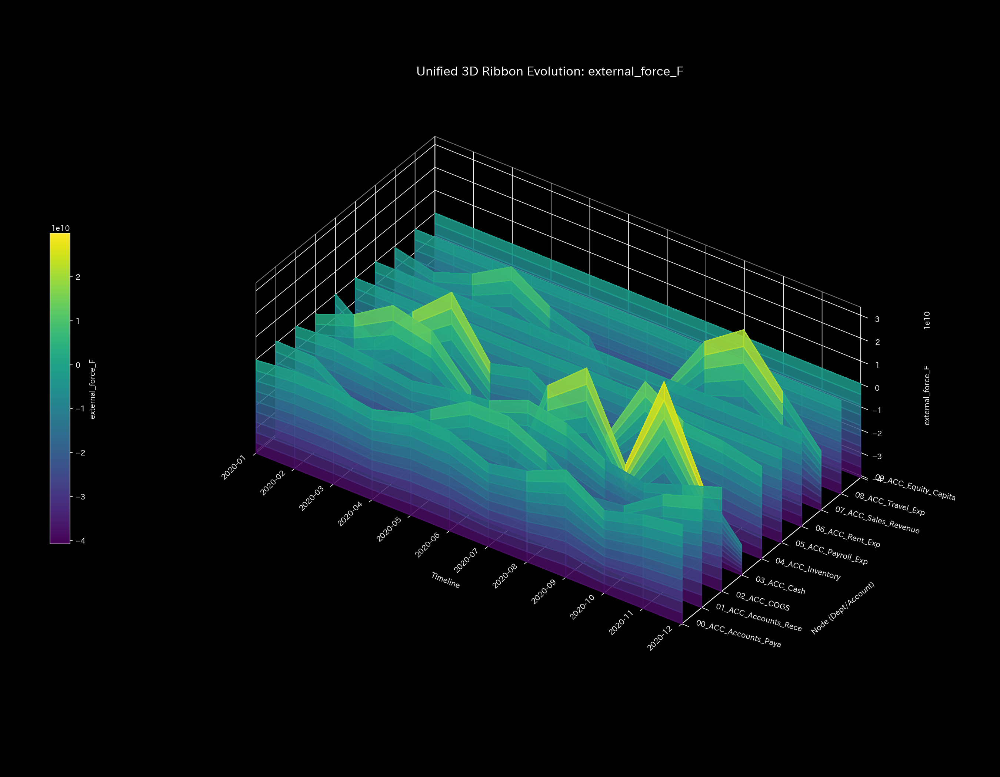
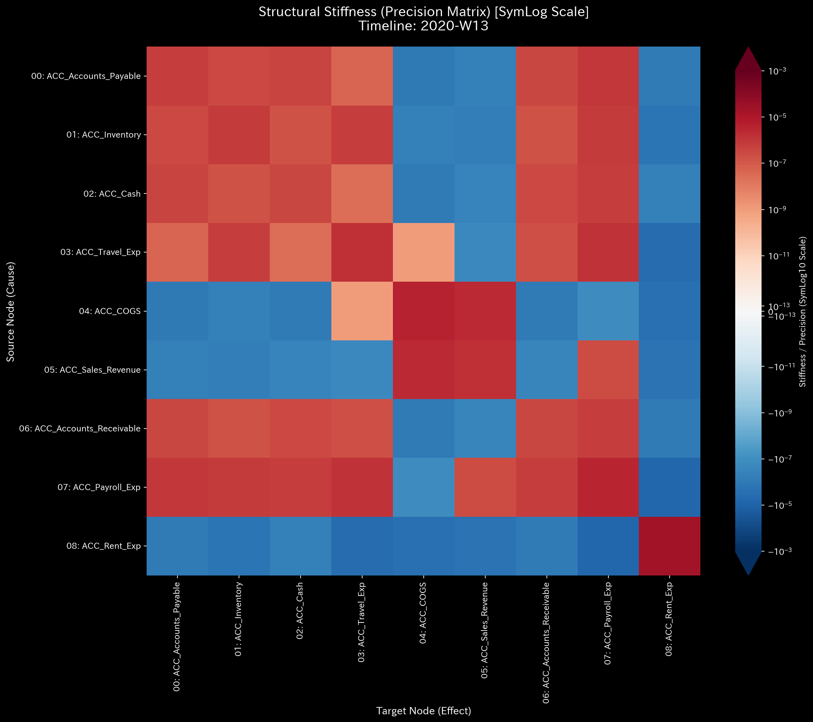
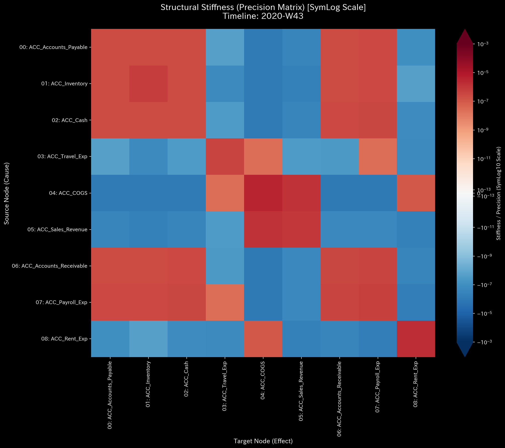
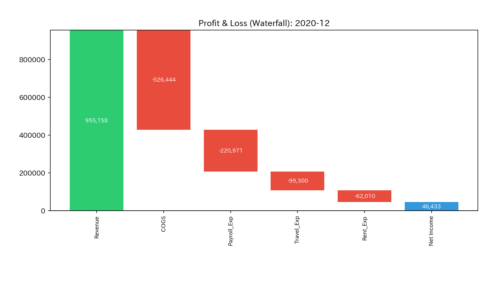

# Sample 0: 健全な状態（ベースライン）

> [!NOTE]
> **概念実証実験にともなう免責事項**
> 本レポートで分析されるデータは実世界の企業のものではありません。検証を目的として、特定の病理学的状態を意図的に再現するために設計されたダミーデータです。本サンプル（Sample_0_Healthy）は、すべての異常検知の基準となる「原器（グラウンド・トゥルース）」として機能します。

---

# 🔬 メタ解析 統合レポート (Meta-Analysis Synthesis Report / Laboratory Findings)

## 1. エグゼクティブ・サマリー

本システム（金融ドメイン）は、構造的および熱力学的に完全に健全な状態（NORMAL）にあります。意図的な不正、取引の無限ループ、またはリソースの異常な流出（漏洩）は存在しません。マクロフォレンジックにおける質量保存則は完全に維持され、トポロジーや熱力学的なエネルギー推移もすべて正常閾値内で推移しています。本サンプルの解析結果は、後続のすべての異常系サンプル（Sample 1〜9）に対する「物理的・数学的に完全に健康なシステムの模範解答」として機能します。

## 2. 物理的病跡の特定（Fundamental Pathophysiology）

本サンプルには根本原因（アノマリー）が存在しません。
ダミーデータ生成ロジック (`_0_0_generate_dummy_journal.py`) は、売上、給与、家賃、仕入などの正常な事業活動のみをシミュレートしています。

## 3. 物理・数理エンジンによる証明 (Physical and Mathematical Proof)

他のすべてのサンプル（Sample 1〜9）は、以下の基準グラフ（Sample 0）と比較して「どのような構造的崩壊を起こしているか」で診断されます。

### 3.1. 質量保存の基準（Macro Forensics）と剛性のベースライン

上段の「System Conservation Residual（質量の絶対残差）」が完全に `0.0` の地平に張り付いています。これは「借方と貸方が1円の狂いもなく一致し、システム外へ消失した（漏れた）質量が一切ない」という貸借一致の原則（質量保存則）が完璧に機能していることを証明しています。異常系（Sample 2など）ではここに鋭いスパイクが発生します。

**【構造的剛性 (Structural Stiffness) と 仮想外力 (External Force)】**

1. **3D外力マップ（平穏な波形）:**
   この Sample 0 の外力マップは1年間を通じて非常に穏やかな起伏しか観測されません。これは、システム（健全なサスペンション）が外部からの巨大な入力エネルギーを完璧に吸収・分散できている物理的証拠です。
2. **剛性行列のタイムラプス（健康なモザイク模様）:**
   剛性行列（システムの内部構造）を時系列で眺めると、全体として多様な色が混ざり合う**「健康なモザイク模様（弾力性）」**を1年間通して完璧に維持しています。異常系で発生する「Rigid Lock（絶対硬直）」は一度も起きていません。

### 3.2. ネットワークトポロジーの基準 (System Stability)

赤色の線「Max Spectral Radius（最大スペクトル半径）」が `0.0` の底に張り付いて安定しています。これはネットワーク内に「自己強化的な無限ループ（資金のキャッチボールなど）」が存在せず、システムに入ってきた資金が正常に流出しているというトポロジーの健全性を証明しています。循環取引（Sample 1）や交通渋滞（Sample 5）ではこの線が天井（1.0）に向けて発散します。

### 3.3. 熱力学的エネルギーの基準 (Thermodynamics Energy Stack)

白色の線「Free Energy（自由エネルギー：F = U - TS）」が、総活動量（U）の拡大に伴い、右肩上がりに力強く成長しています。システムが活発に取引（運動）を行いながらも、摩擦（-TS）にエネルギーを奪われることなく、ビジネスを継続・拡大するための十分な活動余力を維持し続けていることを証明しています。異常系では、摩擦損失が異常膨張し、この白色の線がゼロラインを割って沈み込みます。

### 3.4. 局所的アノマリーの看破 (3D Micro Z-Score & KL Drift)

一年を通じて、全ノードで目立ったスパイクが一切存在せず、「完全に平坦で凪いだ海（Z-Score ≈ 0, KL Drift ≈ 0）」を保っていることが視認できます。この「無風状態」が、他のサンプルで発生する鋭いスパイクを検知するための絶対的なベースライン（原器）となります。

## 4. 従来型分析（集計的スナップショット）の限界 (Traditional Perspective)

**【第52週 損益計算書 (P/L) ＆ 貸借対照表 (B/S)】**

従来の会計監査では、これを見て「帳簿の左右が完全に一致しており、利益も出ている優良企業だ」と判定して終了します。しかし、TLUでは「この静的な最終結果だけでは、期中にどれほど異常なプロセスがあったかを見抜くことは困難である」という前提に立ち、上記の物理的・幾何学的アプローチによって**「そこに至るまでの1年間の形と流れが、完全に自然であったこと」**を数学的に証明しています。

## 5. ⚠️ 反証可能性と検証要件（Falsification Analytics）

* **偽陽性の可能性:** 本診断の「健全（NORMAL）」という結論は、「システム内部のトランザクションがすべて正確に観測・記録されていること」を前提としています。もし「帳簿外取引（Off-balance-sheet transactions）」が存在し、TLUの観測範囲外で資金の流出入が行われている場合、この「健全」という診断は誤り（実態は異常）となります。
* **追加検証要件:**
  外部の銀行口座取引明細（バンキング・ステートメント）と、TLU上の現金勘定の残高突き合わせ（Bank Reconciliation）を実施し、帳簿外の流出入が一切ないことを物理的に確認してください。上記の反証条件が棄却される（＝外部データとも完全に整合する）ことを前提に、本 Sample_0 の各種物理メトリクスおよび可視化プロファイルを、後続のすべてのサンプル（Sample_1〜9）における比較・診断の「原器」として確定させます。
