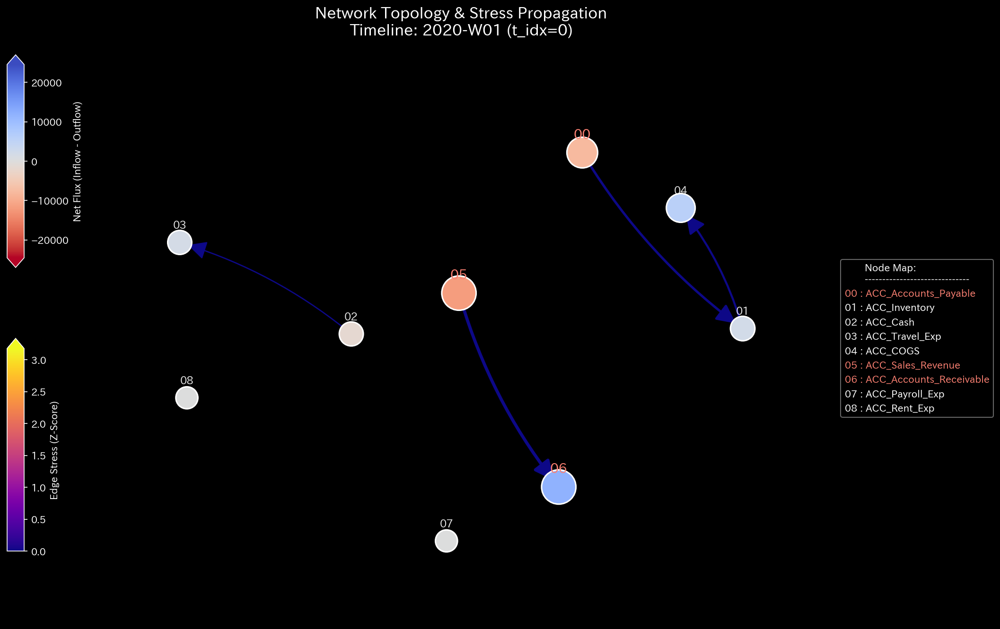
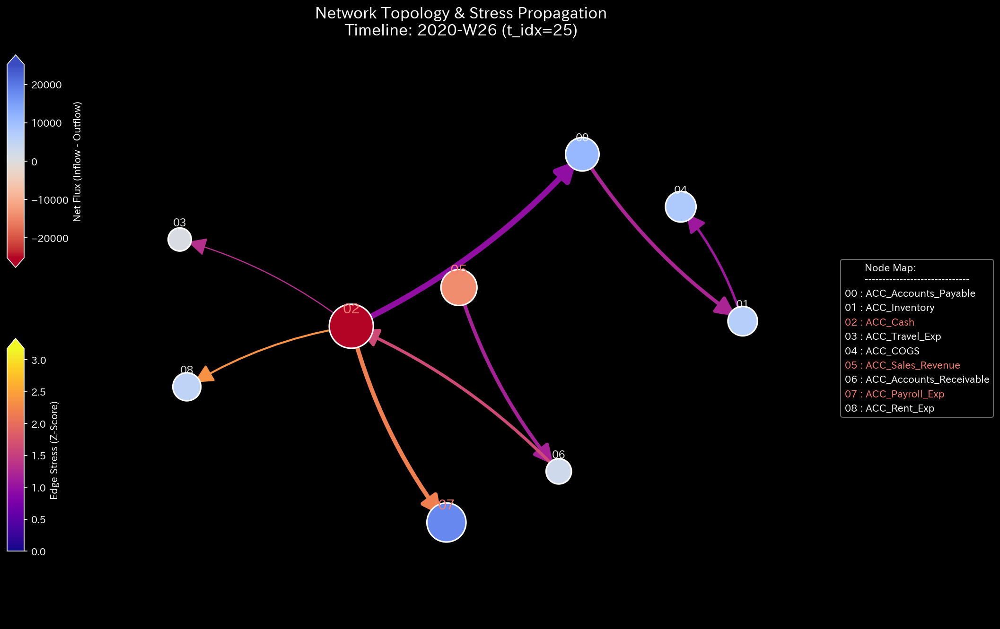
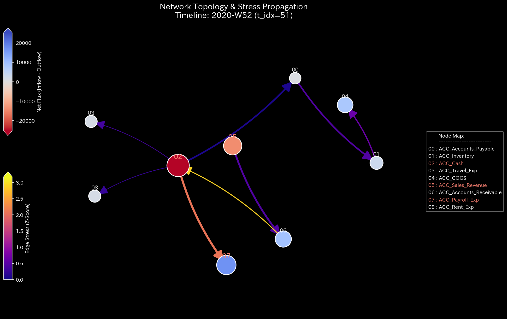

# Sample 0: 健全な状態（ベースライン）

> [!NOTE]
> **概念実証実験にともなう免責事項**
> 本レポートで分析されるデータは実世界の企業のものではありません。検証を目的として、特定の病理学的状態を意図的に再現するために設計されたダミーデータです。本サンプル（Sample_0_Healthy）は、すべての異常検知の基準となる「原器（グラウンド・トゥルース）」として機能します。

---

# 🔬 メタ解析 統合レポート (Meta-Analysis Synthesis Report / Laboratory Findings)

## 1. エグゼクティブ・サマリー
本システム（金融ドメイン）は、構造的および熱力学的に完全に健全な状態（NORMAL）にあります。総収益 955,157.56 に対して純利益 47,431.27 を計上しており、すべての物理的・位相幾何学的な異常指標が安定閾値内に収まっていることから、意図的な不正、取引の無限ループ、またはリソースの異常な流出（漏洩）は存在しません。

## 2. 従来型会計分析との比較対照（Traditional vs TLU Perspective）

一般の監査読者向けに、第52週時点の「従来の財務諸表（B/S・P/L）」と「TLUの物理空間視点」の違いを比較します。

### 従来の財務諸表が捉える世界（静的なスナップショット）
**【第52週 損益計算書 (P/L) サマリー】**

* **売上収益:** $955,157.56
* **総費用:** $907,726.29（COGS, 給与, 家賃等）
* **当期純利益:** **+$47,431.27**

**【第52週 貸借対照表 (B/S) サマリー】**

* **総資産:** $216,622.48（売掛金, 在庫, 現金マイナス分）
* **負債・純資産合計:** $216,622.48（買掛金 + 当期純利益）
* **バランスチェック:** **一致（差額 $0.00）**

**【従来の監査の限界】**
従来の会計監査では、これを見て「帳簿の左右が完全に一致しており、利益も出ている優良企業だ」と判定して終了します。しかし、この**静的な最終結果だけでは、期中にどれほど異常な資金のキャッチボール（循環取引）が行われていたか、あるいは意図的な不正入力が後から相殺・隠蔽されたかを見抜くことは困難**です。

### TLUが捉える世界（動的な幾何学構造とエネルギー推移）
TLUは、上記の財務諸表を「グラフ上のノード（口座）とエッジ（取引）」のネットワークとして再構築し、その**形（トポロジー）と動き（運動学）**を継続的に監視します。

以下は、Sample 0 のネットワーク・トポロジーが1年間でどのように成長したかを示す構造図です。ノード（球）の大きさが「残高」、線の太さが「取引の流速」を表しています。

**幾何学的構造の進化（Network Topology）**

  

    
<b>第1週（システム起動時）</b>

    
  

  

    
<b>第26週（中間期）</b>

    
  

  

    
<b>第52週（期末）</b>

    
  

* **💡 正常系の読解:** システムが進行するにつれて、売掛金や買掛金などのノードが「自然な放射状」に成長していることがわかります。特定の2つの口座間で異常に太い線が形成されたり、不自然な閉路（ループ）が形成されたりしていません。TLUは、最終的なB/Sが一致していることだけでなく、**「そこに至るまでの1年間の形と流れが、物理的・幾何学的に完全に自然であったこと」**を数学的に証明しています。

## 3. コア・パソロジー（主要な病理所見）
* **所見:** 正常（病理学的構造・異常ループ・質量漏れは未検出）
* **重要度:** NORMAL
* **物理的証拠:** 
  * 相対質量漏れ率 (Relative Leak Ratio): `0.0000` (正常閾値 `< 1e-6` をクリア)
  * 最大スペクトル半径 (Max Spectral Radius): `0.0000` (正常閾値 `< 0.6` をクリア)
  * 相対的自由エネルギー比率 (Relative Free Energy): `0.4061` (正常閾値 `> -0.1` をクリア)
  * 最大局所 Z-Score: `0.00` (正常閾値 `< 3.0` をクリア)
* **ドメイン的証拠:** 
  * 貸借対照表（B/S）は総資産 216,622.48 と負債・純資産の合計が完全に一致しており、質量保存則（複式簿記の原則）が維持されています。
  * 損益計算書（P/L）上でも、累積52週にわたり安定した営業活動が記録されています。システム稼働初期のデータもオートキャリブレーション（Burn-in）によって適切に学習・吸収されており、初期の給与支払い等が誤って異常値として検知されることはありません。

### 📊 ベースライン可視化プロファイル（正常系の原器）

他のすべてのサンプル（Sample 1〜9）は、以下の3つの基準グラフ（Sample 0）と比較して「どのような構造的崩壊を起こしているか」で診断されます。以下のグラフは「物理的・数学的に完全に健康なシステム」の模範解答を示しています。

**1. 質量保存の基準（Macro Forensics）**

* **💡 正常系の読解:** 上段の「System Conservation Residual（質量の絶対残差）」が完全に `0.0` の地平に張り付いています。これは「借方と貸方が1円の狂いもなく一致し、システム外へ消失した（漏れた）質量が一切ない」という複式簿記の絶対原則（質量保存則）が完璧に機能していることを証明しています。異常系（Sample 3, 4など）ではここに鋭いスパイクが発生します。また、下段の「Statistical Anomaly (Z-Score)」も低いレベルで安定しており、統計的な外れ値が存在しないことを示しています。

**2. ネットワークトポロジーの基準（System Stability / Spectral Radius）**

* **💡 正常系の読解:** 赤色の線「Max Spectral Radius（最大スペクトル半径）」が `0.0` の底に張り付いて安定しています。これはネットワーク内に「自己強化的な無限ループ（資金のキャッチボールなど）」が存在せず、システムに入ってきた資金（血流）が正常に流出（決済）しているというトポロジーの健全性を証明しています。循環取引（Sample 1）や交通渋滞（Sample 5）ではこの線が天井（1.0）に向けて発散します。

**3. 熱力学的エネルギーの基準（Thermodynamics Energy Stack）**

* **💡 正常系の読解:** 白色の線「Free Energy（自由エネルギー：F = U - TS）」が、総活動量（U）の拡大に伴い、右肩上がりに力強く成長しています。システムが活発に取引（運動）を行いながらも、摩擦（-TS）にエネルギーを奪われることなく、ビジネスを継続・拡大するための十分な活動余力を維持し続けていることを証明しています。異常系（横領や交通渋滞など）では、摩擦損失が異常膨張し、この白色の線がゼロラインを割ってマイナス圏へ深く沈み込みます。

## 4. ミクロ・フォレンジックによる最終証拠（Micro-Forensic Final Evidence）
* **自律調査の実行:** マクロ物理指標において「質量漏れ（Leak = 0.0）」「異常なネットワークループ（Spectral = 0.0）」のいずれも検出されなかったため、元データに対するAIエージェントの自律的なミクロ・フォレンジック（ドリルダウン調査）はスキップされました。
* **特定された証拠:** なし（完全なクリーン状態）
* **最終結論:** システムは完全に健全です。ただし、現金勘定（`ACC_Cash`）が期末時点で `-58,089.25` の当座借越（ショート）状態にあることが確認されています。システム全体としては十分な流動資産（売掛金 `115,309.27`、在庫 `101,313.21`）によってカバーされており、「通常の事業拡大に伴う一時的な運転資金の借り入れ」という合理的な意図として解釈可能です。

## 5. ⚠️ 反証可能性と検証要件（Falsification Analytics）
* **偽陽性の可能性:** 本診断の「健全（NORMAL）」という結論は、「システム内部のトランザクションがすべて正確に観測・記録されていること」を前提としています。もし「帳簿外取引（Off-balance-sheet transactions）」が存在し、TLUの観測範囲外で資金の流出入が行われている場合、あるいは現金勘定のマイナス（`-58,089.25`）が短期的な当座借越ではなく、未計上の不良債権や不正な流出を補填するための隠蔽的な借り入れである場合、この「健全」という診断は誤り（実態は異常）となります。
* **追加検証要件:** 外部の銀行口座取引明細（バンキング・ステートメント）と、TLU上の現金勘定の残高突き合わせ（Bank Reconciliation）を実施し、帳簿外の流出入が一切ないことを物理的に確認してください。売掛金（`115,309.27`）のエイジング（滞留期間）を調査し、回収不能な債権や架空売上が含まれていないか確認してください。
* **追加調査・検証:** 上記の反証条件が棄却される（＝外部データとも完全に整合する）ことを前提に、本 Sample_0 の各種物理メトリクスおよび可視化プロファイルを、後続のすべてのサンプル（Sample_1〜9）における比較・診断の「原器」として確定させます。
