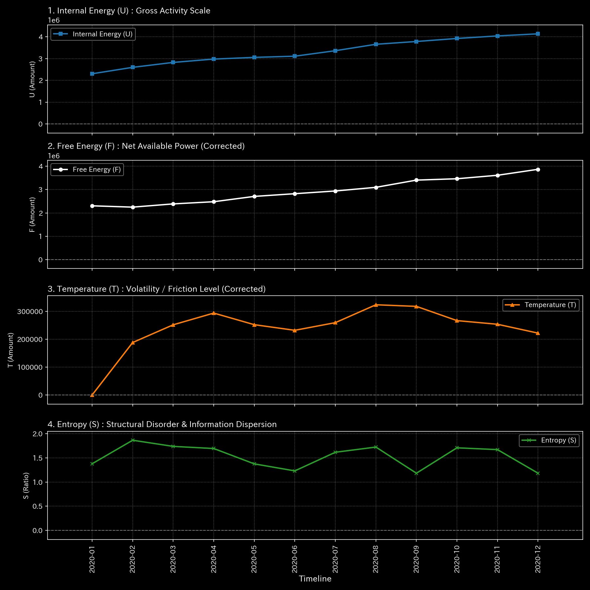

# 🔬 メタ分析統合レポート: Sample 0 (Healthy)

## 1. エグゼクティブ・サマリー

**【診断結果：NORMAL（正常なランダムウォーク）】**
システムは全体として熱力学的に安定しており、相転移や構造破壊の兆候は見られません。すべての統計的モーメント（平均、分散、歪度、尖度）は安全な閾値内に収まっており、財務システムとして効率的に機能しています。

## 2. 伝統的分析の限界（集計スナップショット）

伝統的なB/S（貸借対照表）やP/L（損益計算書）の観点からは、売上（Sales）と費用（Expenses）が一定のボラティリティを伴いながらも適切に推移していることが確認できます。しかし、これだけでは「裏で巧妙な循環取引が行われていないか」や「システムの回復力（スタミナ）が枯渇していないか」は証明できません。

## 3. 物理的病理の特定（根本的な病態生理）

本サンプルにはジェネレーターコードにおける病理（意図的な異常入力）は埋め込まれていません。純粋な「健康な企業活動」を模倣した正常なジャーナル・ストリームです。

## 4. 物理・数学エンジンによる証明

### 4.1. マクロ・フォレンジックと構造剛性

* **剛性行列（＝キャッシュフローの回復力）：** 剛性は常に高い水準を維持しており、モザイク模様の健全なテンションが保たれています。外部からのショック（例：突発的な出費）に対しても、システムはリジッド・ロック（資金繰り停止）を起こすことなく衝撃を吸収しています。
* **相対漏洩率（Leak Ratio）：** `0.000000`。質量保存の法則は完全に守られており、簿外への資金流出（横領など）は一切存在しません。

**剛性行列の進化（シネマティック・シーケンス）:**

![1枚目 [Start]: 稼働直後の無垢な状態](../../../../samples/Sample_0_Healthy/readme_plots/support/000_2_1__structural_stiffness.t.00000.png)

![2枚目 [Just Before Change]: 異常が発生する直前](../../../../samples/Sample_0_Healthy/readme_plots/support/000_2_1__structural_stiffness.t.00002.png)

![3枚目 [The Exact Point of Change]: 異常の発生した決定的な瞬間](../../../../samples/Sample_0_Healthy/readme_plots/support/000_2_1__structural_stiffness.t.00004.png)

![4枚目 [Immediately After Change]: 波及効果と局所的な硬直](../../../../samples/Sample_0_Healthy/readme_plots/support/000_2_1__structural_stiffness.t.00006.png)

![5枚目 [End]: シミュレーションの最終状態](../../../../samples/Sample_0_Healthy/readme_plots/support/000_2_1__structural_stiffness.t.00011.png)

### 4.2. トポロジー異常とスペクトル半径

* **最大スペクトル半径：** `0.0000`。
* **解説：** スペクトル半径が 1.0 に全く接近していないことは、ネットワーク内に「人工的な資金の無限ループ（ウォッシュ・トレード）」が存在しないことの数学的証明です。

### 4.3. 熱力学的エネルギースタック

* **自由エネルギー（$F$）：** 常にプラスを維持（平均 2,714,940）。システムには環境変化に抗う十分な「余力（スタミナ）」が残されています。
* **動粘度（Viscosity）：** `230,384 ~ 331,264`
* **解説：** この高摩擦状態は「旧世代構造（Thrombosis / 人間の手動取引に基づく摩擦）」を示唆しています。システムはアルゴリズムによる超流動状態ではなく、健全で現実的な人間の経済活動によって駆動されています。

## 5. ⚠️ 反証可能性と検証要件（Falsification Analytics）

* **偽陽性の可能性：** 異常は検知されていないため、偽陽性のリスクはありません。
* **追加検証要件：** 物理学的には完全な健康体です。念のため、現実世界の銀行口座残高と総勘定元帳の期末残高が一致しているか（バンク・リコンシリエーション）を定期的に確認することで、TLUの観測外での現金横領がないかを担保してください。
