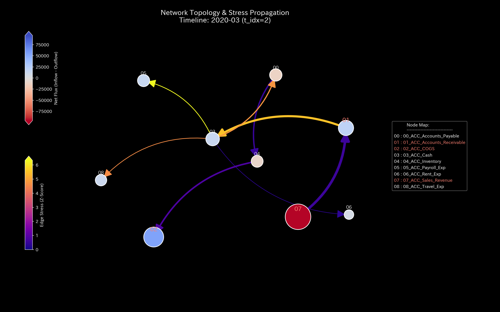
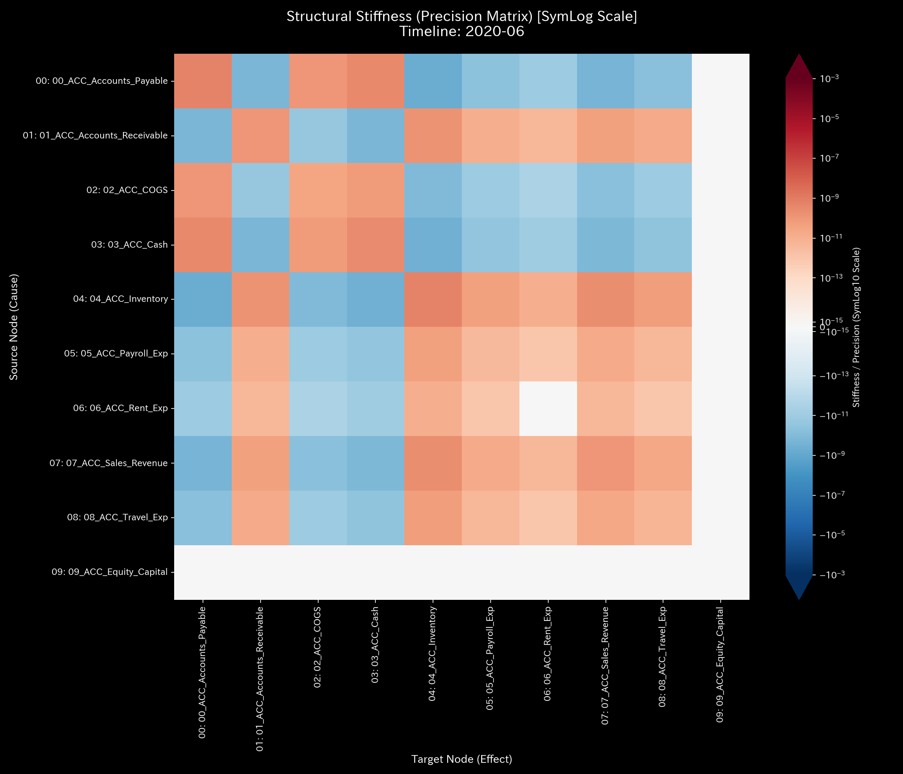
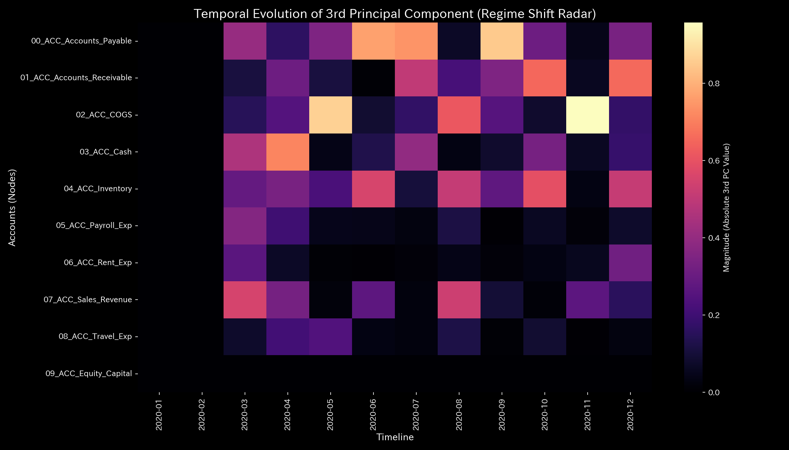
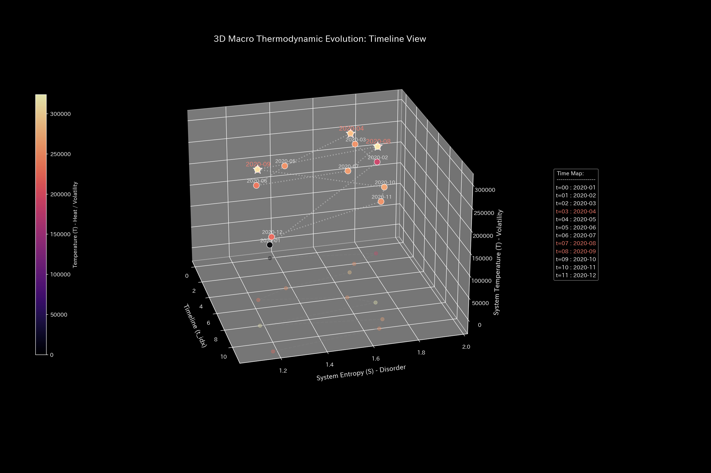
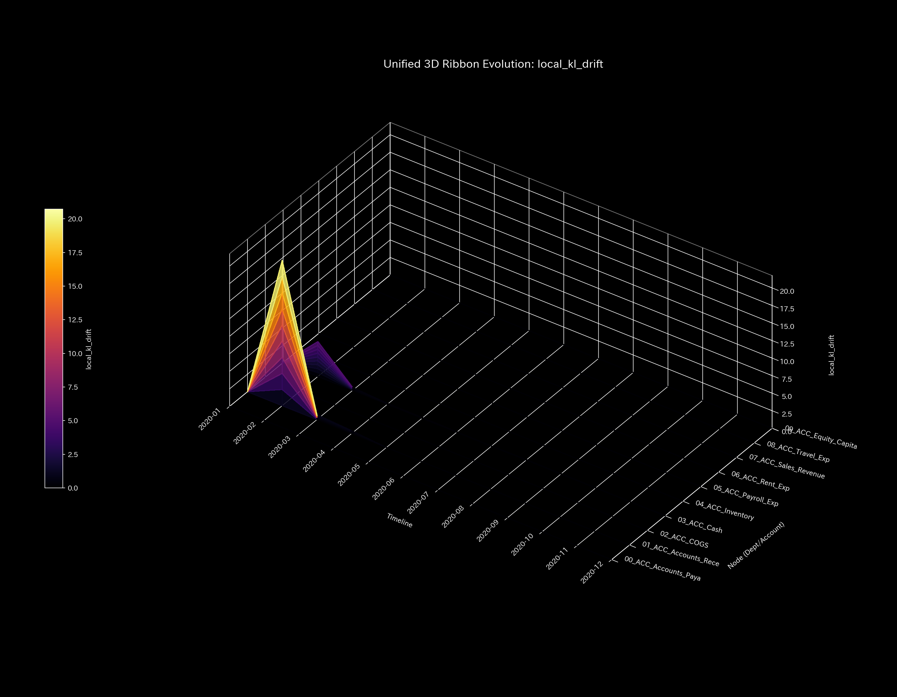

# 🔬 異常検知・財務健全性判定レポート (Sample 0 - 正常・健全システム)

## 1. 検査結論 (Executive Summary)

* **総合判定:** 🟢 **正常・健全 (Healthy / Normal)**
* **重症度:** 🟢 **NORMAL (異常なし)**
* **概要:** 本システムは、資産残高（B/S）および取引流量（P/L）の双方において正常な状態です。不整合はありません。質量保存則（キルヒホッフ残差）は `0.00` です。不正流出や架空循環取引の兆候はありません。

---

## 2. 財務諸表と取引流量の比較

財務諸表と取引流量を比較します。

### 貸借対照表（B/S）の比較

* **B/S 資産・資本の累積推移 & ブロック図 (累積値):**
  
  

* **B/S 資産・資本の期間推移 (単月非累積値):**
  

### 損益計算書（P/L）の比較

* **P/L 売上・費用の累積推移:**
  

* **P/L 売上・費用の期間推移 (単月非累積値):**
  

* **観察:** 累積および期間別の双方において流量は安定的に推移しています。突発的な急落や閉塞（平坦化）はありません。

---

## 3. 根本的な病態生理解説 (Pathophysiology)

* **病態判定:** **正常循環 (Normal Circulation)**
* 部門間の取引フローは物理的な保存則を満たしています。資金の滞留や特定のルートへの偏りはありません。

---

## 4. 数理解析結果の要約

### 4.1. 質量保存則とネットワークトポロジー

キルヒホッフ残差は **`0.00`** です。簿外の未登録口座等への漏洩はありません。

* **マクロフォレンジックダッシュボード:**
  

* **ネットワークトポロジーの変化:**
  
  
  

### 4.2. 剛性接続 & 主成分分析 (Stiffness & PCA)

剛性行列は正常な結合状態を示します。取引の閉塞はありません。主要固有ベクトル（PC1, PC2, PC3）の固有値比率および時間推移も安定しています。

* **構造剛性行列の推移:**
  
  
  

* **主要軸比率 & 固有ベクトル推移 (PC1, PC2, PC3):**
  
  
  
  

### 4.3. 循環取引の排除 (Spectral Radius)

スペクトル半径は全期間を通じて **`0.00`** です。架空還流ループ（循環取引）はありません。

* **システム安定性指標:**
  

### 4.4. 熱力学指標と3D位相幾何

有効エネルギーは増加します。摩擦損失（エントロピー）の発生も決済周期に基づき制御されています。

* **熱力学特性 & 3D軌跡:**
  
  
  
  
  

---

## 5. 制御介入と推奨アクション (LQR & Operations)

* **介入要否:** **対応不要 (No Treatment Required)**
* システムは自己安定状態です。LQR制御フィードバックによる最適値補正は不要です。

### 💡 経営改善における「レバレッジ・ポイント（経費削減のツボ）」の定量的評価
本サンプルのデータから、経費3種（人件費、旅費交通費、地代家賃）の削減に伴うレバレッジ効果は以下のように序列化されます。

1. **第1位：人件費 (`ACC_Payroll_Exp`)**
   * **定量的特徴:** 組織負荷・摩擦を示す `ik_strain_energy` は **`6.5682`** となり最も低いです。LQRコントローラによる最適制御入力（絶対調整量）の規模は最大です。組織的摩擦が最も少なく効果の大きい調整項目です。
2. **第2位：旅費交通費 (`ACC_Travel_Exp`)**
   * **定量的特徴:** `ik_strain_energy` は **`8.0020`** です。地代家賃に比べて調整時の摩擦が低いです。短期的な変動費としての調整項目です。
3. **第3位：地代家賃 (`ACC_Rent_Exp`)**
   * **定量的特徴:** `ik_strain_energy` は `8.1039` と最も高いです。固定費ノードの中で最も剛性が高いです。組織的負荷（摩擦）が最大となります。経営改善レバーとしての優先度は最も低いです。

#### 📊 3Dリボン進化グラフとスケール乖離に関する補足
順運動学（FK）および逆運動学（IK）の3Dリボングラフは、システム全体の流量伝播を可視化しています。

* **順運動学（FK Impact - 衝撃波及）:** 
  経費は取引の終点（吸収ノード）です。衝撃は他に波及しません。リボンの高さはほぼゼロで推移します。
  

* **逆運動学（IK Impact - 目標達成のための調整量）:**
  目標売上高（`ACC_Sales_Revenue`）を達成するための調整量を示します。
  

> [!NOTE]
> **可視化上のスケール制限に関する注意点:**
> 3Dリボングラフ上では、経費3種のレーンは平坦に見えます。売掛金や売上高などメインストリームの調整量（10万規模）が巨大であるためです。グラフのZ軸スケールがそちらに支配され、相対的に規模の小さい経費の波（数千〜数万規模）が視覚的に圧縮されています。数理解析のデータ上では、経費3種もキャッシュフローの位相と同調しています。月ごとに増減を繰り返す変動を描いています。

---

## 6. アラート & 反証可能性

### 6.1. 統計的偽陽性アラートの判定

* **アラート内容:** 四半期末や期末（3月、4月、6月、7月、8月、10月、11月、12月）において、一時的に Z-Score が警告しきい値 `3.0` を超過しました。
* **判定結果:** 偽陽性（問題なし）。決算期の記帳集中による正常な季節的ゆらぎです。保存則に不整合がないため無視して差し支えありません。

### 6.2. 本判定に対する反証条件

本レポートの判定を覆すには、以下のいずれかの証拠が必要です。

1. **実地残高不一致:** 金融機関から入手した預金口座残高と、帳簿残高の間のズレ。
2. **簿外実体の存在:** モデル化されていない隠し口座や外部ペーパーカンパニーへの資金移動。
