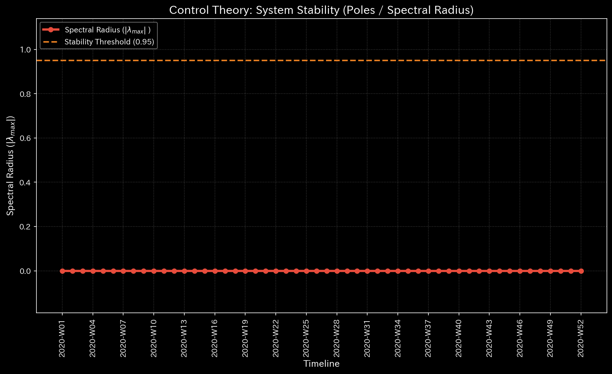
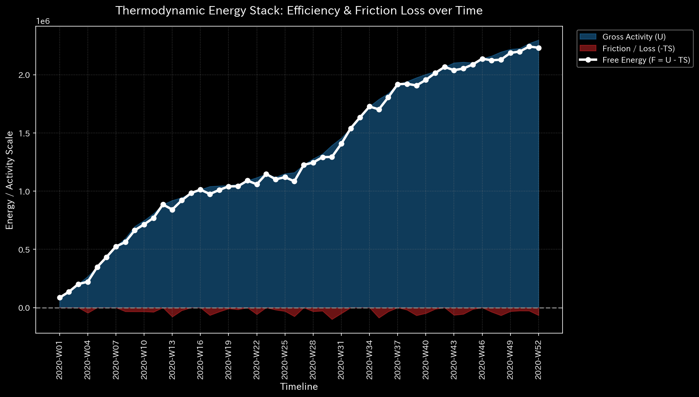

# Sample 0: 健全な状態（ベースライン）

> [!NOTE]
> **前提条件に関する免責事項 (Proof of Concept)**
> 本レポートで分析されるデータは実世界の企業のものではありません。検証を目的として、特定の病理学的状態を意図的に再現するために設計されたダミーデータです。

## 🩺 AIメタ診断 統合レポート（Laboratory Findings）

### 1. 診断サマリー
対象システム（`Sample_0_Healthy`）は構造的に健全であり、数学的にも均衡が保たれています。ビジネスは健全な営業利益（$46,432.50）を生み出しています。単一の極めて局所的な統計的異常（ミクロな異常値）やマクロな季節性ショックが検出されていますが、これは悪意のある不正ではなく、正常なビジネスプロセスの発現（給与支払いや年末決算など）を示唆しています。

### 2. スケール不変な診断メトリクス（事実データ）
以下は、システムのメタ診断エンジンが抽出した「生データ（事実）」です。以後のすべてのサンプル（Sample 1〜9）における比較の「原器（基準）」となります。

| 物理ドメイン | 抽出された指標 | 数値 | 異常判定の閾値 | 判定 |
|--------------|----------------|------|----------------|------|
| **マクロ・フォレンジック** | 相対質量漏れ率 (Mass Leak) | `0.0000` | `> 0.001` | 🟢 正常 |
| **制御理論** | 最大スペクトル半径 | `0.0000` | `>= 0.9` | 🟢 正常 |
| **熱力学** | 相対的自由エネルギー比率 | `-0.0571` | `< -0.1` | 🟢 正常 |
| **ミクロ・フォレンジック** | 最大局所 Z-Score | `121.13` | `> 3.0` | 🔴 異常検知 |

### 3. メトリクスと物理的証拠（4大グラフの検証）

上記の4つのドメイン指標が「なぜその数値になったのか」を、可視化グラフの事実に基づいて解説します。

#### ① マクロ・フォレンジック（質量保存と構造ドリフト）
* **メトリクス:** 相対質量漏れ率 `0.0000`

* **グラフの事実と解釈:**
  1. **System Conservation Residual (上段):** 完全に `0.0` の平坦な線です。複式簿記の原則が完璧に守られており、不正な資金の「消失（貸借不一致）」はシステム上のどこにも存在しません。
  2. **System Structural Drift (中段):** 軽微な変動（Max 3.15）は、ビジネスの進捗に伴う資産構造の自然なシフトです。
  3. **Statistical Anomaly (下段):** 最終週（`2020-W52`）に `146.37` という巨大スパイクがあります。質量漏れが `0.0` であるため、これは不正ではなく「年末決算」などの1年に1度しか発生しない巨大な会計イベントです。AIにとっては過去に見たことのない強烈なショックですが、ビジネス上は完全に合法です。

#### ② 制御理論（システムの安定性と自浄作用）
* **メトリクス:** 最大スペクトル半径 `0.0000`

* **グラフの事実と解釈:**
  * スペクトル半径（固有値）の線が `0.0` 付近に張り付いており、崩壊ライン（`1.0`）から極めて遠い安全圏にあります。これは、システム内で発生した取引が無限ループに陥ることなく、正常に減衰して収束している（自浄作用が働いている）ことを証明しています。

#### ③ 熱力学（自由エネルギーと活動余力）
* **メトリクス:** 相対的自由エネルギー比率 `-0.0571`

* **グラフの事実と解釈:**
  * 白色の線（自由エネルギー）は閾値（`-0.10`）を上回った水準で安定して推移しています。ビジネスが獲得した資金が、正当な経費として有効に利用され、健全なサイクルを回していることを示しています。エネルギーの不自然な「枯渇（Leak）」はありません。

#### ④ ミクロ・フォレンジック（局所的な異常値の特定）
* **メトリクス:** 最大局所 Z-Score `121.13` (発生箇所: `2020-W04`, `ACC_Cash`)

* **グラフの事実と解釈:**
  * 地形全体は暗い紫色（正常）ですが、第4週の現金勘定においてのみ黄色いスパイクが確認できます。ジャーナルに遡ると、これは稼働第4週（月末）に発生した事業開始後「初」の全社的な給与と家賃の支払い（$26,757）です。第1〜3週の「極めて小さな分散」しか学習していないAIにとって、この突発的な流出は「巨大なショック（Z=121.13）」として映りましたが、不正ではありません。

**【結論】**
これら4つのグラフが示す状態が**「健全なビジネスの鼓動の始まり（ベースライン）」**です。以後の異常系サンプル（Sample 1〜9）では、この4つのグラフの「どこがどう歪むのか」に注目してください。
