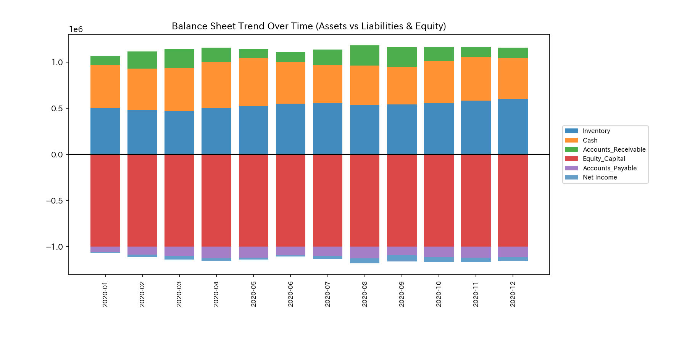
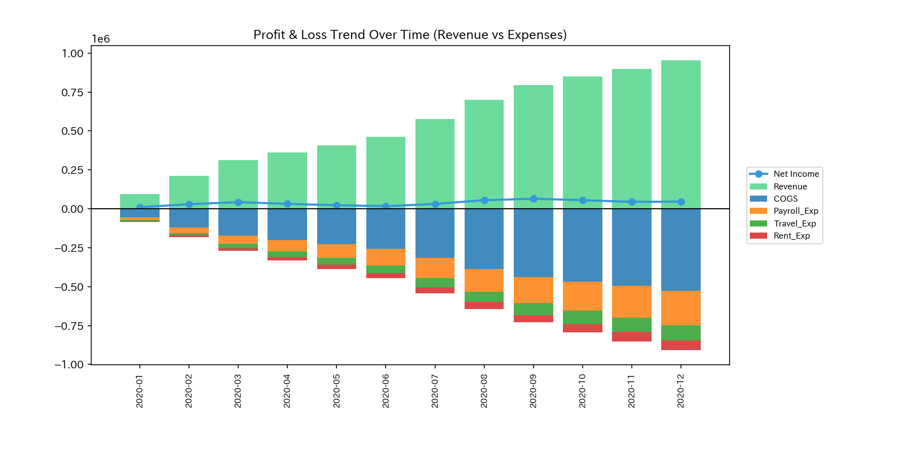
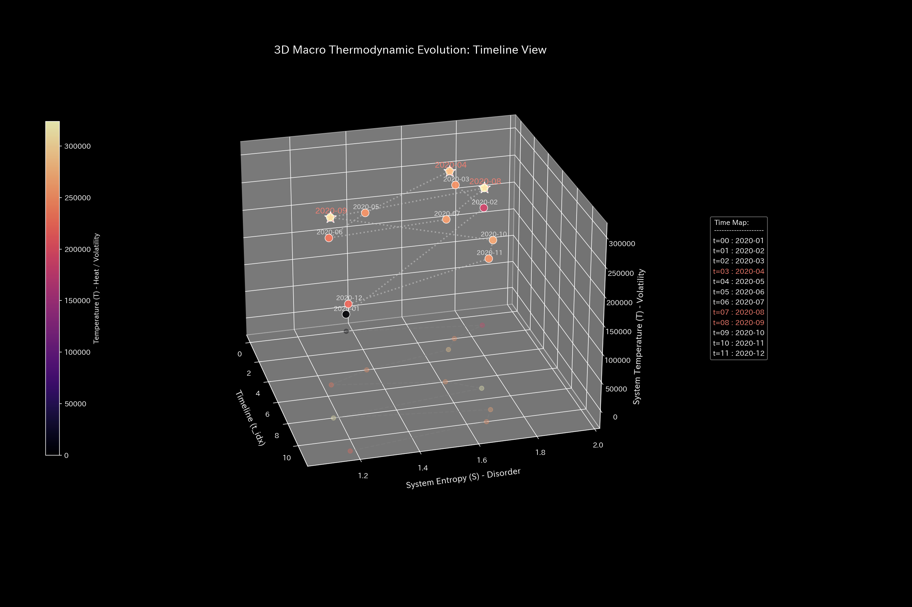
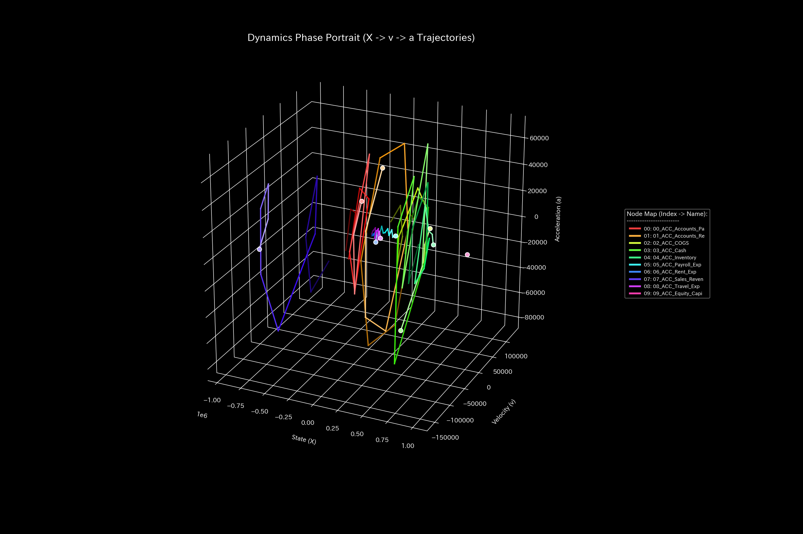

# 財務健全性 臨床要約書（ケース0）

> [!NOTE]
> より詳細な技術的データを含む臨床診断書は [clinical_report.md](clinical_report.md) にあります。

---

## 0. エグゼクティヴ・サマリー (Executive Summary)

* **総合判定:** 【健全・正常（気血和平）】 経理処理および部門間の資金循環は完全に健全です。簿外資金漏洩や架空循環取引は一切見られず、外部からの介入は必要ありません。
* **総合体質評価（健康状態）:**
  十分な資本力を有する**「良好な体格（総資産規模）」**であり、突発的な売上減少などのショックに耐えうる防衛力（**「免疫力・基礎体力」**）も非常に高い状態です。資金循環の摩擦損失（**「自律神経の乱れ」**）も低く、特定の口座だけで資金が固着するような硬化（**「動脈硬化」**）の兆候もありません。脈の乱れ（急激な決済ショック）やその波及も一切ない、健康的な自律運行状態です。
* **要改善点と共生治療:**
  - **肩こり（回収サイトの遅延）:** **`04_ACC_Inventory`**（棚卸資産）の回収領域に緩やかな決済遅延が検出されましたが、これは年末（2020-12）の季節性需要に伴う生理的遅延（肩こり）であり、病的ではありません。
  - **ツボ（改善ポイント）:** **`02_ACC_COGS`**（売上原価）と **`04_ACC_Inventory`** が、システムを最も痛みを伴わずに改善できるツボです。
  - **禁忌（避けるべき介入）:** 反発と構造ストレスを招く **`09_ACC_Equity_Capital`**（自己資本）への直接調整は避けてください。

---

## 1. 総合病態診断（正常代謝）

### 正常代謝（資金循環の安定）

* **数理ブリッジ説明:**
  この図は、システムの内部還流の暴走度を測定する指標（スペクトル半径）です。全期間を通じて `0.0000` で安定しており、取引が循環ループに捕らわれることなく、健康に自己減衰して流れていることを数理的に証明しています。

---

## 2. 総合体質評価

組織の資金循環能力を、東洋医学的メタファーに基づく体質パラメータとして評価します。

### ① 体格 (総資本の規模)

* **数理ブリッジ説明:**
  B/S資産残高の合計トレンドです。総資本（体格）は `$1,000,000.00` で安定し、かつ各仕訳の貸借不一致（質量漏洩）は完全にゼロであることを証明しています。

### ② 免疫力 (ショック吸収バッファー)

* **数理ブリッジ説明:**
  利益の蓄積トレンドです。剰余金が安定的に積み上がっており、突然の売上減（外部ショック）を吸収する防衛力（自由エネルギー）が潤沢であることを示しています。

### ③ 自律神経 (資金の分散多様性)

* **数理ブリッジ説明:**
  資金のボラティリティと多様性の関係図です。開かれた健全な代謝が行われており、無駄な摩擦熱（エントロピー損失）を排出せずに効率的に取引が分散している状態を表しています。

### ④ 動脈硬化 (取引の固定ロック評価)

* **数理ブリッジ説明:**
  特定の取引経路がシステム全体をハイジャックしているかを検知する指標（PCA比率）です。支配率が低く、全ての勘定科目にロードが分散しており、取引の硬化（動脈硬化）がないことを示しています。

### ⑤ 脈の乱れと波及（高次決済ショック）

* **数理ブリッジ説明:**
  資金の加速度の急激な変化（Jerk/脈の乱れ）と、その立ち上がり波（Snap/初期波）です。全期間を通じて平坦でゼロであり、不連続な決済ショックや強迫的なノッキング振動が存在しないことを数学的に証明しています。

---

## 3. 主要な滞留と共生介入

### ⚠️ 肩こり (慢性的な遅延)

* **数理ブリッジ説明:**
  資金状態の3次元ダイナミクスを示すリボン図です。**`04_ACC_Inventory`**（棚卸資産）に緩やかな決済滞留（粘性）が見られますが、これは年末（12月）の季節要因による生理的な「肩こり」であり、時間とともに自然に解消されます。

### 🎯 治療点「ツボ」 (最適改善ポイント)

* **数理ブリッジ説明:**
  介入時の感度と反発応力をマッピングした行列です。**`02_ACC_COGS`**（売上原価）および **`04_ACC_Inventory`** への調整が最も効率的（ツボ）であることを示しています。

### 🚫 禁忌
* **`09_ACC_Equity_Capital`**（自己資本）への直接の削減介入は、接続トポロジーを破壊し強烈なストレス（歪みエネルギー）を誘発するため、絶対に避けてください。

### ⚡ 決済血管の時間的急変（剛性時間差分）
- **剛性時間差分ヒートマップシーケンス (縦一列表示)**:
  - **初期 (t=1)**: 
  - **中間 (t=6)**: 
  - **最終 (t=11)**: 
* **数理ブリッジ説明:**
  タイムステップ間における取引剛性の動的な変化（差分 $\Delta K_t$）を示すヒートマップです。全期間を通じてほぼ白色（変化なし）を維持しており、一時的な支払遅延による血管の突発的な硬化（赤）が一切発生していない健全性を示しています。

---

## 4. 反証可能性 (Falsifiability)

本診断結果（健全・正常）を覆すには、以下の客観的証拠を提示する必要があります：

1. **未開示の簿外預金口座の存在:**
   監査対象外の秘密口座に資金が還流・漏洩していることを証明する、銀行のオリジナル生送金ログ。
2. **棚卸資産の物理的不一致:**
   倉庫の実地棚卸報告書にて、帳簿上の在庫価値（`04_ACC_Inventory`）と現物に重大な乖離（質量欠損）があることを示す物的証拠。

---
*発行: TLU 数理診断エンジン*
