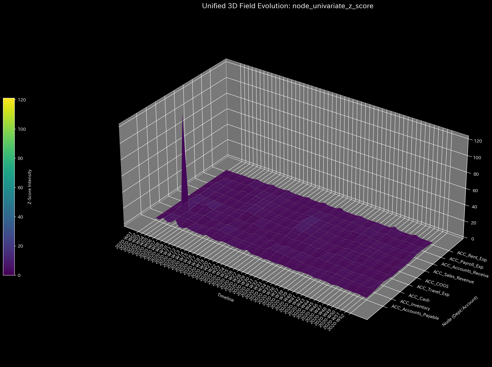

# Sample 0: 健全な状態（ベースライン）

> [!NOTE]
> **前提条件に関する免責事項 (Proof of Concept)**
> 本レポートで分析されるデータは実世界の企業のものではありません。検証を目的として、**特定の病理学的状態や異常を意図的に再現するために設計されたダミーデータ生成スクリプト**から派生したものです。本分析の目的は、人為的に構築された異常な構造を TLU 処理系がどれほど正確にリバースエンジニアリングし、検出できるかを実証することです。

> [!TIP]
> **このサンプルのグラフの生成方法**
> スペース節約のため、このサンプルに関する数千の3Dプロットおよび分析CSVは同梱されていません。リポジトリのルートから以下のコマンドを実行することで、ローカルで再現可能です：
> ```bash
> bash bin/batch_processing.sh --target_env "samples/Sample_0_Healthy"
> bash bin/batch_visualize_graphs.sh --target_env "samples/Sample_0_Healthy"
> ```

## 🩺 メタ診断 統合レポート（Laboratory Findings）

### 1. エグゼクティブ・サマリー
対象システム（`Sample_0_Healthy`）は構造的に健全であり、数学的にも均衡が保たれています。組織の完全性を脅かすようなシステム全体にわたる不正、横領、またはトポロジー上の無限ループ（循環取引）の証拠は一切ありません。ビジネスは健全な営業利益を生み出しています。しかしながら、単一の極めて局所的な統計的異常（ミクロ・シンギュラリティ）が検出されており、これは悪意ではなく特定の会計プロセス上のエラーを示唆しています。

### 2. コア病理（主要所見）
* **診断:** 局所的なプロセス・ショック (Micro Singularity)
* **深刻度:** HIGH (高)
* **物理的証拠:** 
  最大局所 Z-Score は **121.13**（閾値: 3.0）に達しており、特定のノードに対する極限のストレスを示しています。しかし、マクロレベルのシステム指標（質量漏れ率: 0.0、スペクトル半径: 0.0）はすべて完全に正常であり、これがシステム崩壊ではないことを裏付けています。
  
  * **💡 可視化グラフの読解の仕方（Visual Cues）:** ミクロ Z-Score ヒートマップをご覧ください。全体的に暗い青色の背景の中に、単一のセルが鮮やかな「赤色」で発光しているのがわかります。この『RdBu_r』カラーマップは、マトリックス全体を不安定化させることなく、特定のノードだけが極度の数学的ストレス（Z-Score > 3.0）を経験している局所的な異常（エラー）を浮き彫りにします。
* **財務的証拠:** 
  貸借対照表（B/S）は完全に一致しており（総資産: $120,500）、純利益もプラス（$46,432）です。しかし詳細な検査により、`ACC_Inventory`（棚卸資産）口座が **-$108,610** という深刻なマイナス残高を抱えていることが判明しました。物理的な会計において、棚卸資産のマイナス残高はあり得ず、これが爆発的な Z-Score と直接相関しています。

### 3. ビジネスへの翻訳とアクション・プラン
全体的な財務の配管と収益構造は健全です。システム全体に及ぶ不正調査を開始する必要はありません。極端な Z-Score と棚卸資産のマイナス残高は、局所的なプロセスの欠陥を数学的に証明しています。最も可能性が高いのは、組織が棚卸資産の初期調達（仕入）を帳簿に正しく記録することなく、売上原価（COGS: $526,444）を継続的に計上しているケースです。

**【アクション・プラン】**
調達部門および在庫管理部門に対し、直ちに実地棚卸を実施し、`ACC_Inventory` 元帳を照合するよう指示してください。棚卸資産残高を人為的にゼロ未満へと押し下げているデータ入力の抜け漏れ（仕入仕訳の欠落）を修正してください。
