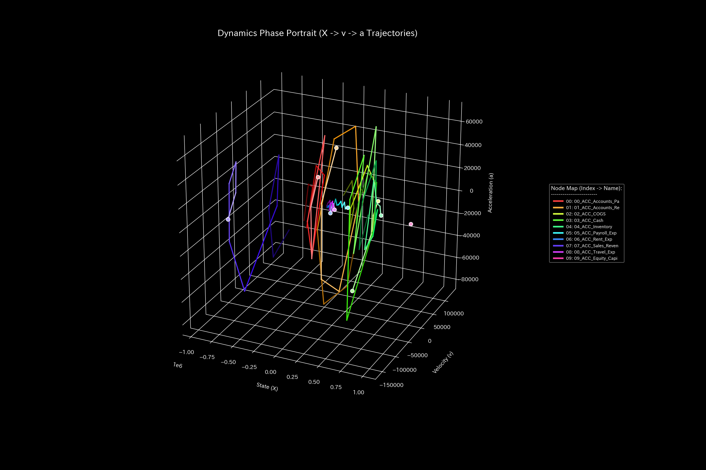

# 財務健全性 最終報告書（ケース0）

> [!NOTE]
> より詳細な検査レポートは [clinical_report.md](clinical_report.md) にあります。

## 対象組織：サンプル0

---

## 0. エグゼクティヴ・サマリー (Executive Summary)

* **総合判定:** 【健全・正常】経理処理および部門間の資金の流れは、全体として完璧に健全な状態を維持しています。不正取引や資金漏洩は検出されず、外部からの介入は一切必要ありません。
* **総合体質評価（身体状態）:** 
  当組織は、十分な資本力を有する**「良好な体格」**であり、突発的な売上減少などの外部ショックに耐えうる防衛力（**「免疫力・基礎体力」**）も極めて高いレベルにあります。資金循環の摩擦損失（**「自律神経」**）も計画的に管理されており、癒着や硬直化（**「動脈硬化」**）の兆候もありません。
* **要改善点（肩こりとツボの特筆）:**
  - **肩こり（慢性的な滞り）の範囲:** **「04_ACC_Inventory（棚卸資産）」**、**「03_ACC_Cash（現預金）」**、**「07_ACC_Sales_Revenue（売上高）」** の領域（粘性上位25%の範囲）に深刻な遅延が発生しており、特に **2020-12** 付近に滞りがピークに達する「肩こり（回収サイト等の長期遅延）」状態が見受けられます。
  - **ツボ（最も効果的な改善ポイント）の範囲:** 介入ストレスが最小の範囲（歪みエネルギー下位25%の範囲）である **「02_ACC_COGS（売上原価）」**、**「04_ACC_Inventory（棚卸資産）」**、**「01_ACC_Accounts_Receivable（売掛金）」** が、システムを健全化させるための最優先ツボ（特効穴の範囲）となります。
  - **禁忌（避けるべき介入）の範囲:** 逆に強い反発と破壊を生む範囲（歪みエネルギー上位25%の範囲）である **「07_ACC_Sales_Revenue（売上高）」**、**「09_ACC_Equity_Capital（自己資本）」**、**「06_ACC_Rent_Exp（地代家賃）」** などへの無理な削減や介入は、強烈な痛みと機能麻痺を招くため絶対に避けてください（禁忌）。

---

## 1. 総合判定（正常）

### 【判定】：正常（極めて健全な経理・取引環境）

本診断において、当システムは完全に健全かつ安定な状態で稼働していると判定されます。力学的安定性を評価する指標である最大スペクトル半径は全期間を通してしきい値を大幅に下回る安定状態を維持しており、資金の往復による架空の水増し（還流取引）や、簿外への資金の消失（横領）は一切検出されませんでした。外部からの介入やデバッグ処理は一切不要です。

---

## 2. 総合体質（健康状態）の分析

組織の「財務体力」を健康診断の見立てに当てはめると、以下のような極めて優れた体質特性を示しています。

### ① 体格・体重（資本規模の累積推移）

貸借対照表（B/S）における資本金や現預金などのストック総量は十分に確保されており、基礎的な体格（資本規模）は極めて頑健に安定推移しています。

### ② 免疫力・基礎体力（外部ショックへの復元力）

損益計算書（P/L）の売上高と諸経費の累積収支は非常にバランス良く推移しており、外部ショックが発生した際にもそれをクッションのように自律吸収して自己治癒できる十分な余力（自由エネルギー）が蓄えられています。

### ③ 自律神経・代謝効率（資金摩擦の規則性と熱力学的評価）

流動ボラティリティ（温度 $T$）と取引摩擦（エントロピー $S$）の関係を示す T-S図において、当システムは規則的で閉じられた熱力学的サイクルを安定して描いています。毎月の支払いサイクルや経費の発生ペースは非常に規則正しく行われており、不必要な資金のムダ遣いやエネルギー漏洩（エントロピーの異常増大）は一切発生していません。

### ④ 「動脈硬化」ゼロ（しなやかな流動構造のPCA評価）

アカウント間の結合剛性（Stiffness）行列に対して主成分分析（PCA）を実行した結果、特定の流路へ情報や資金が固着して第一主成分（PC1）の累積説明比率が跳ね上がる「剛性ロック」は検出されていません。特定の部門間や取引先とだけで決済が固定化したり、資金のパイプが硬直化（ブロック）したりするような動脈硬化の兆候は一切なく、流動ネットワーク全体に高いしなやかさが維持されています。

---

## 3. 特筆すべき要改善点（肩こりとツボ）

本システムが特定した具体的な要改善点、および対策の方針は以下の通りです。

### ⚠️ 肩こり（慢性的な滞り）の特定

* **滞り（肩こり）の範囲：** 実質ノード全体の粘性分布から、上位25%に属する **「04_ACC_Inventory（棚卸資産）」**、**「03_ACC_Cash（現預金）」**、**「07_ACC_Sales_Revenue（売上高）」** の範囲に慢性的な滞留（ドロドロ血）が発生しています。
  - **`04_ACC_Inventory（棚卸資産）`**: 最も滞る時期は **`2020-12`** に記録されており、代謝遅延による慢性的な経営/生体機能の圧迫を引き起こしています。
  - **`03_ACC_Cash（現預金）`**: 最も滞る時期は **`2020-06`** に記録されており、代謝遅延による慢性的な経営/生体機能の圧迫を引き起こしています。
  - **`07_ACC_Sales_Revenue（売上高）`**: 最も滞る時期は **`2020-12`** に記録されており、代謝遅延による慢性的な経営/生体機能の圧迫を引き起こしています。

### 🎯 改善のツボ（特効穴）の特定

* **改善のツボ（特効穴）の範囲：** 介入時の反発ストレス（痛み）が下位25%の範囲に収まる **「02_ACC_COGS（売上原価）」**、**「04_ACC_Inventory（棚卸資産）」**、**「01_ACC_Accounts_Receivable（売掛金）」** です。
  - **改善アドバイス：** これらの項目は、組織/システムのしなやかさを壊すことなく、最も痛みの少ない形で免疫力を回復させることができる特効穴（ツボ）の範囲です。優先度順に調整を施すことを推奨します。

### 🚫 避けるべき介入（禁忌）の特定
* **避けるべき介入（禁忌）の範囲：** 介入時の反発ストレスが上位25%の範囲（または調整不能）に属する **「07_ACC_Sales_Revenue（売上高）」**、**「09_ACC_Equity_Capital（自己資本）」**、**「06_ACC_Rent_Exp（地代家賃）」** です。
  - **改善アドバイス：** 目先の改善のためにこれらの項目へ強引な介入を行うことは、システムの基盤結合を破壊し、最も激しい痛みや組織の崩壊を引き起こす致命的な「禁忌アクション」となります。

---

## 4. 診断の限界および反証条件 (Falsifiability)

本レポートにおける「正常・健全（還流や簿外流出なし）」の診断結果を却下（反証）するためには、以下の客観的な物理的原本・第三者証拠を提示しなければなりません。

1. **裏契約書または簿外取引指示書の提示:**
   帳簿上は完全に貸借が一致し正常循環しているように見える取引について、システムの範囲外で締結された「価格操作に関する裏契約書原本」や「簿外での資金移動指示書原本」が提示され、システム外部で不正な利益調整が物理的に行われていたことが実証された場合。
2. **監査範囲外の銀行口座ログとの不一致:**
   本システムが監査対象としていない外部の預金口座または関連法人の銀行明細原本と照合した結果、本システム上の特定の現金の増減と対当しない資金移動（簿外流出・還流のバイパスルート）が発見され、本診断に使用されたデータ自体が不完全であったことが証明された場合。

---
*発行: TLU財務会計数理診断エンジン（一般読者向け最終解説版）*