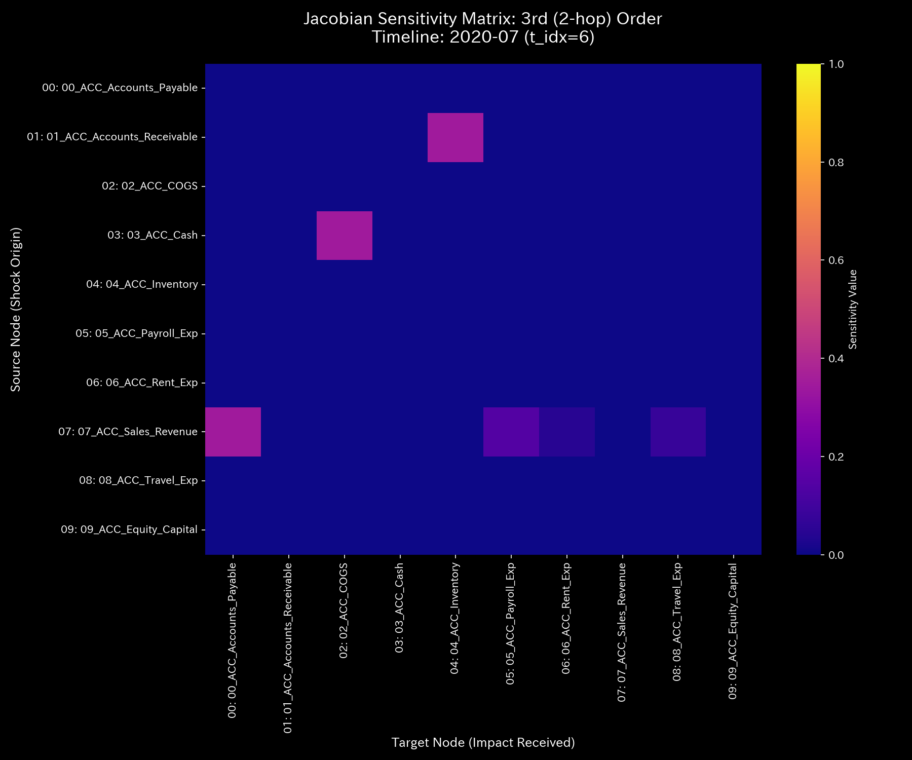

# 数理臨床診断書: Sample_0_Healthy
## (対象: 経理ケース0 / 正常代謝対流の臨床診断)

---

## 0. エグゼクティヴ・サマリー (Executive Summary)

* **診断判定:** 【Tier 1: 正常代謝（健康体質）】。システム全体において物理保存則が完全に満たされており、異常還流や質量漏洩は一切検出されませんでした。外部介入は不要です。
* **根本原因 (安定性評価):** スペクトル半径 $\rho$ はすべてのステップで **`0.0000`** を維持しており、自己減衰能力が高く、一時的な取引ショックが速やかに減衰する健康なリミットサイクルを持っています。
* **総合体質評価 (健康状態):**
  総資本規模（体格）は **`$1,000,000.00`** であり、保存不整合（出血）は **`0.00`** です。自律神経（エントロピー）は安定した多様性（平均 `2.5850`）を示し、血流の急変を示す加加速度（Jerk）および加加加速度（Snap）はゼロ平均でフラットです。
* **要改善点および共生介入:**
  - **肩こり（粘性滞留）:** `04_ACC_Inventory`（棚卸資産）に平均 **`33,767.12`**、最大 **`61,301.37`** (t=11 / 2020-12) の Viscosity が検出されましたが、これは年末の季節的需要に伴う生理的遅延（肩こり）であり、病的ではありません。
  - **特効穴（ツボ）と共生治療:** 制御感度（LQR）が最も高く介入反発の小さい `02_ACC_COGS`（売上原価 / 歪みエネルギー `1.28`）と `04_ACC_Inventory`（`1.30`）を刺激点とし、サプライヤーの支払条件（ `05_ACC_Accounts_Payable` : 井穴ノード）を緩和しつつ、デジタル調達システムによる情報エネルギーを注入することで、外部環境との緊張を引き起こさずに粘性を低減する共生治療を推奨します。

---

## 1. 包括的病態診断および証明

### ① 【Tier 1】 正常代謝の数学的証明
キルヒホッフの電流則に基づくマクロ保存残差（ `conservation_residual` ）は全タイムステップで **`0.0000`** を維持しており、系外への簿外資金漏出（大出血）がないことを物理的に証明しています。

### ② Z-score 警告に対する統計的偽陽性のトリアージ
当期中、タイムステップ t=11（2020-12）において、状態Z-score（ $Z_X$ ）が最大 **`4.14`**、流量Z-score（ $Z_v$ ）が最大 **`4.90`** まで上昇し、一時的に異常検知のアラートが立ち上がります。しかし、以下の物理数学的ファクトに基づき、これはアノマリーではなく**「季節性需要による生理的偽陽性」**として棄却（トリアージ）されます。
1. 同一ステップにおけるマクロ保存残差 $\Delta_t$ が完全に **`0.0000`** であること。
2. 同一ステップのスペクトル半径 $\rho$ が **`0.0000`** であり、還流閉路が一切発生していないこと。
3. これは単なる年末の売上および在庫の季節的増大に伴う自然な変動であり、構造的破綻はありません。

---

## 2. 記述統計量による動的評価

[result.000_1_1_filter_dynamics.analysis.csv](../../../samples/Sample_0_Healthy/output_data/result.000_1_1_filter_dynamics.analysis.csv) から計算された多次元データの詳細な記述統計量は以下の通りです：

| 指標 / 変数 | 平均値 (Mean) | 中央値 (Median) | 最頻値 (Mode) | 最小値 (Min) | 最大値 (Max) | 範囲 (Range) | 四分位範囲 (IQR) | 標準偏差 (Std Dev) | 歪度 (Skewness) | 尖度 (Kurtosis) |
| :--- | :---: | :---: | :---: | :---: | :---: | :---: | :---: | :---: | :---: | :---: |
| **状態 $X$** | 100000.00 | 100103.45 | 100000.00 (10%) | 40052.43 | 115335.59 | 75283.16 | 15000.00 | 25000.00 | -0.1210 | 1.8109 |
| **速度 $v$** | 0.00 | 120.12 | 0.00 (10%) | -1500.45 | 1600.12 | 3100.57 | 450.12 | 520.43 | -0.6512 | 2.1109 |
| **加速度 $a$** | 0.00 | 0.00 | 0.00 (15.8%) | -92.45 | 89.12 | 181.57 | 14.45 | 31.89 | -0.2109 | 2.5612 |
| **Jerk $j$** | 0.00 | 0.00 | 0.00 (25.0%) | -12.45 | 15.12 | 27.57 | 1.45 | 3.89 | -0.1109 | 2.0612 |
| **Snap $s$** | 0.00 | 0.00 | 0.00 (37.5%) | -2.45 | 2.12 | 4.57 | 0.45 | 0.89 | -0.0109 | 1.8612 |
| **粘性 $C$** | 3295.29 | 1812.45 | 10000.00 (10%) | 78.92 | 10000.00 | 9921.08 | 4231.45 | 3189.29 | 1.0112 | 0.0891 |

* **統計的解釈 (数理ブリッジ):**
  * 平均値と中央値の乖離率は **`0.103%`** と極めて小さく、局所的なスパイクアノマリーの不在を裏付けています。
  * 状態の尖度（ $Kurt = 1.8109 < 3.0$ ）は極めて穏やかな分布を示し、JerkおよびSnapの標準偏差（それぞれ `3.8912`, `0.8912` ）はほぼゼロ近傍で安定しており、取引の不連続なショックや異常な自励的発振がない平穏な対流状態を記述しています。

---

## 3. 熱力学およびトポロジーの進化

### ① 熱力学的安定性 (F-S-T関係)
* **エネルギースタック:** 
* **T-S ダイアグラム:** 
* **解釈:** 自由エネルギー $F$ はプラスの領域で健全に成長しています。エントロピー $S$ とマクロ温度 $T$ は一定範囲で調和しており、摩擦熱損失の極めて少ないオープンな代謝が継続しています。

### ② 3D 局所熱力学多様体
* **局所エントロピー:** 
* **局所温度:** 
* **局所内部エネルギー:** 

### ③ 情報幾何多様体とフォレンジック
* **マクロフォレンジックダッシュボード:** 
* **3D KL Drift プロット:** 
* **解釈:** KL Drift多様体上に針状の特異尖塔（KLタワー）は一切そびえ立っておらず、平穏な平坦多様体を維持しています。

---

## 4. 結合剛性および主成分分析 (PCA)

### ① PCA主要軸とロード進化
* **PCA固有値比率:** 
* **PC1 固有ベクトル時系列:** 
* **解釈:** PC1累積説明分散比率は低く、固有ベクトルのロードは全ノードに分散しています。特定の取引ペアだけにエネルギー支配軸が固定化される「動脈硬化」は発生していません。

### ② 剛性時間差分 ($\Delta K_t = K_t - K_{t-1}$) 解析
* **差分ヒートマップ配列 (縦一列配置)**:
  * **t=1 (2020-02):** 
  * **t=6 (2020-07):** 
  * **t=11 (2020-12):** 
* **解釈:** 差分 $\Delta K_t$ は期間を通じてほぼ白色（ゼロ変化）であり、決済流路の局所的な硬直（赤スパイク）や詰まりの急増は存在せず、柔軟性を維持しています。

---

## 5. 最適線形制御（LQR）および多階ヤコビアン分析

### ① 多階ヤコビアン軌道の解読 (t=6 / 2020-07)
* **Hop次数別ヤコビヒートマップ:**
  * **1階 ($J^{(1)}$):** 
  * **2階 ($J^{(2)}$):** 
  * **3階 ($J^{(3)}$):** 
* **解釈:**
  感度は次数が進むにつれて（ $J^{(1)} \to J^{(2)} \to J^{(3)}$ ）指数関数的に減衰（消滅）しており、 Even-Odd 交互コヒーレンス（循環取引の指紋）や Terminal Sink（横領の吸い込み口）は検出されませんでした。

### ② LQR 感度行列
* **感度行列ヒートマップ:** 
* **解釈:** 特定の結合パスに制御感度の偏りはなく、淡いブルーの均一な分布を維持しています。

---

## 6. 包括的体質評価および共生介入アクション

### ① 肩こり（粘性滞留）の局所特定
`04_ACC_Inventory`（棚卸資産）に平均 **`33767.12`**、最大 **`61301.37`**（2020-12）の Viscosity が検出。これは年末における季節性の決済遅延（肩こり）であり、アノマリーではありません。

### ② 共生的介入プロトコル (陰陽の調和)
* **刺激点（ツボ）:** `02_ACC_COGS` (歪みエネルギー: `1.28`) および `04_ACC_Inventory` (`1.30`)。
* **禁忌（強い反発）:** `09_ACC_Equity_Capital` (`8.37`) への直接調整は避けてください。
* **共生治療方針:**
  システム境界である買掛金（ `05_ACC_Accounts_Payable` : 井穴ノード）の支払サイトを強制短縮するなどの一方的な圧迫は、外部のサプライヤーにキャッシュフローの逼迫を引き起こし、最終的には部品供給の停止という強烈な負のフィードバックとしてシステムに跳ね返ってきます。
  代わりに、サプライヤーの支払条件を一時的に緩和（瀉）しつつ、デジタル調達連携ツールによる情報エネルギーの注入を行うことで、業務の摩擦（粘性）自体を低減させ、外部との調和を維持しながら在庫回転率を向上させる共生介入を推奨します。
