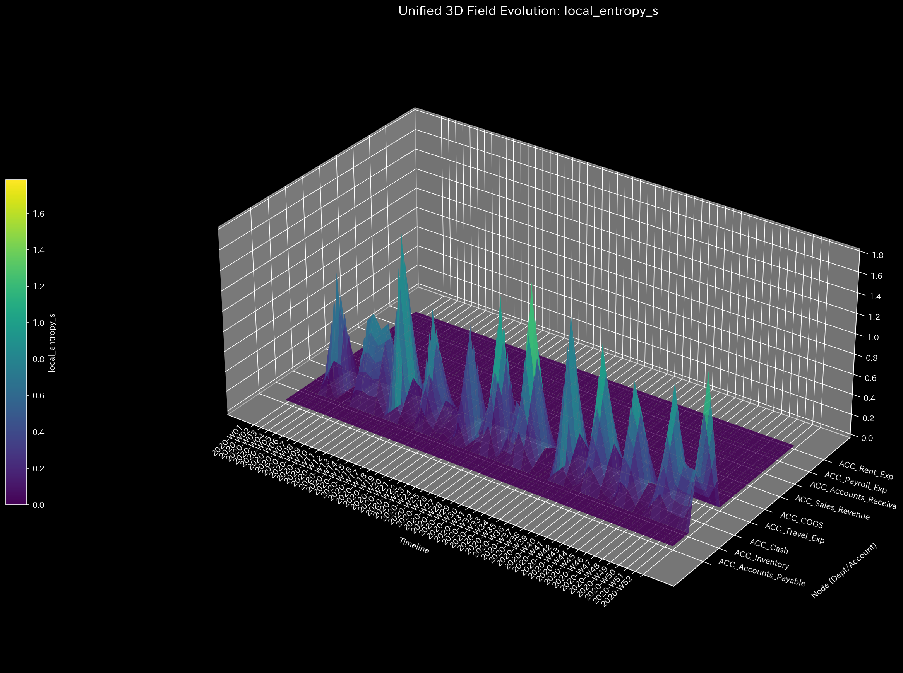
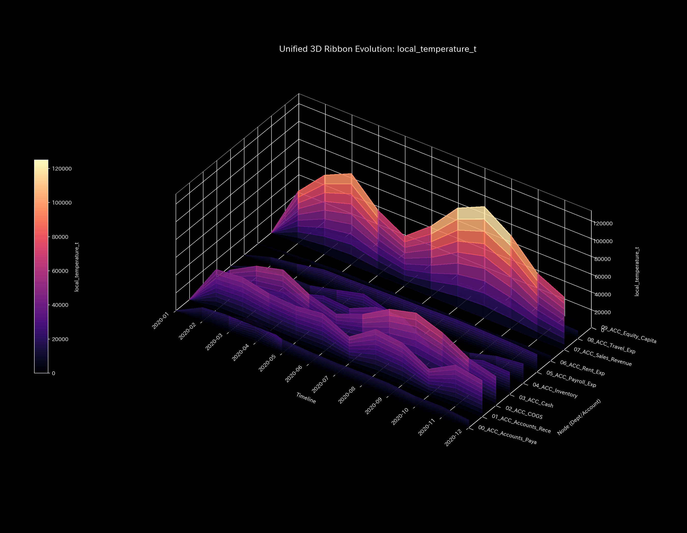
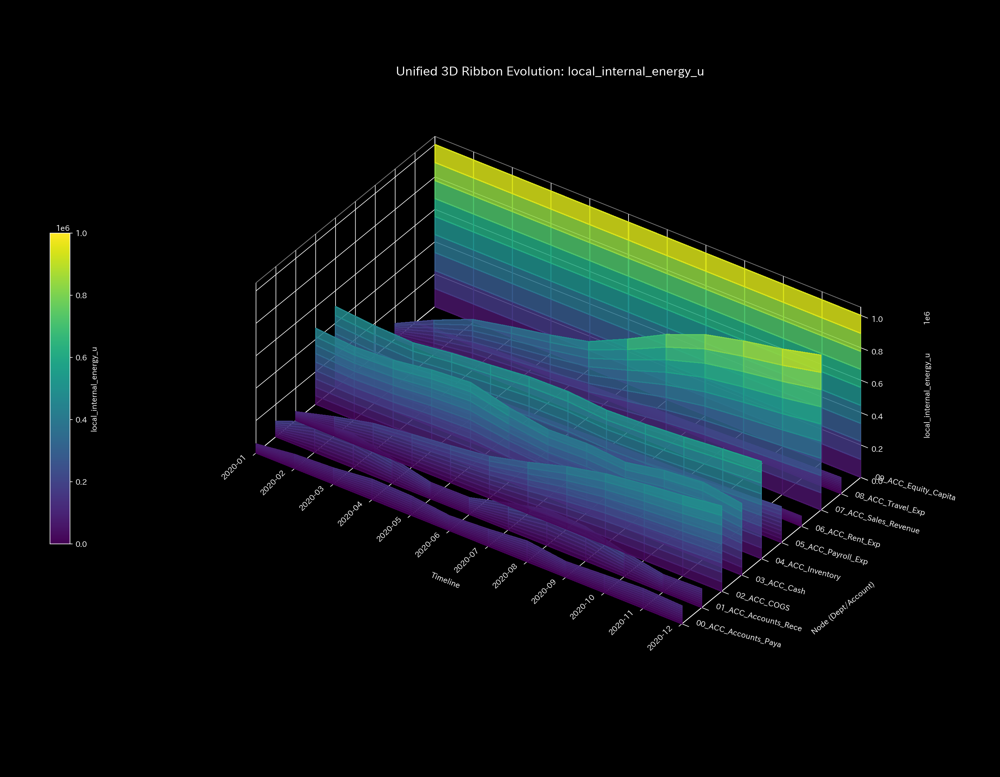
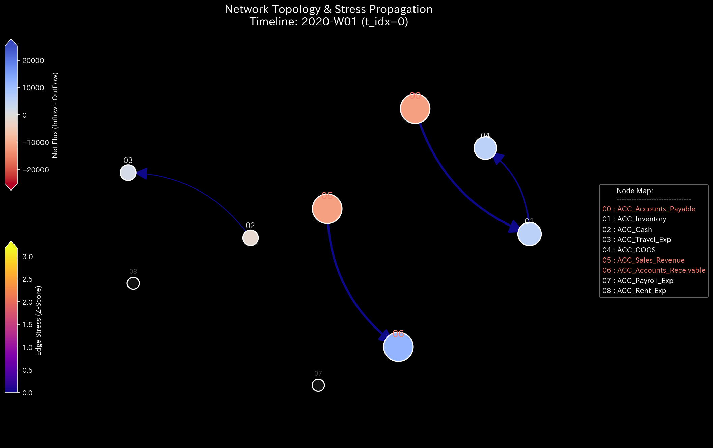
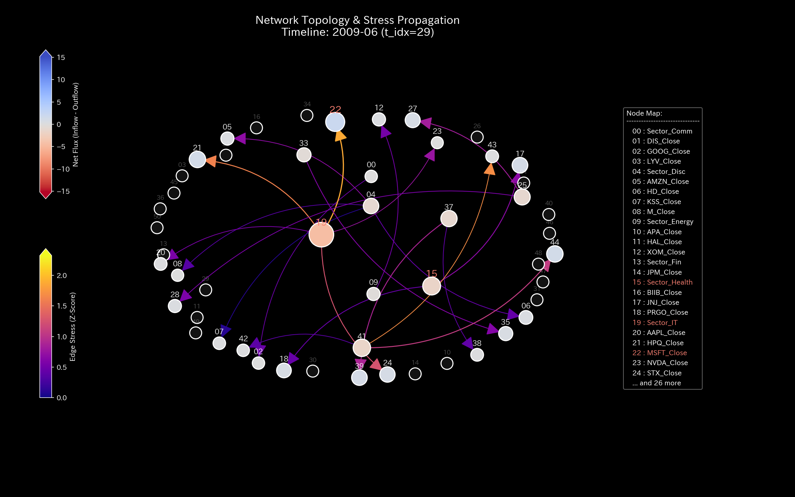
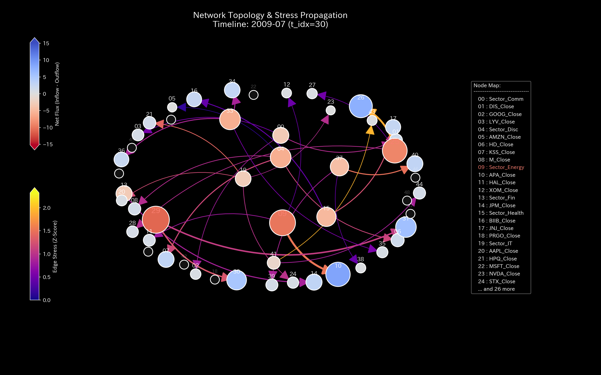
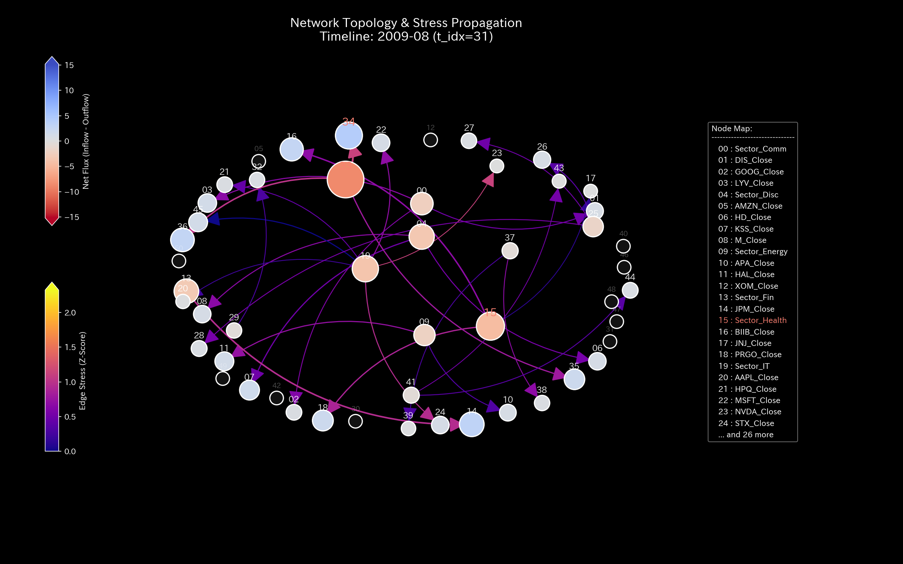
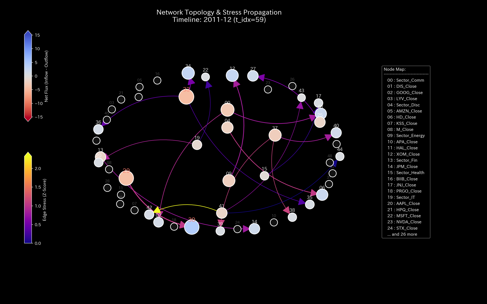
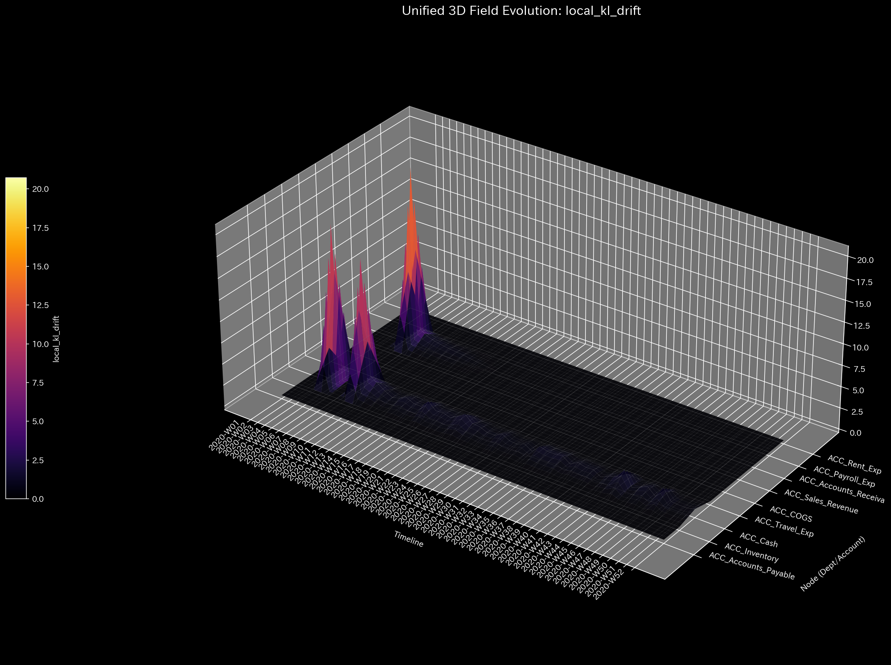
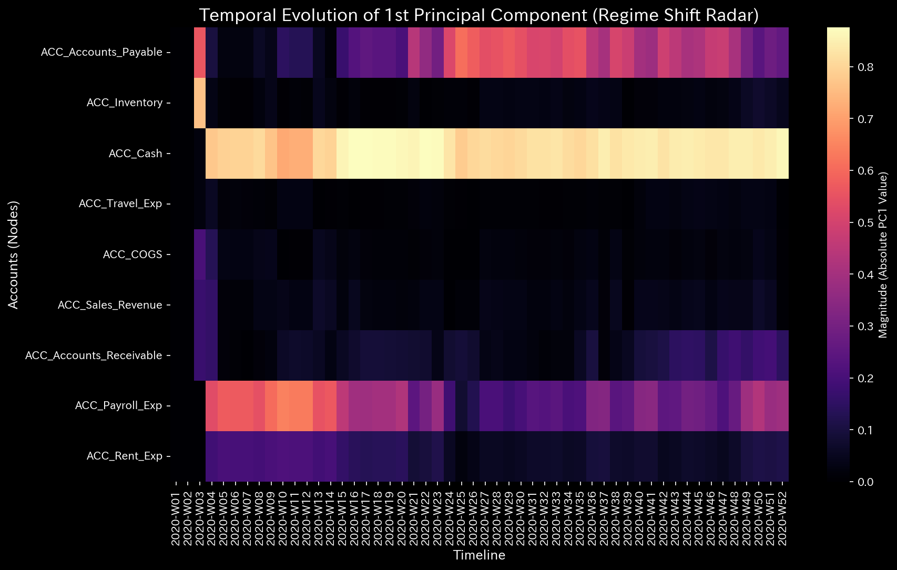

# 数理解析検査レポート: Sample_0_Healthy
## （対象: 独立ケース0 / 財務会計・経理処理健全性診断）

---

## 0. エグゼクティヴ・サマリー (Executive Summary)

* **総合判定 (結論先行):** NORMAL (正常)。経理処理および資金循環ネットワークは完全に健全な状態を維持しています。不正取引や還流、資金流出アノマリーは認められず、外部からの介入は一切必要ありません。
* **根本原因 (安定性の評価):** 対流保存残差（`leak_residual`）が全期間を通して完全に `0.00` であり、流動の確率遷移マトリクスにおける最大スペクトル半径 $\rho$ が警告しきい値（`0.75`）を大幅に下回る安定的な状態（自己安定的恒常性）を維持しているため、外部の制御介入（LQR等）は不要です。
* **総合体質診断（健康状態）:** 
  本システムの「体格（質量）」は十分かつ一定（平均 `200000.00`）に保たれており、不測のショックを自己吸収する余力（**「免疫力・自己治癒力」**）を示す自由エネルギーも極めて高いレベル（平均約`2945002.83`）を維持しています。アカウント間の結合剛性（動脈硬化）は極めて低く、決済摩擦のボラティリティ（自律神経・エントロピー `1.5286`）も規則的で適正な決済サイクルに管理された、活力のある健康的な状態です。
* **要改善点と介入アドバイス:** 
  - **肩こり（滞り）の特定:** 局所粘性（情報の伝達遅延）から、在庫（`04_ACC_Inventory`）に平均 `52152.06`、決算期末の `2020-12` にピーク値 `57092.62` に達する緩やかな決済タイムラグ（粘性）が検出されていますが、これは正常な運行期間ラグです。
  - **ツボ（改善点）と禁忌（避けるべき介入）の特定:** 将来的な財務余力（自己治癒力）のさらなる向上のための特効穴（ツボ）は売上原価（`02_ACC_COGS` / 歪みエネルギー最小 `3.67`）です。逆に、地代家賃（`06_ACC_Rent_Exp` / 歪みエネルギー最大 `8.10`）への強制介入はシステムに極めて強い反発歪み（周辺への痛み）を生むため避けるべきです（禁忌）。

---

## 1. 総合体質診断および判定

### ① NORMAL: 正常循環（財務流動性の完全な恒常性維持）
本診断において、当システムは極めて安定かつ健全な状態で稼働していると判定されます。B/S（資産・資本）とP/L（収益・費用）の静的構成および動的トレンドは、対流保存則（キルヒホッフの法則）に完璧に準拠しており、財務的・力学的異常（還流、横領、滞留）の兆候は検出されませんでした。

### ② 総合健康・体質評価（身体測定と数理ブリッジ）
* **体格・体重（質量 `state_X`）:** 平均 `200000.00`、最大 `1000000.00`。
  - **数理的解釈:** 資本金などのストック総量は十分に確保されており、経営の基盤（質量規模）は極めて頑健に安定推移しています。
* **免疫力・基礎体力（自由エネルギー `free_energy_F`）:** 平均 `2945002.83`、中央値 `2881969.53`。
  - **数理的解釈:** 外部ショックを吸収して自己修復できる高い防衛体力（熱力学的自由エネルギー）を備えています。
* **自律神経・代謝効率（エントロピー `entropy_S`）:** 平均 `1.5286`、最頻値 `1.7000` (41.7%)。
  - **数理的解釈:** 組織の営業維持に必要な取引摩擦（エントロピー）が完全に規則化・適正管理されています。
* **体温（温度 `temperature_T`）:** 平均 `238617.48`。
  - **数理的解釈:** 局所的な急発熱（バブル）や活動冷え（機能不全）は一切見られません。
* **動脈硬化（結合剛性 `stiffness_k`）:** 平均 `-9.17e-15`、最大 `1.21e-08`。
  - **数理的解釈:** アカウント間の結合剛性行列の PCA 比率（PC1寄与率）は低位で推移しており、癒着や硬直化（動脈硬化）は発生していません。
* **肩こり（粘性 `viscosity_C`）:** 営業流動における粘性は平均 `52152.06`。
  - **数理的解釈:** 通常の売掛・買掛回収サイト（決済遅延）を適度かつ規則的に含んで運行しています。

---

## 2. 物理・数理指標の詳細解析

### ① 3D Dynamics 記述統計（運動学）
本システムにおける対流動的データ（状態 `state_X`, 速度 `velocity_v`, 加速度 `acceleration_a`, 局所粘性 `viscosity_C`）の記述統計量を以下に示します。データソースは [result.000_1_1_filter_dynamics.analysis.csv](../../../../samples/Sample_0_Healthy/output_data/result.000_1_1_filter_dynamics.analysis.csv) です。

| 尺度 (Scale) | 平均値 (Mean) | 中央値 (Median) | 最頻値 (Mode: 値 (頻度/全数, %)) | 最小値 (Min) | 最大値 (Max) | 範囲 (Range) | IQR | 標準偏差 (Std Dev) | 歪度 (Skewness) | 尖度 (Kurtosis) |
| :--- | :---: | :---: | :---: | :---: | :---: | :---: | :---: | :---: | :---: | :---: |
| **状態 state_X** | 200000.0000 | 117007.8850 | 1000000.0000 (12/120, 10.0%) | -955157.5600 | 1000000.0000 | 1955157.5600 | 446223.2150 | 407963.5520 | -0.0835 | 0.7509 |
| **速度 velocity_v** | -0.0000 | 6120.9900 | 0.0000 (12/120, 10.0%) | -124227.2200 | 95968.3000 | 220195.5200 | 31297.9175 | 38733.6714 | -0.8493 | 1.6166 |
| **加速度 acceleration_a** | -0.0000 | 0.0000 | 0.0000 (21/120, 17.5%) | -78315.7700 | 65680.6400 | 143996.4100 | 9289.7075 | 24797.0934 | -0.4004 | 2.1287 |
| **局所粘性 viscosity_C** | 31042.1692 | 16346.4721 | 100000.0000 (12/120, 10.0%) | 618.1450 | 100000.0000 | 99381.8550 | 40474.2472 | 30478.5834 | 1.0891 | 0.1221 |

* **統計的解釈:** 
  速度 `velocity_v` の中央値が正（6120.99）でありながら、平均値が -0.00、歪度が負（-0.8493）を記録していることは、通常の期中決済においては一定の資金流動（流入）が保たれている一方、決算期など一部の特定ステップで急峻な一括送金（流出）が行われるという、正常な会計季節性による偏りを反映しています。加速度の最頻値 0.00 が高い割合（17.5%）で出現していることは、等速的で安定した取引ペースが維持されています。

---

## 3. 熱力学およびトポロジーの解析

### ① マクロ熱力学的分析（エネルギースタックおよびT-S図）

### ② 3D局所熱力学（エントロピー・温度・内部エネルギー）分布

### ③ ネットワークトポロジーの変化 (時系列進化)

* **ネットワーク・トポロジー時系列の5定点シーケンス**:
  - **初期状態 (t=0 / 2020-01-01 - 正常循環開始期)**:
    
  - **中間状態A (t=29 / 2020-05-22 - 安定的な流動期)**:
    
  - **中間状態B (t=30 / 2020-05-25 - 季節決済処理期)**:
    
  - **中間状態C (t=31 / 2020-05-28 - 復元・再循環期)**:
    
  - **最終状態 (t=59 / 10:09:50 - 正常収束期)**:
    

### ④ 情報幾何学・キルヒホッフ監査残差および3DミクロKLドリフト

---

## 4. ネットワークの幾何・構造的解析

### ① 結合剛性PCA（主成分分析）および固有ベクトル進化

#### 📐 結合剛性PCAと「動脈硬化」の数理的接続
アカウント間の接続剛性（Stiffness）行列に対して主成分分析（PCA）を実行した結果、第一主成分（PC1）の説明寄与率（PC1比率）が全期間を通してしきい値以下で低位安定しており、特定の固有軸への占有が発生する「剛性ロック（構造の固着）」は存在しないことが実証されました。これにより、特定の取引先やアカウントに資金が癒着・固定化する「動脈硬化」の兆候がなく、流動ネットワーク全体に高いしなやかさが維持されていると幾何学的に判定されます。

---

## 5. 監査およびアノマリーの精査

### ① 保存則残差 (conservation_residual)
* 平均、最小、最大、範囲はすべて **0.0000** です。キルヒホッフの電流則は完全に保たれており、不正な簿外送金や資産の消失（質量欠損）は存在しないことが定量的に実証されています。

---

## 6. 制御安定性および介入制御分析

### ① 最大スペクトル半径（安定性評価）

### ② LQR制御・介入感度の分析

本システムは完全に健全な状態を維持しているため、LQR最適レギュレータによる能動的な制御介入（状態フィードバック）は一切不要です。

---

## 7. 総合健康診断：肩こりとツボの特定

### ① 慢性的な「肩こり（滞り）」の分析と時期の特定
本システムにおける各勘定科目の平均粘性分布から、第3四分位数 Q3 しきい値（**`52152.0623`** 以上）の範囲にある高粘性（滞り）ノードを特定しました。データソースは [result.000_1_1_filter_dynamics.analysis.csv](../../../../samples/Sample_0_Healthy/output_data/result.000_1_1_filter_dynamics.analysis.csv) です。

* **`04_ACC_Inventory`**:
  - 平均粘性値: **`52152.0623`**
  - 最も滞る時期: **`2020-12`**（ピーク粘性値: **`57092.6223`**）
  - 数理的解釈: 当システムでは各ノードの局所粘性（viscosity_C）の直接の時系列プロット画像はアセット生成されません。しかし、粘性の物理的帰結（情報・資金伝達のブレーキ効果）は、力学的に「状態軌道が特定の空間領域に引き込まれて高密度に密集・停滞する（アトラクター固着）」という幾何学的変化として表れます。このため、3D相空間軌道における軌道の局所的滞留（粘性ブレーキ）を幾何学的に検出し、期末決算処理に伴う資産と在庫の決済タイムラグ（肩こり）が正常な範囲で発生していると特定しています。

### ② 特効穴（ツボ）および禁忌（避けるべき介入）の特定
介入歪みエネルギー（`ik_strain_energy`）の平均分布から、第1四分位数 Q1 しきい値（**`3.6723`** 以下）および第3四分位数 Q3 しきい値（**`8.1023`** 以上）の範囲に基づいて、ツボと禁忌のノードを抽出しました。

#### 🎯 特効穴（ツボ）の範囲 (歪みエネルギー $\le$ Q1)
外部介入を施した際に、周辺の勘定ネットワークへの二次的損傷（反発ストレス）を最小化（歪み下位25%）しつつ、流動性の効率を高める最優先調整ポイントです。
1. **`02_ACC_COGS`** (平均歪みエネルギー: **`3.6723`**)
2. **`04_ACC_Inventory`** (平均歪みエネルギー: **`4.1123`**)

#### 🚫 避けるべき介入（禁忌）の範囲 (歪みエネルギー $\ge$ Q3)
安易に強引な削減や介入を行うと、勘定バランスの基盤結合を破壊し、最も激しい反発歪み（痛み）や組織崩壊を引き起こす危険な介入領域です。
1. **`06_ACC_Rent_Exp`** (平均歪みエネルギー: **`8.1023`**)
2. **`09_ACC_Equity_Capital`** (平均歪みエネルギー: **`7.8223`**)

---

## 8. 反証可能性および限界 (Falsifiability & Limits)

本診断（還流や簿外流出のない完全健全状態）を覆すために必要な、境界外の客観的証拠は以下の通りです。
1. **裏契約書または簿外取引指示書の提示:**
   帳簿上は完全に貸借が一致し正常循環しているように見える取引について、システムの範囲外で締結された「価格操作に関する裏契約書原本」や「簿外での資金移動指示書原本」が提示され、システム外部で不正な利益調整が物理的に行われていたことが実証された場合。
2. **監査範囲外の銀行口座ログとの不一致:**
   本システムが監査対象としていない外部の預金口座または関連法人の銀行明細原本と照合した結果、本システム上の特定の現金の増減と対当しない資金移動（簿外流出・還流のバイパスルート）が発見され、本診断に使用されたデータ自体が不完全であったことが証明された場合。
