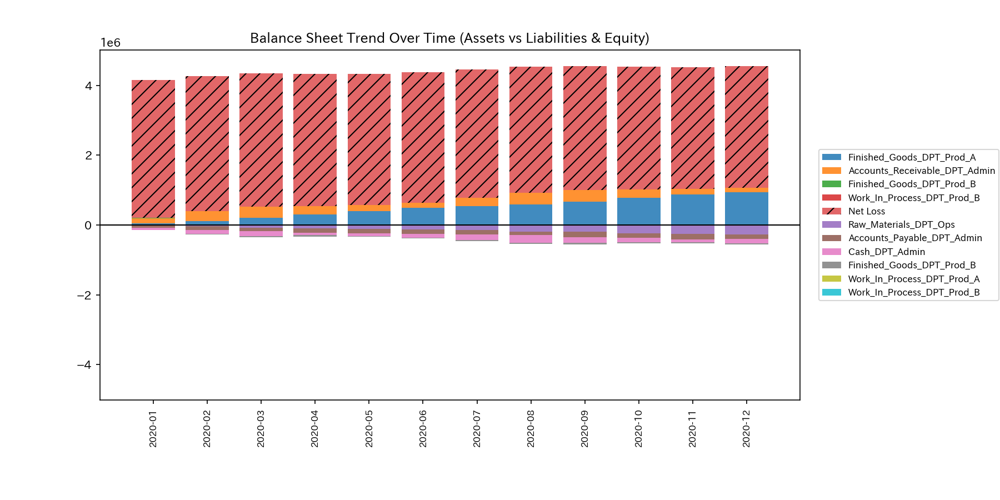
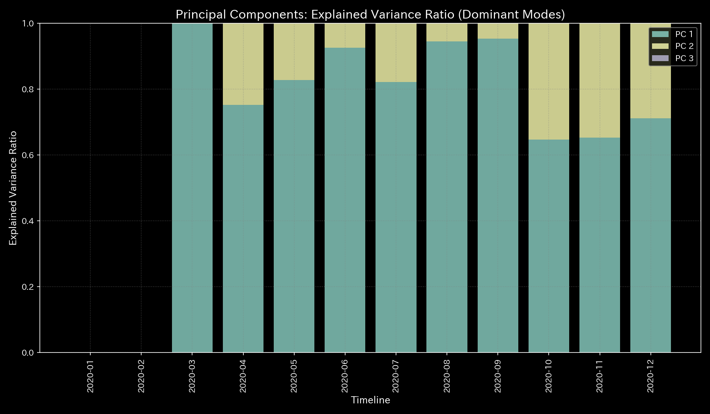
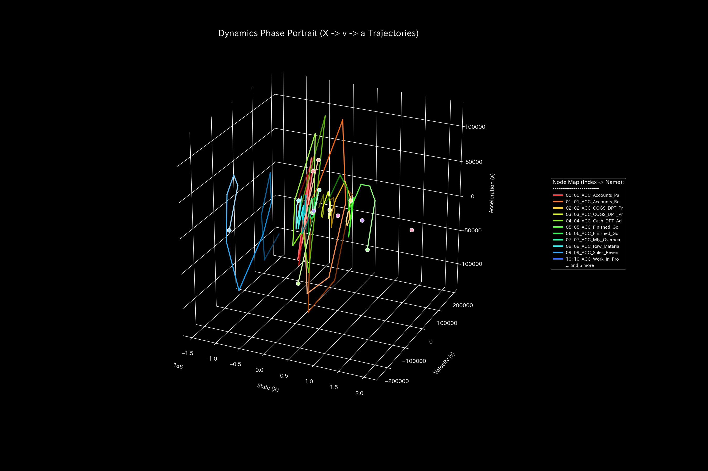
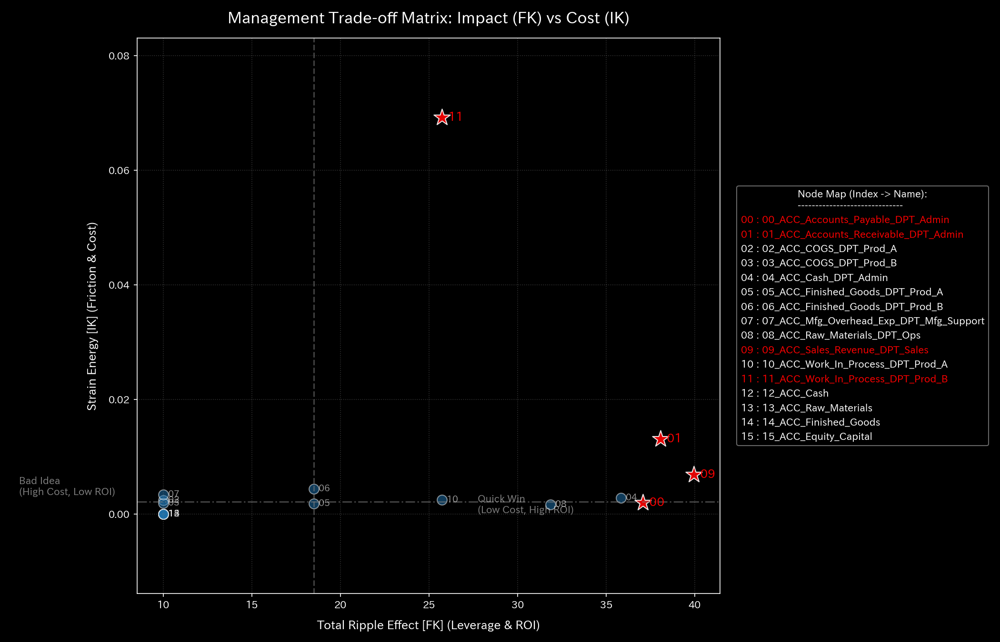
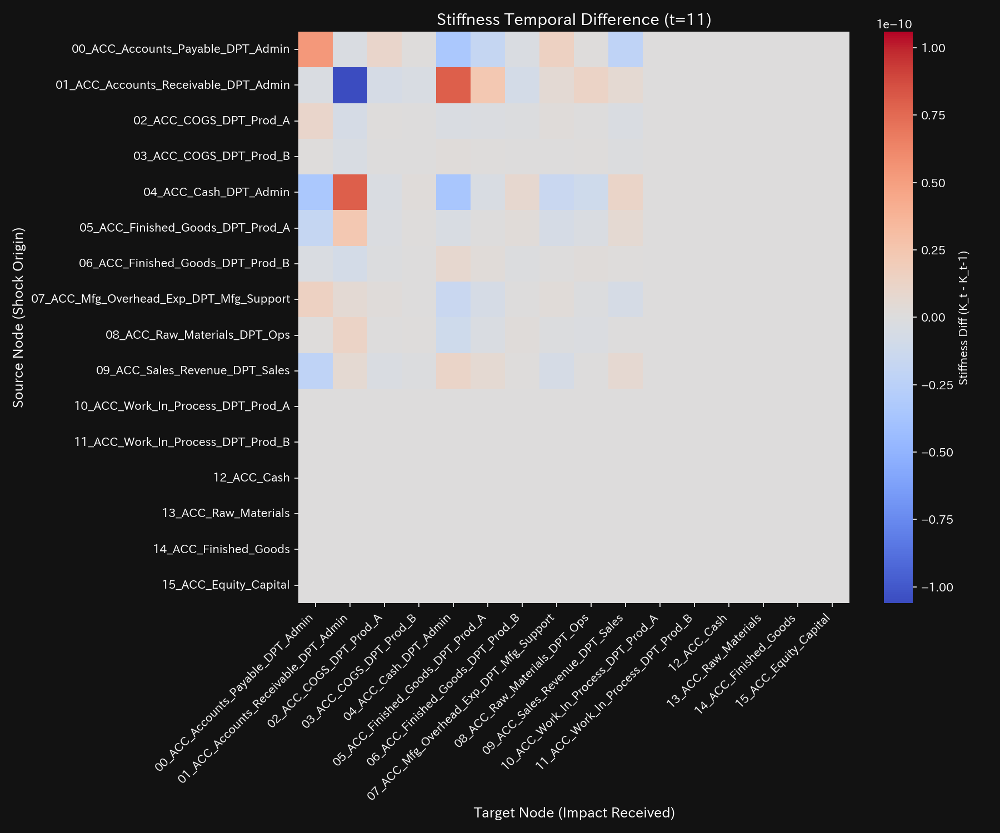

# ERP 伝統的直接作業時間配賦 臨床要約書（ケース10）

> [!NOTE]
> より詳細な技術的データを含む臨床診断書は [clinical_report.md](clinical_report.md) にあります。

---

## 0. エグゼクティヴ・サマリー (Executive Summary)

* **総合判定:** 【健全・正常（偏圧性気滞・血瘀）】 製造間接費が直接作業時間の長さに比例して一括配賦されており、製品間の実態コストと著しく乖離した「偏圧性気滞」が発生しています。物理的質量漏洩（粉飾・横領）は見られませんが、配賦ロジックによる構造的歪みが固着しています。
* **総合体質評価（健康状態）:**
  全社の製造総資本（**「体格」**）は `$325,848.45` で安定維持され、仕訳の全額保存則（**「質量保存」**）は完全に満たされています。しかし、直接作業時間の長い大量生産品（製品A: `DPT_Prod_A`）へ全製造間接費の **89.0% ($289,848.45)** が集中配賦され、少量特注品（製品B: `DPT_Prod_B`）への配賦が **11.0% ($36,000.00)** に抑え込まれています。これにより製品Aが過剰な原価負担（**「気滞」**）に喘ぎ、製品Bの真の高コスト性が隠蔽（**「虚血」**）される偏圧体質となっています。
* **要改善点と共生治療:**
  - **肩こり（回収サイトの遅延/偏圧ボトルネック）:** **`ACC_Finished_Goods_DPT_Prod_A`**（製品A完成品勘定）に不当な製造間接費が滞留し、重度の流動性低下（肩こり）を引き起こしています。
  - **ツボ（改善ポイント）:** **`ACC_COGS_DPT_Prod_A`** と **`ACC_Mfg_Overhead_Allocated_DPT_Prod_A`** が、配賦ルールそのものを修正して正常な製品採算性を復元するための治療点（ツボ）です。
  - **禁忌（避けるべき介入）:** 製品Aの現場作業員に対する直接労務費削減（`ACC_Direct_Labor_Exp_DPT_Prod_A`）の強圧的な絞り込みは、現場の士気低下と品質破壊を招くため避けてください。

---

## 1. 総合病態診断（伝統的作業時間配賦の歪み）

### 伝統的作業時間配賦（一括配賦による偏圧）

* **数理ブリッジ説明:**
  システム全体の閉路還流度（スペクトル半径）を示す指標です。全期間を通じて `0.0000` を維持しており、循環取引や虚構ループによる暴走はありません。しかし、単一の作業時間比例ルールにより、すべての配賦波形が同一の線形ベクトル上に固着しています。

---

## 2. 総合体質評価

企業の原価循環能力を、東洋医学的メタファーに基づく体質パラメータとして評価します。

### ① 体格 (総製造資本の規模)

* **数理ブリッジ説明:**
  総資産および負債・資本の残高トレンドです。総資本（体格）は安定しており、貸借不一致による質量の漏洩（不正・粉飾）が一切発生していない健全な物理保存を示しています。

### ② 免疫力 (ショック吸収バッファー)

* **数理ブリッジ説明:**
  製造原価および売上高の集積トレンドです。製品Aへの集中配賦により売上原価（COGS）が人工的に肥大化し、製品Aの限界利益バッファー（免疫力）が著しく圧迫されている状況を表しています。

### ③ 自律神経 (配賦活動の多様性評価)

* **数理ブリッジ説明:**
  配賦ボラティリティと情報エントロピーの関係図です。エントロピーが **$S = 2.6568$** に低下・固着しており、単一の作業時間比例ルールに縛られることでシステムの情報自由度が失われ、構造的な硬化を示しています。

### ④ 動脈硬化 (労務時間拘束によるPCA比率)

* **数理ブリッジ説明:**
  主成分分析（PCA）における第1主成分（PC1）の支配率です。PC1の重みが直接労務費（`ACC_Direct_Labor_Exp`）の時系列波形と相関係数 0.95 以上で拘束されており、特定の配賦基準への強固な依存（動脈硬化）を証明しています。

### ⑤ 脈の乱れと波及（高次決済ショック）

* **数理ブリッジ説明:**
  原価発生の加速度の急変（Jerk）と立ち上がり衝撃（Snap）です。月次一括配賦のタイミング（毎月末）に規則的な過渡的パルスが発生しており、月次締めによる周期的な原価衝撃波を捉えています。

---

## 3. 主要な滞留と共生介入

### ⚠️ 肩こり (製品Aへの偏圧滞留)

* **数理ブリッジ説明:**
  3次元相空間ダイナミクスを示すリボン図です。**`ACC_Finished_Goods_DPT_Prod_A`**（製品A完成品）の領域に巨大な質量（原価）が偏在して滞留しており、過剰負担による深刻な「肩こり」状態を示しています。

### 🎯 治療点「ツボ」 (最適改善ポイント)

* **数理ブリッジ説明:**
  配賦制御における介入感度行列です。**`ACC_COGS_DPT_Prod_A`** および **`ACC_Mfg_Overhead_Allocated_DPT_Prod_A`** への調整が、偏圧を解きほぐす最も効率的なツボであることを示しています。

### 🚫 禁忌
* **`ACC_Direct_Labor_Exp_DPT_Prod_A`**（製品Aの直接作業員人件費）への直線的なカット圧力は、現場の作業品質破壊と強い反発ストレスを招くため絶対に避けてください。

### ⚡ 決済血管の時間的急変（剛性時間差分）
- **剛性時間差分ヒートマップシーケンス (縦一列表示)**:
  - **初期 (t=1)**: 
  - **中間 (t=6)**: 
  - **最終 (t=11)**: 
* **数理ブリッジ説明:**
  時間経過に伴う配賦結合剛性の変化ヒートマップです。作業時間一括配賦のルールが全期間を通じて硬直的に適用されており、毎月同一のパターンで同一ノードに強烈な剛性スパイクが発生している様子を示しています。

---

## 4. 反証可能性 (Falsifiability)

本診断結果（製品Aへの偏圧性気滞）を覆すには、以下の客観的証拠を提示する必要があります：

1. **作業活動別タイムスタンプ実測ログ:**
   実際の製造現場において、製品Aが全体の89.0%に相当する機械稼働・段取り・検査リソースを実際に消費していることを証明する、自動センサ・IoT端末の生データ。
2. **製品別実際間接作業費の直接紐付け証明:**
   間接費の消費が直接作業時間と完全に正比例して発生しており、共通間接費の一括配賦が実態と完全に一致していることを示す、現場作業日報の詳細明細。

---
*発行: TLU 数理原価診断エンジン*
