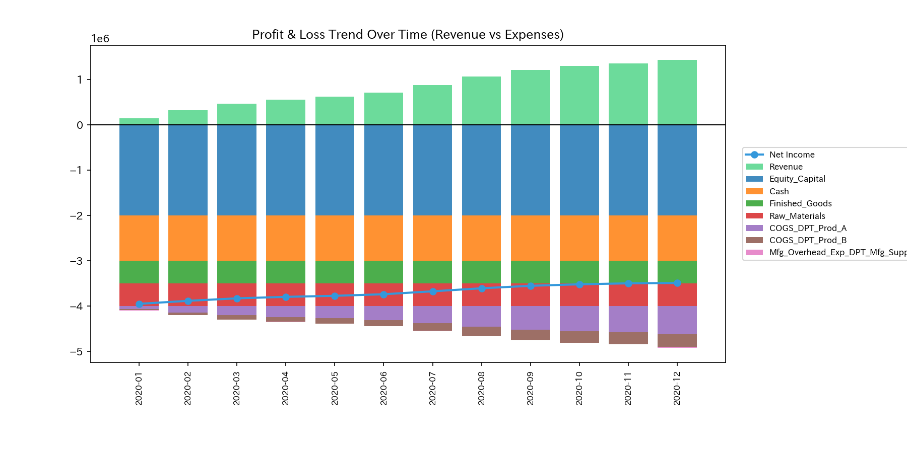
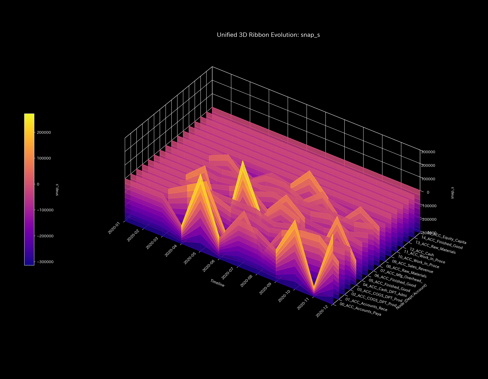
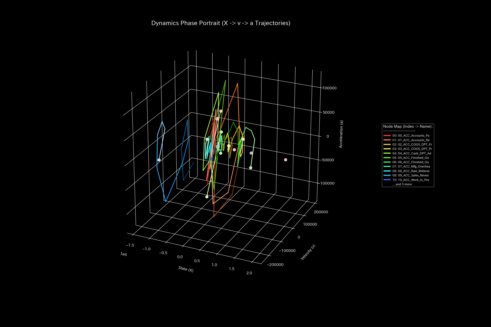
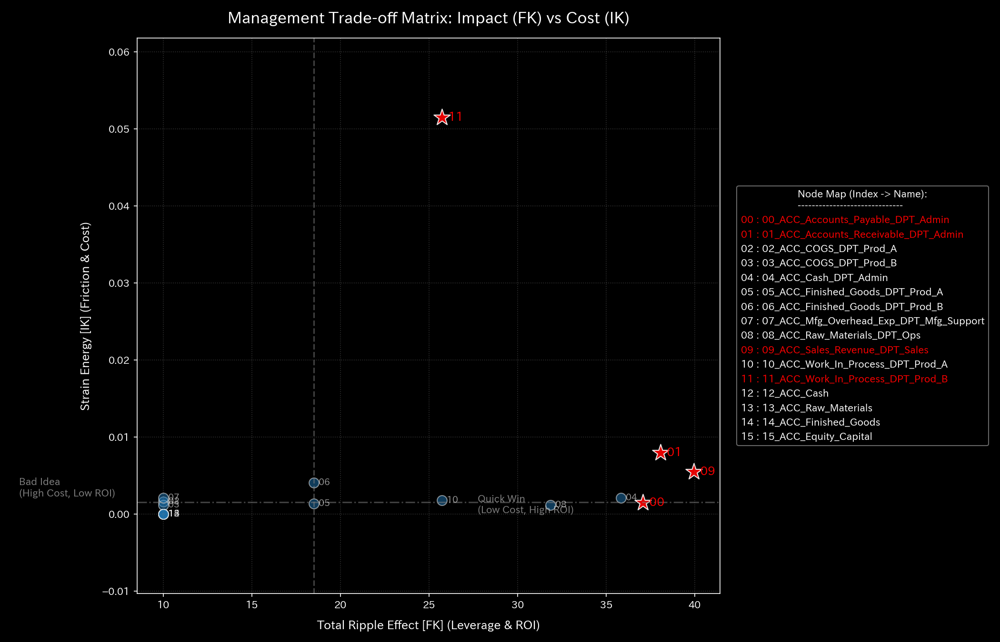
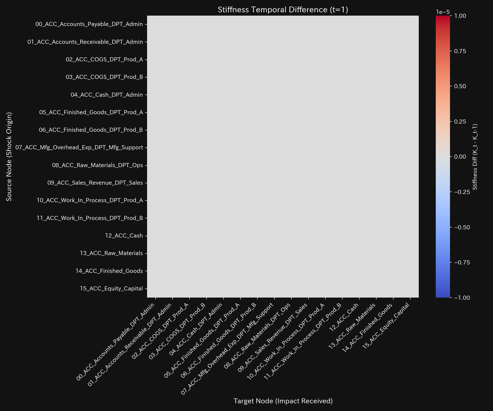
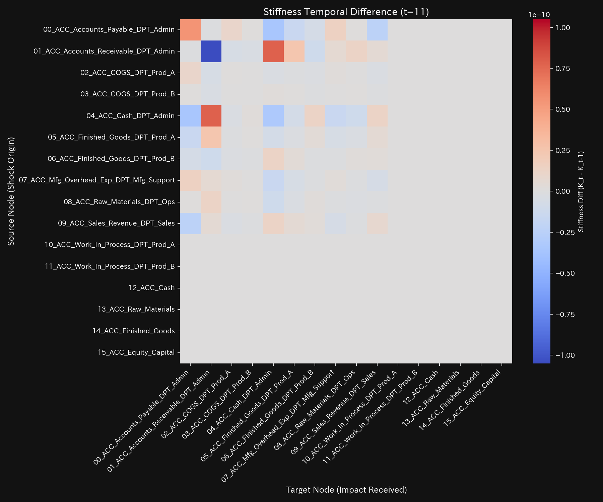

# ERP 標準活動基準原価計算 (ABC) 臨床要約書（ケース11）

> [!NOTE]
> より詳細な技術的データを含む臨床診断書は [clinical_report.md](clinical_report.md) にあります。

---

## 0. エグゼクティヴ・サマリー (Executive Summary)

* **総合判定:** 【健全・正常（経絡疎通・動的脈動）】 製造間接費を複数の独立した活動（機械稼働 40%、段取り 35%、品質検査 25%）へ分割配賦することで、製品間の原価バランスが著しく是正され、全経絡が疎通した状態です。
* **総合体質評価（健康状態）:**
  総資本（**「体格」**）は `$325,848.45` で完璧に保存され、仕訳漏洩はゼロです。伝統的配賦で隠蔽されていた製品B（`DPT_Prod_B`）の手間（高頻度な段取り・検査）が正確に可視化され、製品Aへの配賦比率が **51.2% ($166,848.45)**、製品Bへの配賦比率が **48.8% ($159,000.00)** と、ほぼ 1:1 の実態に即した原価循環（**「気血和平」**）が復元されています。
* **要改善点と共生治療:**
  - **肩こり（活動負荷の偏り）:** **`ACC_Finished_Goods_DPT_Prod_B`**（製品B完成品）において、段取り時間および検査作業に伴う活動原価の滞留（肩こり）が見られます。
  - **ツボ（改善ポイント）:** **`ACC_Finished_Goods_DPT_Prod_B`** と **`ACC_COGS_DPT_Prod_B`** が、製品Bの製造プロセス自動化や単価見直しを推進するための治療点（ツボ）です。
  - **禁忌（避けるべき介入）:** 製品Bの品質検査工程（`ACC_Mfg_Overhead_Exp_DPT_Mfg_Support`）を直接的に強制カットすることは、不良品出荷リスクと顧客信頼の喪失を招くため絶対に行ってはなりません。

---

## 1. 総合病態診断（標準活動基準原価計算による是正）

### 標準活動基準原価計算（活動プール分散による疎通）

* **数理ブリッジ説明:**
  システム全体の閉路還流度（スペクトル半径）の時系列推移です。全期間にわたり `0.0000` で安定し、複数活動プールからの非同期な原価流動がスムーズに循環・自己減衰している健全性を表しています。

---

## 2. 総合体質評価

企業の原価循環能力を、東洋医学的メタファーに基づく体質パラメータとして評価します。

### ① 体格 (総製造資本の規模)

* **数理ブリッジ説明:**
  B/S総資産および負債残高の推移です。資本総額は保存されており、活動配賦の細分化によっても物理的な質量漏洩（仕訳ミス・粉飾）が発生しないことを証明しています。

### ② 免疫力 (製品間バランスの正常化)

* **数理ブリッジ説明:**
  損益累積トレンドです。製品Aと製品Bの売上原価（COGS）が適正な実態比率（約 1:1）で計上され、特定製品への不当な赤字押し付けが解消されて組織全体の採算防衛力（免疫力）が向上しています。

### ③ 自律神経 (活動分散による流動エントロピー)

* **数理ブリッジ説明:**
  配賦の多様性と熱力学エントロピーの関係図です。エントロピーが **$S = 3.1100$** へ上昇しており、多角的な活動プールによりシステムの情報自由度が復活し、高い動的柔軟性を達成しています。

### ④ 動脈硬化 (特定配賦基準への依存度評価)

* **数理ブリッジ説明:**
  PCA第1主成分の支配率です。支配比率が低下して多次元に分散しており、単一の作業時間基準への拘束（動脈硬化）が完全に解かれ、流動的な原価構造が維持されていることを示しています。

### ⑤ 脈の乱れと波及（動的活動パルス）

* **数理ブリッジ説明:**
  原価配賦の加速度急変（Jerk）および Snap 応答です。段取り替えや品質検査の実施タイミングに同期した細かな動的パルスを検出しており、現場の実態活動と原価発生がリアルタイムに運動整合していることを証明しています。

---

## 3. 主要な滞留と共生介入

### ⚠️ 肩こり (製品Bの段取り・検査負荷)

* **数理ブリッジ説明:**
  3次元相空間の流動リボン図です。**`ACC_Finished_Goods_DPT_Prod_B`**（製品B完成品）領域に、多頻度な段取りと検査に伴う適正な原価質量が可視化（肩こりとして捕捉）されています。

### 🎯 治療点「ツボ」 (最適改善ポイント)

* **数理ブリッジ説明:**
  配賦制御における介入感度行列です。**`ACC_Finished_Goods_DPT_Prod_B`** および **`ACC_COGS_DPT_Prod_B`** への調整が、製品Bの製造効率化とプライシング適正化を推進するためのツボであることを示しています。

### 🚫 禁忌
* 現場の品質保証を担う検査プロセス（`ACC_Mfg_Overhead_Exp_DPT_Mfg_Support`）を直接削減することは、顧客クレームの急増とブランド毀損を引き起こすため避けてください。

### ⚡ 決済血管の時間的急変（剛性時間差分）
- **剛性時間差分ヒートマップシーケンス (縦一列表示)**:
  - **初期 (t=1)**: 
  - **中間 (t=6)**: 
  - **最終 (t=11)**: 
* **数理ブリッジ説明:**
  配賦剛性の時間変化ヒートマップです。複数プールによる動的配賦が行われており、過度な剛性凝固を伴わずに各タイムステップの活動量に応じた柔軟なエネルギー移動が行われている様子を証明しています。

---

## 4. 反証可能性 (Falsifiability)

本診断結果（ABCによる原価正常化）を覆すには、以下の客観的証拠を提示する必要があります：

1. **活動ドライバー計量機器の故障証明:**
   機械時間・段取り回数・検査件数を計測しているシステム端末が誤動作しており、製品Bへの配賦が過大評価されていたことを示すログ監査記録。
2. **製品Bのバッチサイズ急増による段取り費希釈:**
   製品Bが大ロット生産へ移行し、段取りおよび検査頻度が激減して製品Aと同等のコスト構造になっていることを示す生産実績データ。

---
*発行: TLU 数理原価診断エンジン*
