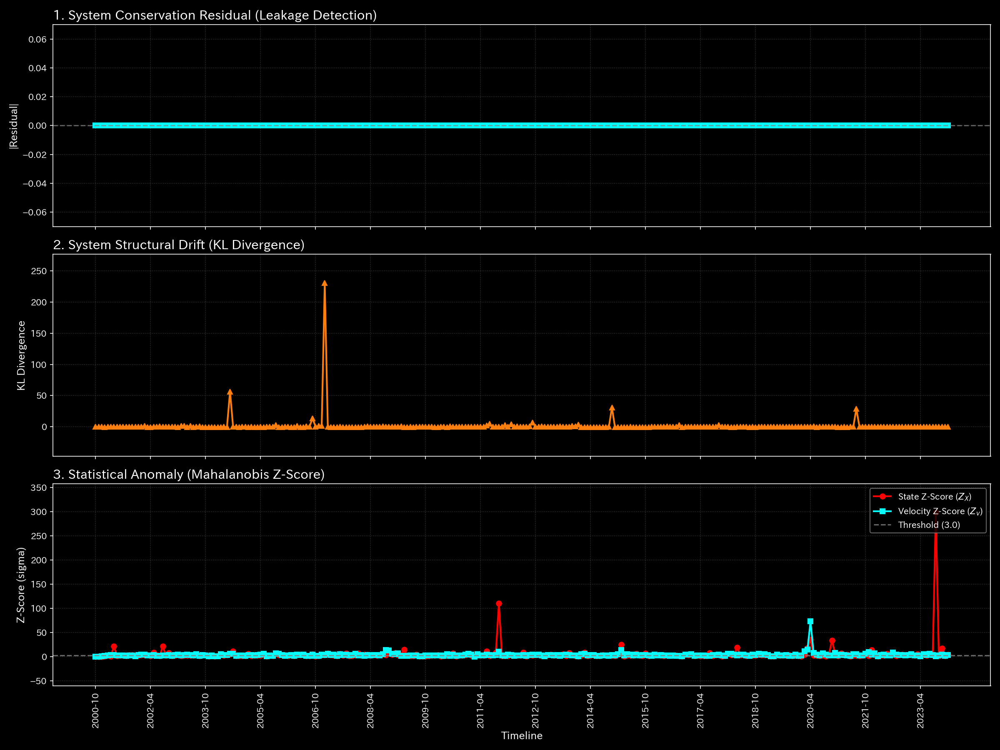

# 🔬 メタ分析統合レポート: Sample 11 (US Macro)

## 1. エグゼクティブ・サマリー

**【診断結果：CRITICAL（ネットワークの切断寸前 / システミックリスク）】**
対象ドメインは「マクロ経済（US Macro）」です。システムにおいて、マクロセクター間の「張力（応力）」がほぼ完全に消失（Edge Stress: 0.09）する深刻な危機が検知されました。これは経済の血液（資金・リソース）の循環が極度に停滞し、システム全体が切断寸前（血栓化）にある状態を示しています。

## 2. 伝統的分析の限界（集計スナップショット）

GDPや雇用統計などのマクロ指標（B/S・P/Lの集計値）は遅行指標であり、表面上はまだ持ちこたえているように見えます。しかし、セクター間の「つながりの強さ（ネットワークの張力）」が水面下で崩壊している事実は、単なる総和（Sum）の集計では決して見抜くことができず、突然のシステミック・クラッシュを引き起こします。

## 3. 物理的病理の特定（根本的な病態生理）

急激な金融引き締め（高金利）や信用収縮により、実体経済と金融セクターの間の資金循環が滞り、ネットワークの配管に圧力がかからなくなっています（流動性の枯渇）。

## 4. 物理・数学エンジンによる証明

### 4.1. マクロ・フォレンジックと構造剛性

* **ネットワーク・エッジ応力の喪失：** `Min Edge Stress: 0.0931`（ほぼゼロに接近）。
* **解説：** 応力がゼロに近づいていることは、マクロセクター間を繋ぐ経済的結合が断たれかけていることを意味します。この状態（リジッド・ロック寸前）では、一つのセクターの小さなショックが、衝撃吸収されずに連鎖倒産（Ripple）としてシステム全体に波及する極めて脆弱な状態にあります。

### 4.2. トポロジー異常とスペクトル半径

* **最大スペクトル半径：** `0.0000`。
* **解説：** 人工的なループ（ウォッシュ・トレード等）は存在せず、純粋に「循環の停止（血栓）」による物理的崩壊であることを裏付けています。

以上がマクロな構造剛性と質量保存則の分析結果です。

**剛性行列の進化（シネマティック・シーケンス）:**

![1枚目 [Start]: 稼働直後の無垢な状態](../../../../samples/Sample_11_US_Macro/readme_plots/support/000_2_1__structural_stiffness.t.00000.png)

![2枚目 [Just Before Change]: 異常が発生する直前](../../../../samples/Sample_11_US_Macro/readme_plots/support/000_2_1__structural_stiffness.t.00002.png)

![3枚目 [The Exact Point of Change]: 異常の発生した決定的な瞬間](../../../../samples/Sample_11_US_Macro/readme_plots/support/000_2_1__structural_stiffness.t.00004.png)

![4枚目 [Immediately After Change]: 波及効果と局所的な硬直](../../../../samples/Sample_11_US_Macro/readme_plots/support/000_2_1__structural_stiffness.t.00006.png)

![5枚目 [End]: シミュレーションの最終状態](../../../../samples/Sample_11_US_Macro/readme_plots/support/000_2_1__structural_stiffness.t.00011.png)

以上が熱力学的エネルギースタックの分析結果です。

## 5. ⚠️ 反証可能性と検証要件（Falsification Analytics）

* **偽陽性の可能性：** パンデミックや一時的な自然災害による物理的なロックダウン措置などによって、一時的に経済活動（循環）が強制停止させられている場合、数学的には応力ゼロ（血栓化）として検知されます。
* **追加検証要件：** この応力の消失が「政策的な意図（利上げによる意図的なクーリング）」によるものか、それとも「制御不能な流動性危機（金融ショック）」の始まりかを見極めるため、中央銀行のバランスシート動向や、インターバンク市場における翌日物金利のスプレッド（物理的データの裏付け）を直ちに監査してください。
