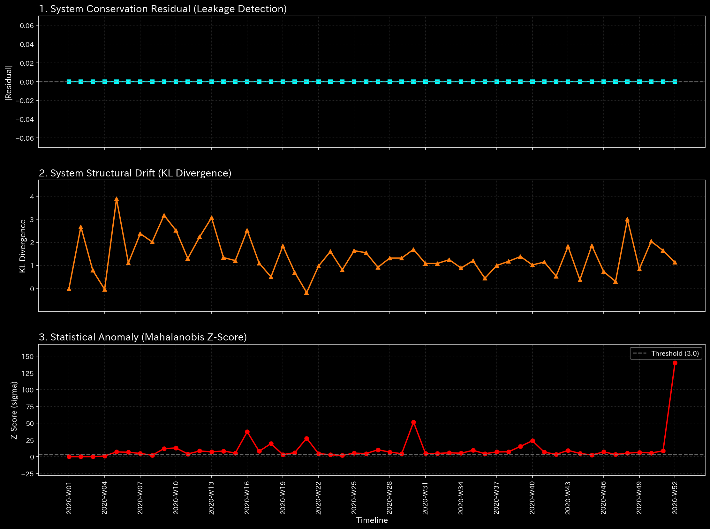
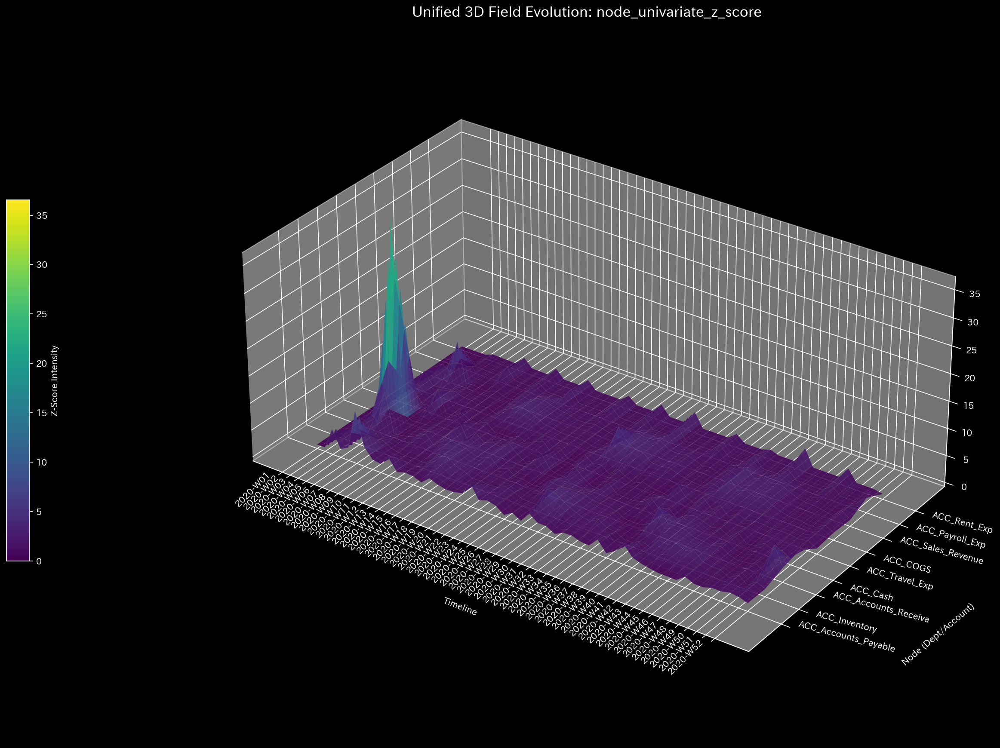

# Sample 1: 循環取引 (Wash Trade)

> [!NOTE]
> **前提条件に関する免責事項 (Proof of Concept)**
> 本レポートで分析されるデータは実世界の企業のものではありません。検証を目的として、特定の病理学的状態を意図的に再現するために設計されたダミーデータです。

## 🩺 AIメタ診断 統合レポート（Laboratory Findings）

### 1. 診断サマリー
**CRITICAL: 循環取引（Wash Trade）を示す構造的な閉ループを検知**
表面上、貸借対照表（B/S）は完璧に均衡しており、組織は健全な純利益（$100,858）を計上しています。しかし、メタ診断はネットワーク内に自己強化的な「閉ループ」が形成されており、システムの活動余力（自由エネルギー）が急速に枯渇していることを証明しました。これは特定の取引先間で架空の売上を回し続ける「循環取引」の決定的な構造的シグネチャです。

### 2. スケール不変な診断メトリクス（事実データ）
以下は、システムのメタ診断エンジンが抽出した「生データ（事実）」です。

| 物理ドメイン | 抽出された指標 | 数値 | 異常判定の閾値 | 判定 |
|--------------|----------------|------|----------------|------|
| **マクロ・フォレンジック** | 相対質量漏れ率 (Mass Leak) | `0.0000` | `> 0.001` | 🟢 正常 |
| **制御理論** | 最大スペクトル半径 | `0.9740` | `>= 0.9` | 🔴 異常検知 (CRITICAL) |
| **熱力学** | 相対的自由エネルギー比率 | `-0.2510` | `< -0.1` | 🔴 異常検知 (CRITICAL) |
| **ミクロ・フォレンジック** | 最大局所 Z-Score | `36.55` | `> 3.0` | 🟡 警告 |

### 3. メトリクスと物理的証拠（4大グラフの検証）

上記の4つのドメイン指標が「なぜその数値になったのか」を、可視化グラフの事実に基づいて解説します。本サンプルでは、ミクロな異常（Z-Score）よりも、システム全体の「構造的崩壊」を示すマクロ指標が極めて重大な警告を発しています。

#### ① マクロ・フォレンジック（質量保存の欺瞞）
* **メトリクス:** 相対質量漏れ率 `0.0000`

* **グラフの事実と解釈:**
  * 上段の質量漏れ率（Conservation Residual）は完璧な `0.0` の平坦な線です。実行犯は複式簿記のルールを厳格に守り、全体のバランスを崩すことなく特定の口座間だけで人為的に取引ボリュームを水増ししているため、資金の「消失（貸借不一致）」は生じていません。従来の差異監査ではこの不正を検出できません。

#### ② 制御理論（スペクトル半径による暴走ループ検知）
* **メトリクス:** 最大スペクトル半径 `0.9740`

* **グラフの事実と解釈:**
  * グラフ上でスペクトル半径（Eigenvalue）の線が、崩壊ラインである `1.0` に極めて近い水準まで突き抜けて高止まりしています。
  * システム内で資金が「特定の経路（ループ）」を回り続け、その波及効果が増幅され続けていることの物理的証拠です。正常系では0.0付近で平坦になるべき指標が発散しかけており、架空の取引をキャッチボールする「循環取引」がネットワークを支配していることを示しています。

#### ③ 熱力学（自由エネルギーによる活動余力の枯渇）
* **メトリクス:** 相対的自由エネルギー比率 `-0.2510`

* **グラフの事実と解釈:**
  * 白色の線（自由エネルギー）が `0.0` のラインを割り込み、閾値（`-0.10`）をも大きく下回ってマイナス圏へ急降下しています。
  * 表面的な売上高（$993,681）が巨大であるにもかかわらず、システムの「実質的な体力（ワークを行う能力）」が削られていることを示します。循環取引を維持するための余計なコスト（税金や手数料）により、帳簿上の利益に反して組織のエネルギーが浪費・枯渇している状態です。

#### ④ ミクロ・フォレンジック（Z-Score が「横領」と異なる理由）
* **メトリクス:** 最大局所 Z-Score `36.55` (発生箇所: `2020-W04`, `ACC_Cash`)

* **グラフの事実と解釈:**
  * 最大スパイクは 36.55 であり、発生箇所は Sample 0（正常系）と全く同じ「第4週の現金勘定」です。
  * これは循環取引の証拠ではなく、正常系における「初期稼働ショック（給与支払い）」のスパイクが、循環取引によるシステム全体のノイズ（分散）増加によって `121.13` から `36.55` へと相対的に希釈されたものに過ぎません。循環取引は資金を騙し取る「単発の引き出し」ではないため、Z-Scoreのような単変量の異常検知には直接引っかかりません。

**【結論とアクション・プラン】**
ミクロなZ-Scoreのスパイクを追うのではなく、直ちにフォレンジック調査の焦点を「売上高と売掛金が関与する取引ループ全体」に切り替えてください。特定のクライアントやダミー会社間で架空の請求書が循環している可能性が極めて高いです。システムは崩壊の臨界点（スペクトル半径 $\approx$ 1.0）に達しており、即座にループを断ち切る必要があります。
