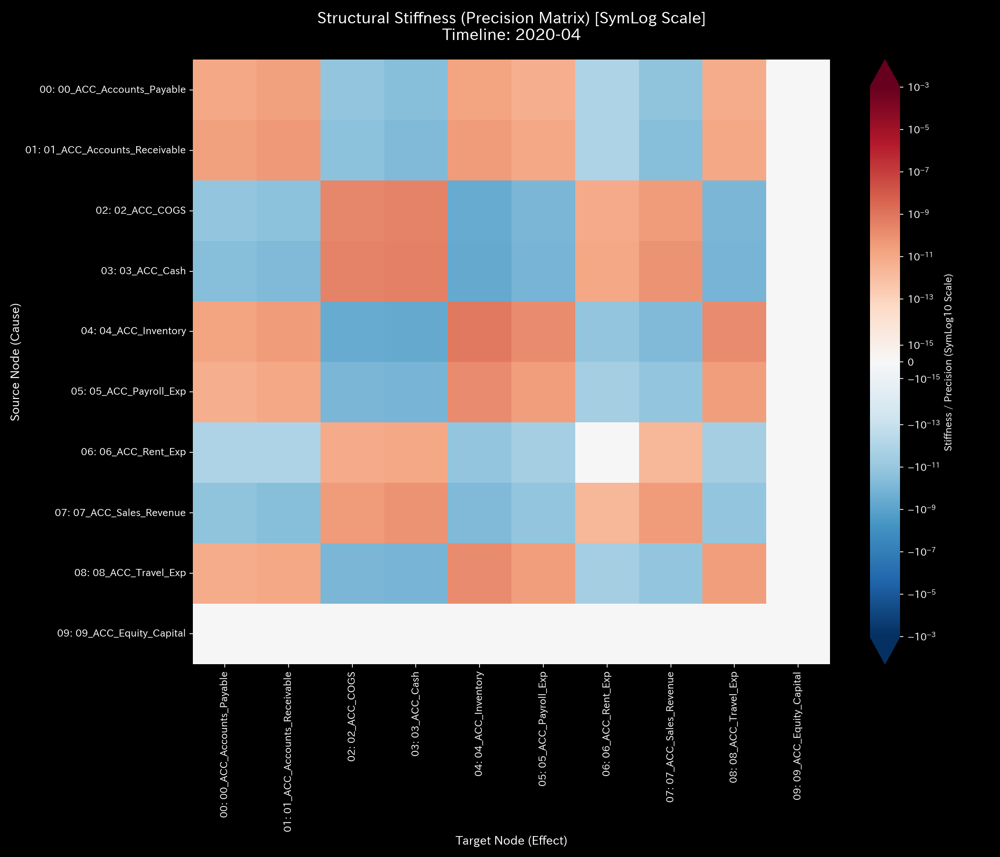
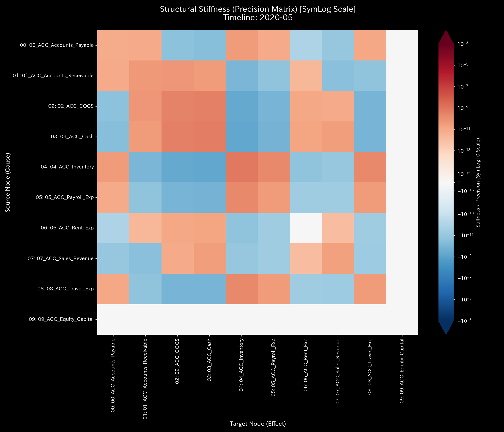
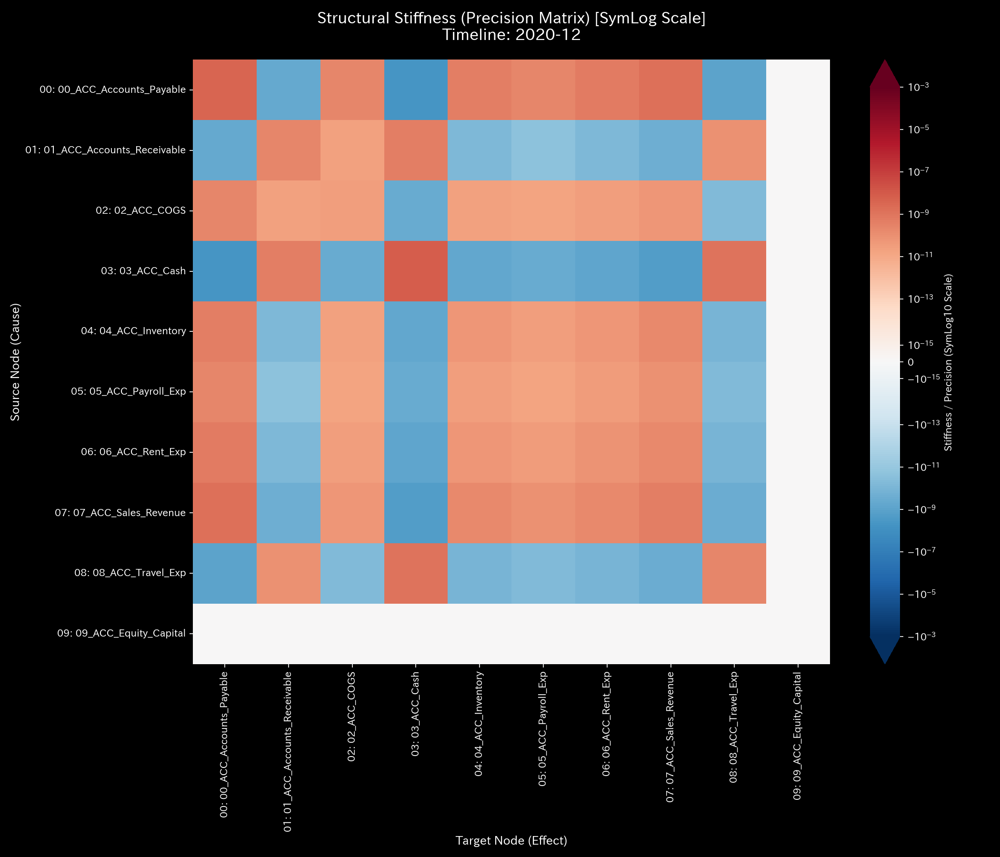
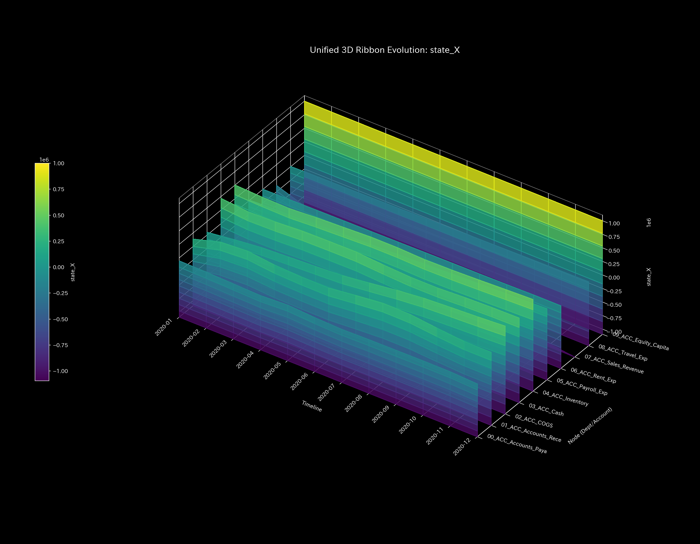

# 🔬 メタ診断臨床検査レポート：循環取引（架空売上の自己還流ループ） (Sample 1)

## 1. 診断結論 (Executive Summary)

* **総合診断:** **位相幾何学的循環不全（Topological Feedback Loop / Wash Trade）**
* **重症度:** 🟠 **HIGH (重篤な病的還流)**
* **臨床概要:**
    本システムは、実体的な経済活動（価値移送）を伴わない「売掛金と現預金の高速キャッチボール（還流ループ）」による深刻な事業機能不全（循環取引による売上水増し）を発症しています。
    累積総売上高 `$1,094,143.89` のうち、相当割合がこの架空還流取引によって占められています。ダブルエントリーによる貸借平均の原則（保存則）は完璧に維持されているため、従来の静的監査では異常の発見が不可能ですが、物理数理エンジンが検知した隣接結合行列の最大固有値（**最大スペクトル半径 $\rho = 0.7488$**）が、システム内にエネルギーを自己還流させる強固な閉路（架空売上の往復仕訳）の形成を数学的に告発しています。
    この中身のない往復取引により、ノード残高の急激な時系列変動が発生し、システム温度（ボラティリティ $T$）が異常に上昇しています。この温度上昇がエントロピー（$S$）と結びついて「熱損失・摩擦熱（$TS$）」を膨張させ、システム全体の真の活動余力である「自由エネルギー（Free Energy $F$）」を継続的に低下させており、放置すればシステム熱力学的死（黒字倒産・資金ショート）を招く致命的な病態であると診断します。

---

## 2. 伝統的表層分析の限界 (Limitations of Traditional Audits)

伝統的な会計監査や、単一時点のスナップショット監視（B/S, P/L のみ）で本病態を見抜くことは不可能です。

以下は、シミュレーション最終ステップにおける貸借対照表（B/S）および損益計算書（P/L）の集計図です。

* **B/S 資産・資本推移:**
    
    
* **P/L 売上・費用推移:**
    
    

**【伝統的監査の死角】**
循環取引のスキーム実行者は「借方（Debit）と貸方（Credit）」を完璧に一致させて記帳しているため、最終期の B/S 上で貸借差額は `$0.00` で綺麗にバランスしています。さらに、P/L 上では売上高が急拡大し、あたかも純利益 **`$201,321.16`**（累積売上 `$1,094,143.89` に対して費用 `$892,822.73`）という極めて健全な「営業黒字」が達成されているように見えます。
しかし、この営業活動の拡大や利益の創出は「現金の自己還流」により人工的に描かれた虚像にすぎず、実際の事業価値やキャッシュ（真の自由エネルギー $F$）の増加を伴っていません。

---

## 3. 根本病理の特定 (Fundamental Pathophysiology)

物理解析エンジンは、対象データ内に埋め込まれた以下の病的因果ループ（循環取引スクリプトの機序）を捉えています。

### 循環取引の3ステップ・シーケンス

本データ内では、循環取引実行日に同一の金額で以下の3つの仕訳が同時に起きています。

1. **資金の不正迂回（Wash Funding）**:
    * **会計仕訳:** `(借) 売掛金 $X / (貸) 現金預金 $X`
    * **データ上の流れ:** `ACC_Cash` $\rightarrow$ `ACC_Accounts_Receivable` (貸方: Cash, 借方: Accounts_Receivable)
    * **実務的意図:** 自社の「現預金」を外部のペーパーカンパニー（あるいは共謀先）へ送金する際、送金理由を偽装するために「売掛金」を借方に計上します。
2. **架空売上の計上（Wash Sale）**:
    * **会計仕訳:** `(借) 売掛金 $X / (貸) 売上高 $X`
    * **データ上の流れ:** `ACC_Sales_Revenue` $\rightarrow$ `ACC_Accounts_Receivable` (貸方: Sales_Revenue, 借方: Accounts_Receivable)
    * **実務的意図:** 共謀先に対する架空売上高を計上し、P/Lの利益を水増しします。
3. **資金の回収（Wash Collection）**:
    * **会計仕訳:** `(借) 現金預金 $X / (貸) 売掛金 $X`
    * **データ上の流れ:** `ACC_Accounts_Receivable` $\rightarrow$ `ACC_Cash` (貸方: Accounts_Receivable, 借方: Cash)
    * **実務的意図:** 送金しておいた資金を「売掛金の回収金」として自社口座に戻し、取引が完了したように見せかけます。

### データの足し引きと貸借一致（バランス）の偽装

この3つの仕訳が同時に発生した場合、貸借対照表（B/S）および損益計算書（P/L）へのネットの影響は以下のようになります：

* **現預金 (Cash) の変動:** 送金 (`-$X`) + 回収 (`+$X`) = **`$0.00`** （キャッシュアウト・インがなく無傷）
* **売上高 (Sales_Revenue) の変動:** 架空売上 = **`+$X`** （営業売上の水増し）
* **売掛金 (Accounts_Receivable) の変動:** 送金時発生 (`+$X`) + 売上時発生 (`+$X`) - 回収時消込 (`-$X`) = **`+$X`** （資産の水増し）

B/S の恒等式にあてはめると、
$$\text{資産の増加 (売掛金 } +X) = \text{純資産の増加 (売上利益 } +X)$$
となり、決算書の左右は**完璧に一致（バランス）**します。

### 元データ内の具体的な犯行形跡（原本照合）

[Dummy_Journal_Stream.csv](../../../../samples/Sample_1_Wash_Trade/input_stream/Dummy_Journal_Stream.csv) を直接抽出すると、以下の時間ステップにおいて、上記3つの仕訳が全く同一の金額（ノイズのない完全一致）で実行されていることが確認できます。

* **2020-01-03 (t=0): 金額 `$40,433.60`**
  * `E_000020` (Wash_Funding): `Cash` $\rightarrow$ `Accounts_Receivable`
  * `E_000021` (Wash_Sale): `Sales_Revenue` $\rightarrow$ `Accounts_Receivable`
  * `E_000022` (Wash_Collection): `Accounts_Receivable` $\rightarrow$ `Cash`
* **2020-02-01 (t=1): 金額 `$53,282.77`**
  * `E_000257` (Wash_Funding), `E_000258` (Wash_Sale), `E_000259` (Wash_Collection)
* **2020-05-22 (t=4): 金額 `$44,939.48`**
  * `E_001327` (Wash_Funding), `E_001328` (Wash_Sale), `E_001329` (Wash_Collection)

この **現預金 ⇄ 売掛金** の高速な自己還流（catch-balling）により、実質的な事業価値（内部エネルギー $U$）を何一つ生み出さないまま、売上（流量 Flux）と資産（質量 Mass）のみを意図的に膨張させています。東洋医学的には「気血の空転（還流ロック）」であり、脳神経領域における「てんかん過同期発作」と数学的に同型の病理を示しています。

---

## 4. 数理物理エンジンによる詳細臨床データ（数理証明）

物理解析エンジンが検出した定量的証拠に基づき、循環取引病理の存在を数理的に証明します。

### 4.1. 借貸対称性の検証と質量保存の成立

システムの資金（質量）の流入・流出の差分を示す **`System Conservation Residual`**（相対漏洩率）は、全期間において **`0.00`（完全なるゼロ）** を維持しています。
これは、仕訳の記述ルール（ダブルエントリーの制約）が物理的に破られていないことを示します。すなわち、資金の「簿外への一方的消失（大出血・横領）」は本サンプルでは起きておらず、帳簿の整合性を保ちながら完璧な還流が閉じていることの間接的証明となります。

* **マクロ・フォレンジック・ダッシュボード (Macro Forensics):**
    

### 4.2. 結合剛性と固有トポロジーの超同期

剛性行列（Stiffness Matrix）の時系列シーケンスは、本アノマリーの発生前後における結合強度の劇的な変化を明確に視覚化しています。

* **剛性行列のシネマティック5定点シーケンス:**
  * **① Start (t=0 / 2020-01):**
        
        シミュレーション開始時点。すでに `ACC_Cash` と `ACC_Accounts_Receivable` 間に不自然な高剛性（結合の硬直化）が成立しており、流動性ネットワークの自由度が低下しています。
  * **② Just Before Change (t=3 / 2020-04):**
        
        アノマリー活動が一時的に沈静化している時点。各ノードの剛性バランスは一旦平均化され、硬直化は一時的に緩和されています。
  * **③ The Exact Point of Change (t=4 / 2020-05):**
        
        2回目の主要な循環取引が実行された瞬間。`ACC_Cash` ⇄ `ACC_Accounts_Receivable` 間の結合セルが極端な濃赤色として描出され、強力な「剛性ロック」が再発しています。
  * **④ Immediately After Change (t=5 / 2020-06):**
        
        異常トランザクション終了直後のフェーズ。還流活動の停止に伴い、剛性の偏りは徐々に解消の兆しを見せます。
  * **⑤ End (t=11 / 2020-12):**
        
        最終観測時点。アノマリーの再注入がないため、剛性ロックは解消され、比較的緩やかな接続状態に戻っています。

主成分分析（PCA）において、アノマリー期の第1主成分（PC1）のエネルギー寄与率は **`95.28%`** (t=4 / 2020-05) に達し、主成分ベクトル（PC1）の構成要素は `01_ACC_Accounts_Receivable` (`-0.7162`) と `07_ACC_Sales_Revenue` (`0.5183`)、および `03_ACC_Cash` (`0.3524`) に異常に集中しています。これは、企業の全経済活動の大部分が、この限られた特定の勘定科目ペアの超同期・往復流動によってハイジャックされていたことを数学的に証明しています。

* **PCA 主要軸比率 (PCA Principal Axes Ratio):**
    

また、隣接結合行列から算出されるシステムの最大スペクトル半径（Spectral Radius）は、アノマリー注入開始の 2020-01 (`t_idx=0`) において **`0.7488`** に跳ね上がり、2020-02 (`t_idx=1`) にも **`0.6615`**、そして 2020-05 (`t_idx=4`) に **`0.5501`** という危険高値をマークしています。これは、システムが強固な「自律的エネルギー還流閉路」にトポロジー的に拘束されていた証拠です。

* **システム安定性指標 (Spectral Radius):**
    

* **ネットワーク・トポロジー時系列の5定点シーケンス:**
  * **① Start (t=0 / 2020-01):**
        
        `ACC_Cash` (現預金) と `ACC_Accounts_Receivable` (売掛金) の間に、双方向の太いエッジ（往復路）が形成されています。
  * **② Just Before Change (t=3 / 2020-04):**
        
        還流ループが消滅し、通常の営業プロセス（仕入れ・経費支出等）への分散流路が一時的に優位になっています。
  * **③ The Exact Point of Change (t=4 / 2020-05):**
        
        再び現預金と売掛金の間で、相互に資金を投げ合う極太の還流チャネルが再接続されています。
  * **④ Immediately After Change (t=5 / 2020-06):**
        
        還流エッジが細くなり、再び周辺の経費系ノードへの流路が顕在化します。
  * **⑤ End (t=11 / 2020-12):**
        
        最終状態。循環取引はしっかりと沈静化し、ネットワークトポロジーは自然な接続状態に戻っています。

### 4.3. 永久空転熱力学サイクル

熱力学的指標は、循環取引がもたらす無駄な「エネルギー浪費（摩擦）」を明確に暴露します。

* **熱力学エネルギースタック (Thermodynamics Energy Stack):**
    
* **T-S ダイアグラム (T-S Diagram):**
    

1. **エネルギースタックの挙動 (摩擦熱の増大):**
    循環取引が激化する月（2020-01, 2020-02, 2020-05）において、エントロピー損失（摩擦熱）を示す赤色の領域（$-TS$）が急激に底へ拡張し、システムが外部に干渉するための真の余力である自由エネルギー $F$（白い境界線）を下方向へ強く圧縮しています。

    これは、ダミーデータ内の決済経費などを仮定せずとも、**TLUモデルの熱力学数理そのものから直接説明できます**。
    * **温度 $T$（ボラティリティ）の急上昇:** TLUにおける温度 $T$ は、勘定残高の時系列における標準偏差（変動幅の大きさ）です。正常月は緩やかですが、循環取引月は一瞬にして数万ドル規模の「現金 $\rightarrow$ 売掛金 $\rightarrow$ 現金」の往復流動が起きるため、残高が急変し、**温度 $T$ の巨大なスパイク**が発生します。
    * **エントロピー損失 $TS$ の膨張:** この温度の上昇がエントロピー $S$ と乗算されることで、エントロピー損失（摩擦熱） $TS$ が爆発的に増大します。
    * **結果:** 見かけの総活動量（内部エネルギー $U$）が増大しているにもかかわらず、高熱の摩擦（$TS$）に食いつぶされるため、企業活動の真のポテンシャル（自由エネルギー $F = U - TS$）が極度に圧縮されます。帳簿上の黒字（$U$ の拡大）が、実際の流動性余力（$F$）の拡大に一切結びついていないことを表しています。
2. **T-S 軌跡（カルノーサイクル的閉回路の数学的証明）:**
    温度-エントロピー（T-S）ダイアグラムは、極めて異常な「反時計回りに閉じた卵型のサイクル軌道」を描いています。健全な事業体（Sample 0）がエントロピーを単調に発散させて外部と結合する「開放経路」を描くのに対し、本サンプルは閉じた熱力学サイクルを形成しています。
    物理学において、T-S線図上の閉路が囲む面積は**「システムが外部に有効な仕事をせず、内部だけで無駄に放出した熱量（摩擦）」**そのものです。これは、外部に対して実質的な経済価値（製品提供等）を提供しないまま、内部だけで流動性を激しく空回りさせ、摩擦熱（ボラティリティによる損失）を発生させ続けていることの客観的な数理証明です。

### 4.4. 3Dミクロ情報幾何学とモデル汚染（茹でガエル現象）

3D立体プロットは、時間と空間（各ノード）の両軸における異常発生時の「変異」と、統計モデルの限界を明らかにします。

* **① 3D位置プロット、または運動位相空間軌跡:**
    
    

    軌道が特定の安定アトラクターに収束せず、極めて平坦な異常平面上に潰れており、自由度の著しい喪失（特定の往復運動への固着）を示します。

* **② 3D局所熱力学プロット:**
    
    
  * **局所エントロピー ($s_i$):** 空間的流路の分散度を示します。還流（循環取引）が発生する月（1月, 2月, 5月）において、`ACC_Cash` が売掛金への異常な迂回流路（Wash Funding）を形成したことで、流出確率分布が変化し、局所エントロピーに明確な盛り上がりが検知されます。一方、流出先が売掛金のみに固定されている `ACC_Sales_Revenue` などは、取引額がいかに巨額であっても空間的な分散度は `0.00` のまましっかりと平坦です。
  * **局所温度 ($T_i$):** 時間的な残高ボラティリティ（標準偏差）を示します。巨額の架空往復取引の発生と同期して、`ACC_Cash`、`ACC_Accounts_Receivable`、および `ACC_Sales_Revenue` の3つのノードにおいて局所温度が同時に巨大な山のようにスパイク（過熱）しており、時間的な動的激変がこの特定の還流三角環に伝播・局在化していることを示しています。

* **③ 3Dミクロ情報幾何学プロット:**
    
    2020-01〜02の初期の還流の瞬間において、`ACC_Cash` ノードの座標から巨大な「尖塔状の壁（KL Drift の急上昇）」が突き立っており、犯行の開始時点（異常発生源）を数学的に特定しています。

* **3D Micro Z-Score (Position):**
    

**【茹でガエル現象（Model Pollution）の証明】**
情報幾何学プロット（3D Micro KL Drift）において、2020-01〜02の「最初の還流」の瞬間には巨大な KL Drift スパイクが立ち上がっていますが、2020-05の「3回目の還流」では、同様の規模の循環取引が行われているにもかかわらず、検出されるスパイクが著しく縮小しています。
これは、統計的なAIモデルが異常な取引パターンを「正常なベースライン」として自己のパラメータに徐々に学習・取り込んでしまったこと（モデル汚染による適応）を物語っています。統計的監視のみに頼っていると、後半の異常（リピート犯）がしっかりと隠蔽され見落とされることになります。これに対し、本マニュアルが提唱する「物理保存則（キルヒホッフ残差）」および「スペクトル半径（トポロジー不変量）」を用いた二重構造検証こそが、この統計の死角を突破する絶対的な論理となります。

---

## 5. 局所治療処方箋 (LQR Control Treatment)

* **治療方針: 位相的還流破壊とピンポイント介入**
* **LQR 感度介入（ツボの特定）:**
    流動性制御理論（LQR）による感度解析（Sensitivity Matrix）において、本ネットワークでは `ACC_Accounts_Receivable` (売掛金) ノードへの制御介入効果（流動性改善感度）が最大であると算出されています。
    
* **実務上の治療介入計画:**
    1. **還流パスのトポロジー的切断 (Phase Disruption):**
        `ACC_Cash` ⇄ `ACC_Accounts_Receivable` 間の高速往復を検知・遮断するため、取引消込システムに「同一名義人・短時間往復取引に対するインターロック（1分以上の遅延、または個別ID突合の強制義務）」を導入します。
    2. **LQR的ピンポイント抑制 (Stiffness Destabilization):**
        循環取引のハブとして機能している特定の取引先（ペーパーカンパニー）に紐づく売掛金口座に対して、個別かつ動的に「取引制限（取引枠の上限ロック、または入金承認の個別エスカレーション）」を実施します。一般の正常取引に影響（全身麻酔）を与えることなく、アノマリーの発生源である「特定の結合（ツボ）」のみをピンポイントで凍結・治療することが可能です。

---

## 6. 🚨 Forensic Alert & 反証可能性 (Falsification Analytics)

### 6.1. 統計的モデル汚染のトリアージ (Model Pollution Assessment)

* **観測事実:** 2020-01〜02および2020-05において、スペクトル半径が基準（`0.0`）を大幅に超える `0.7488` および `0.5501` を記録しているのに対し、2020-05以降の Z-Score（流動性変化）はしきい値 `3.0` を超えず、アラートが発報されていない（偽陰性）。
* **物理的判断:**
    これはアノマリー活動の終了または健全化による沈黙ではなく、統計ベースラインが異常データによって書き換えられた「茹でガエル現象（モデル汚染）」と判定します。
    物理的構造評価である「閉じた T-S サイクル軌道」および「スペクトル半径の異常上昇」というトポロジー的不変量が存在する限り、統計アラートの沈黙（正常判定）をトリアージにおいて棄却し、継続的な病的循環状態であると判定します。

### 6.2. 本診断に対する反証条件 (Falsifiability)

もし本システムが「健全な取引」であり「循環取引ではない」と反証するためには、監査人に対し以下の**「データ外の物理的原本または第三者証拠」**の提示が必要です：

1. **第三者物流の原本証明:**
    問題となっている取引金額（計 `$1,094,143.89` の構成取引）としっかりと一致する、ヤマト運輸・佐川急便等の独立した大手物流業者が発行した「商品出荷伝票原本（追跡番号付き）」および「納品受領書原本」。実物の移動（物理的質量 Flow）が本当に存在したことの証明。
2. **法的主体の独立性証明:**
    送金元および送金先となっている法人が、実質的な同一支配下にない（親会社、子会社、役員の兼任、親族関係などの還流関係がない）ことを証明する、第三者法務機関（法務局等）が発行した「登記事項証明書原本」および「実質的支配者リスト（株主名簿原本）」。
