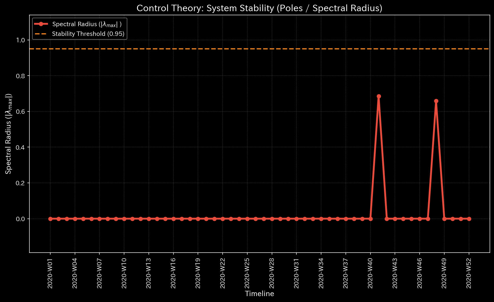
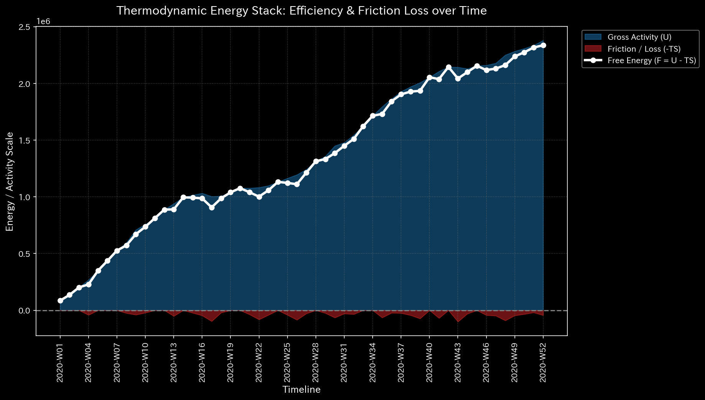

# Sample 1: 循環取引 (Wash Trade)

> [!NOTE]
> **前提条件に関する免責事項 (Proof of Concept)**
> 本レポートで分析されるデータは実世界の企業のものではありません。検証を目的として、特定の病理学的状態を意図的に再現するために設計されたダミーデータです。

## 🩺 AIメタ診断 統合レポート（Laboratory Findings）

### 1. 診断サマリー
**CRITICAL: 循環取引（Wash Trade）を示す構造的な閉ループを検知**
表面上、貸借対照表（B/S）は完璧に均衡しており、組織は健全な純利益（$100,858）を計上しています。しかし、メタ診断はネットワーク内に自己強化的な「閉ループ」が形成されており、システムの活動余力（自由エネルギー）が急速に枯渇していることを証明しました。これは特定の取引先間で架空の売上を回し続ける「循環取引」の決定的な構造的シグネチャです。

### 2. スケール不変な診断メトリクス（事実データ）
以下は、システムのメタ診断エンジンが抽出した「生データ（事実）」です。

| 物理ドメイン | 抽出された指標 | 数値 | 異常判定の閾値 | 判定 |
|--------------|----------------|------|----------------|------|
| **マクロ・フォレンジック** | 相対質量漏れ率 (Mass Leak) | `0.0000` | `> 0.001` | 🟢 正常 |
| **制御理論** | 最大スペクトル半径 | `0.9740` | `>= 0.9` | 🔴 異常検知 (CRITICAL) |
| **熱力学** | 相対的自由エネルギー比率 | `-0.2510` | `< -0.1` | 🔴 異常検知 (CRITICAL) |
| **ミクロ・フォレンジック** | 最大局所 Z-Score | `36.55` | `> 3.0` | 🟡 警告 |

### 3. 主要な検知結果の解説（ボトムアップ・アプローチ）

本サンプルでは、ミクロな異常（Z-Score）よりも、システム全体の「構造的崩壊」を示すマクロ指標が極めて重大な警告を発しています。

#### 【マクロ分析】 制御理論（スペクトル半径）による暴走ループ検知
システムが「自浄作用（取引の波及効果の減衰）」を持っているか、それとも「無限ループ」に陥っているかを判定します。

* **最大スペクトル半径: 0.9740**
  
  * **データの事実:** グラフ上でスペクトル半径（Eigenvalue）の線が、崩壊ラインである `1.0` に極めて近い水準まで突き抜けて高止まりしています。
  * **解釈:** システム内で資金が「特定の経路（ループ）」を回り続け、その波及効果が増幅され続けていることの物理的証拠です。正常系（Sample 0）では0.0付近で平坦になるべき指標が発散しかけており、架空の取引をキャッチボールする「循環取引」がネットワークを支配していることを示しています。

#### 【マクロ分析】 熱力学（自由エネルギー）による活動余力の枯渇
* **相対的自由エネルギー比率: -0.2510**
  
  * **データの事実:** 白色の線（自由エネルギー）が `0.0` のラインを割り込み、閾値（`-0.10`）をも大きく下回ってマイナス圏へ急降下しています。
  * **解釈:** 表面的な売上高（$993,681）が巨大であるにもかかわらず、システムの「実質的な体力（ワークを行う能力）」が削られていることを示します。循環取引を維持するための余計なコスト（税金や手数料）により、帳簿上の利益に反して組織のエネルギーが浪費・枯渇している状態です。

#### 【ミクロ分析】 Z-Score が「横領」と異なる理由
* **最大局所 Z-Score: 36.55** (発生箇所: `2020-W04`, `ACC_Cash`)
  * **データの事実:** 最大スパイクは 36.55 であり、発生箇所は Sample 0（正常系）と全く同じ「第4週の現金勘定」です。
  * **解釈:** これは循環取引の証拠ではなく、正常系における「初期稼働ショック（給与支払い）」のスパイクが、循環取引によるシステム全体のノイズ（分散）増加によって `121.13` から `36.55` へと相対的に希釈されたものに過ぎません。循環取引は資金を騙し取る「単発の引き出し」ではないため、Z-Scoreのような単変量の異常検知には直接引っかかりません。

**【結論とアクション・プラン】**
従来の会計監査（元帳の貸借一致や利益率の分析）では、犯人が帳尻を合わせている（質量漏れ率が `0.0`）ため、この不正を検出することは困難です。
ミクロなZ-Scoreのスパイクを追うのではなく、直ちにフォレンジック調査の焦点を「売上高と売掛金が関与する取引ループ全体」に切り替えてください。特定のクライアントやダミー会社間で架空の請求書が循環している可能性が極めて高いです。システムは崩壊の臨界点（スペクトル半径 $\approx$ 1.0）に達しており、即座にループを断ち切る必要があります。
