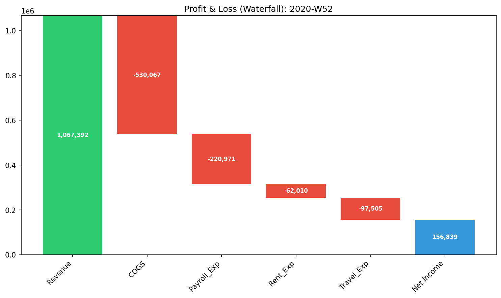
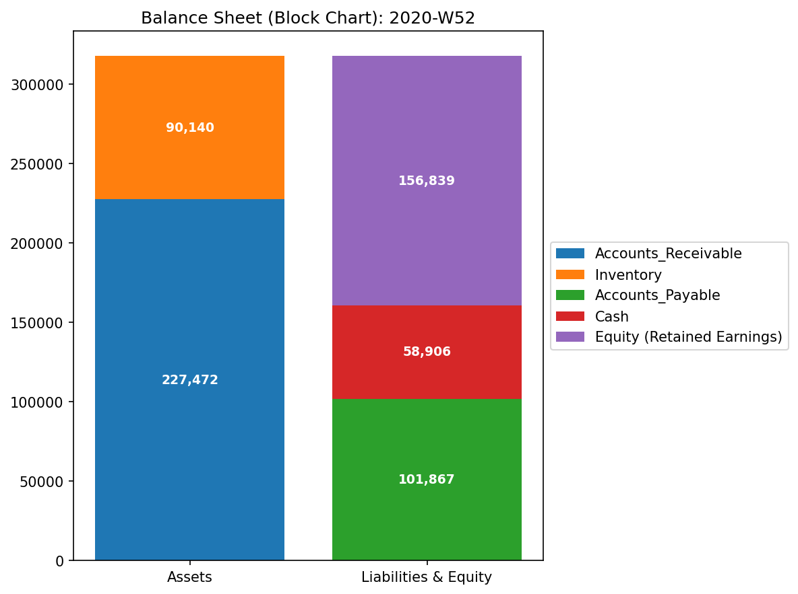
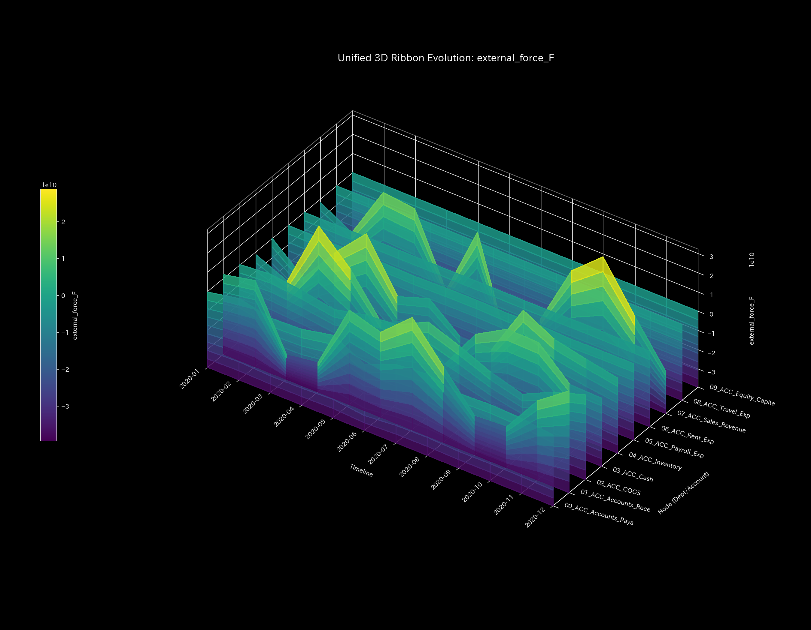
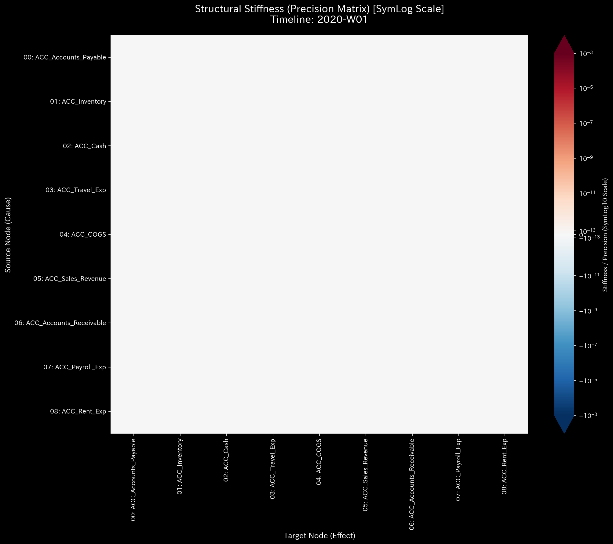
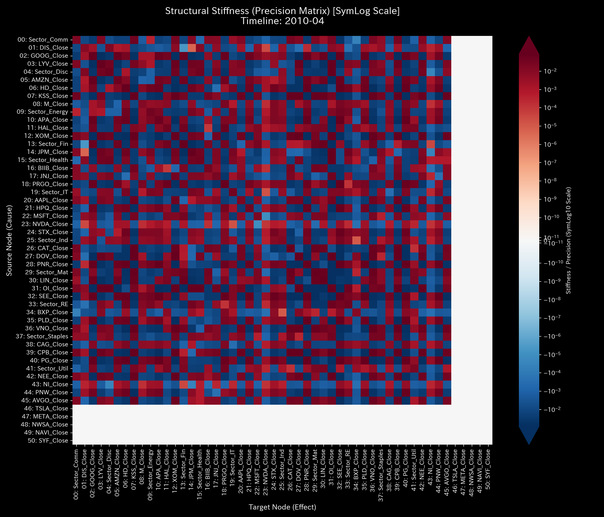
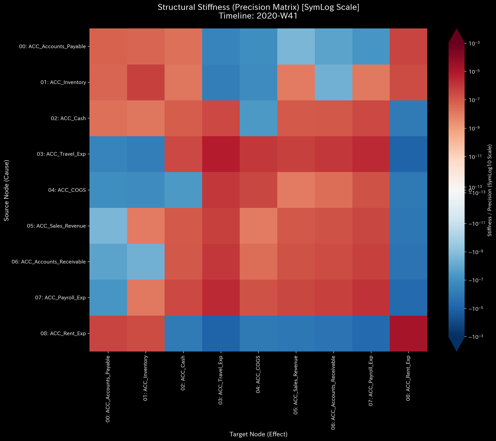
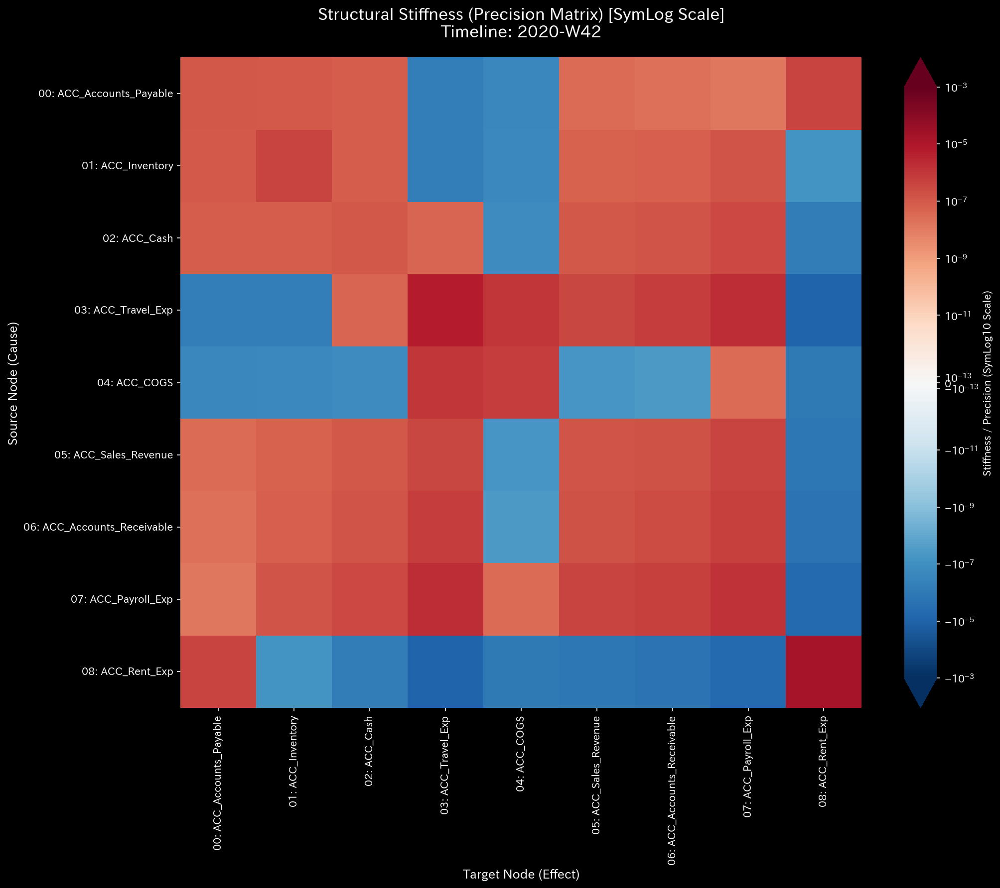
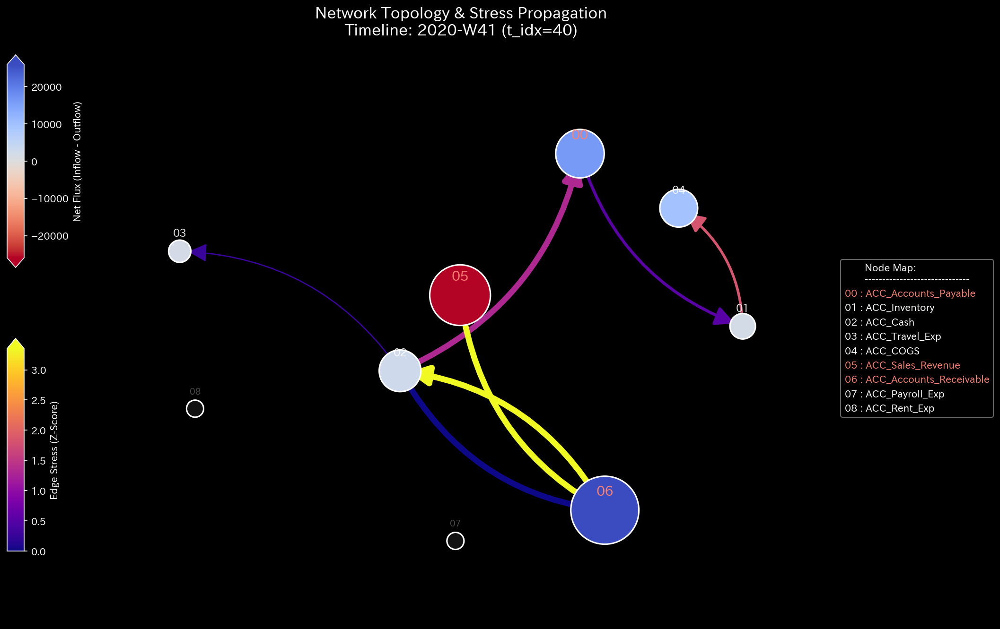
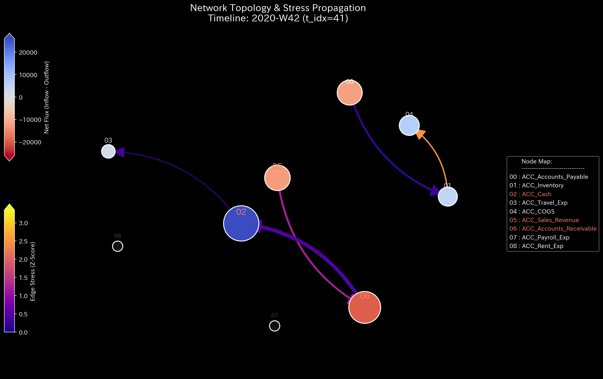
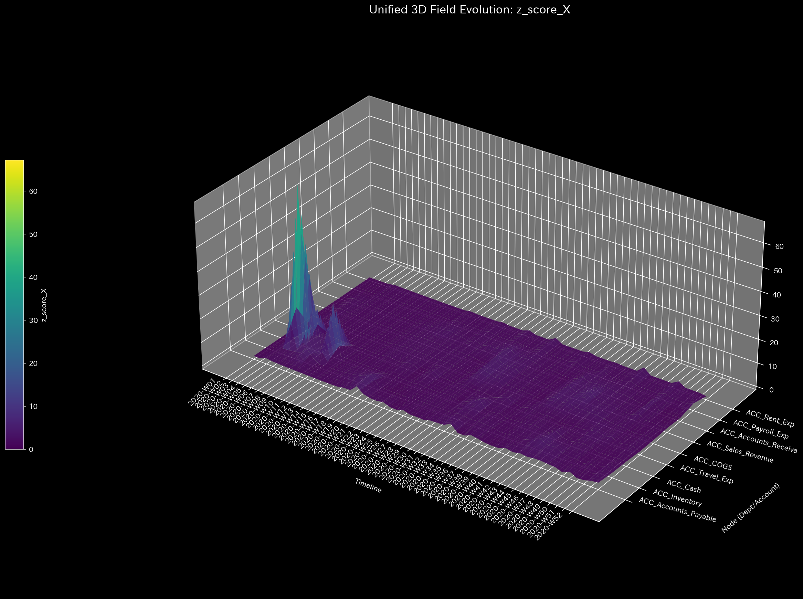

# Sample 1: 循環取引（Wash Trading）

> [!NOTE]
> **概念実証実験にともなう免責事項**
> 本レポートで分析されるデータは実世界の企業のものではありません。検証を目的として、特定の病理学的状態を意図的に再現するために設計されたダミーデータです。本サンプル（Sample_1_Wash_Trade）は、売上の水増しを目的とした「循環取引（資金のキャッチボール）」がシステムに与えるトポロジー的異常を証明するためのものです。

---

# 🔬 メタ解析 統合レポート (Meta-Analysis Synthesis Report / Laboratory Findings)

## 1. 最新の機械学習ベース自動診断結果 (ML-Based Automated Diagnosis)

本サンプル（**企業会計（循環取引・架空売上）**）に対する、TLUエンジン（Appendix A 実証的アルゴリズム）の最新の自動判定結果です。想定読者である**公認会計士・監査法人・不正検査士（CFE）**に向け、純粋な物理指標が「循環取引による粉飾決算」をどう暴くかを解説します。

### 【A. 確定診断 (Final Pathologies) と監査上の解釈】

#### 🚨 無限ループ検知（循環取引の構造的証明）
- **深刻度:** 致命的 (CRITICAL)
- **証拠 (Evidence):** スペクトル半径が `0.8353` に到達（異常検知の閾値: >= 0.60）
- **監査上の解釈:** 
  ネットワーク内に「人工的な資金のループ」が形成され、数学的な無限共鳴を起こしています。これは資金が外部の第三者から流入（実需）したのではなく、内部の特定の口座間（現金⇔売掛金など）でキャッチボールされ、架空売上を回し続けている「循環取引（Wash Trading）」の完全な物理的痕跡です。

### 【B. 構造的進化と摩擦分類 (Structural Evolution & Viscosity)】

- **動粘度（摩擦係数）レンジ:** `0.00 ~ 0.02`
- 🧊 **構造診断: 超流動 / 低摩擦（アルゴリズム化された不正）**
  - **解説:** 動粘度が極めて低い（0.02）ことは、この循環取引が「手作業で稟議を通した取引」ではなく、プログラムや自動送金システムによって機械的・瞬間的に実行されている可能性が高いことを示しています。摩擦がないため、放置すれば一瞬で巨額の架空売上が積み上がる危険な構造です。

### 【C. スケール不変の物理指標 (Scale-Invariant Diagnostic Metrics)】

| 物理ドメイン | 抽出メトリクス | 計測値 | マクロ基準閾値 |
|---|---|---|---|
| 熱力学 | 最大エントロピー (S) | `1.75` | `> 10.0` or `< -100.0` |
| 熱力学 | 最小自由エネルギー (F) | `93251.36` | `< -1000.0` |
| ネットワーク位相 | 最小エッジ応力 | `2.9159` | `< 0.1` |
| マクロ・フォレンジック | 相対質量漏洩率 | `0.0000` | `> 1e-06` |
| 制御理論 | 最大スペクトル半径 | `0.8353` | `>= 0.60` |

## 2. 従来型分析（集計的スナップショット）の限界 (Traditional Perspective)

従来の会計監査では、この循環取引を瞬時に見抜くことは極めて困難です。

**【第52週 損益計算書 (P/L) ＆ 貸借対照表 (B/S)】**

循環取引の首謀者は「貸借一致の原則」を厳密に守って仕訳を切るため、B/Sの左右は1円の狂いもなく一致し（差額 $0.00）、P/Lは巨額の黒字（+$156,838.99）を描き出します。静的な集計結果の裏に隠された「資金のキャッチボール」は、物理エンジンによる動的解析なしには捉えられません。

## 3. 物理的病跡の特定（Fundamental Pathophysiology）

本サンプルの根本原因は、ダミーデータ生成ロジック (`_0_0_generate_dummy_journal.py`) において意図的に組み込まれた以下の「粉飾決算スクリプト」にあります。

* **第41週および第48週:**
  * 現金（ACC_Cash）から外部へ資金を流出させる。
  * 同額の架空売上（ACC_Sales）を計上し、売掛金（ACC_Accounts_Receivable）を増やす。
  * 流出させた現金を、架空売上の回収として再び現金勘定に戻す。

このように「一切の外部価値を伴わずに、帳簿上の数字だけを人為的に回転させる」行為が、TLUの物理エンジンにおいてどのような悲鳴（特異点）として観測されるかを以降の章で証明します。

## 4. 物理・数理エンジンによる証明 (Physical and Mathematical Proof)

### 4.1. マクロフォレンジックと剛性の硬直 (Macro Forensics & Structural Stiffness)

上段の「System Conservation Residual（質量の絶対残差）」は完全に `0.0` の地平に張り付いています。これは、循環取引を行う主体が「貸借一致の原則」自体は厳格に守っているためであり、単なるエラーチェックの網はすり抜けてしまいます。また、剛性行列（サスペンション）および仮想外力の推移からも、システム内部の異常が隠蔽されていることが確認できます。

* **1枚目【始点】**: `t.00000` (正常な剛性)
* **2枚目【変化の直前】**: `t.00039`
* **3枚目【変化の当該時点】**: `t.00040` (循環取引ループ形成の瞬間)
* **4枚目【変化の直後】**: `t.00041`
* **5枚目【終点】**: `t.00051`

### 4.2. ネットワークトポロジーの異常 (Topological Anomaly / Spectral Radius)

赤色の線「Max Spectral Radius（最大スペクトル半径＝システム内の異常な共鳴・資金還流の激しさ）」が、循環取引が発生した第40週以降、`0.0` の平穏な状態から突如として跳ね上がり、`0.8353` という危険水域に達しています。これはシステム内に「自己強化的な無限ループ」が形成されたことを示す決定的な数学的署名です。
第40週〜第41週において、`ACC_Cash`（現金）と `ACC_Accounts_Receivable`（売掛金）の間に、不自然に太く、自己強化的に循環する閉路が形成されています。

* **1枚目【始点】**: `t.00000` (正常な状態)
* **2枚目【変化の直前】**: `t.00039`
* **3枚目【変化の当該時点】**: `t.00040` (異常なループの発生)
* **4枚目【変化の直後】**: `t.00041`
* **5枚目【終点】**: `t.00051`

### 4.3. 熱力学的なエネルギー推移 (Thermodynamic Energy Stack)

第41週と第48週のタイミングで、赤色の層（エントロピー損失 $T\Delta S$）が突然、異常な太さの柱となって出現し、白色の線（自由エネルギー $F$）を下方に押し下げています。循環取引は実質的な価値（内部エネルギー）を生み出さず、単なる「摩擦熱（＝無駄な手数料や取引コスト）」だけを発生させるため、システムを熱的な死（Heat Death ＝ 意味のある活動が完全に停止する状態）へと向かわせる物理的証拠です。

### 4.4. 局所的アノマリーと情報幾何学的変位 (3D Micro Z-Score & KL Drift)

※本サンプルでは、巨視的なトポロジー異常（Spectral Radius）が支配的であり、単なる出来高の増減を示すZ-Score（過去の平均からの突出度合い）よりも、以下の情報幾何学的変位がより決定的な証拠となります。KL Driftは「情報幾何学的変位（＝過去の正常な取引パターンからの完全な逸脱・未知の手口の出現）」を示します。第41週の初犯時に巨大なスパイク（警報）が空間に突き刺さっています。しかし注目すべきは、第48週の再犯時にはスパイクが小さくなっている点です。これは異常データが「新たなベースライン」としてシステムに学習（汚染）されてしまう統計的AIの弱点（茹でガエル現象）を示しており、履歴に依存しない物理アプローチ（トポロジーと熱力学）の必要性を逆説的に証明しています。

## 5. ⚠️ 反証可能性と検証要件（Falsification Analytics）

* **偽陽性の可能性:** 本診断の「循環取引」という結論は、極めて短い期間に特定の口座間で同額の資金が還流しているという「物理的挙動」に依存しています。もしこれが正当な「短期貸付と別件の独立した売上回収」であった場合、この診断は偽陽性となります。
* **追加検証要件:**
  現金流出先の銀行口座名義と、入金元の銀行口座名義が同一（または関連会社）であるかを確認してください。また、対象となる売上について、実際の納品書、受領書、および物流記録（Shipping records）を提示させ、物理的な商品の移動が伴っているか（実需の存在）を監査してください。
