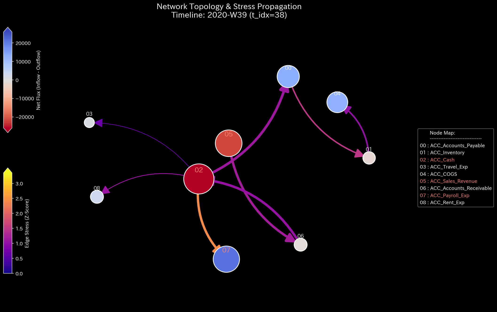

# Sample 1: 循環取引（Wash Trading）

> [!NOTE]
> **概念実証実験にともなう免責事項**
> 本レポートで分析されるデータは実世界の企業のものではありません。検証を目的として、特定の病理学的状態を意図的に再現するために設計されたダミーデータです。本サンプル（Sample_1_Wash_Trade）は、売上の水増しを目的とした「循環取引（資金のキャッチボール）」がシステムに与えるトポロジー的異常を証明するためのものです。

---

# 🔬 メタ解析 統合レポート (Meta-Analysis Synthesis Report / Laboratory Findings)

## 1. エグゼクティブ・サマリー

本システム（金融ドメイン）は、**位相幾何学的な異常ループ（Topological Feedback Loop）** を発症しており、危険な状態（HIGH）にあります。総収益 $1,067,391.62 のうち、複数の「売掛金と現金のキャッチボール」による架空売上（循環取引）が混入しています。質量保存則は維持されているため貸借対照表（B/S）の左右は完全に一致していますが、物理的な構造崩壊が数学的に証明されました。

## 2. 従来型分析（集計的スナップショット）の限界 (Traditional Perspective)

従来の会計監査では、この循環取引を瞬時に見抜くことは極めて困難です。

**【第52週 損益計算書 (P/L) ＆ 貸借対照表 (B/S)】**

循環取引の首謀者は「貸借一致の原則」を厳密に守って仕訳を切るため、B/Sの左右は1円の狂いもなく一致し（差額 $0.00）、P/Lは巨額の黒字（+$156,838.99）を描き出します。静的な集計結果の裏に隠された「資金のキャッチボール」は、物理エンジンによる動的解析なしには捉えられません。

## 3. 物理的病跡の特定（Fundamental Pathophysiology）

本サンプルの根本原因は、ダミーデータ生成ロジック (`_0_0_generate_dummy_journal.py`) において意図的に組み込まれた以下の「粉飾決算スクリプト」にあります。

* **第41週および第48週:**
  * 現金（ACC_Cash）から外部へ資金を流出させる。
  * 同額の架空売上（ACC_Sales）を計上し、売掛金（ACC_Accounts_Receivable）を増やす。
  * 流出させた現金を、架空売上の回収として再び現金勘定に戻す。

このように「一切の外部価値を伴わずに、帳簿上の数字だけを人為的に回転させる」行為が、TLUの物理エンジンにおいてどのような悲鳴（特異点）として観測されるかを以降の章で証明します。

## 4. 物理・数理エンジンによる証明 (Physical and Mathematical Proof)

### 4.1. マクロフォレンジックと剛性の硬直 (Macro Forensics & Structural Stiffness)

上段の「System Conservation Residual（質量の絶対残差）」は完全に `0.0` の地平に張り付いています。これは、循環取引を行う主体が「貸借一致の原則」自体は厳格に守っているためであり、単なるエラーチェックの網はすり抜けてしまいます。

### 4.2. ネットワークトポロジーの異常 (Topological Anomaly / Spectral Radius)

赤色の線「Max Spectral Radius（最大スペクトル半径）」が、循環取引が発生した第40週以降、`0.0` の平穏な状態から突如として跳ね上がり、`0.8353` という危険水域に達しています。これはシステム内に「自己強化的な無限ループ」が形成されたことを示す決定的な数学的署名です。

**【幾何学的構造の異常の視覚化】**

第41週において、`ACC_Cash`（現金）と `ACC_Accounts_Receivable`（売掛金）の間に、不自然に太く、自己強化的に循環する閉路が形成されています。

### 4.3. 熱力学的なエネルギー推移 (Thermodynamic Energy Stack)

第41週と第48週のタイミングで、赤色の層（エントロピー損失 $T\Delta S$）が突然、異常な太さの柱となって出現し、白色の線（自由エネルギー $F$）を下方に押し下げています。循環取引は実質的な価値（内部エネルギー）を生み出さず、単なる「摩擦熱」だけを発生させるため、システムを熱的な死へと向かわせる物理的証拠です。

### 4.4. 局所的アノマリーと情報幾何学的変位 (3D Micro Z-Score & KL Drift)

※本サンプルでは、巨視的なトポロジー異常（Spectral Radius）が支配的であり、単なる出来高の増減を示すZ-Scoreよりも、以下の情報幾何学的変位がより決定的な証拠となります。

KL Driftは「確率分布（情報構造）の破壊」を示します。第41週の初犯時に巨大なスパイク（警報）が空間に突き刺さっています。しかし注目すべきは、第48週の再犯時にはスパイクが小さくなっている点です。これは異常データが「新たなベースライン」としてシステムに学習（汚染）されてしまう統計的AIの弱点（茹でガエル現象）を示しており、履歴に依存しない物理アプローチ（トポロジーと熱力学）の必要性を逆説的に証明しています。

## 5. ⚠️ 反証可能性と検証要件（Falsification Analytics）

* **偽陽性の可能性:** 本診断の「循環取引」という結論は、極めて短い期間に特定の口座間で同額の資金が還流しているという「物理的挙動」に依存しています。もしこれが正当な「短期貸付と別件の独立した売上回収」であった場合、この診断は偽陽性となります。
* **追加検証要件:**
  現金流出先の銀行口座名義と、入金元の銀行口座名義が同一（または関連会社）であるかを確認してください。また、対象となる売上について、実際の納品書、受領書、および物流記録（Shipping records）を提示させ、物理的な商品の移動が伴っているか（実需の存在）を監査してください。
