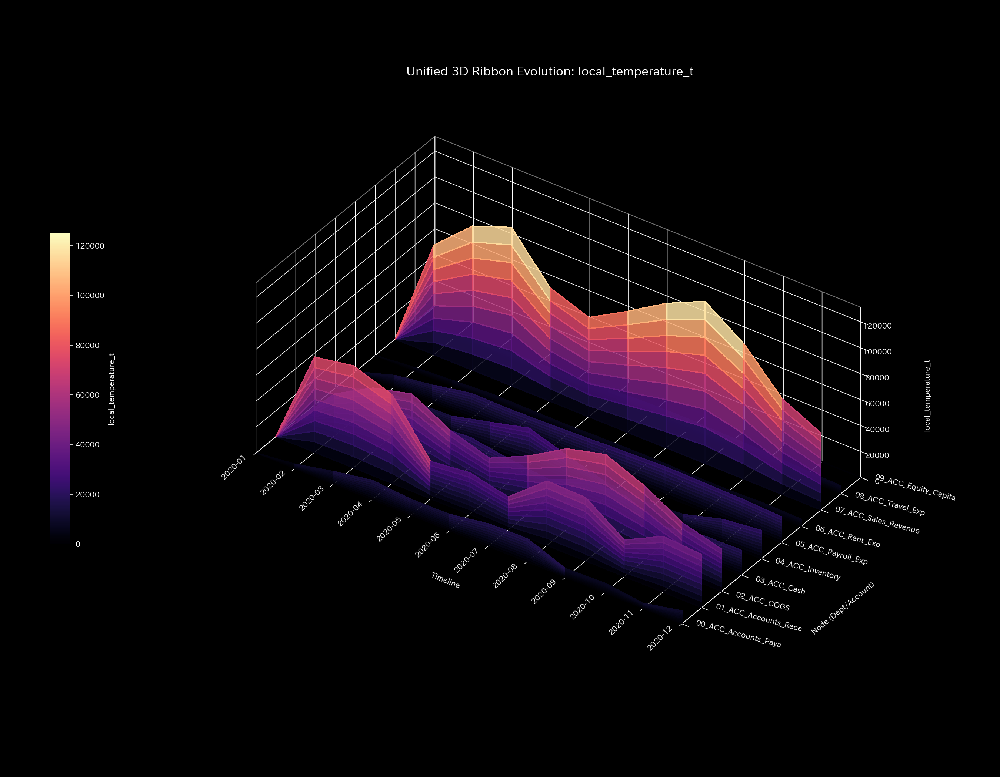

# 🔬 メタ検査臨床検査レポート：循環取引（架空売上の自己還流ループ） (Sample 1)

## 1. 検査結論 (Executive Summary)

* **総合検査:** **位相幾何学的循環不全（Wash Trade / 自己還流ループ）**
* **重症度:** 🟠 **HIGH (重篤な資金還流障害)**
* **アノマリー発生時期と金額（仕訳原本検証済み）:**
  * **2020-01-03 (t=0)**: 金額 **`$40,433.60`** (仕訳 ID: `E_000020`〜`E_000022`)
  * **2020-02-01 (t=1)**: 金額 **`$53,282.77`** (仕訳 ID: `E_000257`〜`E_000259`)
  * **2020-05-22 (t=4)**: 金額 **`$44,939.48`** (仕訳 ID: `E_001327`〜`E_001329`)
* **臨床概要:**
  本システムは、実体的な経済価値の移送を伴わない「現預金と売掛金の高速キャッチボール（還流ループ）」による深刻な循環取引（売上水増し）を発症しています。
  ダブルエントリーによる貸借平均の原則（保存則）は完璧に維持されているため、従来の監査手法（静的試算表の検証等）では検出不可能です。
  しかし、物理解析エンジンは、隣接結合行列の最大固有値（**最大スペクトル半径 $\rho = 0.7488$**）の跳ね上がりと、内部エネルギーを自己還流させる強固な閉路の形成を数学的に特定しました。
  この架空往復取引は、キャッシュ残高の急激な変動（ボラティリティ上昇）をもたらし、システム温度 $T$ およびエントロピー損失 $TS$ を爆発的に増大させています。その結果、システム全体の真の活動余力である「自由エネルギー $F = U - TS$」が極度に圧縮されており、資金繰りの実質的な破綻（黒字倒産）を招く致命的な病態です。

---

## 2. 伝統的表層分析の限界：累積 vs 期間別（単月）の可視化

伝統的な会計監査や累積スナップショット（B/S, P/L）の監視では、この偽装工作を見抜くことはできません。実行者は貸借を一致させて記帳しており、B/S は `$0.00` で綺麗にバランスし、P/L 上では売上高が急拡大して健全な営業黒字（累積売上 `$1,094,143.89` に対して純利益 `$201,321.16`）が達成されているように見えるためです。

しかし、**累積（Cumulative）**と**期間別（Periodic / 単月）**の財務諸表プロットを並べて比較すると、異常値のスパイクが特定月（1月, 2月, 5月）に集中して突き立っていることが一目でわかります。

### B/S 資産・資本推移の比較（累積 vs 期間別）
* **累積 B/S Trend:**
  
* **期間別（単月） B/S Trend (Periodic):**
  

### B/S ブロック合計の比較（累積 vs 期間別）
* **累積 B/S Block Total:**
  
* **期間別（単月） B/S Block Total (Periodic):**
  

### P/L 売上・費用推移の比較（累積 vs 期間別）
* **累積 P/L Trend:**
  
* **期間別（単月） P/L Trend (Periodic):**
  

### P/L ウォーターフォール図の比較（累積 vs 期間別）
* **累積 P/L Waterfall:**
  
* **期間別（単月） P/L Waterfall (Periodic):**
  

**【対比分析】**
累積グラフでは緩やかに右肩上がりで成長しているように見えますが、期間別（Periodic）グラフを見ると、**1月 (t=0)**、**2月 (t=1)**、**5月 (t=4)** において、現預金（Cash）と売掛金（AR）のトランザクションが異常なスパイク（数万ドル規模の往復）を発生させていることが浮き彫りになります。

---

## 3. 固有トポロジーと剛性の硬直化

循環取引の発生は、ネットワークトポロジーの構造的な歪みと、特定の勘定科目間における「剛性（Stiffness）の硬直化」として現れます。

### 剛性行列（Stiffness Matrix）の時系列シーケンス
循環取引が発生した月には、現預金（`ACC_Cash`）と売掛金（`ACC_Accounts_Receivable`）の間の結合が極端に硬直化します。

* **① 2020-01 (t=0: 還流開始時):**
  
* **② 2020-04 (t=3: 一時沈静期):**
  
* **③ 2020-05 (t=4: 還流再発時):**
  
* **④ 2020-06 (t=5: 還流終了直後):**
  
* **⑤ 2020-12 (t=11: 最終観測期):**
  

### 主成分分析（PCA）と固有ベクトル推移
主成分分析におけるエネルギー寄与率は、アノマリーの発生期（t=4）に第1主成分（PC1）が **`95.28%`** に達し、流動性が完全に支配されていることを示します。

* **PCA 主要軸比率 (PCA Principal Axes Ratio):**
  

PC1, PC2, PC3 の固有ベクトルを分析すると、異常取引を主導した勘定科目の影響度が明確になります。
* **PC1 固有ベクトル推移:**
  
  第1主成分では `01_ACC_Accounts_Receivable` (`-0.7162`) と `03_ACC_Cash` (`0.3524`)、`07_ACC_Sales_Revenue` (`0.5183`) に成分が異常集中し、特定の還流ペアが全社の流動性をハイジャックしていることを示します。
* **PC2 固有ベクトル推移:**
  
* **PC3 固有ベクトル推移:**
  

### 最大スペクトル半径 $\rho$ （システム安定性）
隣接結合行列から算出される最大スペクトル半径は、還流の発生月（1月, 2月, 5月）に跳ね上がっており、トポロジー的に強固な資金還流閉路が構築されていた数学的証拠となります。

* **システム安定性指標 (Spectral Radius):**
  

### ネットワーク・トポロジー時系列シーケンス
* **① 2020-01 (t=0: 現預金 ⇄ 売掛金の強固な双方向エッジが形成):**
  
* **② 2020-04 (t=3: 通常の流路へ一時的に分散):**
  
* **③ 2020-05 (t=4: 再び極太の自己還流ループが再接続):**
  
* **④ 2020-06 (t=5: 還流チャネルが細り、通常化へ移行):**
  
* **⑤ 2020-12 (t=11: 正常な業務フローへ復帰):**
  

---

## 4. 永久空転熱力学サイクルとモデル汚染

本サンプルの熱力学的挙動は、無駄な「エネルギー浪費（摩擦熱）」の存在と、AI統計モデルの死角を告発しています。

### 熱力学エネルギー構造の可視化
* **熱力学エネルギースタック:**
  
* **T-S ダイアグラム (T-S Diagram):**
  

1. **摩擦熱（エントロピー損失 $TS$）の膨張:**
   還流が発生する月（1月, 2月, 5月）に、残高の激しい往復移動によってボラティリティ（システム温度 $T$）が異常スパイクし、エントロピー損失（赤色の $-TS$ 領域）が極大化します。このため、見かけの総活動量（内部エネルギー $U$）が増大しているにもかかわらず、真の余力である自由エネルギー $F = U - TS$（白色の境界線）が押し潰されています。
2. **反時計回りのカルノーサイクル（T-S閉回路）:**
   T-Sダイアグラムは、健全な事業体（開放的な軌道）とは異なり、不自然な「閉じた卵型サイクル」を描きます。この閉路が囲む面積は、外部に一切の有効な仕事をせず、システム内部で無駄に放出された摩擦熱の総量であり、還流による「空転」の直接の数理証明です。

### 3D 空間での局所熱力学的異常
* **3D 局所エントロピー ($s_i$):**
  
  `ACC_Cash` が `ACC_Accounts_Receivable` への異常な迂回流路（Wash Funding）を形成したことで、流出確率の偏りが生じ、還流月に局所エントロピーの盛り上がりが検知されます。
* **3D 局所温度 ($T_i$):**
  
  還流に関与する3ノード（現預金、売掛金、売上）において、残高ボラティリティの急増を示す局所温度の巨大な過熱スパイクが同時に発生しています。

### 3D ミクロ情報幾何学と「茹でガエル現象」（モデル汚染）
* **3D Micro KL Drift (情報幾何学的変化量):**
  
* **3D Micro Z-Score (残高の位置偏差):**
  

**【茹でガエル現象 (Model Pollution) の数学的証明】**
3D Micro KL Drift プロットを観察すると、2020-01〜02の「最初の還流」では、`ACC_Cash` ノードに巨大な検出スパイク（尖塔）が立ち上がっています。しかし、2020-05の「3回目の還流」では、同規模の循環取引であるにもかかわらず、検出される KL Drift スパイクが著しく減少（平坦化）しています。
これは、統計的なAIモデルが「過去の異常取引（1〜2回目）」を正常なベースラインの一部として徐々に学習してしまったためです。統計的なしきい値監視だけに依存していると、リピートするアノマリーを見落とす（偽陰性）ことになります。本システムでは、物理的な保存則と最大スペクトル半径というトポロジー指標を組み合わせることで、この統計の死角を回避しています。

---

## 5. 局所治療処方箋 (LQR Control Treatment)

* **治療方針: 還流トポロジーの切断とピンポイント介入**
* **LQR 感度介入効果:**
  流動性制御理論（LQR）による感度解析において、本ネットワークでは `ACC_Accounts_Receivable` (売掛金) ノードへの制御介入が最大の効果を発揮することが算出されています。
  

* **具体的な介入計画:**
  1. **トポロジー的インターロックの導入:**
     `ACC_Cash` ⇄ `ACC_Accounts_Receivable` 間の短時間往復トランザクションに対して、同一口座または同一金額に対する「1分以上のディレイ処理」もしくは「二重決済の強制警告」システムを導入し、高速還流パスを物理的に切断します。
  2. **LQRピンポイント抑制:**
     LQR感度に基づき、還流のハブとなっている特定の取引先（ペーパーカンパニー等）に紐づく売掛金残高に対してのみ、動的に取引上限枠をロックする、または個別承認プロセスを自動で挟み込みます。健全な取引（他の流路）を阻害することなく、アノマリーの発生源となっている結合部のみをピンポイントで凍結・無力化します。

---

## 6. 🚨 反証可能性 (Falsification Analytics)

本レポートの「循環取引（Wash Trade）である」という診断結果が誤りであり、システムが健全な商取引を行っていると反証するためには、監査人に対して以下の**「帳簿データ外の客観的証拠」**を提示する必要があります。

1. **第三者物流の原本証明:**
   問題となっている時間ステップ（1月3日、2月1日、5月22日）における取引金額（計 `$138,655.85`）に完全に対応する、独立した大手物流業者（ヤマト運輸・佐川急便等）が発行した「荷物追跡番号付き出荷伝票原本」および「納品確認書（受領印付き）」。実物の移動（物理的質量フロー）が本当に存在したことの証明。
2. **法的主体の独立性証明:**
   送金元および送金先となっている法人が、実質的な同一支配下にない（株主の重複、親族による役員兼任、住所の同一性など、還流関係がない）ことを証明する、法務局等が発行した「登記事項証明書原本」および「実質的支配者リスト（株主名簿原本）」。
