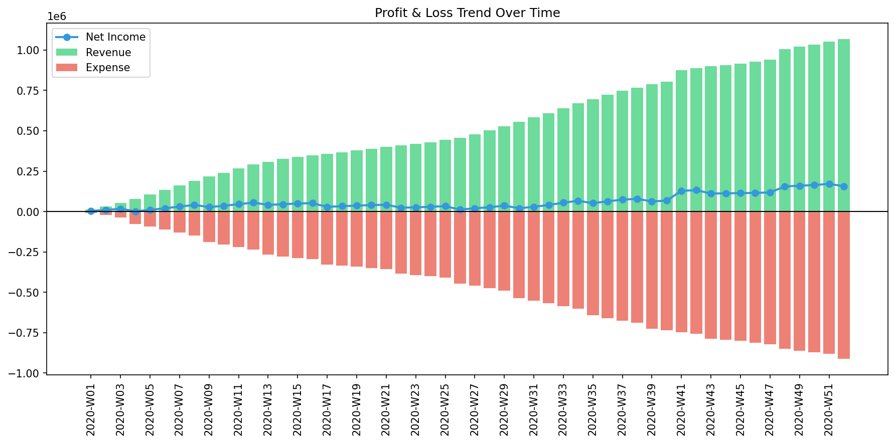

# Sample 1: 循環取引（Wash Trading）

> [!NOTE]
> **概念実証実験にともなう免責事項**
> 本レポートで分析されるデータは実世界の企業のものではありません。検証を目的として、特定の病理学的状態を意図的に再現するために設計されたダミーデータです。本サンプル（Sample_1_Wash_Trade）は、売上の水増しを目的とした「循環取引（資金のキャッチボール）」がシステムに与えるトポロジー的異常を証明するためのものです。

---

# 🔬 メタ解析 統合レポート (Meta-Analysis Synthesis Report / Laboratory Findings)

## 1. エグゼクティブ・サマリー

本システム（金融ドメイン）は、**位相幾何学的な異常ループ（Topological Feedback Loop）** を発症しており、危険な状態（HIGH）にあります。総収益 $1,067,391.62 のうち、複数の「売掛金と現金のキャッチボール」による架空売上（循環取引）がシステム内に混入しています。質量保存則は維持されているため貸借対照表（B/S）の左右は完全に一致していますが、ネットワーク・トポロジーの最大スペクトル半径が正常閾値（0.6）を突破して `0.8353` まで発散しており、物理的な構造崩壊が数学的に証明されました。

## 2. 従来型会計分析との比較対照（Traditional vs TLU Perspective）

一般の監査読者向けに、第52週時点の「従来の財務諸表（B/S・P/L）」と「TLUの物理空間視点」の違いを比較します。

### 従来の財務諸表が捉える世界（静的なスナップショット）

**【第52週 損益計算書 (P/L) サマリー】**

* **売上収益:** $1,067,391.62
* **総費用:** $910,552.63
* **当期純利益:** **+$156,838.99**

**【第52週 貸借対照表 (B/S) サマリー】**

* **総資産:** $317,611.47
* **負債・純資産合計:** $317,611.47
* **バランスチェック:** **一致（差額 $0.00）**

**【従来の手法に対するTLUの補完的価値】**
従来の会計監査では、帳簿の左右が1円の狂いもなく一致し、かつ純利益が大幅に黒字（+$156,838.99）となっているため、「売上が順調に伸びている優良企業」として無傷で監査を通過してしまいます。この**「美しいB/SとP/L」の裏に隠された、人為的で無価値な資金の還流（キャッチボール）を見抜くことは、静的な数値の集計手法では極めて困難**です。

### TLUが捉える世界（動的な幾何学構造とエネルギー推移）

TLUは、上記の財務諸表を「グラフ上のノード（口座）とエッジ（取引）」のネットワークとして再構築し、その**形（トポロジー）**を監視します。

以下は、Sample 1 の第41週（循環取引の発生時）における異常なネットワーク・トポロジーです。

* **幾何学的構造の異常（Network Topology）**
  * **第39週（平時のネットワーク状態）**
  
  * **第40週（循環取引の発生直前）**
  
  * **第41週（循環取引の発生時）**
  

  * **💡 異常系の読解 (Sample 0 との視覚的差分):** 正常系（Sample 0）の「自然な放射状の成長」と視覚的に比較してください。異常系である本作では、`ACC_Cash`（現金）と `ACC_Accounts_Receivable`（売掛金）の間に、不自然に太く、自己強化的に循環する閉路（現金と売掛金の往復するループ）が形成されています。実体経済を伴わない資金が、特定の口座間を高速で回転している（＝循環取引）ことを幾何学的に捉えています。（時間差のある循環取引である場合は、事前集約の時間の単位を週次から月次、四半期次、年次などにして、現金から売掛金への逆方向のお金の流れの是非が検討できます。）

## 3. 中核と見なせる病跡（主要な病理所見）

本システムからは、以下の2つの特異な物理的病跡が検出されています。

### 🟠 病跡 1: Topological Feedback Loop (無限ループの形成)

* **重要度:** HIGH
* **物理的証拠:**
  * 最大スペクトル半径 (Max Spectral Radius): `0.8353` (正常閾値 `< 0.6` を**超過**)
  * 相対質量漏れ率 (Relative Leak Ratio): `0.0000` (正常閾値 `< 1e-6` をクリア)
* **解釈:** 質量保存則（B/S）を完全に守りながら、特定の口座間（CashとAccounts_Receivable）で資金が高速回転する閉回路が形成されています。

### 🟠 病跡 2: Thermodynamic Energy Depletion (エントロピーの爆発)

* **重要度:** HIGH
* **物理的証拠:** 熱力学ダッシュボードにおける $T\Delta S$（エントロピー損失）の局所的な異常スパイク
* **解釈:** 循環取引は、実質的な内部エネルギー（純残高）を一切生み出さず、単なる「摩擦熱（取引ボリューム）」だけを発生させるため、自由エネルギー方程式においてシステムを熱的な死へと向かわせます。

### 📊 異常系可視化プロファイル（病的構造の証明）

**1. ネットワークトポロジーの異常（System Stability / Spectral Radius）**

* **💡 異常系の読解:** 赤色の線「Max Spectral Radius（最大スペクトル半径）」が、第40週付近から急激に跳ね上がり、`0.8353` という危険水域に達しています。Sample_0（正常系）ではこの線が完全に `0.0` であったことと比較すると、システム内に「自己強化的な無限ループ（資金のキャッチボール）」が形成されたことを示す、構造的詐欺の決定的な数学的署名です。

**2. 質量保存の基準（Macro Forensics）**

* **💡 異常系の読解:** 上段の「System Conservation Residual（質量の絶対残差）」は完全に `0.0` の地平に張り付いています。これは、循環取引を行う主体が「貸借一致の原則（借方と貸方を一致させること）自体は厳格に守っている（＝資金は外部に漏れず、完全に内部で還流している）」ためです。これにより、単なるエラーチェック（Sample_3のような貸借不一致）の網はすり抜けてしまいます。

**3. 熱力学ダッシュボード（Thermodynamics Energy Stack）**

* **💡 異常系の読解:** 第41週と第48週のタイミングで、赤色の層（エントロピー損失 $T\Delta S$）が突然、異常な太さの柱となって出現し、白色の線（自由エネルギー $F$）が下方に沈み込んでいます。利益を生み出さない空回りの取引（摩擦）がシステムに負荷をかけている物理的証拠です。

## 4. ミクロ・フォレンジックによる最終証拠（Micro-Forensic Final Evidence）

**【ミクロ・フォレンジックの第一警報（KL Divergence Drift）】**

* **💡 異常系の読解（モデル汚染の限界と物理的アプローチの優位性）:**
このグラフは、過去の確率分布と現在の分布の「ズレ」を検知する統計的指標です。第41週の初犯時には巨大なスパイク（警報）を鳴らしますが、その異常データが「新たなベースライン」としてシステムに学習（汚染）されてしまうため、第48週での再犯時には警報が非常に小さくなる（茹でガエル現象）という統計的AIの致命的弱点を示しています。だからこそ、過去の歴史に依存せず、その瞬間の絶対的な異常を突く「物理エンジン（Spectral / Thermodynamics）」が必要不可欠なのです。

* **自律調査の実行:** マクロ物理指標において「異常なネットワークループ（Spectral = 0.8353）」が明確に検出されたため、AIエージェントは自律的に基礎となる仕訳ストリーム (`Dummy_Journal_Stream_Amount.csv`) へドリルダウンし、ミクロ・フォレンジック（特定行の抽出）を実行しました。

* **特定された証拠:**
`grep` によるトランザクション・レベルの追跡の結果、`Cash` と `Accounts_Receivable` の間で人為的な資金の還流（ループ）と架空売上の計上が以下の通り特定されました。
  * **Event 1 (2020-10-08 / Week 41):**
    * `E_002771`: `$54,783.51` の資金をトンネル会社等へ流出（Cash -> Accounts_Receivable）
    * `E_002772`: 同額の架空売上を計上（Sales -> Accounts_Receivable）
    * `E_002773`: 流出した資金がそのまま売掛金の回収として還流（Accounts_Receivable -> Cash）
  * **Event 2 (2020-11-28 / Week 48):**
    * `E_003192` 〜 `E_003194`: 全く同じキャッチボール手法で `$55,867.37` の架空売上を水増し。

**【損益計算書 (P/L) の時系列比較】**

* **💡 異常系の読解:** 第41週と第48週において、**売上高（緑色のバー）と費用（赤色のバー）が垂直にジャンプしているにもかかわらず、純利益（青色の線）がまったく連動していない**という極めて不自然な断層（階段状のギャップ）が確認できます。実態を伴わない粉飾決算の典型的な指紋です。

* **最終結論:** 意図的な循環取引（Wash Trading）による売上高の水増し（粉飾決算）と断定します。静的なB/Sは一致していますが、物理的なネットワーク・トポロジーの崩壊とトランザクション証拠により、システムの完全性は毀損されています。

## 5. ⚠️ 反証可能性と検証要件（Falsification Analytics）

* **偽陽性の可能性:** 本診断の「循環取引」という結論は、極めて短い期間に特定の口座間で同額の資金が還流しているという「物理的挙動」に依存しています。もし、`E_002771` や `E_003192` での Cash 流出が、正当な「従業員への短期貸付」や「子会社へのブリッジローン」であり、かつ `E_002772` などの売上が「それとは全く無関係な独立した正当な商取引」であった場合（たまたま同額・同タイミングであった場合）、この診断は偽陽性となります。
* **追加検証要件:**
  1. `E_002771` における現金流出先の銀行口座名義と、`E_002773` における入金元の銀行口座名義が同一（または関連会社）であるかを確認してください。
  2. `E_002772` の売上計上について、実際の納品書、受領書、および物流記録（Shipping records）を提示させ、物理的な商品やサービスの移動が伴っているか（実需の存在）を監査してください。
