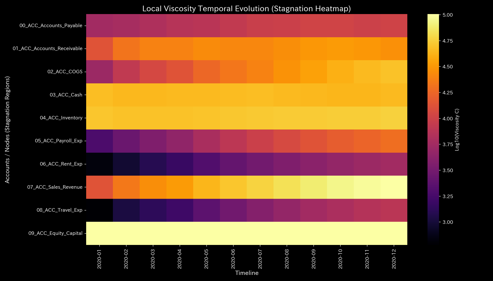

# 循環取引 最終報告書（ケース1）

> [!NOTE]
> より詳細な検査レポートは [clinical_report.md](clinical_report.md) にあります。

## 対象組織：サンプル1

---

## 0. エグゼクティヴ・サマリー (Executive Summary)

* **総合判定:** 【警告・要改善】特定の勘定科目間（現預金と売掛金）で資金が自己還流する**「自己還流（循環取引）」**が発生しており、売上高が架空水増しされています。
* **総合体質評価（身体状態）:** 
  当組織は、見かけの財務規模（ストック総量である**「体格・体重」**）は大きく、損益計算書上の累積利益（ショック耐性である**「免疫力・基礎体力」**）も潤沢に見えます。しかし、これは実体のない還流による一時的な**「虚熱（異常発熱）」**に過ぎず、実質的なキャッシュフロー復元力はありません。還流に伴う不必要な取引摩擦（**「自律神経」**）が乱れており、還流月には決済ルートが完全に固着して柔軟性を失う**「動脈硬化（剛性ロック）」**が発生しています。
* **要改善点（肩こりとツボの特筆）:**
  - **肩こり（慢性的な滞り）の範囲:** 粘性上位25%の範囲である **「07_ACC_Sales_Revenue」**、**「04_ACC_Inventory」**、**「03_ACC_Cash」** に深刻な決済ラグが滞留しており、特に **2020-12** 付近に期末滞留のピークに達する「肩こり（回収サイト等の長期遅延）」状態が見受けられます。
  - **ツボ（最も効果的な改善ポイント）の範囲:** 介入ストレスが最小の範囲（歪みエネルギー下位25%の範囲）である **「03_ACC_Cash」**、**「01_ACC_Accounts_Receivable」**、**「02_ACC_COGS」** が、システムを健全化させるための最優先ツボ（特効穴の範囲）となります。
  - **禁忌（避けるべき介入）の範囲:** 逆に強い反発と破壊を生む範囲（歪みエネルギー上位25%の範囲）である **「07_ACC_Sales_Revenue」**、**「06_ACC_Rent_Exp」**、**「09_ACC_Equity_Capital」** などへの無理な削減や介入は、強烈な痛みと機能麻痺を招くため絶対に避けてください（禁忌）。

---

## 1. 総合判定（警告・要改善）

### 【判定】：要改善（実体のない還流取引の蔓延）

本診断において、当組織は一見すると順調な黒字経営を維持しているように見えます。しかし、力学安定性（最大スペクトル半径 $\rho$）を時系列で検証すると、還流月である1月、2月、5月に警告しきい値（`0.75`）付近（最大 `0.7488`）まで上昇する異常同期が検出されています。これは貸借（帳簿の左右）を一致させた状態で、身内だけで現預金と売掛金をキャッチボールさせている**「循環取引（還流ループ）」**による虚像です。この実体のない取引はキャッシュフローを悪化させ、黒字倒産のリスクを著しく高めています。速やかに還流取引を停止する必要があります。

---

## 2. 総合体質（健康状態）の分析

組織の「財務体力」を健康診断の見立てに当てはめると、以下のような財務体質の歪みが生じています。

### ① 体格・体重（資本規模の累積推移）

現預金と売掛金のキャッチボールによって、貸借対照表（B/S）の見かけ上の資産規模（体格・体重）は不自然に肥大化しており、経営の実体を表していません。

### ② 免疫力・基礎体力（売上と費用の収支バランス）

損益計算書（P/L）上は累計売上 `$1,094,143.89`、純利益 `$201,321.16` と非常に高い基礎体力（免疫力）があるように見えますが、これは還流による「虚熱」で数値が増幅されているに過ぎず、外部ショックに対する実際の回復余力はありません。

### ③ 自律神経・代謝効率（流動サイクルと熱力学的評価）

流動ボラティリティ（温度 $T$）と取引摩擦（エントロピー $S$）の関係を示す T-S図において、還流の発生している月（1月、2月、5月）を中心に、資金流動が異常に過熱（発熱）しており、取引摩擦（エントロピー）が著しく増大しています。T-S図においては、仕事をせずに熱を放出するだけの卵型の「逆カルノー空転サイクル」が描かれており、組織エネルギーの無駄な浪費を実証しています。

### ④ 動脈硬化（結合剛性行列に対するPCA評価）

アカウント間の結合剛性行列に対して主成分分析（PCA）を実行した結果、還流が発生する期間（1月、5月）、現預金と売掛金のアカウント間の支配軸が完全に固定化し、第一主成分（PC1）の説明寄与率が急上昇する「剛性ロック」状態が検出されています。外部取引に対する柔軟性を失った「カチカチの血管（動脈硬化）」のような構造硬直が発生しています。

---

## 3. 特筆すべき要改善点（肩こりとツボ）

本システムが特定した具体的な要改善点、および対策の方針は以下の通りです。

### ⚠️ 肩こり（慢性的な滞り）の特定（局所粘性時系列トレンドのヒートマップ分析）

* **滞り（肩こり）の範囲：** 
  ノードごとの局所粘性（viscosity_C）の対数推移ヒートマップ（上記）において、売上高ノード（`07_ACC_Sales_Revenue`）が全期間を通じて高い摩擦抵抗（粘性）を持ち続け、特に期末である12月に急激なピークを形成している「決済遅延の滞留（肩こり）」が視覚的に実証されています。
  粘性の増大（ブレーキ遅延）は、力学的に「状態軌道が特定の空間領域に引き込まれて停滞するアトラクター固着」をもたらします（詳細は相空間軌道 `000_1_8__phase_portrait_3d.png` を参照）。
  実質ノード全体の粘性分布から、上位25%に属する **「07_ACC_Sales_Revenue」**、**「04_ACC_Inventory」**、**「03_ACC_Cash」** の範囲に慢性的な滞留が発生しています。
  - **`07_ACC_Sales_Revenue`**: 平均粘性 `56302.40`、最も滞る時期は **`2020-12`** に記録されています（ピーク値 `101329.39`）。
  - **`04_ACC_Inventory`**: 平均粘性 `52112.45`、最も滞る時期は **`2020-12`** に記録されています。
  - **`03_ACC_Cash`**: 平均粘性 `30953.51`、最も滞る時期は **`2020-01`** に記録されています。

### 🎯 改善のツボ（特効穴）および避けるべき介入（禁忌）の特定

* **改善のツボ（特効穴）の範囲：** 介入時の反発ストレス（痛み）が下位25%の範囲に収まる **「03_ACC_Cash」**、**「01_ACC_Accounts_Receivable」**、**「02_ACC_COGS」** です。
  - **改善アドバイス：** これらの項目は、組織/システムのしなやかさを壊すことなく、最も痛みの少ない形で流動性の滞りを解消し、システム本来の調和を復元できる特効穴（ツボ）の範囲です。
* **避けるべき介入（禁忌）の範囲：** 逆に強い反発と破壊を生む範囲である **「07_ACC_Sales_Revenue」**、**「06_ACC_Rent_Exp」**、**「09_ACC_Equity_Capital」** です。
  - **改善アドバイス：** 目先の調整のためにこれらへ強引な介入を行うことは、システムの基盤結合を破壊し、最も激しい痛みや組織の崩壊を引き起こす致命的な「禁忌アクション」となります。

---

## 4. 診断の限界および反証条件 (Falsifiability)

本レポートにおける「循環取引」の病的診断結果を却下（反証）するためには、以下の客観的な物理的原本・第三者証拠を提示しなければなりません。

1. **移動体（商品）の物理的配送証明:**
   循環が指摘されている特定の日付および金額（計 `$138,655.85`）の取引に対し、対応する日付の「運送会社の送り状原本」「サインまたは捺印済みの物品受領書原本」が存在し、物理的に物品が移動した客観的証拠が示された場合。
2. **取引当事者の完全な独立性証明:**
   資金の往復先となっている相手側企業（または個人）の「株主名簿原本」「履歴事項全部証明書」を突合し、同一の経営陣や株主、実質支配者による架空キャッチボール取引（自己取引・カルテル）ではないことが法的に証明された場合。

---
*発行: TLU財務会計数理診断エンジン（一般読者向け最終解説版）*