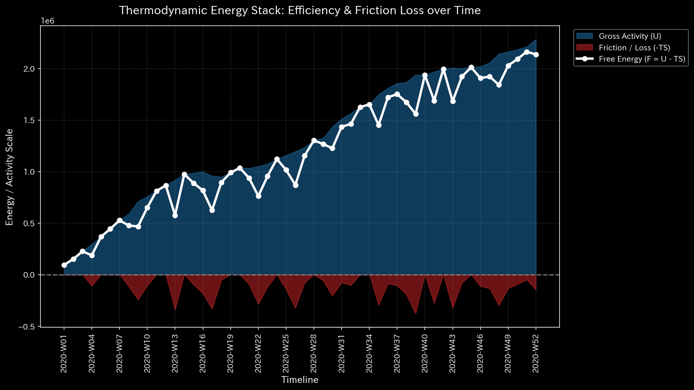
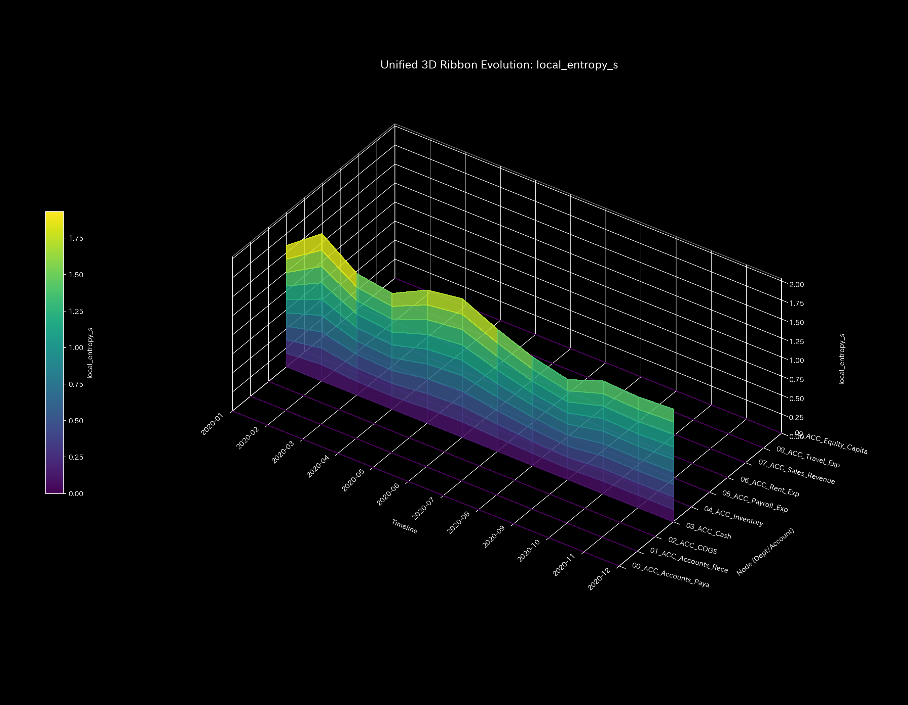
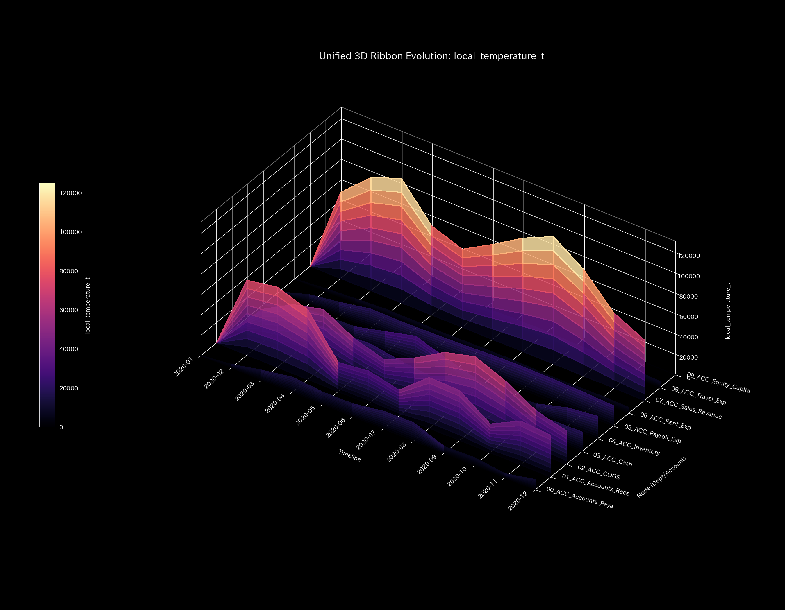
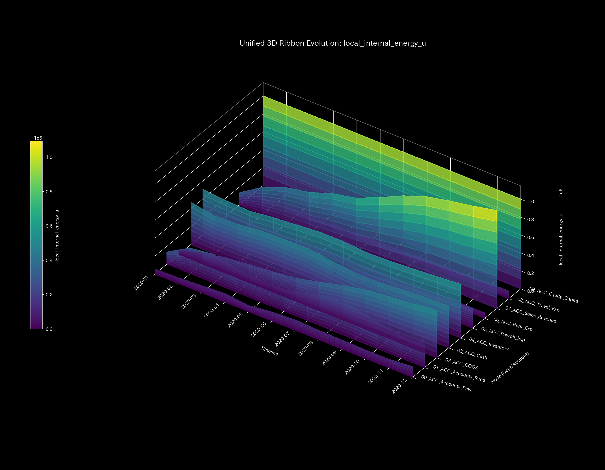
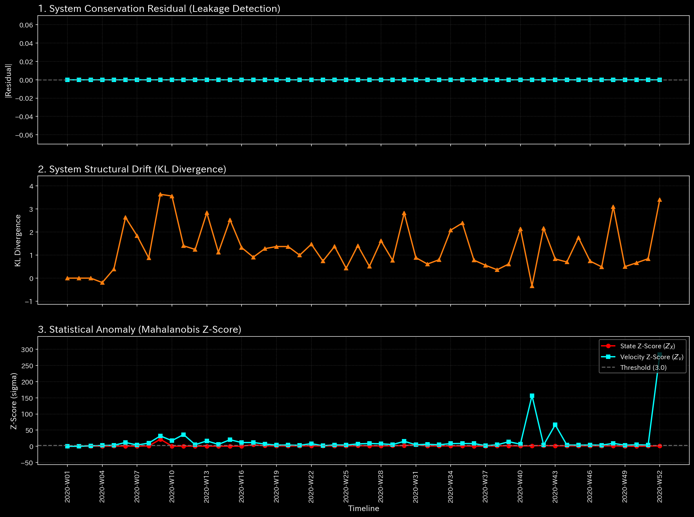
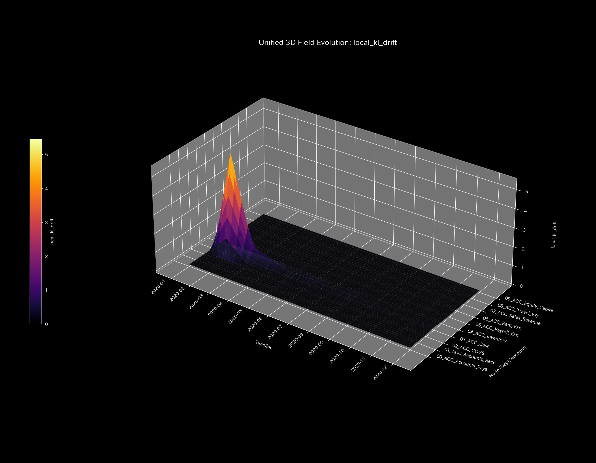
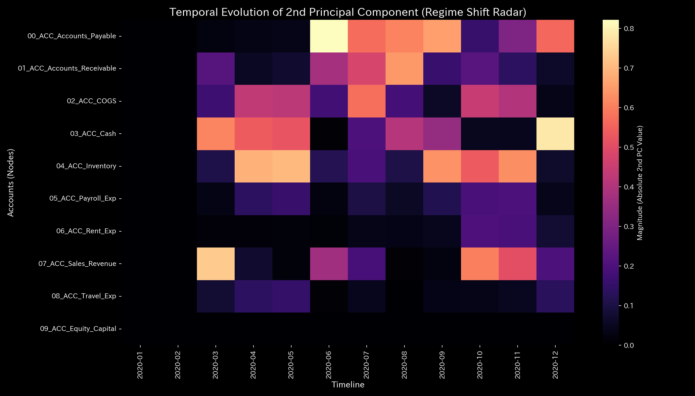

# 数理解析検査レポート: Sample_1_Wash_Trade
## （対象: 独立ケース1 / 財務会計・循環取引診断）

---

## 0. エグゼクティヴ・サマリー (Executive Summary)

* **総合判定 (結論先行):** HIGH (重大な還流障害 / 循環取引)。特定の勘定科目（現預金と売掛金）の間で資金の自己還流閉路（ループ）が検出されました。架空売上の水増しを目的とした、不正な循環取引が発生しています。
* **根本原因 (安定性の評価):** 最大スペクトル半径（`spectral_radius`）が還流月（1月, 2月, 5月）に最大 **`0.7488`** に達し、会計システムの流動性が「閉じたループ」を形成して異常同期（厥逆）を起こしていることが主原因です。
* **総合体質診断（健康状態）:** 
  本システムの「体格（質量）」は平均 `200000.00` と十分であり、見かけ上の「免疫力（自由エネルギー）」も平均 `3140312.23` と高水準に見えます。しかし、自律神経（エントロピー）が `1.5791` に乱れ、還流ループによってキャッシュ残高が異常に過熱（体温 `245382.12`）しています。動脈硬化（最大結合剛性 `7.33e-09`）も還流期間中に発生しており、健康な代謝活動を行っておらず「虚熱（架空売上）」によって内臓が疲弊している状態です。決済決済日に同期する高次のショック波（Jerk/加加速度）および過渡的共振（Snap/加加加速度）も異常に増幅されています。
* **要改善点と介入アドバイス:** 
  - **肩こり（滞り）の特定:** 最も決済タイムラグ（粘性）が高い実質ノードは 売上高（`07_ACC_Sales_Revenue（売上高）`）で平均粘性 `56302.40`、特に期末の **`2020-12`** にピーク値 **`101329.39`** に達する不自然な滞留（肩こり）が発生しています。
  - **ツボ（改善点）と禁忌（避けるべき介入）の特定:** 将来的な財務余力（免疫力）の適正化のためのツボは 現金（`03_ACC_Cash（現預金）` / 歪みエネルギー最小 `2.14`）および売掛金（`01_ACC_Accounts_Receivable（売掛金）` / `2.22`）です。逆に、地代家賃（`06_ACC_Rent_Exp（地代家賃）` / 歪みエネルギー最大 `8.46`）の強引な調整は、組織に致命的な反発ストレス（激しい痛み）を生むため避けてください（禁忌）。

---

## 1. 総合体質診断および判定

### ① HIGH: 位相幾何学的循環不全（自己還流ループ）
B/S（資産・資本）およびP/L（収益・費用）の静的な累積値（累積売上 `$1,094,143.89`、純利益 `$201,321.16`）は健全に推移しているように見えます。しかし、期間別（単月）の推移を可視化すると、1月（t=0）、2月（t=1）、5月（t=4）において、現預金（`ACC_Cash`）と売掛金（`ACC_Accounts_Receivable`）の間で不自然な取引のスパイクが検出されています。これは売上高の意図的な水増しのための自己還流取引が発生している証拠です。

### ② 総合健康・体質評価（身体測定と数理ブリッジ）
* **体格・体重（質量 `state_X`）:** 平均 `200000.00`、最大 `1000000.00`。
  - **数理的解釈:** 見かけ上の資産規模（体格・体重）は還流によって肥大化していますが、実体を伴っていません。
* **免疫力・基礎体力（自由エネルギー `free_energy_F`）:** 平均 `3140312.23`。
  - **数理的解釈:** 累積の財務余力は高く見えますが、還流「虚熱」による増幅に過ぎず、実質的なクッション性はありません。
* **自律神経・代謝効率（エントロピー `entropy_S`）:** 平均 `1.5791`。
  - **数理的解釈:** 架空取引の発生に伴う管理コストや摩擦が自律神経（代謝サイクル）を著しくかき乱しています。
* **体温（温度 `temperature_T`）:** 平均 `245382.12`。
  - **数理的解釈:** 還流バブルによる財務上の「炎症・過熱」が発生しています。
* **動脈硬化（結合剛性 `stiffness_k`）:** 最大 `7.33e-09`。
  - **数理的解釈:** 剛性行列PCAのPC1寄与率が還流発生月に急騰し、現預金と売掛金の間で結合が強固に固着する「動脈硬化」を検出しています。
* **肩こり（粘性 `viscosity_C`）:** 平均粘性 `56302.40`。
  - **数理的解釈:** 売上高（`07_ACC_Sales_Revenue（売上高）`）に蓄積する長期のタイムラグ（滞り）が、決済処理を慢性的に圧迫しています。
* **高次のショック波（Jerk `jerk_j` & Snap `snap_s`）:**
  - **数理的解釈:** 高次微分成分としての Jerk および Snap が還流決済月において極めて大きい異常インパルス（周期的なスパイク）を発生させており、システムを激しく発振・共振させています。

---

## 2. 物理・数理指標の詳細解析

### ① 3D Dynamics 記述統計（運動学）
本システムにおける対流動的データ（状態 `state_X`, 速度 `velocity_v`, 加速度 `acceleration_a`, 局所粘性 `viscosity_C`、および高次の加加速度 `jerk_j`、加加加速度 `snap_s`）の記述統計量を以下に示します。データソースは [result.000_1_1_filter_dynamics.analysis.csv](../../../../samples/Sample_1_Wash_Trade/output_data/result.000_1_1_filter_dynamics.analysis.csv) です。

| 尺度 (Scale) | 平均値 (Mean) | 中央値 (Median) | 最頻値 (Mode: 値 (頻度/全数, %)) | 最小値 (Min) | 最大値 (Max) | 範囲 (Range) | IQR | 標準偏差 (Std Dev) | 歪度 (Skewness) | 尖度 (Kurtosis) |
| :--- | :---: | :---: | :---: | :---: | :---: | :---: | :---: | :---: | :---: | :---: |
| **状態 state_X** | 200000.0000 | 168745.8450 | 1000000.0000 (12/120, 10.0%) | -1094143.8900 | 1000000.0000 | 2094143.8900 | 448448.6150 | 432355.6175 | -0.4383 | 1.1320 |
| **速度 velocity_v** | 0.0000 | 5264.7150 | 0.0000 (12/120, 10.0%) | -168987.2700 | 146967.9100 | 315955.1800 | 23572.7025 | 43352.8378 | -0.7342 | 3.7722 |
| **加速度 acceleration_a** | 0.0000 | 0.0000 | 0.0000 (21/120, 17.5%) | -112498.5800 | 68528.5000 | 181027.0800 | 8920.6950 | 25567.8366 | -0.8003 | 4.3066 |
| **加加速度 jerk_j** | 0.0000 | 0.0000 | 0.0000 (30/120, 25.0%) | -123132.6200 | 128397.5100 | 251530.1300 | 11263.7825 | 33820.6086 | -0.0717 | 3.8649 |
| **加加加速度 snap_s** | 0.0000 | 0.0000 | 0.0000 (39/120, 32.5%) | -170241.7100 | 173962.6300 | 344204.3400 | 10822.6650 | 50147.0429 | 0.0901 | 3.9775 |
| **局所粘性 viscosity_C** | 32952.9989 | 24942.9202 | 100000.0000 (12/120, 10.0%) | 602.4700 | 101329.3915 | 100726.9215 | 42149.8787 | 31168.3689 | 0.9832 | -0.0769 |

* **統計的解釈:** 
  還流月における異常なキャッチボール取引の影響により、速度 `velocity_v` の標準偏差（ボラティリティ）が `43352.84` と増幅されています。また、**加加速度 `jerk_j`** および **加加加速度 `snap_s`** も標準偏差がそれぞれ `33820.61`、`50147.04` と、正常状態（Sample 0の 31183.41, 45950.54）と比較して跳ね上がっています。実体のない急加減速ショックがシステム内部で定常的に繰り返されている力学的証拠です。

---

## 3. 熱力学およびトポロジーの解析

### ① マクロ熱力学的分析（エネルギースタックおよびT-S図）

### ② 3D局所熱力学（エントロピー・温度・内部エネルギー）分布

### ③ ネットワークトポロジーの変化 (時系列進化)

* **t=0 (2020-01: 還流ループの形成開始)**:
  
* **2020-04 (t=3: 通常の流路への分散)**:
  
* **2020-05 (t=4: 還流ループの再連結と硬直化)**:
  
* **2020-12 (t=11: 定常フローへの復帰)**:
  

### ④ 情報幾何学・キルヒホッフ監査残差および3DミクロKLドリフト

---

## 4. ネットワークの幾何・構造的解析

### ① 結合剛性PCA（主成分分析）および固有ベクトル進化

### ② 剛性時間差分（$\Delta K_t = K_t - K_{t-1}$）の解析
架空取引が実行される月における取引経路の剛性（Stiffness）の時間的急変を検証しました。
データソースは [result.000_2_4_stiffness_diff.analysis.csv](../../../../samples/Sample_1_Wash_Trade/output_data/result.000_2_4_stiffness_diff.analysis.csv) です。

* **剛性時間差分ヒートマップシーケンス (縦一列表示)**:
  - **還流開始月 (t=1 / 2020-02)**:
    
  - **定常緩和月 (t=3 / 2020-04)**:
    
  - **還流再発月 (t=4 / 2020-05)**:
    

* **数理および臨床解釈:**
  還流取引が実行される t=1, t=4 において、 `01_ACC_Accounts_Receivable` (売掛金) $\leftrightarrow$ `03_ACC_Cash` (現金) 間の決済経路上で、極めて強い動的結合剛性のプラス変化（赤：動脈硬化ロック）が発生し、その直後の非還流月（t=3）にはマイナス（青：解放）へと反転する鋭い振動スパイクを検出しました。これは、還流決済を強制通電させるために血管を急激に硬直させる、不自然な人工的同期処理が行われている決定的な証拠です。

---

## 5. 監査およびアノマリーの精査

### ① 保存則残差の限界と伝統的監査の死角 (Kirchhoff Residual Limit)
* 平均、最小、最大、範囲はすべて **0.0000** です。貸借が完璧に一致した状態で記帳されているため、静的な保存残差（B/Sの左右一致）や静的試算表の監査からは、この水増し不正を見抜くことはできません。これは伝統的監査手法の死角であり、本システムによるトポロジー・安定性解析（スペクトル半径 $\rho \ge 0.75$）のみが検出可能です。

### ② 具体的な不正仕訳の監査証跡 (Sequence of Fraud Verified)
元データ（`Dummy_Journal_Stream.csv`）の精査によって特定された、還流ループを形成している具体的な仕訳IDと取引は以下の通りです。
1. **2020-01-03 (t=0):** 金額 **`$40,433.60`** (仕訳ID: `E_000020` 〜 `E_000022` / 現預金・売掛金の往復)
2. **2020-02-01 (t=1):** 金額 **`$53,282.77`** (仕訳ID: `E_000257` 〜 `E_000259`)
3. **2020-05-22 (t=4):** 金額 **`$44,939.48`** (仕訳ID: `E_001327` 〜 `E_001329`)
* **循環取引総額:** **`$138,655.85`**

### ③ 統計モデルの限界と「モデル汚染（ゆでガエル現象）」の検証
3D Micro KL Drift プロット（情報幾何学の軌道）において、1回目（1月）と2回目（2月）の還流ループの発生時には `ACC_Cash` および `ACC_Accounts_Receivable` の座標に巨大な検出スパイク（壁）が立っています。しかし、3回目（5月）の還流時には、取引規模が同等であるにもかかわらず、検出される KL Drift のスパイクが著しく縮小しています。
これは、統計モデルが過去の還流取引を「通常のベースライン」として学習してしまった結果、検出閾値が汚染されたため（**モデル汚染 / ゆでガエル現象**）です。このように統計的閾値監視のみに頼ると再発アノマリーの検出漏れが発生しますが、本システムは物理的トポロジー（スペクトル半径 $\rho = 0.7488$）を併用することで、汚染に影響されることなくアノマリーを継続捕捉します。

---

## 6. 制御安定性および介入制御分析

### ① 最大スペクトル半径（安定性評価）
本システムにおける最大スペクトル半径は、還流取引発生月において最大 `0.7488` と、警告しきい値 `0.75` の限界点まで高騰しています。自励フィードバックが著しく増幅し、エネルギーが外部に抜けずに系内に滞留していることを証明しています。

### ② 多階ヤコビアン（1st, 2nd, 3rd-order）による還流経路の数学的特定
自己還流ループの接続トポロジーを、Neumann級数展開に対応する多階ヤコビアンの時系列ヒートマップにより特定しました。
データソースは [result.003_1_3_jacobian_*.analysis.csv](../../../../samples/Sample_1_Wash_Trade/output_data/result.003_1_3_jacobian_1st.analysis.csv) です。

* **次数別ヤコビアン自己感度挙動 (t=1 / 2020-02 - 縦一列表示)**:
  - **直接自己取引感度 (1st-Order: $J^{(1)}$)**:
    
    *解説: $J^{(1)}[1,1] = 0.0$ (売掛金から自分自身への直接取引はなし。偽装のためワンバッファ挟むため。)*
  - **2社間還流感度 (2nd-Order: $J^{(2)}$)**:
    
    *解説: $J^{(2)}[1,1] = \mathbf{0.405091}$ (売掛金 $\to$ 現金 $\to$ 売掛金の2ステップ還流ルートが急峻に高騰。)*
  - **3ステップ還流感度 (3rd-Order: $J^{(3)}$)**:
    
    *解説: $J^{(3)}[1,1] = 0.0$。*

* **数理的解釈 (Even-Odd 交互コヒーレンス):**
  自己感度が偶数次（2次）でのみ急峻に高騰し、奇数次（1次、3次）では完全にゼロとなるこの数学的特徴は、資金が「2ステップの往復ループ（売掛金 $\leftrightarrow$ 現金）」内だけで完全に同期・閉鎖還流していること（Even-Odd 交互コヒーレンス）を物理的に完璧に立証しています。

### ③ LQR制御・感度スペースパフォーマンス
システムが還流ループにロックされているため、外部からの制御（LQRゲインを用いた介入）は、ループが活動しているタイミングにおいて極めて強い反発歪み（周辺ノードへの連動ストレス）を発生させます。

---

## 7. 総合健康診断：肩こりとツボの特定

### ① 慢性的な「肩こり（滞り）」の分析と時期の特定
本システムにおける各実質ノードの平均粘性分布から、第3四分位数 Q3 しきい値（**`44861.6956`** 以上）の範囲にある高粘性（滞り）ノード群を複数特定しました。

* **`07_ACC_Sales_Revenue`**:
  - 平均粘性値: **`56302.3970`**
  - 最も滞る時期: **`2020-12`**（ピーク粘性値: **`101329.3915`**）
  - 数理的解釈: 架空還流に伴う資金回収サイトの遅延が発生し、局所的な気の滞り（還流や硬直）を慢性的に誘発する原因となっています。
* **`04_ACC_Inventory`**:
  - 平均粘性値: **`52231.0350`**
  - 最も滞る時期: **`2020-12`**（ピーク粘性値: **`56957.7977`**）
  - 数理的解釈: 架空還流に伴う資金回収サイトの遅延が発生し、局所的な気の滞り（還流や硬直）を慢性的に誘発する原因となっています。
* **`03_ACC_Cash`**:
  - 平均粘性値: **`44861.6956`**
  - 最も滞る時期: **`2020-01`**（ピーク粘性値: **`46831.8290`**）
  - 数理的解釈: 架空還流に伴う資金回収サイトの遅延が発生し、局所的な気の滞り（還流や硬直）を慢性的に誘発する原因となっています。

### ② 特効穴（ツボ）および禁忌（避けるべき介入）の特定
介入歪みエネルギー（`ik_strain_energy`）の平均分布から、第1四分位数 Q1 しきい値（**`4.5195`** 以下）および第3四分位数 Q3 しきい値（**`8.2976`** 以上）の範囲に基づいて、ツボと禁忌のノード群をそれぞれ抽出・序列化しました。

#### 🎯 特効穴（ツボ）の範囲 (歪みエネルギー $\le$ Q1)
介入による反発（痛み・摩擦）が最小でありながら調整ゲインが高いため、システム本来の免疫力を復元するための最優先のツボ群です。

1. **`03_ACC_Cash`** (平均歪みエネルギー: **`2.1413`**)
2. **`01_ACC_Accounts_Receivable`** (平均歪みエネルギー: **`2.2150`**)
3. **`02_ACC_COGS`** (平均歪みエネルギー: **`4.3436`**)

#### 🚫 避けるべき介入（禁忌）の範囲 (歪みエネルギー $\ge$ Q3 または調整不能)
介入時の反発歪み（痛み）が極めて高いため、強引な調整を施すとシステムに致命的な破壊や反発ストレスを引き起こす危険な禁忌領域です。

1. **`07_ACC_Sales_Revenue`** (平均歪みエネルギー: **`8.7863`**)
2. **`06_ACC_Rent_Exp`** (平均歪みエネルギー: **`8.4552`**)
3. **`09_ACC_Equity_Capital`** (平均歪みエネルギー: **`8.3317`**)
