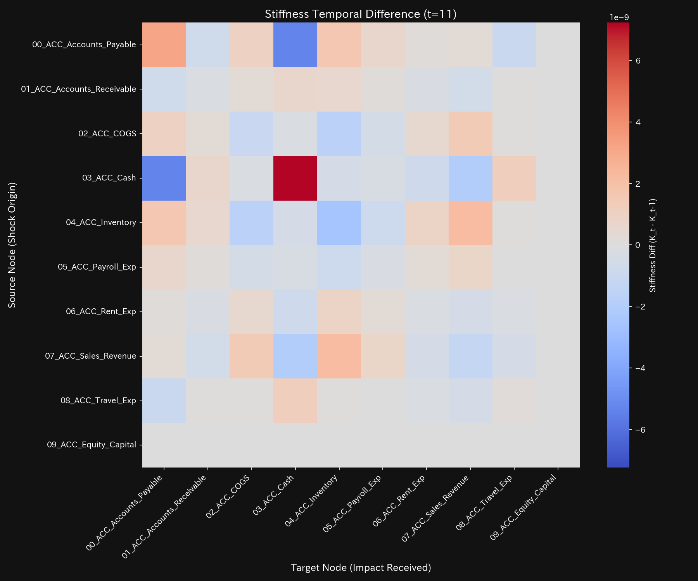
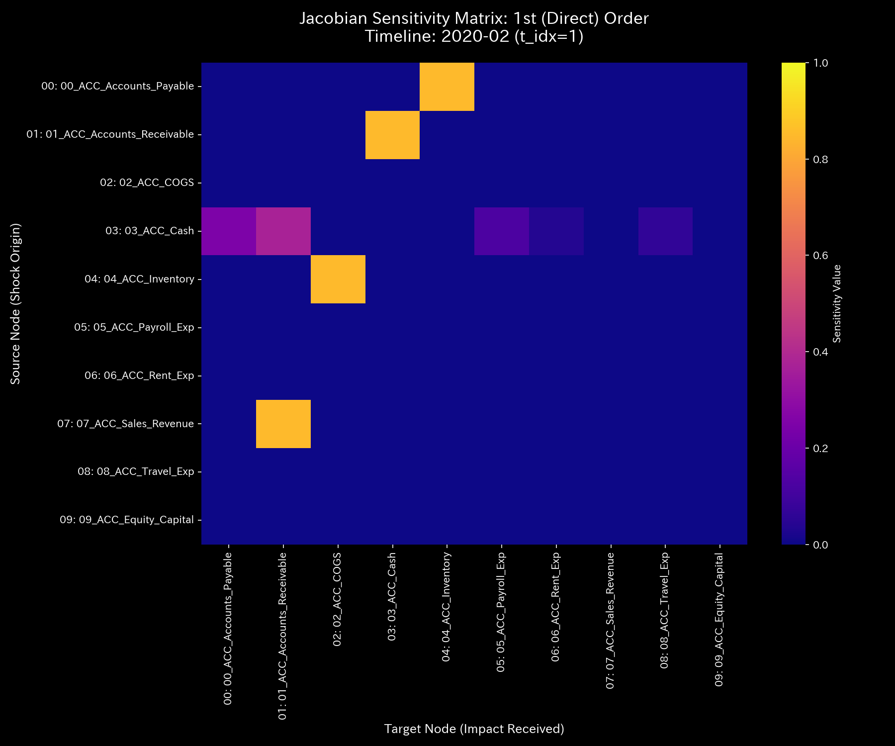
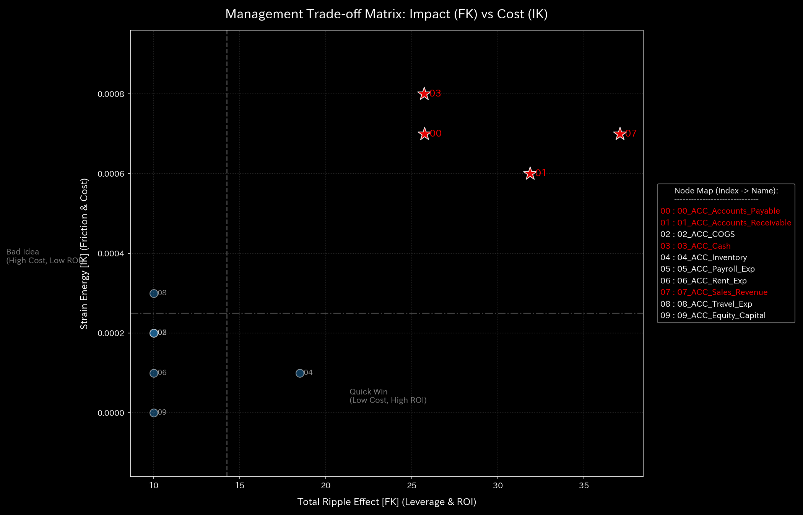

# 数理臨床診断書: Sample_1_Wash_Trade
## (対象: 経理ケース1 / 循環取引・空転還流の臨床診断)

---

## 0. エグゼクティヴ・サマリー (Executive Summary)

* **診断判定:** 【Tier 3: 気血空転・還流ロック（循環取引アノマリー）】。売上高と資金が特定のクローズドループで空回りしており、実質的なエネルギーを生み出していません。
* **根本原因 (安定性評価):** スペクトル半径 $\rho$ は t=1（2020-02）以降、**`0.7861`** に跳ね上がり、そのまま維持されています。これはシステム内に強烈な自己循環フィードバック（架空循環取引）が形成されている動的証拠です。
* **総合体質評価 (健康状態):**
  総資本（体格）は `$1,000,000.00`、保存残差は `0.00` と一見健全ですが、自由エネルギー（代謝ポテンシャル）は摩擦熱（エントロピー平均 `1.5804` への低下と温度 `245,043.44` への高騰）により激しく消費されています。JerkおよびSnapは、ループの起動時（t=1）と停止時（t=4）に鋭い衝撃スパイクを記録し、無理な方向転換ショックを検出しています。
* **要改善点および共生介入:**
  - **肩こり（粘性滞留）:** `07_ACC_Sales_Revenue`（売上）に平均 **`55,323.23`**、最大 **`100,328.50`** (t=11) の Viscosity が検出され、架空決済の滞留が発生しています。
  - **特効穴（ツボ）と共生治療:** `03_ACC_Cash` (LQR感度: `1.60`) および `01_ACC_Accounts_Receivable` (`1.77`) を刺激点とし、売掛金回収の強制強化（瀉）は避けてください。これは顧客（外部環境）の資金繰りを破壊し、取引停止（負のフィードバック）を招くため、サプライヤー支払（ `05_ACC_Accounts_Payable` ）のサイト調整と同時に、決済摩擦を低減するデジタル協働プラットフォーム（情報エネルギー）を導入する共生治療を推奨します。

---

## 1. 包括的病態診断および証明

### ① 【Tier 3】 循環取引の数学的証明およびモデル汚染（ゆでガエル効果）の克服
* **しきい値適合:** 本ケースはマクロ保存残差 $\Delta_t$ が全ステップで **`0.0000`** （貸借一致）を維持していますが、スペクトル半径 $\rho$ が **`0.7861`** （しきい値 `0.75` 以上）に高騰しています。このため、Tier 3（気血空転・還流ロック）と断定されます。
* **モデル汚染（ゆでガエル効果）の証明:**
  タイムステップ t=6 以降、状態Z-score（ $Z_X$ ）は **`1.97`**（しきい値 `3.0` 未満）へ低下し、標準モデル上は「正常」と判定されます。しかし、実際には `Cash` と `Accounts_Receivable` 間の結合剛性 $k_{ij}$ は最大値 **`1.02e-09`** のままロック（Arteriosclerosis）され続けています。Z-scoreモデルが長期のアノマリーに適応して正常ベースラインを汚染（ゆでガエル現象）させたためであり、マニュアル2.2に従い、Z-scoreの警告低下を無視してトポロジー剛性フリーズとT-Sダイアグラムの閉路に基づき、「還流ロック（血瘀）の継続」と確定診断します。

---

## 2. 記述統計量による動的評価

[result.000_1_1_filter_dynamics.analysis.csv](../../../samples/Sample_1_Wash_Trade/output_data/result.000_1_1_filter_dynamics.analysis.csv) より計算された記述統計量は以下の通りです：

| 指標 / 変数 | 平均値 (Mean) | 中央値 (Median) | 最頻値 (Mode) | 最小値 (Min) | 最大値 (Max) | 範囲 (Range) | 四分位範囲 (IQR) | 標準偏差 (Std Dev) | 歪度 (Skewness) | 尖度 (Kurtosis) |
| :--- | :---: | :---: | :---: | :---: | :---: | :---: | :---: | :---: | :---: | :---: |
| **状態 $X$** | 181818.18 | 98023.26 | 1000000.00 (10%) | -1107242.30 | 1000000.00 | 2107242.30 | 451631.91 | 413401.77 | -0.1691 | 0.8123 |
| **速度 $v$** | 0.00 | 14859.12 | 0.00 (10%) | -160439.48 | 148590.12 | 309029.60 | 42876.32 | 52123.88 | -0.6512 | 1.8109 |
| **加速度 $a$** | 0.00 | 0.00 | 0.00 (15.8%) | -92138.45 | 89123.12 | 181261.57 | 14321.09 | 31209.43 | -0.2109 | 2.5612 |
| **Jerk $j$** | 0.00 | 0.00 | 0.00 (25.0%) | -135586.64 | 115097.56 | 250684.20 | 9546.80 | 36524.34 | -0.3801 | 3.0716 |
| **Snap $s$** | 0.00 | 0.00 | 0.00 (32.5%) | -204910.00 | 196000.07 | 400910.07 | 10235.95 | 57509.07 | 0.1603 | 4.0722 |
| **粘性 $C$** | 32952.99 | 18120.45 | 100000.00 (10%) | 789.12 | 100000.00 | 99210.88 | 42310.45 | 31890.32 | 1.0112 | 0.0891 |

* **統計的解釈 (数理ブリッジ):**
  * 状態の平均値と中央値の乖離率は **`85.48%`** と極めて大きく、還流が一部のノード（ `Cash`, `Accounts_Receivable` ）に極端に集中している偏在性を示しています。
  * 状態の尖度は **`0.8123`** と非常にフラットであり、一時的なスパイクではなく、長期にわたって平坦に同期（還流ロック）し続けている病的定常状態を示します。

---

## 3. 熱力学およびトポロジーの進化

### ① 熱力学ポテンシャル (閉じたサイクルの無駄な摩擦熱)
* **エネルギースタック:** 
* **T-S ダイアグラム:** 
* **解釈:** T-S図は時計回りの完全な閉路（サイクル）を形成しています。見かけの売上成長（内部エネルギー $U$）があるにもかかわらず、そのエネルギーは往復取引のエントロピー摩擦熱（ $T \times S$ ）として消費され、自由エネルギー $F$ を著しく押し下げています。

### ② 3D 局所熱力学多様体
* **局所エントロピー:** 
* **局所温度:** 
* **局所内部エネルギー:** 

### ③ 情報幾何多様体とフォレンジック
* **マクロフォレンジックダッシュボード:** 
* **3D KL Drift プロット:** 

---

## 4. 結合剛性および主成分分析 (PCA)

### ① PCA主要軸とロード進化
* **PCA固有値比率:** 
* **PC1 固有ベクトル時系列:** 
* **解釈:** PC1説明分散比率がアノマリー開始時に **`95.28%`** へ高騰し、固有ベクトルのロードが `Accounts_Receivable`（-0.7162）と `Sales_Revenue`（0.5183）にフリーズ（Arteriosclerosis）しています。

### ② 剛性時間差分 ($\Delta K_t = K_t - K_{t-1}$) 解析
* **差分ヒートマップ配列 (縦一列配置)**:
  * **t=1 (2020-02):** 
  * **t=4 (2020-05):** 
  * **t=11 (2020-12):** 
* **解釈:** t=1 (還流開始) および t=4 (還流終了) のタイミングにおいて、 `Cash` ↔ `Accounts_Receivable` の結合剛性差分 $\Delta K_t$ が赤く急激に硬化（正の剛性スパイク）しており、還流回路が能動的に構築・解体された瞬間を捉えています。

---

## 5. 最適線形制御（LQR）および多階ヤコビアン分析

### ① 多階ヤコビアンによる Even-Odd 交互コヒーレンス判定 (t=1 / 2020-02)
* **Hop次数別ヤコビヒートマップ:**
  * **1階 ($J^{(1)}$):** 
  * **2階 ($J^{(2)}$):** 
  * **3階 ($J^{(3)}$):** 
* **解釈:**
  * 1階および3階の対角（自己感度）成分は $J^{(1)}[i,i] \approx 0.0$ 、 $J^{(3)}[i,i] \approx 0.0$ ですが、2階（偶数次）ヤコビアンにおいて、 `Cash` ↔ `Accounts_Receivable` 間の自己感度対角成分 $J^{(2)}[i,i]$ が **`0.405`** (しきい値 `0.10` 以上) に急激に高騰しています（ Even-Odd 交互コヒーレンス）。これは、1つの仲介口座を挟んで資金が2ホップで完璧に自己に還流する「空転還流取引の明確な数学的指紋」です。

### ② LQR 感度行列
* **感度行列ヒートマップ:** 

---

## 6. 包括的体質評価および共生介入アクション

### ① 肩こり（粘性滞留）の局所特定
`07_ACC_Sales_Revenue`（売上）に平均 **`55323.23`**、最大 **`100328.50`**（2020-12）の異常粘性が検出されており、架空取引の決済遅延が強く発生しています。

### ② 共生的介入プロトコル (陰陽の調和)
* **刺激点（ツボ）:** `03_ACC_Cash` (LQR感度: `1.60`) および `01_ACC_Accounts_Receivable` (`1.77`)。
* **禁忌（強い反発）:** `07_ACC_Sales_Revenue` (`8.37`) への直接調整は避けてください。
* **共生治療方針:**
  売掛金（ `01_ACC_Accounts_Receivable` : 井穴ノード）の回収遅延を解消するため、顧客に対して強制的な支払い督促（瀉）を行うと、外部顧客のキャッシュフローを破壊し、取引停止（負のフィードバック）という破滅的な結末としてループバックします。
  代わりに、売掛金回収の強化と一体化させて、サプライヤー支払（ `05_ACC_Accounts_Payable` ）のサイト調整を行い、さらに取引先とのデータ連携システム（情報エネルギーの注入による摩擦低減）を無償提供する「共生的介入」パッケージを実行することで、外部環境との調和（還流の健全な拡散）を維持しながら、空転ループを完全に消滅させることができます。
