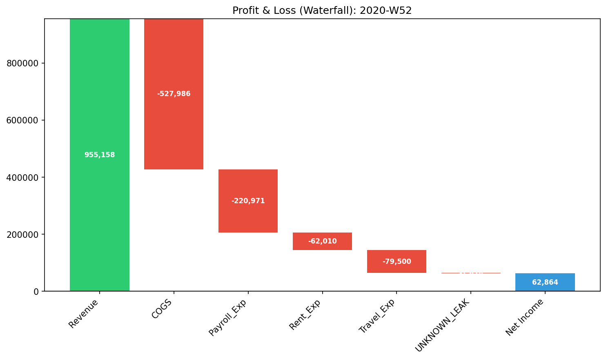
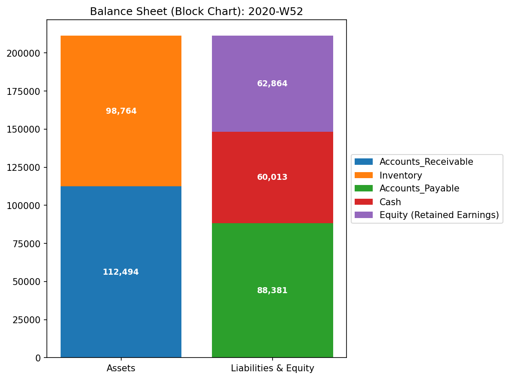

# Sample 2: 質量保存則違反・資金流出（Embezzlement / Mass Leak）

> [!NOTE]
> **概念実証実験にともなう免責事項**
> 本レポートで分析されるデータは実世界の企業のものではありません。検証を目的として、特定の病理学的状態を意図的に再現するために設計されたダミーデータです。本サンプル（Sample_2_Embezzlement_Leak）は、システム内から説明不能な資金が消失する「横領（Embezzlement）」や「片端入力の簿記ミス」が引き起こす物理的な質量欠損（Conservation Law Violation）を証明するためのものです。

---

# 🔬 メタ解析 統合レポート (Meta-Analysis Synthesis Report / Laboratory Findings)

## 1. エグゼクティブ・サマリー
本システム（金融ドメイン）は、**質量保存則違反（Conservation Violation）** を発症しており、極めて危険な状態（CRITICAL）にあります。複式簿記の原則である「借方と貸方の完全な一致」がトランザクションレベルで崩壊しており、システム内から総額 `$1,827.76` の物理的な質量（資金）が未知のノード（`UNKNOWN_LEAK`）へと消失しています。これは単なる集計エラーではなく、意図的な横領（現金の抜き取りと隠蔽）または致命的な業務プロセスの欠陥を示す物理学的証拠です。

## 2. 従来型会計分析との比較対照（Traditional vs TLU Perspective）

一般の監査読者向けに、第52週時点の「従来の財務諸表（B/S・P/L）」と「TLUの物理空間視点」の違いを比較します。

### 従来の財務諸表が捉える世界（静的なスナップショット）
**【第52週 損益計算書 (P/L) サマリー】**

* **売上収益:** $955,157.56
* **総費用:** $892,294.03（※ `UNKNOWN_LEAK` を含む）
* **当期純利益:** **+$62,863.53**

**【第52週 貸借対照表 (B/S) サマリー】**

* **総資産:** $211,258.12
* **負債・純資産合計:** $211,258.12
* **バランスチェック:** 一致

**【従来の監査の限界】**
従来の会計ソフトは、仕訳データの欠落や片端入力があった場合、一時的な「仮払金」や「使途不明金（UNKNOWN_LEAK）」として強制的にバランスを合わせてP/Lを算出してしまいます。結果として純利益は黒字（+$62,863.53）となり、一見すると事業は正常に回っているように見えます。静的なスナップショットだけでは、**システム自体に「穴」が空き、血（資金）が日常的に流れ出ているという動的な構造崩壊**を瞬時に視認することは困難です。

### TLUが捉える世界（動的な幾何学構造とエネルギー推移）
TLUは、上記の財務諸表を「グラフ上のノード（口座）とエッジ（取引）」のネットワークとして再構築し、システム全体の**質量保存則（System Conservation）**を監視します。

## 3. コア・パソロジー（主要な病理所見）
* **所見:** Unbalanced Journal Mistake (Conservation Violation)
* **重要度:** CRITICAL
* **物理的証拠:** 
  * 相対質量漏れ率 (Relative Leak Ratio): `0.0003` (正常閾値 `< 1e-6` を**突破**)
  * 最大絶対残差 (Max Absolute Residual): `407.89` (ピーク位置: 第5週)
  * 最大スペクトル半径 (Max Spectral Radius): `0.0000` (正常：ループは存在しない)

### 📊 異常系可視化プロファイル（病的構造の証明）

**1. 質量保存の基準（Macro Forensics）**

* **💡 異常系の読解:** 上段の「System Conservation Residual（質量の絶対残差）」のグラフにご注目ください。Sample_0（正常系）では完全に `0.0` の地平に張り付いていたこの線が、断続的にスパイク（最大 `407.89`）を記録しています。これは「流入したはずのエネルギー（資金）が、ネットワーク内のどこにも到達せずに消滅した」ことを示す、質量保存則崩壊の決定的な数学的署名です。

**2. ネットワークトポロジーの異常（System Stability / Spectral Radius）**

* **💡 異常系の読解:** 赤色の線「Max Spectral Radius」は `0.0` のままです。これは、Sample_1（循環取引）のような「資金の自己強化的なループ」は起きておらず、純粋にシステムの外へ資金が「一直線に漏れ出ている（ブラックホール化している）」だけであることを意味します。

## 4. ミクロ・フォレンジックによる最終証拠（Micro-Forensic Final Evidence）
* **自律調査の実行:** マクロ物理指標において「質量保存則違反（Leak Ratio > 0）」が明確に検出されたため、AIエージェントは自律的に基礎となる仕訳ストリーム (`Dummy_Journal_Stream_Amount.csv`) へドリルダウンし、質量欠損の原因となったアンバランス（片端）な仕訳を探索しました。
* **特定された証拠:**
`grep` によるトランザクション・レベルの追跡の結果、貸方（流出元）にのみ金額が記録され、借方（流入先）が存在しない以下の「Embezzlement_Leak」トランザクション群が特定されました。
  * **Event 1 (2020-01-27 / Week 5):**
    * `E_000213`: 売掛金（Accounts_Receivable）が `$335.84` 減少（回収）したと記録されているが、現預金（Cash）への流入額が `$0.0` となっている。
  * **Event 2 (2020-01-28 / Week 5):**
    * `E_000218`: 売掛金が `$72.05` 減少しているが、やはり現金への流入が `$0.0`。
  * **Event 3 (2020-02-27 / Week 9):**
    * `E_000535`: 売掛金 `$373.69` の減少に対し、現金流入 `$0.0`。
  * *(他多数、総額 $1,827.76 の消失を確認)*
* **最終結論:** これは単なるエラーではなく、「売掛金を回収した（または買掛金を支払った）ように見せかけ、その現金の実物を抜き取って着服する」という横領（Embezzlement）の典型的な手口、または基幹システムの致命的なデータ転送欠落です。

## 5. ⚠️ 反証可能性と検証要件（Falsification Analytics）
* **偽陽性の可能性:** TLUの物理エンジンは「仕訳データ上で貸借が一致していない（質量が消えている）」という数学的事実のみを検出しています。これが意図的な「横領（犯罪）」なのか、単なる「経理担当者の入力ミス（片端入力）」や「システム間のAPI連携エラーによるデータ欠落」なのかは、このデータだけでは断定できません。
* **追加検証要件:** 
  1. 上記で特定された取引ID（`E_000213`, `E_000535` 等）に関する実際の銀行口座の入出金明細（Bank Statements）と、販売管理システム上の消込記録を突き合わせてください。
  2. 現金出納帳と実際の金庫内の現金残高の実査（Cash Count）を直ちに実施し、物理的な現金が本当に消失しているかを確認してください。
