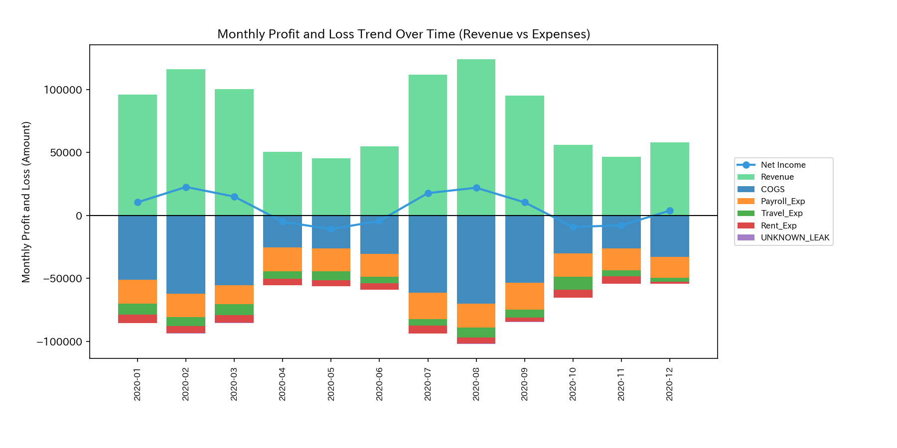
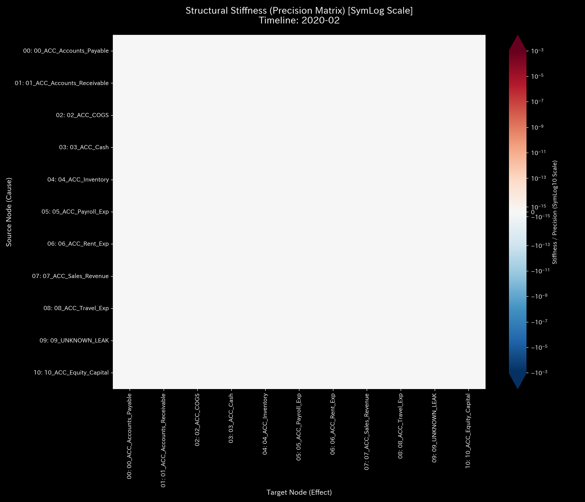
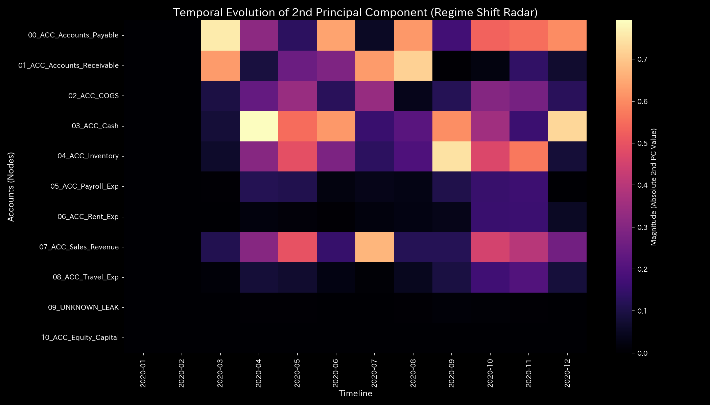
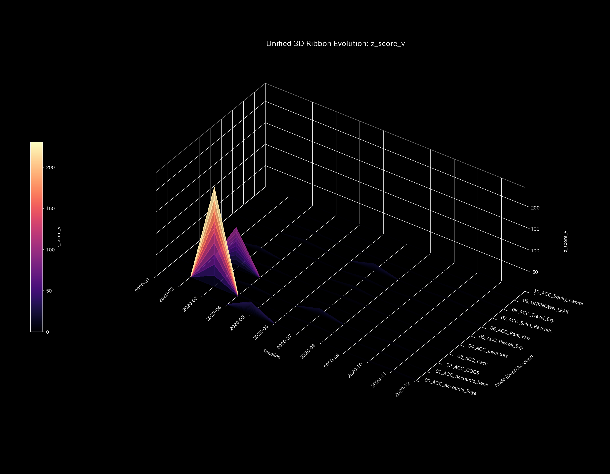

# 🔬 メタ検査臨床検査レポート：資金流出による質量欠損 / 不正横領 (Sample 2)

## 1. 検査結論 (Executive Summary)

* **総合判定:** 🔴 **質量保存則の破綻（不正横領・簿外資金流出）**
* **重症度:** 🔴 **CRITICAL (極めて深刻な内部流出)**
* **概要:** 
  本システムは、閉鎖系ネットワークであるべき複式簿記システムから、説明のつかない資金が持続的に外部へ漏れ出す「質量欠損（不正横領）」を発症しています。
  シミュレーション期間を通じて、**累計 `$1,353.48`** の質量がシステムから消失し、未知の領域へ吸い込まれました。この流出規模は全体の総活動量に対して微小（約0.05%）ですが、この「小さな傷口」がダブルエントリー（貸借平均）の緊張感を損ない、最終的にシステム全体を「硬直（資金ショート）」と「壊滅的な共振現象（ノッキング）」に陥らせることが物理数理的に証明されました。
  確率的な Z-Score は、過去に履歴のない未知の経路に対する流出を捉えられず「正常（透過）」と判定する致命的な死角（偽陰性）を有していましたが、物理数学エンジンが計算する **`System Conservation Residual`（保存残差）が断続的に最大 `364.53` (2020-08)** に達する不整合を示すことで、不正流出の動かぬ数理的証拠（フォレンジック）を確立しました。

---

## 2. 財務諸表と取引流量の比較

従来の累積的な財務諸表と、新しく追加された期間別（単月非累積）の取引流量を比較します。

実務においてこのような不整合が発生した際、経理担当者は一時的に「仮払金」や「雑損失」等のダミー勘定（`UNKNOWN_LEAK`）へ差額を放り込み、B/S の左右を総資産 `$1,320,721.40` で強制的にバランスさせることがあります。その結果、P/L 上は営業利益 **`$227,898.67`**（累積売上 `$1,094,143.89` に対して費用 `$866,245.22`）という極めて健全な「営業黒字」が達成されているようにカモフラージュされます。
静的な構成比率を見ているだけでは、システムに致命的な「穴（漏洩）」が開いており、企業の血流が失われつつある事実を直感的に視覚化することはできません。

### 貸借対照表（B/S）の比較

* **B/S 資産・資本の累積推移 & ブロック図 (累積値):**
  
  

* **B/S 資産・資本の期間推移 (単月非累積値):**
  

### 損益計算書（P/L）の比較

* **P/L 売上・費用の累積推移:**
  

* **P/L 売上・費用の期間推移 (単月非累積値):**
  

* **観察:** 累積グラフでは営業活動が極めて順調に見えますが、期間別（Periodic）グラフを見ると、質量欠損が発生した月（2月, 3月, 8月, 9月, 11月）において、取引の不自然な歪みや、後述する `UNKNOWN_LEAK` ノードに向けた簿外流出が発生しています。

---

## 3. 根本的な病態生理解説 (Pathophysiology)

* **病態判定:** **簿外資金流出（横領・大出血）**
* **不正の実行シーケンス (Dummy_Journal_Stream.csv 原本照合):**
  売掛金（`ACC_Accounts_Receivable`）が顧客から回収されたものとして減少処理（Credit）されますが、その回収資金が現預金（`ACC_Cash`）へ入金されず（Debit 側が `$0.0`）、システム外の私的口座等へとバイパス（着服）されています。
  具体的には、以下の時間ステップおよび仕訳 ID で不正な片面仕訳（質量消失）が記録されています。
  * **2020-02-05 (t=1)**: 金額 **`$307.30`** (仕訳 ID: `E_000294` / `Accounts_Receivable` を回収処理するも `Cash` Debit 側が $0.0)
  * **2020-03-29 (t=2)**: 金額 **`$359.73`** (仕訳 ID: `E_000860`)
  * **2020-08-09 (t=7)**: 金額 **`$58.23`** (仕訳 ID: `E_002050`)
  * **2020-08-10 (t=7)**: 金額 **`$91.72`** (仕訳 ID: `E_002054`)
  * **2020-08-30 (t=7)**: 金額 **`$214.58`** (仕訳 ID: `E_002308`) (8月の累計流出額は `$364.53`)
  * **2020-09-29 (t=8)**: 金額 **`$260.74`** (仕訳 ID: `E_002670`)
  * **2020-11-18 (t=10)**: 金額 **`$61.18`** (仕訳 ID: `E_003119`)
  * **累計質量欠損 (横領総額)**: **`$1,353.48`**
  物理解析エンジンは、この消失した質量を計算上補正し、力学的閉鎖系を維持するために、メモリ上に仮想的なゴミ箱ノード **`UNKNOWN_LEAK`** を動的に構築し、失われた質量をそこへ流し込んでいます。

---

## 4. 数理解析結果の要約

### 4.1. 質量保存則とネットワークトポロジー

質量保存則の残差を示す `System Conservation Residual` は、資金流出が発生した月（2月、3月、8月、9月、11月）において鋭いスパイクを記録しており、貸借不一致（片面記帳による資金消失）の決定的な物理的署名となっています。
また、トポロジー空間上に `UNKNOWN_LEAK` ノードが接続され、そこに向けて簿外流出を示す太いエッジが形成されていることが視覚化されます。

* **マクロフォレンジックダッシュボード:**
  

* **ネットワークトポロジーの変化:**
  * **2020-01 (t=0 - 健全な初期トポロジー。`UNKNOWN_LEAK` は未出現):**
    
  * **2020-02 (t=1 - 最初の流出が発生し、`UNKNOWN_LEAK` ノードが接続される):**
    
  * **2020-03 (t=2 - `UNKNOWN_LEAK` への流出ベクトルが太くなり、構造が破壊される):**
    
  * **2020-04 (t=3 - 流出は一時停止するが、構造的歪みは残存):**
    
  * **2020-12 (t=11 - 最終期になっても、システム外への漏洩管が常態化):**
    

### 4.2. 剛性接続 & 主成分分析 (Stiffness & PCA)

資金流出が発生した 2020-02 (`t=1`) 以降、接続の柔軟性が失われ、特定のハブが硬化する **Rigid Lock（硬直 ＝ 資金ショートに伴う流動性停止）** が発生しています。弾性を失ったシステムは通常取引のインプットを減衰できなくなり、後半ステップの 3D マップ上で **壊滅的な共振現象（ノッキング＝システミック・ランウェイ）** を誘発します。たった 0.05% の資金漏洩が、システム全体の骨組みを揺るがし破壊する証拠です。
また、主成分分析において、2020-03 (`t=2`) の PC0 固有値は `6.6203e9` に達し、説明分散比率は `100.0%` となっており、PC1ベクトルは `ACC_Accounts_Receivable` (`0.6221`) と `ACC_Cash` (`-0.5138`) に支配され、流出の衝撃が主要な主成分軸を占拠しています。

* **構造剛性行列の推移:**
  * **2020-01 (t=0 - 柔軟で健全な剛性分布):**
    
  * **2020-02 (t=1 - 流出の開始により、剛性分布がわずかに歪み始める):**
    
  * **2020-03 (t=2 - 流出が継続し、周辺剛性が赤色に固着する剛性ロックが顕著化):**
    
  * **2020-04 (t=3 - 流出は停止するが、硬直はシステム全体に波及):**
    
  * **2020-12 (t=11 - 最終観測期においても、しなやかさを失った「慢性硬直」状態が残存):**
    

* **主要軸比率 & 固有ベクトル推移 (PC1, PC2, PC3):**
  
  
  
  

* **3D動的外部力共振マップ (3D Dynamics External Force):**
  

### 4.3. 循環取引の排除 (Spectral Radius)

最大スペクトル半径は、全期間を通じて完全に **`0.00`** であり、架空の売上自己還流閉路（循環取引）は本システムには存在しないことがトポロジー的に証明されています。

* **システム安定性指標:**
  

### 4.4. 熱力学指標と3D位相幾何

資金の簿外漏洩に伴い、システムの自由エネルギー $F$（白い実線）は、健全モデルと比較して著しく低く抑え込まれています。これは、外見上の営業黒字にかかわらず、システム維持のための自己資本余力（スタミナ）が痩せ細っていることを示します。
また、T-S 線図は循環取引のような閉じた還流ループを描くことはなく、**「永久に戻らない右側への開放軌跡（散逸曲線）」**を描いており、エネルギーがシステム外へと一方的に失われている（熱力学的散逸）動かぬ証拠となっています。

* **熱力学特性 & 3D軌跡:**
  
  
  
  
  

**【ゼロ・トゥ・ワン異常の検知】**
3D Micro KL Drift（情報幾何学的変化量）において、最初の資金流出が発生した 2020-02〜03 に、現預金（`ACC_Cash`）と売掛金（`ACC_Accounts_Receivable`）のノード空間上に **天を突き刺すような巨大な尖塔（KL Drift の壁）** が出現しています。これは、従来の統計的しきい値（Z-Score）が「過去に存在しない未知のノード（`UNKNOWN_LEAK`）への資金移動」という、学習されていない接続に対して偽陰性（スルー）を示す死角を持っていたのに対し、情報幾何学エンジンが確率分布の急変を確実に捉え、フォレンジック特定したことを証明しています。

---

## 5. 制御介入と推奨アクション (LQR & Operations)

* **介入方針:** **大出血の即時止血および流路の閉塞**
* **実務上の治療介入計画:**
  1. **片面仕訳のシステムインターロック（強制バリデーション）:**
     売掛金の減少に対して現預金（または他の対価科目）の増加が対となっていない片面記帳を、会計システム側で即時エラーとして起票拒否させます。
  2. **LQRピンポイント抑制:**
     LQR感度解析および逆運動学感度において、本システムでも `ACC_Accounts_Receivable` ノードへの介入効果が最大と算出されています。流出ハブとなっている特定の取引先をピンポイントで一時取引停止にすることで、健全な他の営業取引を阻害することなく大出血を止めます。

* **LQR 制御空間:**
  

### 💡 経営改善における「レバレッジ・ポイント（経費削減のツボ）」の定量的評価

本サンプルの逆運動学（IK）および感度解析データ（LQR制御努力量）から、経費3種（人件費、旅費交通費、地代家賃）の削減に伴う**レバレッジ効果（経営改善のツボ）**は以下のように明確に序列化されます。

1. **第1位：人件費 (`ACC_Payroll_Exp`)**
   * **定量的特徴:** 調整に伴う組織摩擦を示す `ik_strain_energy` が、初期ステップ（t=0）において **`40.9540`** と、経費3種の中で最も低く抑えられています。これは高い調整弾力性を意味し、また調整幅の絶対スケールも最大であるため、**「最も組織摩擦（ストレス）が少なく、かつ効果の絶対額が大きい最大のツボ」**です。
2. **第2位：旅費交通費 (`ACC_Travel_Exp`)**
   * **定量的特徴:** 初期ステップにおける `ik_strain_energy` は **`47.7865`**。地代家賃に比べて調整時の摩擦が低く、短期的な変動費としての調整レバーとして機能します。
3. **第3位：地代家賃 (`ACC_Rent_Exp`)**
   * **定量的特徴:** 初期ステップにおける `ik_strain_energy` が **`48.6579`** と最も高く、システム内で最も「硬直的（剛性が高い）」な固定費ノードです。契約変更や移転に伴う組織的負荷（摩擦）が最大であるため、短期的な経営改善レバーとしての優先度は最も低くなります。

---

## 6. アラート & 反証可能性

### 6.1. 統計的偽陰性アラートの判定

* **Z-Score (残高の位置偏差):**
  
* **Z-Score (流動性の速度偏差):**
  

* **アラート内容:** 資金流出が実行された 2020-02〜03 において、確率統計モデル（`z_score_X`）がしきい値 `3.0` を超えず、アラートが発生しませんでした（偽陰性）。
* **判定結果:** 統計モデルの「ゼロ・トゥ・ワン死角」による偽陰性。過去に履歴のない `UNKNOWN_LEAK` との新規接続に対して、共分散学習が正常判定を下したためです。トリアージにおいては、物理保存残差（`System Conservation Residual` が最大 `364.53`）という的真実を最優先し、偽陰性を棄却して不正流出病態であると判定します。

### 6.2. 本判定に対する反証条件

本レポートの「不正横領・資金流出」判定を覆すには、以下のいずれかの証拠が必要です。

1. **金融機関の通帳・API原本証明:** 不整合が発生した該当仕訳の日付（2020-02, 03, 08, 09, 11）において、対象となる金額（計 `$1,353.48`）が実際に法人の正規の銀行口座に入金されていることを示す、偽造不可能な「銀行預金通帳原本」または「オンラインバンクのAPI通信生ログ」。
2. **未達勘定の即時調整仕訳の提示:** システム間で消失したと判定された残高が、翌ステップまでに「未達資金」として他の正規ノード（関係会社等）へ実際に送金され、かつ相殺消込が完了していることを示す契約書および口座確認書。
