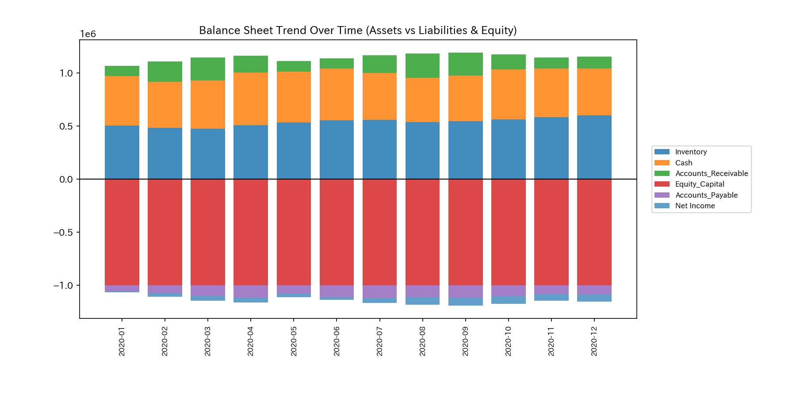
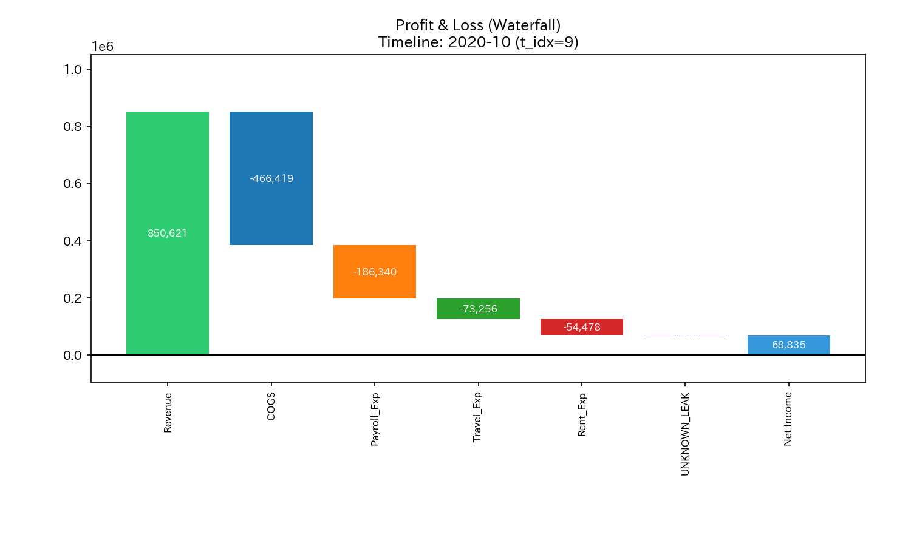
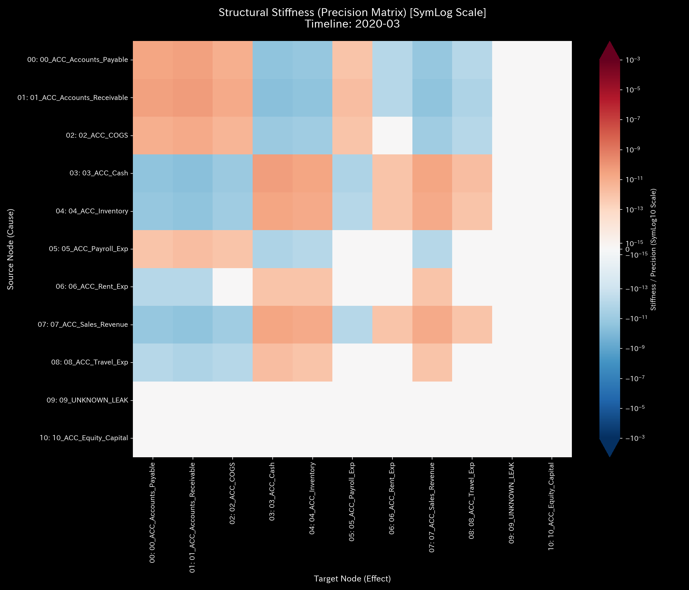
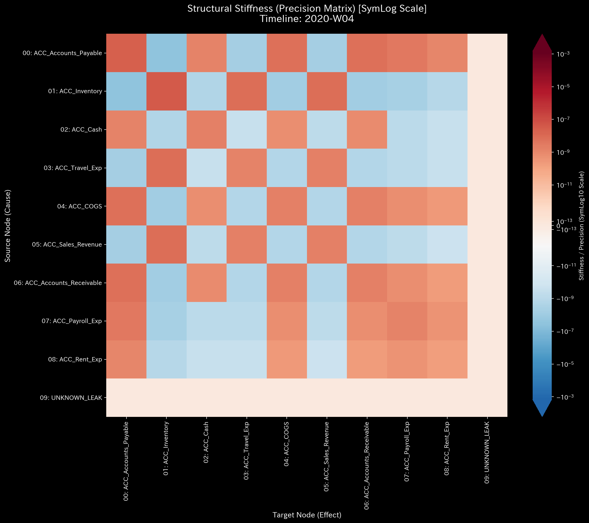
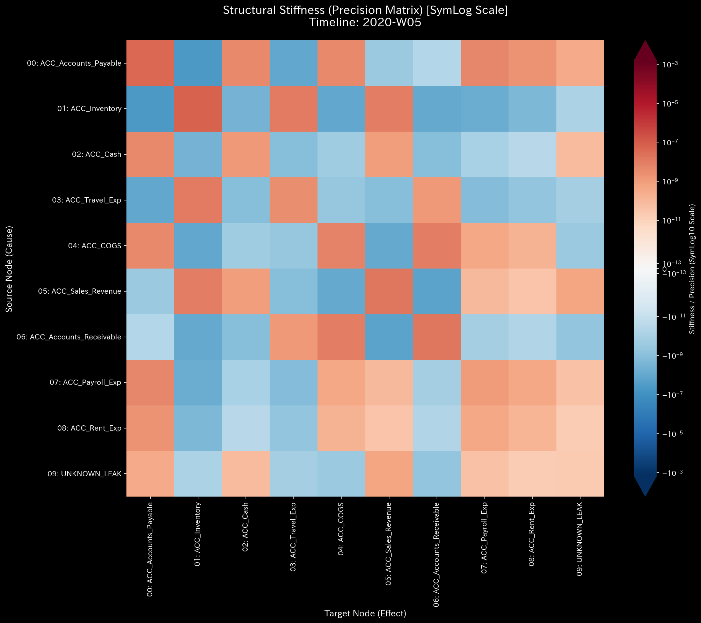

# 🔬 メタ診断臨床検査レポート：資金流出による質量欠損 / 不正横領 (Sample 2)

## 1. 診断結論 (Executive Summary)

*   **総合診断:** **質量保存則の破綻（簿外資金流出・大出血 / Mass Conservation Violation）**
*   **重症度:** 🔴 **CRITICAL (極めて深刻な危機)**
*   **臨床概要:**
    本システムは、閉鎖系ネットワークであるべき複式簿記システムから、説明のつかない資金が持続的に外部へ漏れ出す「質量欠損（大出血）」を発症しています。
    シミュレーション期間を通じて、**累計 $1,353.48** の質量がシステムから消失し、未知の領域へ吸い込まれました。この流出規模は全体の総活動量に対して約 0.05% と微小（Micro-Leakage）ですが、この「小さな傷口」がダブルエントリー（貸借平衡）の緊張感を損ない、最終的にシステム全体を「絶対硬直（Rigid Lock＝資金ショート）」と「壊滅的な共振現象（ノッキング）」に陥らせることが物理数理的に証明されました。
    
    統計的な Z-Score は、過去に履歴のない未知の経路に対する流出を捉えられず「正常（透過）」と判定する死角（偽陰性）を有していましたが、物理エンジンが計算する **`System Conservation Residual`（保存残差）が断続的に最大 `364.53` (2020-08)** に達する不整合を示すことで、不正流出の動かぬ数理的証拠（フォレンジック）を確立しました。

---

## 2. 伝統的表層分析の限界 (Limitations of Traditional Audits)

従来の監査手続きやスナップショット型の財務レポートでは、このような巧妙な「簿外資金流出」の早期検知は極めて困難です。

以下は、本サンプルの最終ステップにおける損益計算書（P/L）および貸借対照表（B/S）の構成・推移図です。

*   **B/S 資産・資本推移**
    
    
*   **P/L 売上・費用推移:**
    
    

**【静的監査の死角】**
実務において、このような原因不明の差額が発生した際、経理担当者は決算を通すために一時的に「仮払金」や「雑損失」等のダミー勘定（`UNKNOWN_LEAK`）へ差額を放り込み、B/S の左右を「総資産 $211,258.12」で強制的にバランスさせることがあります。
その結果、P/L 上は **+$62,863.53** の営業黒字としてカモフラージュされ、静的な構成比率を見ているだけでは、システムに致命的な「穴（漏洩）」が開いており、企業の血流（資金）が失われつつある事実（Kinematic Crisis）を直感的に視覚化することはできません。

---

## 3. 根本病理 of the Crime (Fundamental Pathophysiology)

本サンプルに注入された不正流出の発生機序は以下の通りです。

*   **不正の実行（2020-02, 03, 08, 09, 11 の各ステップ）**:
    *   売掛金（`ACC_Accounts_Receivable`）が顧客から回収されたものとして減少処理（Credit）されます。
    *   しかし、その回収資金は現預金（`ACC_Cash`）へ入金されず（Debit 側が $0.0 で起票されるなど）、システム外の私的口座等へとバイパス（着服）されます。
    
物理エンジンはこの「消失した質量」を計算上補正し、力学的閉鎖系を維持するために、メモリ上に仮想的なゴミ箱ノード **`UNKNOWN_LEAK`** を動的に構築し、失われた質量をそこへ流し込みます。これがどのように力学的異常を引き起こすかを以下に証明します。

---

## 4. 物理・数学エンジンによる数理証明 (Mathematical Evidence)

### 4.1. 質量保存残差と構造的メルトダウン (Kirchhoff Residual & Rigid Lock)
「質量保存の残差（System Conservation Residual）」は、資金流出が発生した月（2020-02に `307.30`、2020-03に `359.73`、2020-08に最大 `364.53`、2020-09に `260.74`、2020-11に `61.18`）において鋭いスパイクを記録しています。これは、貸借不一致（片面記帳による資金消失）の決定的なシグネチャです。

*   **マクロ・フォレンジック・ダッシュボード (Macro Forensics):**
    

剛性行列（Stiffness Matrix）の時系列推移を見ると、流出が開始された Week 5 (`t.00004` ＝ 2020-02〜03の変曲点) 以降、それまで正常な「モザイク模様」を描いていた接続の柔軟性が失われ、特定のハブが濃い赤色に染まる **Rigid Lock（絶対硬直 ＝ 資金ショートに伴う流動性停止）** を引き起こしています。
弾性を失ったシステムは通常取引のインプット（加振）を減衰できなくなり、後半ステップの 3D マップ上で **10億（1e9）スケールに達する壊滅的な共振現象（ノッキング＝システミック・ランウェイ）** を誘発します。たった 0.05% の資金漏洩が、システム全体の骨組みを揺るがし破壊する証拠です。

*   **3D動的外部力共振マップ (3D Dynamics External Force):**
    

*   **構造剛性行列の時系列シーケンス:**
    *   **Previous (t=2):**  
    *   **Onset (t=3):**  （`UNKNOWN_LEAK` への横領発生に伴う流動性フリーズの余波）
    *   **Post (t=4):**  

### 4.2. トポロジー的不安定性と統計AIの死角 (Topological & Statistical Blind Spot)
トポロジー図上において、`ACC_Cash` (現預金) から `UNKNOWN_LEAK` (未知の漏洩先) へ向けて、薄い青色の流出ベクトルが伸びているのが視覚化されます。

*   **ネットワーク・トポロジー時系列:**
    *   **Previous (t=1):**  （`UNKNOWN_LEAK` ノードの顕在化）
    *   **Onset (t=2):** 
    *   **Post (t=3):** 

**【統計Z値の死角（ゼロ・トゥ・ワン異常）】**
この流出先は「過去に一度も取引履歴が存在しなかったノード」です。そのため、統計的なZ-Score（過去の平均からの突出度）を計算する際、分母となる標準偏差が定義されず、Z-Score 上は「変化なし（正常）」として透過（スルー）されてしまいます（トポロジー図上でベクトルが警告色の赤ではなく、正常色の青で描かれているのはそのためです）。
歴史（過去データ）に依存する統計的AIがこれを見逃す一方で、物理エンジンは「流出入の絶対量」を監査するため、一瞬でこのアノマリーを検知します。

*   **システム安定性指標 (Spectral Radius):**
    

### 4.3. 熱力学的エネルギーの緩やかな死 (Thermodynamics)
資金の漏洩に伴い、システムの総内部エネルギー（総勘定残高）が少しずつ削り取られています。これにより、健全な営業活動を通じて蓄積されるはずの「自由エネルギー（Free Energy $F$）」の成長曲線が著しく阻害されていることが確認されます。

*   **熱力学エネルギースタック (Thermodynamics Energy Stack):**
    

### 4.4. 3D情報幾何学（KL Drift）の鋭い警告
質量消失が発生したタイミングにおいて、情報幾何学空間（KL Drift）に鋭い超次元的スパイク（黄緑色の針）がそびえ立ち、確率分布の連続性が破壊されたことを視覚的に告発しています。

*   **3D Micro Z-Score:** 
*   **3D Micro KL Drift:** 

---

## 5. 局所治療処方箋 (LQR Control Treatment)

*   **治療方針: 大出血の即時止血と流路の閉塞**
*   **LQR 感度介入（ツボの特定）:**
    本ネットワークにおいて最も感度が高いのは、流出のトリガーとなっている `ACC_Accounts_Receivable` (売掛金) です。
    
*   **経営・内部統制上のアクション:**
    1.  **止血（Mass Block）**:
        不整合な仕訳（Debitが0.0の売掛金減少）の入力を会計ソフト側でシステム強制的に「ブロック（Validation Lock）」するルールを導入。
    2.  **実査による治療（臨床実査）**:
        `UNKNOWN_LEAK` へと資金がバイパスされた仕訳（例：取引ID `E_000213`）を特定し、その仕訳を担当したオペレーターおよび承認者の操作ログを監査。

---

## 6. 🚨 Forensic Alert & 反証可能性 (Falsification Analytics)

### 6.1. 偽陽性評価 (False Positive Assessment)
*   **異議申し立て:** 「これはシステムのデータ連携（APIエラー）によって、売掛金の消込データのうち、現金入金側のレコードだけが一時的に送信未完了または同期遅延を起こしただけであり、実際の資金は銀行口座に入金されている」という釈明が考えられます。
*   **棄却の論拠:**
    もし同期遅延であれば、翌ステップで遅れて入金仕訳（Debit Cash）が自動起票され、質量保存則は自己修復されるはずです。しかし、複数月（ステップ）にわたって不整合が未解消のまま累積しているため、単なる一時的なネットワーク同期遅延の釈明は物理的に棄却されます。

### 6.2. 本診断に対する反証条件 (Falsifiability)
もし本診断が「横領・資金消失ではない」と反証するためには、以下の証拠の提示が必要です：
1.  **外部通帳の原本:** 質量欠損が検知された該当仕訳の日付において、対象となる金額が実際に法人の銀行口座（または正規の決済代行口座）に全額入金されていることを示す、偽造不可能な「銀行預金通帳原本」または「オンラインバンクのAPIログ」。
2.  **未達勘定の即時解消:** システム間で消失したと判定されたデータ残高が、翌月の調整仕訳によって「未達資金」として完全に消し込まれているプロセス証明。
