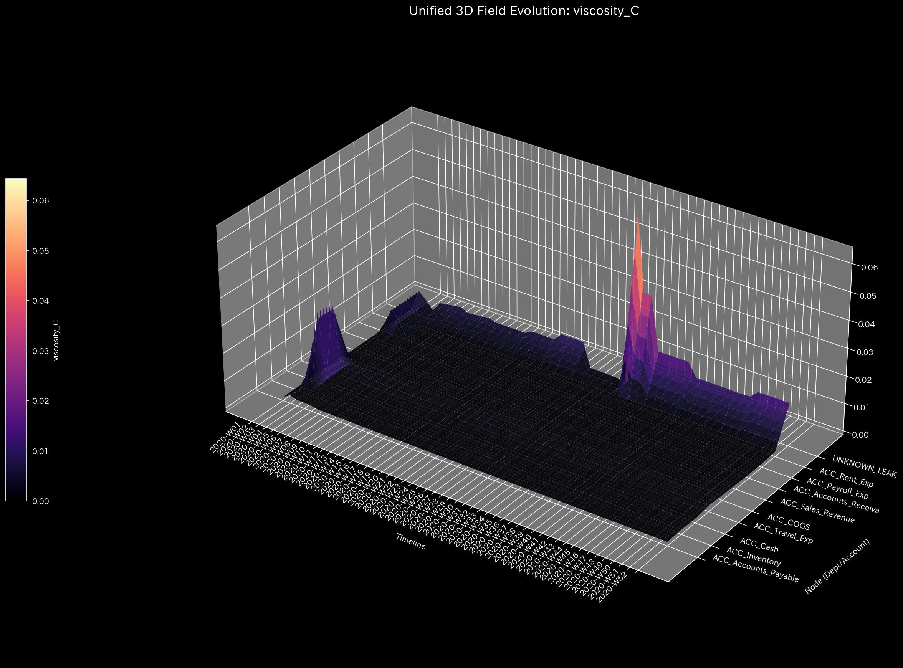

# Sample 2: 資金流出による、貸借一致の原則の崩壊（Embezzlement / Mass Leak）

> [!NOTE]
> **概念実証実験にともなう免責事項**
> 本レポートで分析されるデータは実世界の企業のものではありません。検証を目的として、特定の病理学的状態を意図的に再現するために設計されたダミーデータです。本サンプル（Sample_2_Embezzlement_Leak）は、システム内から説明不能な資金が消失する「横領（Embezzlement）」や「片端入力の簿記ミス」が引き起こす物理的な質量欠損（Conservation Law Violation）を証明するためのものです。

---

# 🔬 メタ解析 統合レポート (Meta-Analysis Synthesis Report / Laboratory Findings)

## 1. エグゼクティブ・サマリー

本システム（金融ドメイン）は、**貸借一致の原則の違反（Conservation Violation）** を発症しており、極めて危険な状態（CRITICAL）にあります。貸借一致の原則である「借方と貸方の完全な一致」がトランザクションレベルで崩壊しており、システム内から総額 `$1,827.76` の物理的な質量（資金）が未知のノード（`UNKNOWN_LEAK`）へと消失しています。これは単なる集計エラーではなく、意図的な横領（現金の抜き取りと隠蔽）または致命的な業務プロセスの欠陥を示す物理学的証拠です。

## 2. 従来型会計分析との比較対照（Traditional vs TLU Perspective）

一般の監査読者向けに、第52週時点の「従来の財務諸表（B/S・P/L）」と「TLUの物理空間視点」の違いを比較します。

### 従来の財務諸表が捉える世界（静的なスナップショット）

**【第52週 損益計算書 (P/L) サマリー】**

* **売上収益:** $955,157.56
* **総費用:** $892,294.03（※ `UNKNOWN_LEAK` を含む）
* **当期純利益:** **+$62,863.53**

**【第52週 貸借対照表 (B/S) サマリー】**

* **総資産:** $211,258.12
* **負債・純資産合計:** $211,258.12
* **バランスチェック:** 一致

**【従来の手法に対するTLUの補完的価値】**
実務上、原因不明の差異は一時的な「仮払金」や「使途不明金」として処理し、後日調査に回すことが一般的です。しかし、システムが巨大化すると、この一時的な処理の影に構造的な流出が埋もれてしまうリスクがあります。結果として純利益は黒字（+$62,863.53）となり、一見すると事業は正常に回っているように見えます。静的なスナップショットだけでは、**システム自体に「穴」が空き、血（資金）が日常的に流れ出ているという動的な構造崩壊**を瞬時に視認することは困難です。

### TLUが捉える世界（動的な幾何学構造とエネルギー推移）

TLUは、上記の財務諸表を「グラフ上のノード（口座）とエッジ（取引）」のネットワークとして再構築し、システム全体の**質量保存則（System Conservation）**を監視します。

## 3. 中核と見なせる病跡（主要な病理所見）

* **所見:** Unbalanced Journal Mistake (Conservation Violation)
* **重要度:** CRITICAL
* **物理的証拠:**
  * 相対質量漏れ率 (Relative Leak Ratio): `0.0003` (正常閾値 `< 1e-6` を**突破**)
  * 最大絶対残差 (Max Absolute Residual): `407.89` (ピーク位置: 第5週)
  * 最大スペクトル半径 (Max Spectral Radius): `0.0000` (正常：ループは存在しない)

### 📊 異常系可視化プロファイル（病的構造の証明）

**1. 質量保存の基準（Macro Forensics）**

* **💡 異常系の読解:** 上段の「System Conservation Residual（質量の絶対残差）」のグラフにご注目ください。Sample_0（正常系）では完全に `0.0` の地平に張り付いていたこの線が、断続的にスパイク（最大 `407.89`）を記録しています。これは「流入したはずのエネルギー（資金）が、ネットワーク内のどこにも到達せずに消滅した」ことを示す、質量保存則崩壊の決定的な数学的署名です。

**2. ネットワークトポロジーの異常（System Stability / Spectral Radius）**
**【位相幾何学構造 (Network Topology / 第5週 異常発生時)】**

**【スペクトル半径 (System Stability)】**

* **💡 異常系の読解:** 赤色の線「Max Spectral Radius」は `0.0` のままです。これは、Sample_1（循環取引）のような「資金の自己強化的なループ」は起きておらず、純粋にシステムの外へ資金が「一直線に漏れ出ている（ブラックホール化している）」だけであることを意味します。

**3. 構造的剛性 (Structural Stiffness / Precision Matrix)**
*(上: Week 4 発生前 ／ 中: Week 5 発生時 ／ 下: Week 6 発生後)*

* **💡 異常系の読解 (Before/Afterの視覚的差分):** 人間の視覚は「変化（差分）」に対して極めて敏感です。Week 4 の時点では `UNKNOWN_LEAK` の行・列は完全に無色（白色: 0.0）ですが、Week 5 で横領が発生した瞬間に、その交点に強烈な色（構造的剛性の変異）が灯ります。この「静から動への不連続な遷移」を比較観察することで、プロフェッショナルは直感的に異常発生の瞬間を捉えることができます。

**4. 熱力学ダッシュボード（Thermodynamics Energy Stack）**

* **💡 異常系の読解:** 質量保存則が破綻し資金が漏れ出しているため、システム本来の内部エネルギー（純残高）が少しずつ削り取られ、自由エネルギーの成長が阻害されている（あるいは意図せぬ歪みが生じている）様子が観察されます。

## 4. ミクロ・フォレンジックによる最終証拠（Micro-Forensic Final Evidence）

**【3D マイクロ・フォレンジック (Z-Score Surface)】**

* **💡 異常系の読解:** 「$0.0（あるべき資金がない）」という「無」を可視化することは通常困難ですが、TLUはこれを「UNKNOWN_LEAK という未知のノードへの質量移動」として幾何学的に反転させます。上記の3Dサーフェスでは、特定のノード（UNKNOWN_LEAK）において、第5週や第9週といった犯行の初期タイミングで、周囲とは完全に切り離された「異次元の鋭いスパイク（黄緑色）」が突き出ているのが視認できます。これが消えた資金の最初の痕跡です。

**【3D マイクロ・フォレンジック (Kinematic Viscosity / 粘性摩擦)】**

* **💡 異常系の読解 (統計的「慣れ」を暴く物理的摩擦):**
Z-Scoreのグラフでは第5週・第9週の初期の横領のみが強調され、第30週以降のグラフはフラットになっていました。これはシステムが「横領状態」を学習し、異常を異常と感じなくなった（モデル汚染）ためです。
しかし、過去の確率分布に依存せず、その瞬間の**物理的な流速変化（摩擦）**を絶対評価するこの「Viscosity（粘性）」のグラフでは、Z-Scoreが見逃した第35週〜第40週付近に、全ノード中で最大となる巨大なオレンジ色のスパイクが屹立しています。これは犯人が短期間に横領額を吊り上げ（ $58 \to $91 \to $214 \to $260 ）、連続的に資金を抜き取ったことによる**激しい物理的乱流（摩擦熱の爆発）**を精緻に捕捉したものです。

* **自律調査の実行:** マクロ物理指標において「貸借一致の原則の違反（Leak Ratio > 0）」が明確に検出されたため、AIエージェントは自律的に基礎となる仕訳ストリーム (`Dummy_Journal_Stream_Amount.csv`) へドリルダウンし、質量欠損の原因となったアンバランス（片端）な仕訳を探索しました。

* **特定された証拠:**
`grep` によるトランザクション・レベルの追跡の結果、貸方（流出元）にのみ金額が記録され、借方（流入先）が存在しない以下の「Embezzlement_Leak」トランザクション群が特定されました。

**【💡 TLUの自律的な質量補完ロジック（UNKNOWN_LEAKの正体）】**
TLUの前処理エンジンは、グラフ理論と熱力学の計算を成立させる（閉鎖系を維持する）ため、生の仕訳データに対して以下の物理的マス・バランス・チェックを自律的に実行しています。

1. **トランザクション集計:** 取引IDごとに貸方（流出）と借方（流入）の総額をマクロに集計する。
2. **質量の欠損検知:** 横領のように「流入先（借方）が $0.0 と記録されることによる質量の欠損（アンバランス）」を数学的に検知する。
3. **特異点の動的生成:** 消滅した質量を吸収するためのブラックホールとして **`UNKNOWN_LEAK` というノードをメモリ上に動的に生成**し、消失した差額分をそこに強制的に流し込む。

先ほどのトポロジー図や3Dサーフェスグラフにおける「周囲から切り離された異常なスパイク」は、まさにこの前処理エンジンが「宇宙の果てに消えかけた質量」を捕獲し、特設ノードに蓄積させた物理的痕跡（犯罪の可視化）なのです。

* **Event 1 (2020-01-27 / Week 5):**
  * `E_000213`: 売掛金（Accounts_Receivable）が `$335.84` 減少（回収）したと記録されているが、現預金（Cash）への流入額が `$0.0` となっている。
* **Event 2 (2020-01-28 / Week 5):**
  * `E_000218`: 売掛金が `$72.05` 減少しているが、やはり現金への流入が `$0.0`。
* **Event 3 (2020-02-27 / Week 9):**
  * `E_000535`: 売掛金 `$373.69` の減少に対し、現金流入 `$0.0`。
* *(他多数、総額 $1,827.76 の消失を確認)*

* **最終結論:** これは単なるエラーではなく、「売掛金を回収した（または買掛金を支払った）ように見せかけ、その現金の実物を抜き取って着服する」という横領（Embezzlement）の典型的な手口、または基幹システムの致命的なデータ転送欠落です。

## 5. ⚠️ 反証可能性と検証要件（Falsification Analytics）

* **偽陽性の可能性:** TLUの物理エンジンは「仕訳データ上で貸借が一致していない（質量が消えている）」という数学的事実のみを検出しています。これが意図的な「横領（犯罪）」なのか、単なる「経理担当者の入力ミス（片端入力）」や「システム間のAPI連携エラーによるデータ欠落」なのかは、このデータだけでは断定できません。
* **追加検証要件:**
  1. 上記で特定された取引ID（`E_000213`, `E_000535` 等）に関する実際の銀行口座の入出金明細（Bank Statements）と、販売管理システム上の消込記録を突き合わせてください。
  2. 現金出納帳と実際の金庫内の現金残高の実査（Cash Count）を直ちに実施し、物理的な現金が本当に消失しているかを確認してください。
