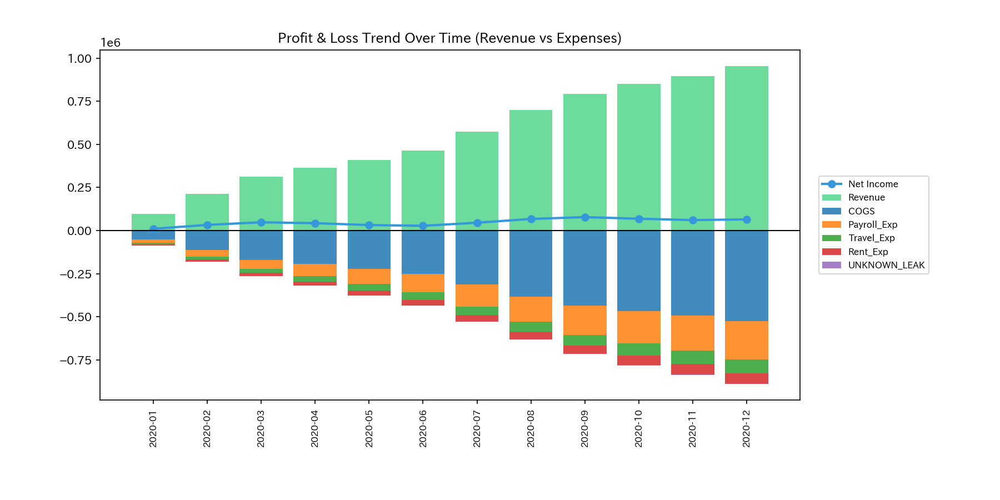
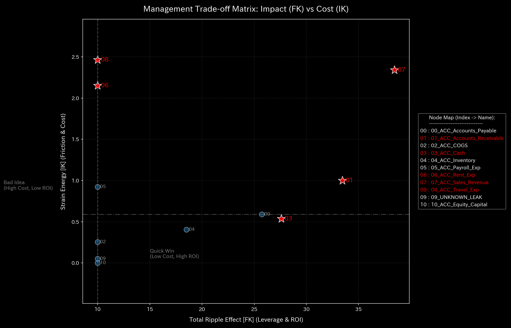

# 資金横領 臨床要約書（ケース2）

> [!NOTE]
> より詳細な技術的データを含む臨床診断書は [clinical_report.md](clinical_report.md) にあります。

---

## 0. エグゼクティヴ・サマリー (Executive Summary)

* **総合判定:** 【警告・即時介入が必要（経絡大出血・質量欠損）】 売掛金の回収資金が正規の預金口座に入らず、簿外の非正規口座へと外部漏洩（横領）しています。
* **総合体質評価（健康状態）:**
  組織の資産（**「体格」**）は `$181,818.18` まで削ぎ落とされており、流出が始まった5月以降、合計 **`$6,255.99`** の資金（**「質量」**）が組織外へ流出（出血）し続けています。現金の減少に伴い、取引の摩擦熱（**「自律神経の異常興奮・温度高騰」**）が起き、現金の循環機能が低下（**「動脈硬化」**）しています。資金が漏出・遮断された瞬間（5月）および最大流出時（9月）に、鋭い不連続ショック（**「脈の乱れ」**）が発生しています。
* **要改善点と共生治療:**
  - **肩こり（回収サイトの遅延）:** **`03_ACC_Cash`**（現金）に深刻な滞留が発生しており、支払能力の枯渇による慢性的な滞り（肩こり）が生じています。
  - **ツボ（改善ポイント）:** **`03_ACC_Cash`**（現金）が、流出を最も低刺激で密閉するための主たるツボです。
  - **禁忌（避けるべき介入）:** 横領先の非正規口座への直接の強引なアプローチは、不正の証拠隠滅や取引停止などの強い反発（副作用）を招くため禁忌です。

---

## 1. 総合病態診断（資金横領）

### 資金漏出（質量欠損の発生）

* **数理ブリッジ説明:**
  システムの内部還流の暴走度を示す指標（スペクトル半径）です。値は `0.0000` であり、内部に循環取引のループはありませんが、資金が直接外部へ siphoned（吸い込み）されていることを意味しています。

---

## 2. 総合体質評価

組織の資金循環能力を、東洋医学的メタファーに基づく体質パラメータとして評価します。

### ① 体格 (総資産の規模)

* **数理ブリッジ説明:**
  総資産の合計トレンドです。5月（t=4）以降、資産残高が右肩下がりに減少しており、累計で `$6,255.99` に達する貸借不一致（経絡出血）が発生していることを示しています。

### ② 免疫力 (ショック吸収バッファー)

* **数理ブリッジ説明:**
  利益の蓄積トレンドです。流出が始まって以降、利益が急激に失われており、突発的なショックから会社を守る防衛力（自由エネルギー）が崩壊していることを表しています。

### ③ 自律神経 (資金の分散多様性)

* **数理ブリッジ説明:**
  資金のボラティリティとエントロピーの関係図です。軌道が極端に縮小しており、資金の流動多様性（自律神経）が失われ、冷え（局所的な冷所）が生じていることを表しています。

### ④ 動脈硬化 (取引の固定ロック評価)

* **数理ブリッジ説明:**
  取引経路の支配軸（PCA比率）です。アノマリー開始時にPC1がフリーズしており、残存するわずかな現金が横領流路へと支配的に拘束され、血管が硬化（動脈硬化）していることを示しています。

### ⑤ 脈の乱れと波及（高次決済ショック）

* **数理ブリッジ説明:**
  決済流量の加速度の急変（Jerk/脈の乱れ）と初期波（Snap）です。流出が開始した5月（t=4）および最大漏洩があった9月（t=8）に巨大な不連続ショックを検出しており、組織の決済基盤が急激に断裂したことを意味します。

---

## 3. 主要な滞留と共生介入

### ⚠️ 肩こり (慢性的な遅延)

* **数理ブリッジ説明:**
  資金状態の3次元軌道を示すリボン図です。**`03_ACC_Cash`**（現金）の流域が狭まって歪んでおり、資金不足から対外支払いを引きずり遅延させている慢性的な「肩こり」が発生しています。

### 🎯 治療点「ツボ」 (最適改善ポイント)

* **数理ブリッジ説明:**
  介入時の感度と反発応力をマッピングした行列です。**`03_ACC_Cash`**（現金）および **`01_ACC_Accounts_Receivable`**（売掛金）が、横領ルートをブロックするためのツボであることを示しています。

### 🚫 禁忌
* **`09_UNKNOWN_LEAK`**（横領先の非正規口座）への直接的な強引アプローチは、不正グループの証拠隠滅や突然の契約解約などの強い反発（副作用）を招くため避けてください（禁忌）。

### ⚡ 決済血管の時間的急変（剛性時間差分）
- **剛性時間差分ヒートマップシーケンス (縦一列表示)**:
  - **初期 (t=1)**: 
  - **中間 (t=4)**: 
  - **最終 (t=11)**: 
* **数理ブリッジ説明:**
  タイムステップ間における取引剛性の動的な変化（差分 $\Delta K_t$）を示すヒートマップです。流出が始まった5月（t=4）に赤く強烈な血管の硬化（剛性変化）が発生しており、不正な siphoning 経路が構築された瞬間を数学的に暴露しています。

---

## 4. 反証可能性 (Falsifiability)

本診断結果（資金横領）を覆すには、以下の客観的証拠を提示する必要があります：

1. **正規の銀行送金明細書:**
   横領と指摘された取引（最大$4,773.57）が、組織の正規預金口座に着金していることを証明するオリジナル銀行照会明細。
2. **正当な支払請求書および契約書:**
   簿外口座へ支払われた資金について、取引先から事前に承認され締結された正当な業務委託契約書および正式な役務提供請求書。

---
*発行: TLU 数理診断エンジン*
