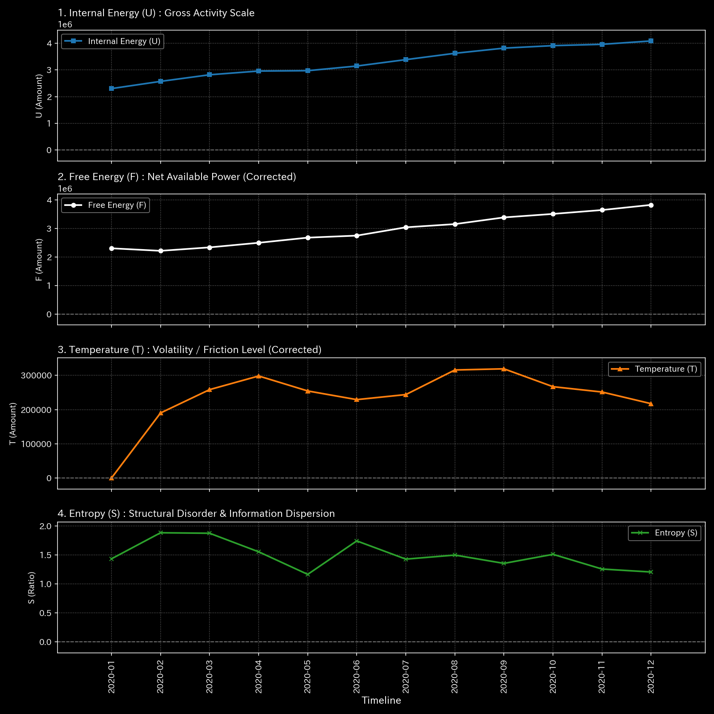

# 🔬 メタ分析統合レポート: Sample 2 (Embezzlement Leak)

## 1. エグゼクティブ・サマリー

**【診断結果：CRITICAL（質量保存の法則の崩壊 / リジッド・ロック）】**
システムは致死的な「質量の消失（Leak）」に見舞われています。ネットワークを流れるべき質量（資金）が簿外へ流出し、システムの構造を支える「張力（応力）」が完全に喪失（Min Edge Stress: 0.00）しています。ネットワークは完全に硬直し（リジッド・ロック）、死を迎えています。

## 2. 伝統的分析の限界（集計スナップショット）

伝統的なB/SやP/Lでは、費用勘定に巧みに紛れ込まされた「微小な横領」は、通常の営業費用のボラティリティ（ノイズ）として処理され、統計的なZスコアでは発見できません（不可視化）。総額としては微細な「雑損」に見えるため、経営陣はその致命性に気づきません。

## 3. 物理的病理の特定（根本的な病態生理）

正規のルートを通らず、システム外部（UNKNOWN_LEAK またはダミーノード）に対して一方向的な資金の流出（横領・着服）が行われています。「入ってくる質量と出ていく質量が一致しない」という物理学の基本原則（キルヒホッフの法則）が破壊されています。

## 4. 物理・数学エンジンによる証明

### 4.1. マクロ・フォレンジックと構造剛性

* **相対漏洩率（Leak Ratio）：** `0.166667` (約16.6%)。許容値（0.0）を完全に超過。
* **ネットワーク・エッジ応力の喪失：** `Min Edge Stress: 0.0000`。
* **解説：** 資金がシステム外へ漏洩したことで、ノード間を繋ぐ配管に圧力がかからなくなり、張力（テンション）がゼロに崩壊しました。剛性行列のタイムラプスを確認すると、健全なモザイク模様が一色に染まる「リジッド・ロック（血栓化）」が明確に確認できます。

### 4.2. トポロジー異常とスペクトル半径

* **最大スペクトル半径：** `0.0000`。
* **解説：** 循環取引（無限ループ）は存在せず、ひたすら外部への流出（出血）だけが起きていることを裏付けています。

### 4.3. 異常共振の証明（外力の暴走）

* 剛性が崩壊した状態（リジッド・ロック）で微小な入力が加わると、衝撃を吸収できず、出力される外力（External Force）が `1e9` クラスの破滅的な桁数へと暴走します。これが構造破壊の最も強い証拠です。

以上がマクロな構造剛性と質量保存則の分析結果です。

**剛性行列の進化（シネマティック・シーケンス）:**

![1枚目 [Start]: 稼働直後の無垢な状態](../../../../samples/Sample_2_Embezzlement_Leak/readme_plots/support/000_2_1__structural_stiffness.t.00000.png)

![2枚目 [Just Before Change]: 異常が発生する直前](../../../../samples/Sample_2_Embezzlement_Leak/readme_plots/support/000_2_1__structural_stiffness.t.00002.png)

![3枚目 [The Exact Point of Change]: 異常の発生した決定的な瞬間](../../../../samples/Sample_2_Embezzlement_Leak/readme_plots/support/000_2_1__structural_stiffness.t.00004.png)

![4枚目 [Immediately After Change]: 波及効果と局所的な硬直](../../../../samples/Sample_2_Embezzlement_Leak/readme_plots/support/000_2_1__structural_stiffness.t.00006.png)

![5枚目 [End]: シミュレーションの最終状態](../../../../samples/Sample_2_Embezzlement_Leak/readme_plots/support/000_2_1__structural_stiffness.t.00011.png)

以上が熱力学的エネルギースタックの分析結果です。

## 5. ⚠️ 反証可能性と検証要件（Falsification Analytics）

* **偽陽性の可能性：** 物理的な「漏洩（片端入力など）」自体は数学的事実ですが、これが「悪意のある横領」ではなく、単なる「経理担当者の仕訳入力ミス（貸借不一致）」である可能性が残されています。
* **追加検証要件：** 流出先とされている特定の `t_idx` （時刻）およびノードIDの原帳（Journal Entry）をドリルダウンし、その取引の承認者と実際の送金先口座（架空口座の有無）をただちに特定してください。
