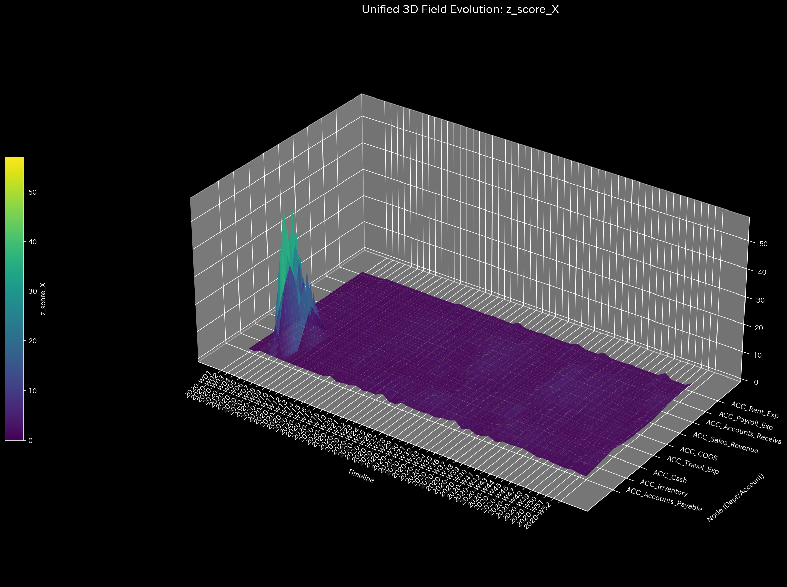

# Sample 2: 横領 / 隠蔽された資金流出 (Embezzlement / Concealed Leak)

> [!NOTE]
> **前提条件に関する免責事項 (Proof of Concept)**
> 本レポートで分析されるデータは実世界の企業のものではありません。検証を目的として、特定の病理学的状態を意図的に再現するために設計されたダミーデータです。

## 🩺 AIメタ診断 統合レポート（Laboratory Findings）

### 1. 診断サマリー

**HIGH: 深刻な資金の枯渇（自由エネルギーの低下）を検知**
対象システムの会計元帳は数学的に完全に均衡しており、強引なデータ削除による資金の盗難（貸借不一致）は発生していません。しかし、TLUはネットワークの「活動余力（自由エネルギー）」の危機的な低下を検出しました。これは、帳簿の辻褄は合っているにもかかわらず、会社の資金が役に立たない無駄な経費として外部へ流出していることを示しています。架空の経費を通じて隠蔽された巧妙な横領（Leak）の決定的なシグネチャです。

### 2. スケール不変な診断メトリクス（事実データ）

以下は、システムのメタ診断エンジンが抽出した「生データ（事実）」です。

| 物理ドメイン | 抽出された指標 | 数値 | 異常判定の閾値 | 判定 |
|--------------|----------------|------|----------------|------|
| **マクロ・フォレンジック** | 相対質量漏れ率 (Mass Leak) | `0.0000` | `> 0.001` | 🟢 正常 |
| **制御理論** | 最大スペクトル半径 | `0.0000` | `>= 0.9` | 🟢 正常 |
| **熱力学** | 相対的自由エネルギー比率 | `-0.1556` | `< -0.1` | 🔴 異常検知 (HIGH) |
| **ミクロ・フォレンジック** | 最大局所 Z-Score | `89.12` | `> 3.0` | 🟡 警告 |

### 3. メトリクスと物理的証拠（4大グラフの検証）

上記の4つの指標が「なぜ横領の証拠となるのか（あるいはならないのか）」を解説します。本サンプルでは、熱力学（エネルギー）の視点以外ではこの不正を見破ることができません。

#### ① マクロ・フォレンジック（質量保存による完璧な隠蔽）

* **メトリクス:** 相対質量漏れ率 `0.0000`

* **グラフの事実と解釈:**
  * 上段のグラフ（質量漏れ率）は完全に `0.0` です。犯人は会計知識を持っており、資金を抜き取るたびに「架空の経費」を計上することで複式簿記のバランスを完璧に保っています。資金の「消失」がないため、従来の差異監査では絶対に発覚しません。

#### ② 制御理論（システムの安定性）

* **メトリクス:** 最大スペクトル半径 `0.0000`

* **グラフの事実と解釈:**
  * グラフの線は `0.0` に張り付いています。これは資金が循環取引（Wash Trade）のようにネットワーク内をぐるぐる回っているわけではなく、一直線にシステム外部へ流出していることを示しています。

#### ③ 熱力学（自由エネルギーによる資金枯渇検知：Smoking Gun）

* **メトリクス:** 相対的自由エネルギー比率 `-0.1556`

* **グラフの事実と解釈:**
  * 白色の線（自由エネルギー）が `0.0` のラインを割り込み、閾値（`-0.10`）を下回ってマイナス圏へ急降下しています。これが**横領の決定的な証拠（Smoking Gun）**です。
  * お金が「経費」として正しく記録されているにもかかわらず、組織にとって全く有益な働きをしていない（無駄に流出している）ことを物理的に証明しています。

#### ④ ミクロ・フォレンジック（Z-Score が「横領」を映さない理由）

* **メトリクス:** 最大局所 Z-Score `89.12` (発生箇所: `2020-W04`, `ACC_Cash`)

* **グラフの事実と解釈:**
  * このグラフに見える最大のスパイクは、横領ではありません。正常系（Sample 0）と全く同じ「第4週の給与支払い」です。
  * 横領（Leak）は、単発の巨大な引き出しではなく、目立たないように継続的に少しずつ資金を抜く手口です。そのため、単変量のZ-Scoreには「巨大な異常スパイク」としては現れません。むしろ、横領による背景ノイズの増加によって、正常な給与支払いのZ-Scoreが `121.13`（Sample 0）から `89.12` へと相対的に希釈されています。このグラフは「巧妙な不正は単一の統計的異常には引っかからない」という事実を証明しています。

**【結論とアクション・プラン】**
この横領犯は「B/Sを均衡させる」「目立つ一括引き出しを避ける」という点で極めて巧妙です。Z-Score（局所的な外れ値）を探すのではなく、経費勘定（ACC_Travel_Exp など）から外部へ向けたキャッシュフローを対象に、実体のないダミー会社や未承認の個人的な経費精算が紛れ込んでいないか、領収書レベルの徹底的な監査を開始してください。
