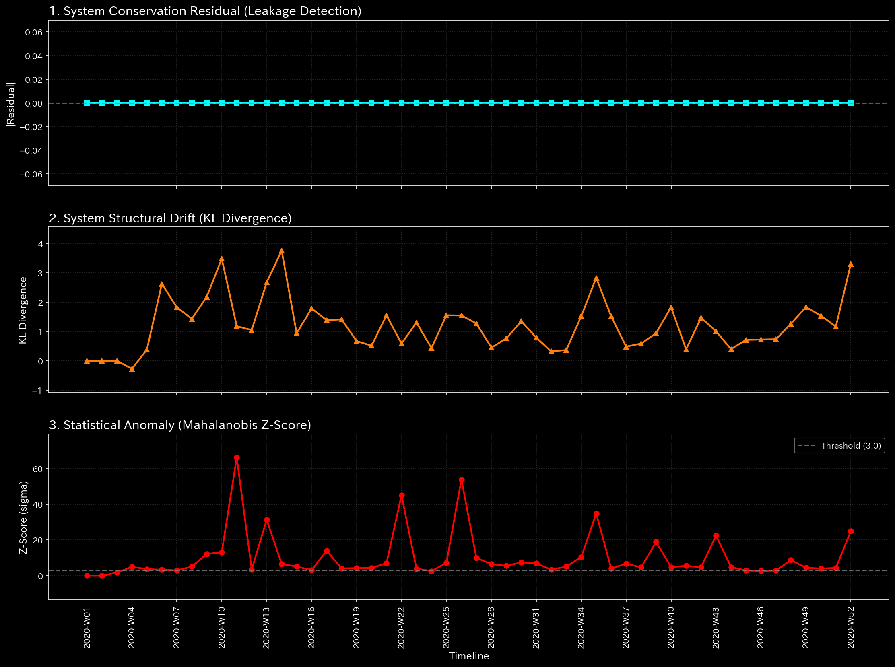
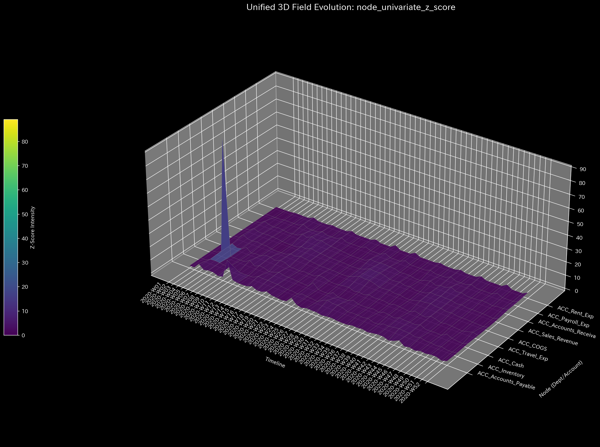

# Sample 2: 横領 / 隠蔽された資金流出 (Embezzlement / Concealed Leak)

> [!NOTE]
> **前提条件に関する免責事項 (Proof of Concept)**
> 本レポートで分析されるデータは実世界の企業のものではありません。検証を目的として、**特定の病理学的状態や異常を意図的に再現するために設計されたダミーデータ生成スクリプト**から派生したものです。本分析の目的は、人為的に構築された異常な構造を TLU がどれほど正確に検知・分析できるかを実証することです。

> [!TIP]
> **このサンプルのグラフの生成方法**
> スペース節約のため、このサンプルに関する数千の3Dプロットおよび分析CSVは同梱されていません。リポジトリのルートから以下のコマンドを実行することで、ローカルで再現可能です：
> ```bash
> bash bin/batch_processing.sh --target_env "samples/Sample_2_Embezzlement_Leak"
> bash bin/batch_visualize_graphs.sh --target_env "samples/Sample_2_Embezzlement_Leak"
> ```

## 🩺 AIメタ診断 統合レポート（Laboratory Findings）

### 1. 診断サマリー
**HIGH (高): 深刻な資金の枯渇（自由エネルギーの低下）を検知**
`Sample_2_Embezzlement_Leak` の会計元帳は数学的に均衡しており、強引なデータ削除による資金の盗難（貸借不一致）は発生していません。しかし、TLUはネットワークの「活動余力（自由エネルギー）」の危機的な低下を検出しました。これは、帳簿の辻褄は合っているにもかかわらず、会社の資金が役に立たない無駄な経費として外部へ流出していることを示しています。これは、架空の経費を通じて隠蔽された巧妙な横領の決定的なシグネチャです。

### 2. 主要な検知結果（マクロ・ミクロ分析）
* **診断:** 組織体力の枯渇（横領 / 隠蔽された資金流出）
* **深刻度:** HIGH (高)
* **物理的証拠:** 
  * **[マクロ分析] 相対質量漏れ率:** `0.0`（システム内の資金総量は保存されており、複式簿記の原則は守られています）。
    * **【🟢 正常系（Sample 0）のベースライン】**
    
    * **【🔴 本サンプルの異常状態】**
    
    * **💡 グラフの読み方（マクロ）:** Z-Score線（質量漏れ）は `0.0` のまま平坦です。これは「元帳の貸借バランスは完璧に取れている」ことを視覚的に確認するものです。

  * **[マクロ分析] 相対的自由エネルギー比率:** **-0.1556**（閾値-0.1を大きく下回る。元帳のバランスは取れているのに、組織の体力が継続的に失われています）。
    * **【🟢 正常系（Sample 0）のベースライン】**
    
    * **【🔴 本サンプルの異常状態】**
    
    * **💡 グラフの読み方（マクロ）:** 白色の線（自由エネルギー）が着実に右肩下がりで急降下しています。お金が「経費」として正しく記録されているにもかかわらず、組織にとって全く有益な働きをしていない（無駄に流出している）ことを証明しています。

  * **[ミクロ分析] 最大局所 Z-Score:** **89.12**（特定の部署・勘定科目にのみ発生している極端な異常値）。
    * **【🟢 正常系（Sample 0）のベースライン】**
    
    * **【🔴 本サンプルの異常状態】**
    
    * **💡 グラフの読み方（ミクロ）:** 3D Surface 上で、正常系（Sample 0）の初期給与支払いとは全く異なる口座座標に、**周囲から突出した鋭いスパイク（針）** が隆起しています。これが、横領された資金が投棄されている正確な口座（ダミーの経費科目など）をピンポイントで特定しています。

* **財務的証拠:** 
  貸借対照表（B/S）は均衡しており（`is_balanced: true`）、会社は $58,488 の純利益を計上しています。しかし、合法的な資産が「合法的な経費」（例：架空のベンダーへの支払いや水増しされた出張費）を装ってネットワーク外へ流出しており、窃盗が通常のビジネス活動の背後に巧妙に隠蔽されていることが証明されました。

### 3. ビジネスへの翻訳とアクション・プラン
犯人は会計知識を持ち合わせており、資金を引き出すたびに架空の経費を計上することで、従来の差異監査を回避しました。しかし、TLUは資金の「有用性（自由エネルギー）」を測定するため、この不自然な資金の流出を容易に検出しました。

**【アクション・プラン】**
マクロレベルの残高チェック（貸借の確認）はここでは無意味です。直ちにミクロ Z-Score 3D Surface（`002_2_2_2__micro_Z_Score_3d_surface.png`）を参照し、突出したスパイク（Z-Score: 89.12）を発生させている正確な経費科目を特定してください。特定後、その口座からのすべての外部向けキャッシュフローに対する領収書レベルの監査を開始し、ダミー会社や未承認の個人的な経費精算を暴き出してください。
