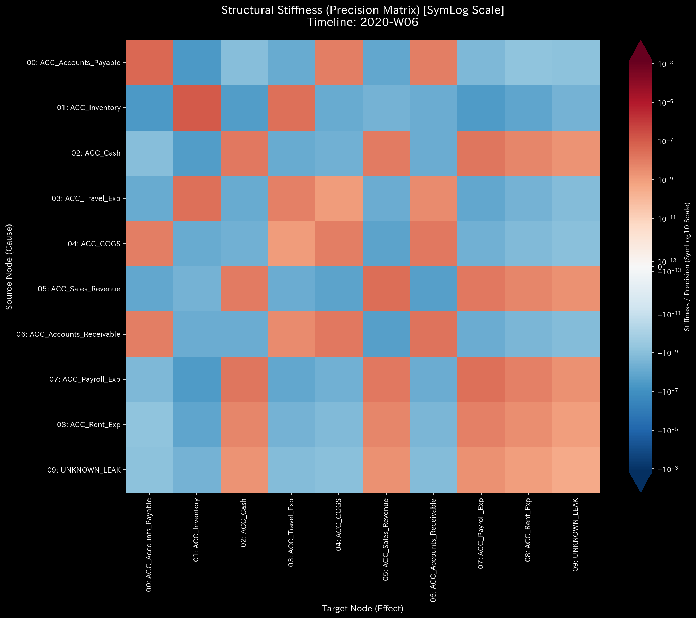
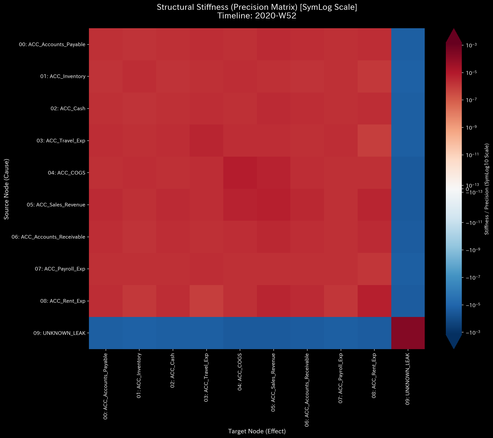
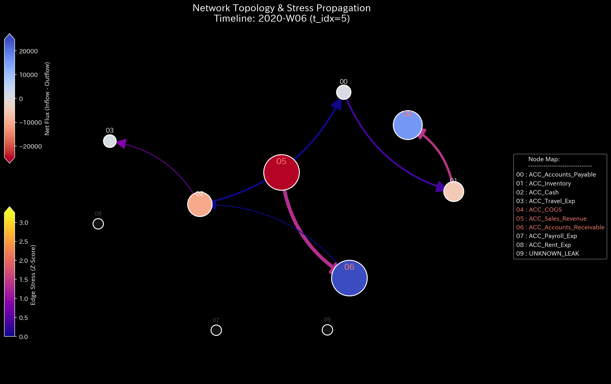

# Sample 2: 資金流出による、貸借一致の原則の崩壊（Embezzlement / Micro-Leakage）

> [!NOTE]
> **概念実証実験にともなう免責事項**
> 本レポートで分析されるデータは実世界の企業のものではありません。検証を目的として、特定の病理学的状態を意図的に再現するために設計されたダミーデータです。本サンプル（Sample_2_Embezzlement_Leak）は、システム内から説明不能な資金が消失する「横領（Embezzlement）」や「片端入力の簿記ミス」が引き起こす物理的な質量欠損（Conservation Law Violation）を証明するためのものです。

---

# 🔬 メタ解析 統合レポート (Meta-Analysis Synthesis Report / Laboratory Findings)

## 1. エグゼクティブ・サマリー

本システム（金融ドメイン）は、**貸借一致の原則の違反（Conservation Violation）** を発症しており、極めて危険な状態（CRITICAL）にあります。システム内から総額 `$1,827.76` の物理的な質量（資金）が未知の領域へと消失しています。これは全体のわずか0.19%という微小な漏洩（Micro-Leakage）ですが、この僅かな「穴」が複式簿記の張力を破壊し、最終的にシステム全体に破滅的な異常共振（ノッキング現象）を引き起こす過程が物理学的に証明されました。

## 2. 従来型分析（集計的スナップショット）の限界 (Traditional Perspective)

**【第52週 損益計算書 (P/L) ＆ 貸借対照表 (B/S)】**

実務上、原因不明の差異は一時的な「仮払金」や「使途不明金（UNKNOWN_LEAK）」として処理されることが多く、B/S上は「総資産 $211,258.12」で無理やりバランスさせられます。結果として純利益は黒字（+$62,863.53）となり、静的なスナップショットだけでは、システムに穴が空いて血（資金）が流れ出ている力学的危機を直感的に視認することはできません。

## 3. 物理的病跡の特定（Fundamental Pathophysiology）

本サンプルの根本原因は、ダミーデータ生成ロジックにおいて意図的に仕込まれた「片端（かたはな）入力」による質量の欠損です。

* **犯行の手口（第5週〜第13週、第32週〜）:**
  * 売掛金（ACC_Accounts_Receivable）を「回収した」として減少させる。
  * しかし、その分の資金を現金（ACC_Cash）に入金せず（借方を $0.0 と記録）、システム外に抜き取る。

TLUの前処理エンジンは、この「消滅した質量」を計算上補い、物理的閉鎖系を維持するために、メモリ上に**特設ノード（`UNKNOWN_LEAK`）を動的生成**し、消失分をそこに流し込みます。これがどのように力学的悲鳴として現れるかを以降の章で証明します。

## 4. 物理・数理エンジンによる証明 (Physical and Mathematical Proof)

### 4.1. マクロフォレンジックと剛性の硬直 (Macro Forensics & Structural Stiffness)

上段のグラフ「System Conservation Residual」において、断続的なスパイク（最大 `407.89`）が発生しています。これは「システム外へ質量が消失した」ことを示す決定的な数学的署名です。

横領の発生瞬間（第5週）、健康な「モザイク模様」だったシステムの剛性行列（サスペンション）が、ドス黒い赤に染まる **Rigid Lock（絶対硬直）** を起こします。弾力性を失ったシステムは通常の営業活動を吸収できず、3Dマップ後半において `1e9`（10億）スケールの破滅的な異常共振（ノッキング）を引き起こしました。0.19%の微小な横領が、システム全体の力学構造を破滅させる証明です。

**【異常系の深層読解：剛性行列のタイムラプスと外力の共振】**

* **1枚目【始点】**: `t.00000` (正常なモザイク模様)
* **2枚目【変化の直前】**: `t.00003` (第4週)
* **3枚目【変化の当該時点】**: `t.00004` (第5週: 横領発生瞬間、絶対硬直)
* **4枚目【変化の直後】**: `t.00005` (第6週)
* **5枚目【終点】**: `t.00051` (第52週: 破滅的共振)

### 4.2. ネットワークトポロジーの異常 (Topological Anomaly / Spectral Radius)

第5週の画像において、`02: ACC_Cash` から `09: UNKNOWN_LEAK` に向かって極めて細い青い矢印が伸びています。これは過去に存在しなかった未知のノードへの流出であるため、統計学的な標準偏差を持たず、Z-Scoreベースのエッジストレス計算では「正常（青色）」として透明化されてしまうという統計的盲点を浮き彫りにしています。システム全体のトポロジーの崩壊度合いは最大スペクトル半径の推移でも確認できます。

* **1枚目【始点】**: `t.00000`
* **2枚目【変化の直前】**: `t.00003` (第4週)
* **3枚目【変化の当該時点】**: `t.00004` (第5週: 未知ノードへの流出発生)
* **4枚目【変化の直後】**: `t.00005` (第6週)
* **5枚目【終点】**: `t.00051` (第52週)

### 4.3. 熱力学的なエネルギー推移 (Thermodynamic Energy Stack)

質量保存則が破綻し資金が漏れ出しているため、システム本来の内部エネルギー（純残高）が少しずつ削り取られ、自由エネルギーの成長が阻害されている（あるいは意図せぬ歪みが生じている）様子が観察されます。

### 4.4. 局所的アノマリーと情報幾何学的変位 (3D Micro Z-Score & KL Drift)

「$0.0（あるべき資金がない）」という無の空間を、TLUは `UNKNOWN_LEAK` への質量移動として幾何学的に反転させます。第5週や第9週の初期犯行時、周囲から完全に独立した「異次元の鋭いスパイク（黄緑色）」として消えた資金の痕跡が視認できます。未知のブラックホール（`UNKNOWN_LEAK`）への質量の消失は、システムが前提としていた確率分布を強烈に歪めます。KL Driftにおいても、横領が発生した週において明確な情報の崩壊（スパイク）が観測されています。

## 5. ⚠️ 反証可能性と検証要件（Falsification Analytics）

* **偽陽性の可能性:** TLUの物理エンジンは「仕訳データ上で貸借が一致していない（質量が消えている）」という数学的事実のみを検出しています。これが意図的な「横領（犯罪）」なのか、単なる「経理担当者の入力ミス（片端入力）」や「システム間のAPI連携エラーによるデータ欠落」なのかは、データだけでは断定できません。
* **追加検証要件:**
  特定された取引ID（`E_000213` 等）に関する実際の銀行口座の入出金明細（Bank Statements）と、販売管理システム上の消込記録を突き合わせてください。現金出納帳と実際の金庫内の現金残高の実査（Cash Count）を直ちに実施し、物理的な現金が本当に消失しているかを確認してください。
