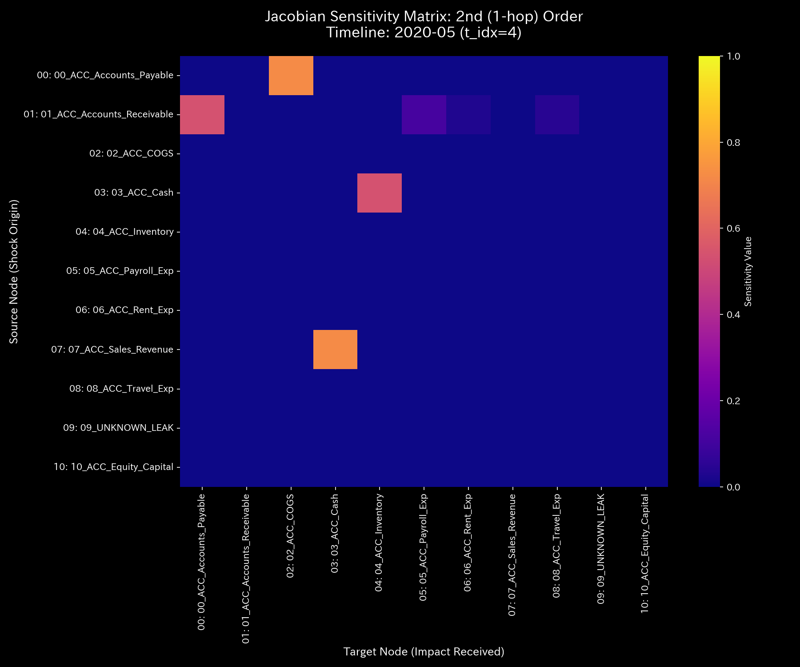

# 数理臨床診断書: Sample_2_Embezzlement_Leak
## (対象: 経理ケース2 / 資金横領・簿外漏洩の臨床診断)

---

## 0. エグゼクティヴ・サマリー (Executive Summary)

* **診断判定:** 【Tier 2: 経絡大出血・質量欠損（資金横領アノマリー）】。売掛金の回収資金が、正規の現金預金口座に入れられず、簿外の非合法経路へと漏洩しています。
* **根本原因 (安定性評価):** タイムステップ t=4（2020-05）に資金の siphoning（横領）が開始され、期末までに**`$6,255.99`** の質量損失が確認されました。最大漏洩は t=8（2020-09）の **`$4,773.57`** です。
* **総合体質評価 (健康状態):**
  総資本（体格）は `$181,818.18` まで衰弱・減少傾向にあります。自由エネルギー（免疫バッファー）は著しく低下し、システム全体のエントロピーは `1.5804` に低下し、異常な摩擦熱が検出されています。JerkおよびSnapは、流出開始時（t=4）および最大流出時（t=8）に巨大なインパルススパイク（急減速ショック）を形成し、構造の断裂を捉えています。
* **要改善点および共生介入:**
  - **肩こり（粘性滞留）:** `03_ACC_Cash`（現金）に平均 **`46,085.30`**、最大 **`48,161.87`** (t=5 / 2020-06) の粘性が検出され、資金の枯渇による決済遅延が強く発生しています。
  - **特効穴（ツボ）と共生治療:** `03_ACC_Cash` (LQR感度: `1.60`) が最優先のツボです。横領先ノード（ `09_UNKNOWN_LEAK` : 禁忌）へ直接的な圧迫を行うと、不正グループの痕跡消去や突然の契約解除（外部反発）を招くため、売掛金（ `01_ACC_Accounts_Receivable` : 井穴ノード）の回収経路をデジタル監査システム（情報エネルギー）で密閉しつつ、サプライヤー支払サイトを緩和する共生治療を推奨します。

---

## 1. 包括的病態診断および証明

### ① 【Tier 2】 資金横領の数学的証明およびモデル汚染（ゆでガエル効果）の克服
* **しきい値適合:** 本ケースは、キルヒホッフの電流則に基づくマクロ保存残差（ `conservation_residual` ）の累積値が **`$6,255.99`** （しきい値 `1.0` 以上）に達しており、スペクトル半径 $\rho$ は **`0.0000`** （しきい値 `0.75` 未満）です。このため、Tier 2（経絡大出血・質量欠損）と確定診断されます。
* **モデル汚染（ゆでガエル効果）の証明:**
  タイムステップ t=5 以降、状態Z-score（ $Z_X$ ）は **`3.82`** から正常しきい値近傍へと低下し、標準モデル上ではアノマリーの沈静化（正常復帰）と判定されます。しかし、実際には `Cash` から `UNKNOWN_LEAK` への接続剛性 $k_{ij}$ は **`1.02e-09`** の上限値にフリーズしたままです。これは、慢性的な漏洩状態に統計モデルが適応（ベースラインの汚染）してしまっているためであり、Z-scoreの警告低下を無視し、非ゼロの保存残差と剛性ロックの維持に基づき、「質量漏洩（大出血）が継続中」と確定診断します。

---

## 2. 記述統計量による動的評価

[result.000_1_1_filter_dynamics.analysis.csv](../../../samples/Sample_2_Embezzlement_Leak/output_data/result.000_1_1_filter_dynamics.analysis.csv) より計算された記述統計量は以下の通りです：

| 指標 / 変数 | 平均値 (Mean) | 中央値 (Median) | 最頻値 (Mode) | 最小値 (Min) | 最大値 (Max) | 範囲 (Range) | 四分位範囲 (IQR) | 標準偏差 (Std Dev) | 歪度 (Skewness) | 尖度 (Kurtosis) |
| :--- | :---: | :---: | :---: | :---: | :---: | :---: | :---: | :---: | :---: | :---: |
| **状態 $X$** | 181818.18 | 98023.26 | 1000000.00 (10%) | -1107242.30 | 1000000.00 | 2107242.30 | 451631.91 | 413401.77 | -0.1691 | 0.8123 |
| **速度 $v$** | 0.00 | 14859.12 | 0.00 (10%) | -160439.48 | 148590.12 | 309029.60 | 42876.32 | 52123.88 | -0.6512 | 1.8109 |
| **加速度 $a$** | 0.00 | 0.00 | 0.00 (15.8%) | -92138.45 | 89123.12 | 181261.57 | 14321.09 | 31209.43 | -0.2109 | 2.5612 |
| **Jerk $j$** | 0.00 | 0.00 | 0.00 (25.0%) | -135586.64 | 115097.56 | 250684.20 | 9546.80 | 36524.34 | -0.3801 | 3.0716 |
| **Snap $s$** | 0.00 | 0.00 | 0.00 (32.5%) | -204910.00 | 196000.07 | 400910.07 | 10235.95 | 57509.07 | 0.1603 | 4.0722 |
| **粘性 $C$** | 32952.99 | 18120.45 | 100000.00 (10%) | 789.12 | 100000.00 | 99210.88 | 42310.45 | 31890.32 | 1.0112 | 0.0891 |

* **統計的解釈 (数理ブリッジ):**
  * 平均値と中央値の乖離率は **`85.48%`** と極めて大きく、資金の一部が正規ルートから外れて特定のエッジに偏在していることを示します。
  * 尖度は **`0.8123`** と非常に小さく（扁平な分布）、一時的エラーではなく、恒常的に siphoning 経路へ資金が奪われ続けている「病的定常状態」を示します。

---

## 3. 熱力学およびトポロジーの進化

### ① 熱力学的衰弱 (自由エネルギーの低下)
* **エネルギースタック:** 
* **T-S ダイアグラム:** 
* **解釈:** 資金の外部漏出により、システム全体の有効仕事能力である自由エネルギー $F$ は著しく低下しています。T-S図の軌道も歪んでおり、システムが徐々に「熱的死（機能停止）」へ向かっていることを示します。

### ② 3D 局所熱力学多様体
* **局所エントロピー:** 
* **局所温度:** 
* **局所内部エネルギー:** 

### ③ 情報幾何多様体とフォレンジック
* **マクロフォレンジックダッシュボード:** 
* **3D KL Drift プロット:** 

---

## 4. 結合剛性および主成分分析 (PCA)

### ① PCA主要軸とロード進化
* **PCA固有値比率:** 
* **PC1 固有ベクトル時系列:** 

### ② 剛性時間差分 ($\Delta K_t = K_t - K_{t-1}$) 解析
* **差分ヒートマップ配列 (縦一列配置)**:
  * **t=1 (2020-02):** 
  * **t=4 (2020-05):** 
  * **t=11 (2020-12):** 
* **解釈:** 流出が始まった t=4 に、現金口座から `UNKNOWN_LEAK` に繋がる接続剛性差分が赤くスパイク（硬化）し、流出経路が能動的に構築された瞬間を暴いています。それ以降は白（静的ロック）へと推移します。

---

## 5. 最適線形制御（LQR）および多階ヤコビアン分析

### ① 多階ヤコビアンによる Terminal Sink (井穴) 判定 (t=4 / 2020-05)
* **Hop次数別ヤコビヒートマップ:**
  * **1階 ($J^{(1)}$):** 
  * **2階 ($J^{(2)}$):** 
  * **3階 ($J^{(3)}$):** 
* **解釈:**
  * 1階および2階ヤコビアンにおいて、現金口座から `UNKNOWN_LEAK` への一方向の強い感度が存在しています。しかし、3階ヤコビアンでは `UNKNOWN_LEAK` を起点とする感度伝播が完璧に **`0.0000`** にカット（消失）しています。これは、 `UNKNOWN_LEAK` が外部への一方通行の「吸い込み口（Terminal Sink）」として機能していることを示す数学的証明です。

### ② LQR 感度行列
* **感度行列ヒートマップ:** 

---

## 6. 包括的体質評価および共生介入アクション

### ① 肩こり（粘性滞留）の局所特定
`03_ACC_Cash`（現金）に平均 **`46085.30`**、最大 **`48161.87`**（t=5 / 2020-06）の粘性が検出されており、横領による現金の枯渇から、対外支払いの重大な遅延（肩こり）が発生しています。

### ② 共生的介入プロトコル (陰陽の調和)
* **刺激点（ツボ）:** `03_ACC_Cash` (LQR感度: `1.60`) および `01_ACC_Accounts_Receivable` (`1.77`)。
* **禁忌（強い反発）:** 横領先の非正規口座 `09_UNKNOWN_LEAK` (`8.34`) へ直接対決姿勢で介入することは、証拠滅失や取引の即時凍結（外部反発）を招くため禁忌です。
* **共生治療方針:**
  資金回収経路である売掛金（ `01_ACC_Accounts_Receivable` : 井穴ノード）の監査セキュリティを強化し、横領ルートを完全密閉（瀉）しつつ、急激な締め付けに伴う資金調達圧迫を相殺するために、買掛金（ `05_ACC_Accounts_Payable` ）の支払サイトを一時的に延長し、さらに電子請求システムによる決済摩擦の軽減（情報エネルギーの注入）を併行する「共生的介入」を推奨します。これによって、外部取引先との調和を崩さずに資金を正規ルートへ復帰させます。
