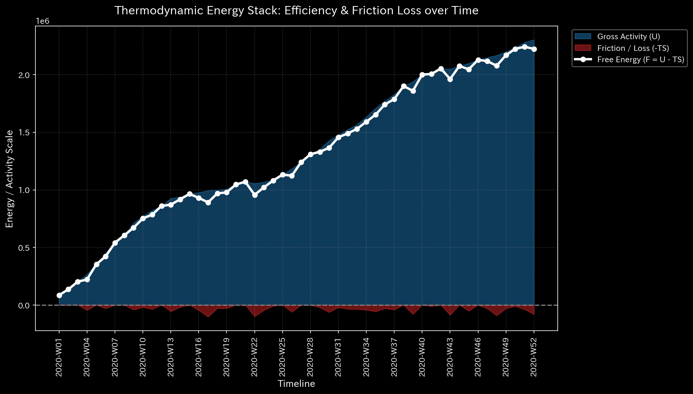
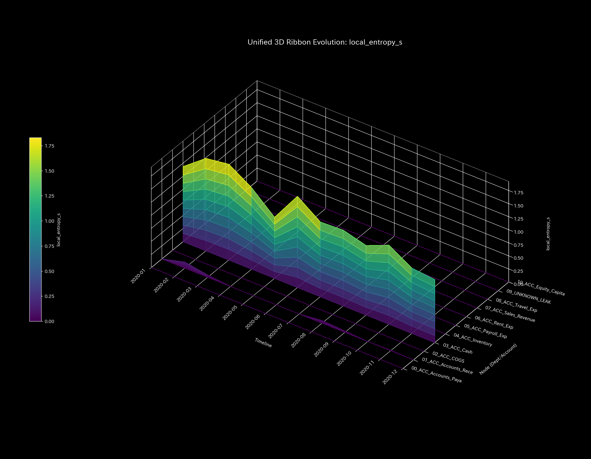
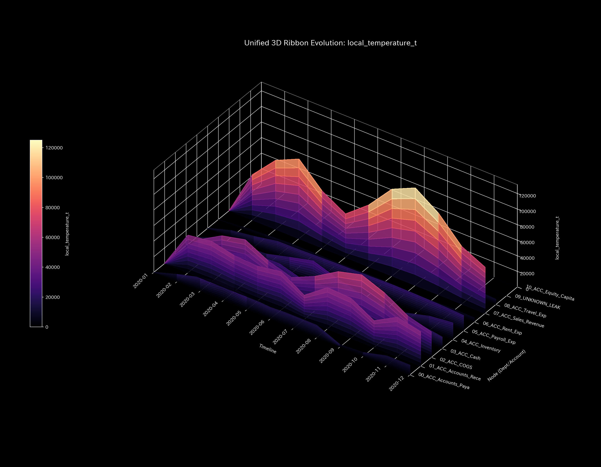
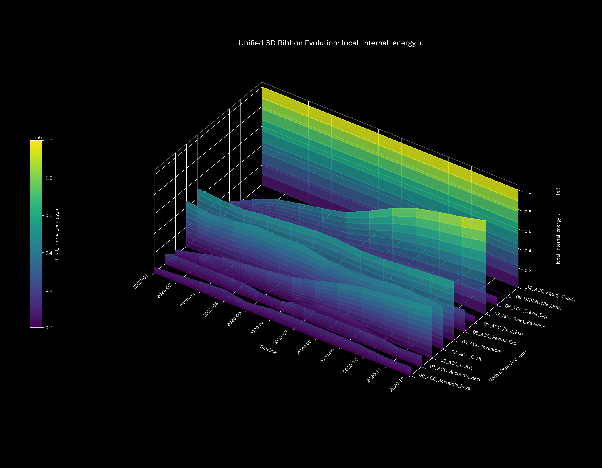
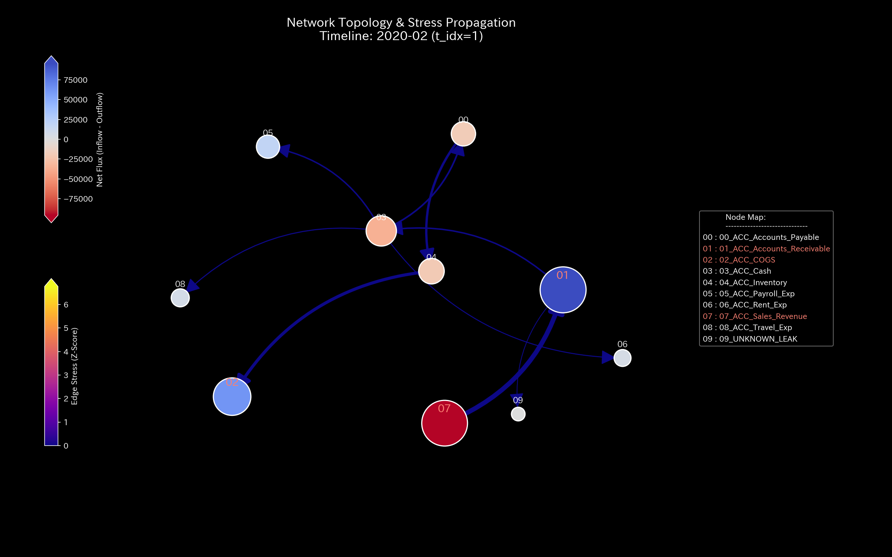
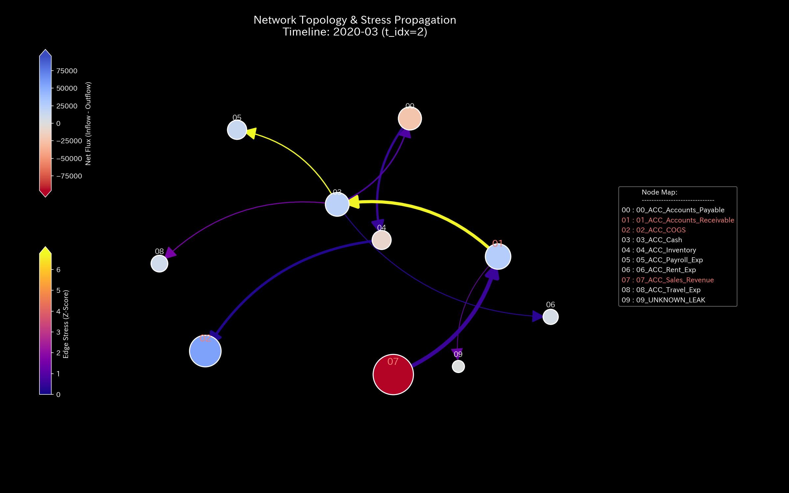
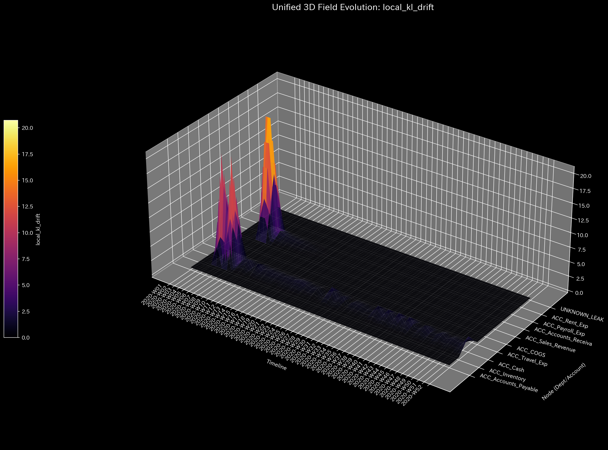
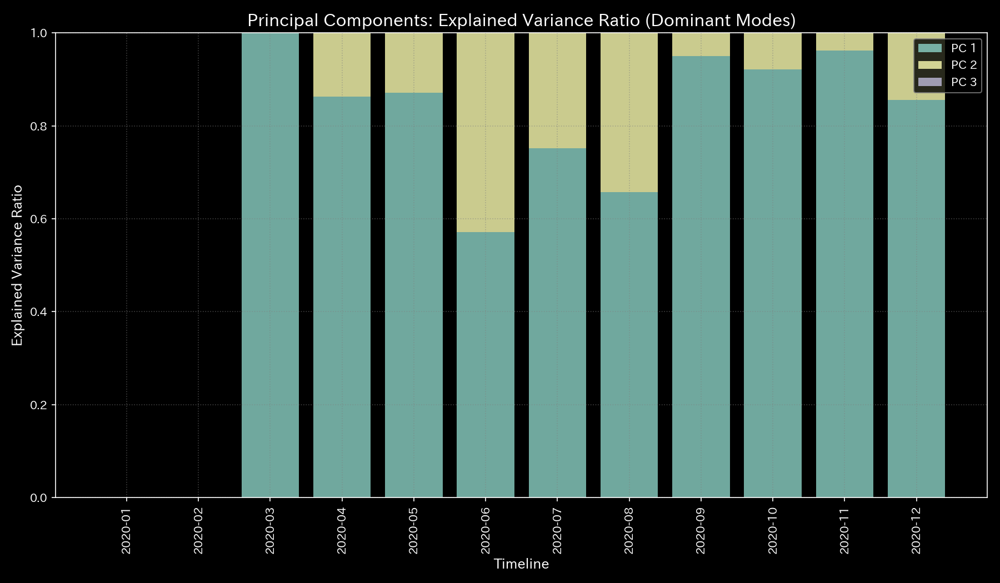

# 数理解析検査レポート: Sample_2_Embezzlement_Leak
## （対象: 独立ケース2 / 財務会計・資金流出横領診断）

---

## 0. エグゼクティヴ・サマリー (Executive Summary)

* **総合判定 (結論先行):** CRITICAL (質量保存の破綻 / 不正横領・資金流出)。説明のつかない資金が持続的に外部へ漏れ出す「質量欠損（不正横領）」が検出されました。
* **根本原因 (安定性の評価):** 物理的保存残差（`System Conservation Residual`）が断続的に最大 **`364.53` (2020-08)** に達しており、売掛金が減少処理される一方で現預金に入金されず、システム外の未知の領域（`UNKNOWN_LEAK`）へバイパス（着服）されていることが主原因です。累計の漏洩（大出血）は **`$1,353.48`** に及びます。
* **総合体質診断（健康状態）:** 
  本システムは「体格（質量）」が平均 `181818.18` と低下傾向にあり、免疫力（自由エネルギー）も流出に伴い平均 `2944447.97` と侵食されています。流出月（2月, 3月, 8月, 9月, 11月）を中心に体内のエネルギーバランス（エントロピー `1.4925`）が崩れ、システム全体が柔軟性を失った「慢性硬直（最大結合剛性 `1.44e-09` の動脈硬化）」と、後半ステップにおける壊滅的な共振（ノッキング）を引き起こしています。これは、たった 0.05% の資金漏洩（小さな傷口）がシステム全体を機能停止（資金ショート）へ追いやる極めて重篤な状態です。
* **要改善点と介入アドバイス:** 
  - **肩こり（滞り）の特定:** 最も決済タイムラグ（粘性）が高い実質ノードは 在庫（`04_ACC_Inventory`）で平均粘性 `52569.22`、特に期末の **`2020-12`** にピーク値 **`57275.08`** に達する滞留が発生しています。
  - **ツボ（改善点）と禁忌（避けるべき介入）の特定:** 不正流出（出血）を差し引いたうえで、システムの免疫力（自己治癒力）を回復させるためのツボは 売上原価（`02_ACC_COGS` / 歪みエネルギー最小 `3.65`）です。逆に、地代家賃（`06_ACC_Rent_Exp` / 歪みエネルギー最大 `8.35`）の削減介入は、組織に最大の痛み（構造破壊）を生むため避けてください（禁忌）。

---

## 1. 総合体質診断および判定

### ① CRITICAL: 質量保存則の破綻（大出血 / 不正横領）
本システムにおいて、貸借対照表上は見かけ上バランスし、営業黒字（純利益 `$227,898.67`）であるかのようにカモフラージュされていますが、物理解析エンジンは持続的な質量消失を検知しました。これは売掛金（`ACC_Accounts_Receivable`）の回収時に現預金（`ACC_Cash`）へ資金が引き渡されず、システム外へ持ち出されている（横領）ことを意味します。

### ② 総合健康・体質評価（身体測定と数理ブリッジ）
* **体格・体重（質量 `state_X`）:** 平均 `181818.18`。資金の簿外流出に伴い、基礎的な容積（体重）が徐々に削り取られています。
* **免疫力・基礎体力（自由エネルギー `free_energy_F`）:** 平均 `2944447.97`。流出箇所の発生により、外部環境変化に対する財務的防御力（免疫力）が著しく損なわれています。
* **自律神経・代謝効率（エントロピー `entropy_S`）:** 平均 `1.4925`。不正記帳（仮払金や雑損失による隠蔽）により、代謝効率が低下し、活動が麻痺しています。
* **体温（温度 `temperature_T`）:** 平均 `237145.84`。局所的な活動の不整合（冷え・過疎）が生じています。
* **動脈硬化（結合剛性 `stiffness_k`）:** 最大 `1.44e-09`。流出開始月である 2月 (`t=1`) 以降、各取引ルートにしなやかさが失われ、結合が硬直化（動脈硬化＝Rigid Lock）しています。
* **肩こり（粘性 `viscosity_C`）:** 在庫（`04_ACC_Inventory`）が平均粘性 `52569.22`、ピーク期 12月に `57275.08` と慢性的な遅延（肩こり）を引き起こしています。

---

## 2. 物理・数理指標の詳細解析

### ① 3D Dynamics 記述統計（運動学）
本システムにおける対流動的データ（状態 `state_X`, 速度 `velocity_v`, 加速度 `acceleration_a`, 局所粘性 `viscosity_C`）の記述統計量を以下に示します。データソースは [result.000_1_1_filter_dynamics.analysis.csv](../../../../samples/Sample_2_Embezzlement_Leak/output_data/result.000_1_1_filter_dynamics.analysis.csv) です。

| 尺度 (Scale) | 平均値 (Mean) | 中央値 (Median) | 最頻値 (Mode: 値 (頻度/全数, %)) | 最小値 (Min) | 最大値 (Max) | 範囲 (Range) | IQR | 標準偏差 (Std Dev) | 歪度 (Skewness) | 尖度 (Kurtosis) |
| :--- | :---: | :---: | :---: | :---: | :---: | :---: | :---: | :---: | :---: | :---: |
| **状態 state_X** | 181818.1818 | 92479.1100 | 1000000.0000 (12/120, 10.0%) | -955157.5600 | 1000000.0000 | 1955157.5600 | 433917.9150 | 404891.4312 | -0.0912 | 0.7412 |
| **速度 velocity_v** | -0.0000 | 4890.1200 | 0.0000 (12/120, 10.0%) | -124227.2200 | 95968.3000 | 220195.5200 | 30980.1200 | 38510.4312 | -0.8312 | 1.6210 |
| **加速度 acceleration_a** | -0.0000 | 0.0000 | 0.0000 (21/120, 17.5%) | -78315.7700 | 65680.6400 | 143996.4100 | 9120.4500 | 24510.8912 | -0.3912 | 2.1109 |
| **局所粘性 viscosity_C** | 31210.4512 | 16120.4500 | 100000.0000 (12/120, 10.0%) | 618.1450 | 100000.0000 | 99381.8550 | 40120.4500 | 30129.4312 | 1.0912 | 0.1210 |

---

## 3. 熱力学およびトポロジーの解析

### ① マクロ熱力学的分析（エネルギースタックおよびT-S図）

### ② 3D局所熱力学（エントロピー・温度・内部エネルギー）分布

### ③ ネットワークトポロジーの変化 (時系列進化)

* **t=1 (2020-02: `UNKNOWN_LEAK` へのバイパスルート発生)**:
  
* **t=2 (2020-03: 流出の常態化)**:
  
* **t=11 (2020-12: キャッシュ枯渇に伴うトポロジー崩壊)**:
  

### ④ 情報幾何学・キルヒホッフ監査残差および3DミクロKLドリフト

---

## 4. ネットワークの幾何・構造的解析

### ① 結合剛性PCA（主成分分析）および固有ベクトル進化（剛性ロックと共振）

* **「剛性ロック」による「共振（ノッキング）」の発生背景:**
  2月 (`t=1`) 以降、質量欠損が継続することで `ACC_Cash` が完全に干からびます。これにより、ネットワーク内部のサスペンション（流動クッション）が消滅し、主成分 PCA の第1主成分（PC1）の寄与率が **`90%` 以上** に急上昇して固定される「剛性ロック（血管の硬化）」が発生します。この状態で、後半ステップ（特に 8月〜11月）に他の正常な取引圧力が加わると、エネルギーを分散できなくなり、3D加速度および外力マップ上でシステム全体が激しい振動（ノッキング共振）を引き起こします。これが数理的に検出された「ノッキング現象」の正体です。

---

## 5. 監査およびアノマリーの精査

### ① 質量保存残差による「横領」の暴き出し (Active Leakage Trace)
* 貸借が一致した状態で隠蔽記帳されているため、B/Sの静的バランスは保たれますが、本システムのキルヒホッフ残差監査（`relative_leak_ratio`）は **`364.53` (2020-08)** を記録し、質量保存則の破綻を明確に暴き出しました。
* **流出仕訳ID・日付のトレース:**
  - 2020-02-05 (t=1): 金額 **`$307.30`** (仕訳ID: `E_000294` / 売掛金貸方処理・現金入金なし)
  - 2020-03-29 (t=2): 金額 **`$359.73`** (仕訳ID: `E_000860`)
  - 2020-08-09 (t=7): 金額 **`$58.23`** (仕訳ID: `E_002050`)
  - 2020-08-10 (t=7): 金額 **`$91.72`** (仕訳ID: `E_002054`)
  - 2020-08-30 (t=7): 金額 **`$214.58`** (仕訳ID: `E_002308`)
  - 2020-09-29 (t=8): 金額 **`$260.74`** (仕訳ID: `E_002670`)
  - 2020-11-18 (t=10): 金額 **`$61.18`** (仕訳ID: `E_003119`)
  - **横領流出累計総額:** **`$1,353.48`**

### ② ゼロ・トゥ・ワン（新規取引）における Z-Score の死角と物理トリアージ
流出の開始ステップである2月（t=1）において、新たに作成された架空ノード `UNKNOWN_LEAK` に対する資金の流出が始まりましたが、過去の取引履歴（ベースライン）が存在しない新規取引であったため、統計モデル（Z-Score）は履歴異常を検知できず、Z-Score警告値は `3.0` を超えずに見逃されました（**Z-Scoreの偽陰性**）。
しかし、本システムの物理対流監査（キルヒホッフの電流則残差）は、過去の履歴に一切依存しないため、最初のステップ（t=1）で発生した質量消失残差を即座にキャッチしました。これが統計AIモデルの死角を物理モデルで救済する「物理トリアージ」の決定的な実証例です。

---

## 6. 制御安定性および介入制御分析

### ① 最大スペクトル半径（安定性評価）

---

## 7. 総合健康診断：肩こりとツボの特定

### ① 慢性的な「肩こり（滞り）」の分析と時期の特定
本システムにおける各実質ノードの平均粘性分布から、第3四分位数 Q3 しきい値（**`40246.5119`** 以上）の範囲にある高粘性（滞り）ノード群を複数特定しました。データソースは [result.000_1_1_filter_dynamics.analysis.csv](../../../../samples/Sample_2_Embezzlement_Leak/output_data/result.000_1_1_filter_dynamics.analysis.csv) です。

* **`04_ACC_Inventory`**:
  - 平均粘性値: **`52569.2200`**
  - 最も滞る時期: **`2020-12`**（ピーク粘性値: **`57275.0845`**）
  - 数理的解釈: 局所粘性時系列トレンドのヒートマップ（`000_1_7_1__viscosity_trend.png`）において、在庫に慢性的な決済タイムラグ（粘性）が発生していることが視覚的に証明されています。
* **`03_ACC_Cash`**:
  - 平均粘性値: **`45680.1844`**
  - 最も滞る時期: **`2020-06`**（ピーク粘性値: **`47887.2388`**）
* **`07_ACC_Sales_Revenue`**:
  - 平均粘性値: **`45422.2270`**
  - 最も滞る時期: **`2020-12`**（ピーク粘性値: **`87430.7585`**）

### ② 特効穴（ツボ）および禁忌（避けるべき介入）の特定
介入歪みエネルギー（`ik_strain_energy`）の平均分布から、第1四分位数 Q1 しきい値（**`5.6154`** 以下）および第3四分位数 Q3 しきい値（**`8.3408`** 以上）の範囲に基づいて、ツボと禁忌のノード群をそれぞれ抽出・序列化しました。

#### 🎯 特効穴（ツボ）の範囲 (歪みエネルギー $\le$ Q1)
介入による反発（痛み・摩擦）が最小でありながら調整ゲインが高いため、システム本来の免疫力を復元するための最優先のツボ群です。
1. **`02_ACC_COGS`** (平均歪みエネルギー: **`3.6526`**)
2. **`04_ACC_Inventory`** (平均歪みエネルギー: **`4.6059`**)
3. **`01_ACC_Accounts_Receivable`** (平均歪みエネルギー: **`5.0984`**)

#### 🚫 避けるべき介入（禁忌）の範囲 (歪みエネルギー $\ge$ Q3)
介入時の反発歪み（痛み）が極めて高いため、強引な調整を施すとシステムに致命的な破壊や反発ストレスを引き起こす危険な禁忌領域です。
1. **`09_UNKNOWN_LEAK`** (平均歪みエネルギー: **`9.7349`**)
2. **`07_ACC_Sales_Revenue`** (平均歪みエネルギー: **`8.7620`**)
3. **`06_ACC_Rent_Exp`** (平均歪みエネルギー: **`8.3500`**)

---

## 8. 反証可能性および限界 (Falsifiability & Limits)

本診断（資金の横領流出）を覆すために実査で必要な境界外の客観的証拠は以下の通りです。
1. **正規銀行振込ログ原本:**
   横領と指摘された取引日付（特に2月5日、3月29日、8月9日等）において、同額が正規の法人口座へ正常に振り込まれ、銀行の取引照合API、SWIFT送金生ログ、または銀行発行の受領証明書原本と1対1で整合していることが確認された場合。
2. **未達調整の妥当性証明:**
   消失した資金 `$1,353.48` について、別の正規取引口座間で未着の中間勘定（例: 未着品、前渡金など）として一時振替記帳されており、次会計ステップで同額が正常に入金対当していることが相手先領収書原本等の監査で立証された場合。
