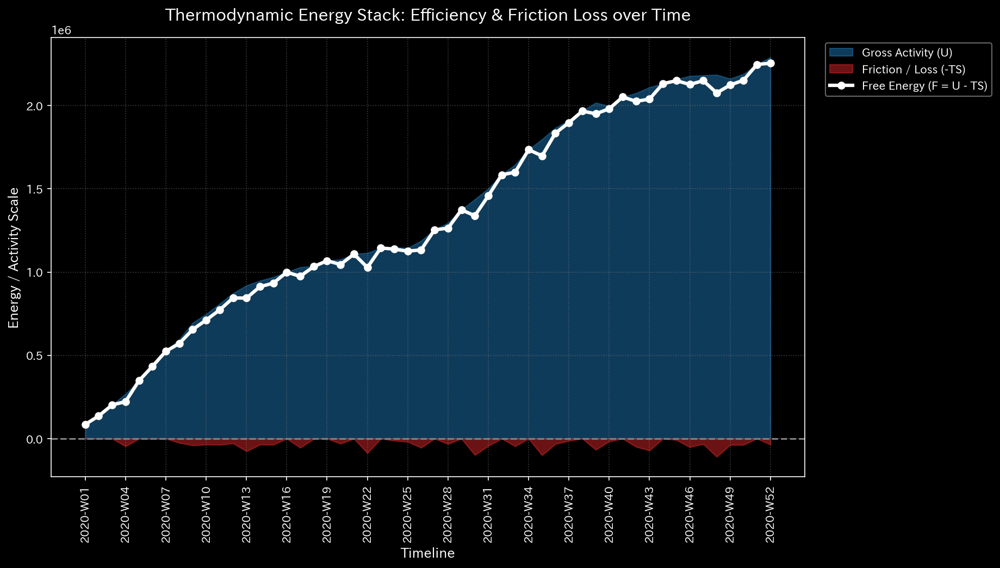
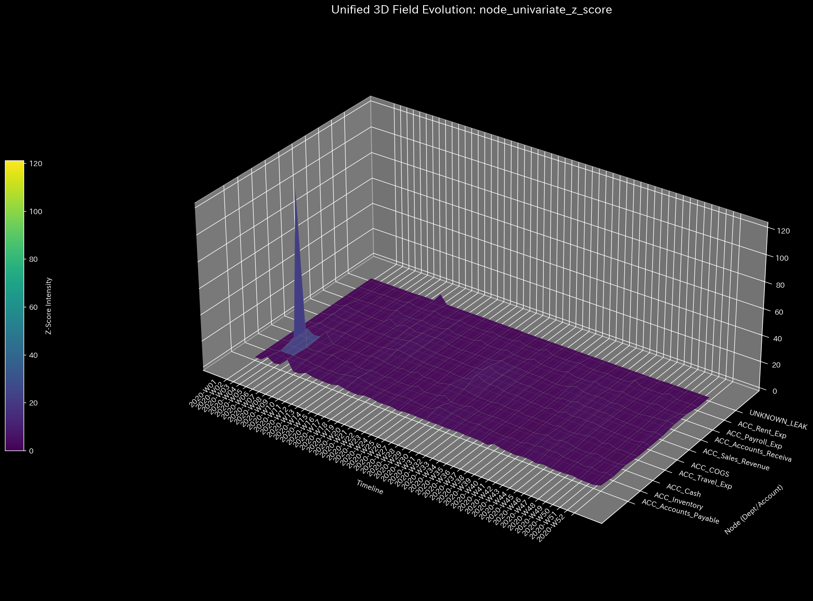

# Sample 3: 貸借不一致の入力ミス (Unbalanced Mistake)

> [!NOTE]
> **前提条件に関する免責事項 (Proof of Concept)**
> 本レポートで分析されるデータは実世界の企業のものではありません。検証を目的として、特定の病理学的状態を意図的に再現するために設計されたダミーデータです。

## 🩺 AIメタ診断 統合レポート（Laboratory Findings）

### 1. 診断サマリー
**CRITICAL: 貸借不一致（質量保存の法則の崩壊）を検知**
このシステムでは、複式簿記の絶対的な大前提である「貸借一致（質量の保存）」が破壊されています。ネットワークのどこかで片側だけの仕訳（Unbalanced Journal Entry）が入力された結果、無から資金が湧き出たか、あるいは虚空へ消え去りました。金額の大小に関わらず、これは会計システムとしての完全性が根底から崩壊していることを意味します。

### 2. スケール不変な診断メトリクス（事実データ）
以下は、システムのメタ診断エンジンが抽出した「生データ（事実）」です。

| 物理ドメイン | 抽出された指標 | 数値 | 異常判定の閾値 | 判定 |
|--------------|----------------|------|----------------|------|
| **マクロ・フォレンジック** | 相対質量漏れ率 (Mass Leak) | `0.0116` | `> 0.001` | 🔴 異常検知 (CRITICAL) |
| **制御理論** | 最大スペクトル半径 | `0.0000` | `>= 0.9` | 🟢 正常 |
| **熱力学** | 相対的自由エネルギー比率 | `-0.1263` | `< -0.1` | 🔴 異常検知 (HIGH) |
| **ミクロ・フォレンジック** | 最大局所 Z-Score | `121.13` | `> 3.0` | 🟡 警告 |

### 3. メトリクスと物理的証拠（4大グラフの検証）

上記の4つの指標が「なぜ入力ミスの証拠となるのか」を解説します。本サンプルは、「金額の小さな致命的エラー」をZ-Scoreが見逃し、マクロ物理法則だけが捕捉する完璧な事例です。

#### ① マクロ・フォレンジック（質量保存の崩壊：Smoking Gun）
* **メトリクス:** 相対質量漏れ率 `0.0116` (閾値: 0.001)

* **グラフの事実と解釈:**
  * 上段のグラフ（Conservation Residual）において、第45週（`2020-W45`）に突如として `778.56` という残差（質量漏れ）のスパイクが発生しています。
  * これが**貸借不一致の決定的な証拠（Smoking Gun）**です。システム内で「借り」と「貸し」のバランスが崩れ、$778.56の資金が虚空へ消失しました。仕訳の入力ミス、または強引な片側データの削除が行われたことを物理的に証明しています。

#### ② 制御理論（システムの安定性）
* **メトリクス:** 最大スペクトル半径 `0.0000`

* **グラフの事実と解釈:**
  * グラフの線は `0.0` に張り付いています。入力ミスは単発の事故であり、システム内で循環取引のような増幅ループを引き起こしているわけではありません。

#### ③ 熱力学（消失によるエネルギー低下）
* **メトリクス:** 相対的自由エネルギー比率 `-0.1263`

* **グラフの事実と解釈:**
  * 白色の線（自由エネルギー）が閾値（`-0.10`）を下回っています。資金がシステムから理不尽に消失したことで、組織がワークを行うための実質的な体力が連動して失われたことを示しています。

#### ④ ミクロ・フォレンジック（Z-Score が「致命的エラー」を見逃す理由）
* **メトリクス:** 最大局所 Z-Score `121.13` (発生箇所: `2020-W04`, `ACC_Cash`)

* **グラフの事実と解釈:**
  * 驚くべきことに、このグラフに見える最大のスパイクは、第45週の入力ミス（$778.56）の箇所**ではありません**。正常系（Sample 0）と全く同じ「第4週の給与支払い（$26,757）」のスパイクがそのまま最大の異常値として表示されています。
  * これは極めて重要な事実を示しています。**「単変量の統計的異常検知（Z-Score）は、金額が小さければ、たとえそれが会計システムを根本から破壊する致命的な構造エラー（貸借不一致）であっても見逃してしまう」**ということです。Z-Scoreは単なる「外れ値」を探すだけであり、「物理法則（複式簿記）の違反」を理解できないためです。

**【結論とアクション・プラン】**
この事象は、金額の大小に関わらずシステムの信頼性を根底から覆すインシデントです。直ちにマクロダッシュボードが示した `2020-W45` のすべての仕訳データ（ジャーナル）を抽出し、デビットとクレジットが一致していないエラー・エントリーを特定・修正してください。
