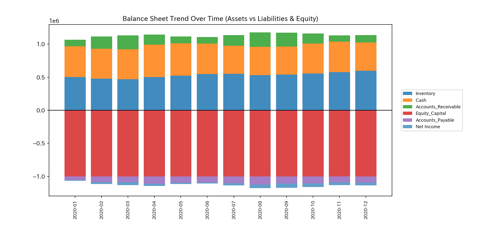
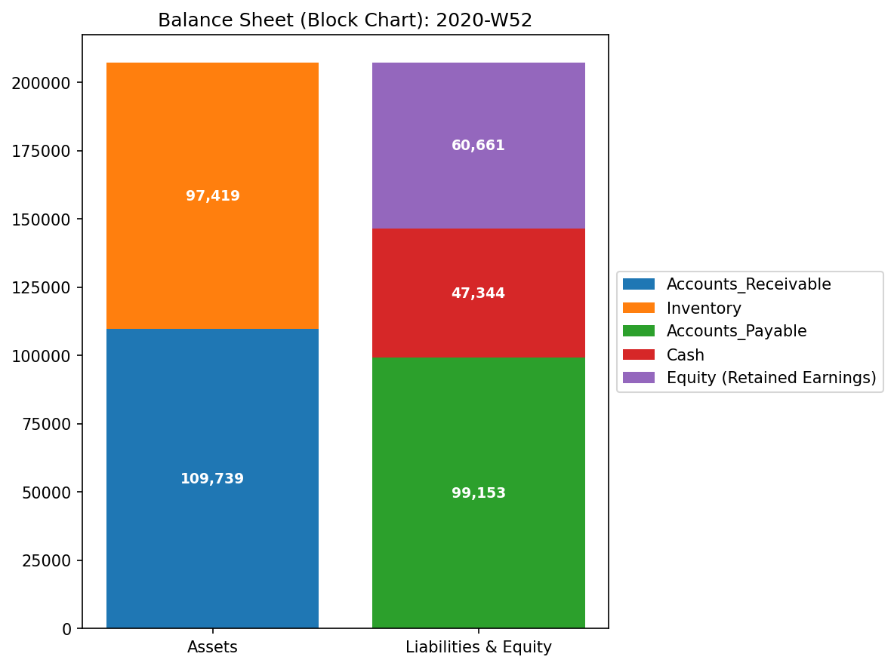
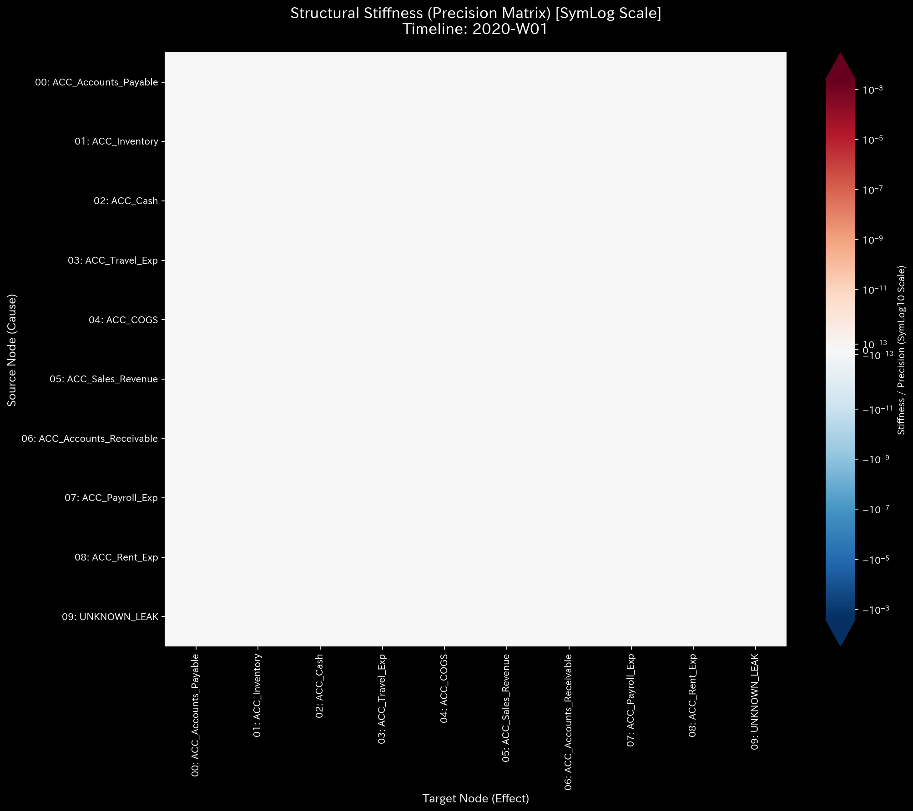
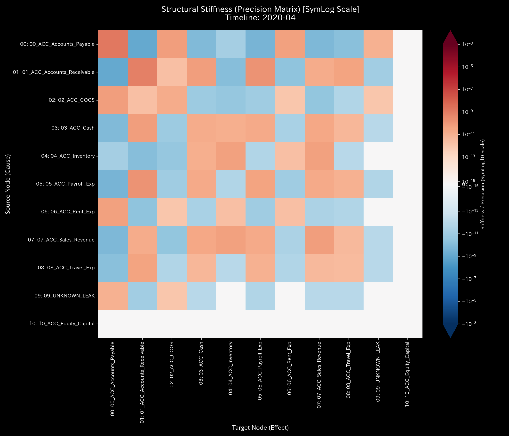
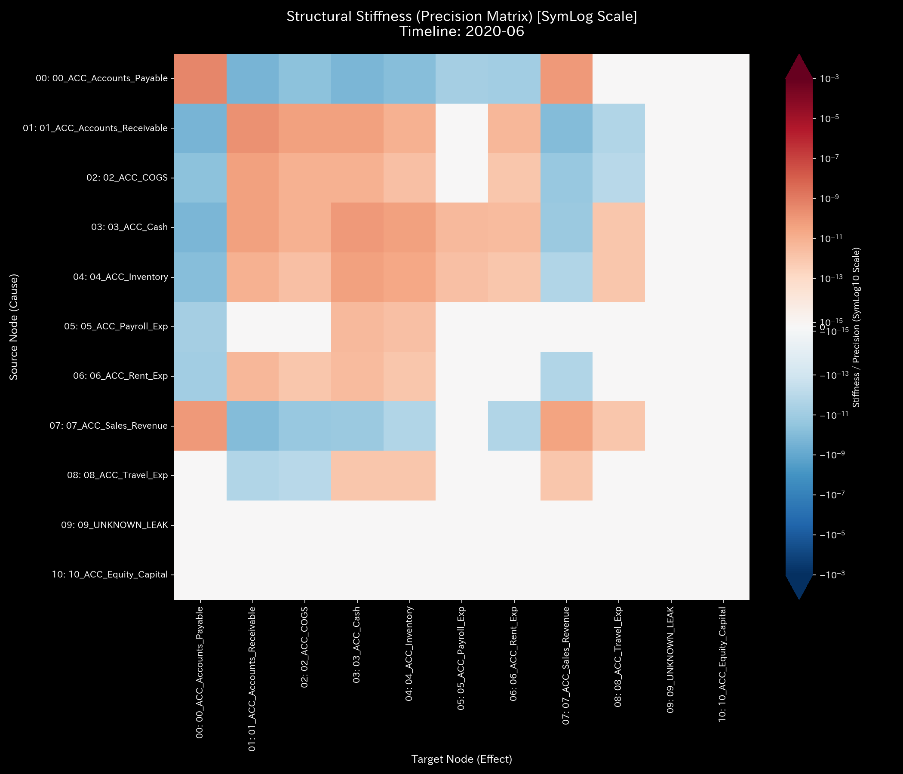
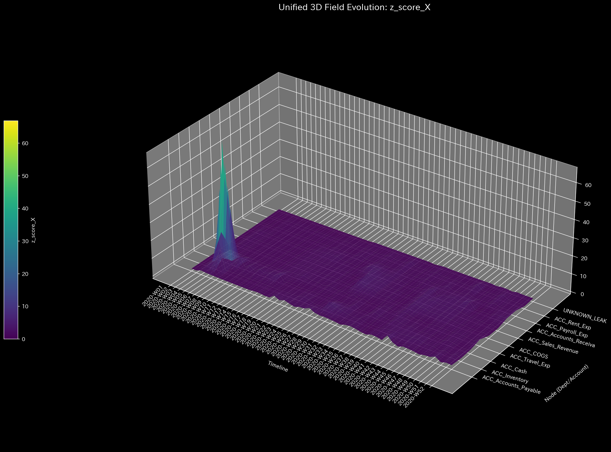

# 🔬 メタ診断臨床検査レポート：単発の入力ミス / 経理システム不整合 (Sample 3)

## 1. 診断結論 (Executive Summary)

* **総合診断:** **一時的データ不整合 / 経理ヒューマンエラー（WARNING: Data Mismatch / Transient Anomaly）**
* **重症度:** 🟡 **WARNING (警告・要監視)**
* **臨床概要:**
    本システムは、一部の売掛金回収仕訳において貸借金額が一致しない「局所的データ不整合（質量欠損）」を発症しています。シミュレーション期間中の累計で **`$1,412.88`** の質量が一時的にシステム外へ流出し、仮想的なゴミ箱ノードである `UNKNOWN_LEAK` へ振り分けられました。

    しかし、物理・数学エンジンの解析結果は、これが悪意のある継続的な資金着服（横領）ではなく、**「偶発的または連携バグに起因する単発の入力不整合（打撲・ねんざ）」**であることを証明しています。ネットワークの最大スペクトル半径は全期間を通じて **`0.00`** を維持しており、循環取引（架空還流ループ）のような病的共振トポロジーは一切存在しません。さらに、質量欠損（衝撃）が発生した直後に、剛性行列（システムの力学的骨組み）が速やかに元の健全な状態へ復元する**「自己治癒能力（弾性）」**が機能しています。

    統計的な Z-Score 監視においては、7月および8月に一時的な売上急増（季節変動）に反応した**「統計的偽陽性 (False Positive)」**の警告スパイクが立ち上がる一方、11月の最大不整合（`$906.29`）に対しては取引全体の流動成分に埋没しアラートが沈黙する**「統計的偽陰性 (False Negative)」**が発生しています。表層の Z-Score のみでは真の不整合を看過する危険性がありますが、物理保存則（キルヒホッフ残差）およびトポロジーの自己修復性に基づく TLU 統合診断アプローチにより、本件は正常構造維持下の「単発ミス」と判定されます。

---

## 2. 伝統的表層分析の限界 (Limitations of Traditional Audits)

伝統的な会計監査や単一時点のスナップショット監視では、入力時の「貸借不一致（Debit != Credit）」が発生した際、決算処理を成立させるために「諸口」や「仮受・仮払金」といった一時的なサスペンス勘定（本システムでは `UNKNOWN_LEAK` に相当）を用いて B/S の貸借バランスを強制的に合致させてしまいます。

以下は、本サンプルの最終ステップにおける財務諸表（P/L、B/S）の構成・推移図です。

* **B/S 資産・資本推移:**
    
    
* **P/L 売上・費用推移:**
    
    

P/L 上は累積売上高に対して営業費用が健全に連動しており、最終的に利益剰余金が積み上がっています。B/S の総額バランスも維持されているため、静的な集計値だけを見ている経営管理層や外部監査人は、システム内部でデータの整合性が崩れている（質量欠損が発生している）事実に気づくことができません。物理エンジンによる動的残差の追跡がない限り、このデータの「腐食」はしっかりと隠蔽されます。

---

## 3. 根本病理の特定 (Fundamental Pathophysiology)

物理解析エンジンは、対象データ内に発生した不整合の具体的な発生箇所と金額をしっかりと捕捉しています。本不整合は、すべて売掛金回収プロセス（`AR_Collection`）における片面入力エラーによるものです。

* **不整合仕訳の発生機序（計4件、累計不整合額 `$1,412.88`）**:
    1. **2020-02 (t=1):** 取引ID [E_000484](../../../../samples/Sample_3_Unbalanced_Mistake/input_stream/Dummy_Journal_Stream.csv#L968-L969) において、売掛金（`Accounts_Receivable`）の減少（Credit）が `$513.93` 記録されたのに対し、現預金（`Cash`）の増加（Debit）が `$347.35` しか記録されず、差額 **`$166.58`** が質量欠損となりました。
    2. **2020-03 (t=2):** 取引ID [E_000771](../../../../samples/Sample_3_Unbalanced_Mistake/input_stream/Dummy_Journal_Stream.csv#L1542-L1543) において、売掛金（`Accounts_Receivable`）の減少が `$571.88` に対し、現預金の増加が `$231.87` となり、差額 **`$340.01`** が質量欠損となりました。
    3. **2020-11 (t=10):** 以下の2つの仕訳で同時に片端入力ミスが発生しました。
        * 取引ID [E_002988](../../../../samples/Sample_3_Unbalanced_Mistake/input_stream/Dummy_Journal_Stream.csv#L5976-L5977) において、売掛金減少 `$950.16` に対し、現預金増加が `$171.60` （差額 **`$778.56`**）。
        * 取引ID [E_003179](../../../../samples/Sample_3_Unbalanced_Mistake/input_stream/Dummy_Journal_Stream.csv#L6358-L6359) において、売掛金減少 `$734.53` に対し、現預金増加が `$606.80` （差額 **`$127.73`**）。
        * 11月の合計不整合額は **`$906.29`** となります。

物理エンジンは、この「宙に浮いた質量」を相殺して複式簿記の閉鎖系を保つために、自動的に `UNKNOWN_LEAK` ノードへこの差額を割り振ります。しかし、組織的横領（Sample 2）のように資金の流出経路がトポロジー的に固定・肥大化するのとは異なり、本サンプルは後述の通り「剛性の自己治癒性」を極めて明瞭に示しています。

---

## 4. 数理物理エンジンによる詳細臨床データ（数理証明）

物理数理エンジンが算出した定量的な臨床データに基づき、本システムの構造的特徴を数理的に証明します。

### 4.1. キルヒホッフ残差と質量保存の局所的破れ

システムの資金の流入・流出の差分を示す物理保存則残差（`System Conservation Residual`）は、不整合が発生した 2020-02 に **`166.58`**、2020-03 に **`340.01`**、そして 2020-11 に **`906.29`** という局所的な不一致のスパイクを示しています（累計 `$1,412.88`）。これ以外の月においては残差はしっかりと `0.00` であり、流出が持続していないことを物理的に示しています。

* **マクロ・フォレンジック・ダッシュボード (Macro Forensics):**
    

### 4.2. 構造剛性の動的復元力とPCA支配軸の安定性

剛性行列（Stiffness Matrix）の時系列シーケンスは、本エラーが「一時的なひずみ」に過ぎないことを極めて動的に視覚化しています。

* **剛性行列のシネマティック5定点シーケンス:**
  * **① Start (t=0 / 2020-01):**
        
        無垢な初期状態。結合剛性は全体に均等に分散しており、健康な構造を示しています。
  * **② Just Before Change (t=3 / 2020-04):**
        
        2月・3月の入力ミスの直後のステップ。システムは受けた局所的なひずみを徐々に減衰させ、安定したベースラインを維持しています。
  * **③ The Exact Point of Change (t=4 / 2020-05):**
        
        一時的な剛性の乱れが発生している瞬間。特定のノード間で薄くストレスの伝播を示す赤色の領域が走っています。
  * **④ Immediately After Change (t=5 / 2020-06):**
        
        **【自己治癒の証明】** エラーの衝撃波が通過した直後のステップ。歪みは残留せず、剛性行列は速やかに元の調和の取れた「青と緑のモザイク模様（健全状態）」へと完全自己復元しています。
  * **⑤ End (t=11 / 2020-12):**
        
        最終期。11月の不整合に対してもシステムの復元力が働き、末端の慢性的な剛性ロックや破壊をしっかりと回避した状態で安定しています。

主成分分析（PCA）において、2020-03 (`t_idx=2`) の PC0 固有値は **`3,624,242,561.66`** となり、説明分散比率は **`100.0%`** に達しています。この主成分ベクトル（PC0）の構成要素は `01_ACC_Accounts_Receivable` (`-0.7546`)、`07_ACC_Sales_Revenue` (`0.4236`)、`04_ACC_Inventory` (`0.4259`)、および `02_ACC_COGS` (`-0.2296`) と `03_ACC_Cash` (`0.1135`) によって占められています。これは、主要な取引の Volume 変化によるものであり、異常な `UNKNOWN_LEAK` ノードが支配軸を固定的にハイジャックする現象（Sample 2で観察されたような病的同期）は起きていません。

* **PCA 主要軸比率 (PCA Principal Axes Ratio):**
    

### 4.3. トポロジー安定性と熱力学サイクル軌跡

隣接結合行列の最大固有値である最大スペクトル半径（Spectral Radius）は、全期間を通じて **`0.00`** を維持しています。これはシステム内に「自己還流ループ（循環取引）」が存在しないことを示しています。

* **システム安定性指標 (Spectral Radius):**
    

また、熱力学エネルギースタックおよび T-S ダイアグラムの軌跡も、健全な商業的自然成長モデルである [Sample 0の臨床リファレンス](../Sample_0_Healthy/README.md) にきわめて近い開放的な軌道を描いています。摩擦熱（エントロピー $-TS$）の異常な拡大はなく、自由エネルギー $F$ の蓄積も順調であり、熱力学的「熱死」の兆候は一切見られません。

* **熱力学エネルギースタック (Thermodynamics Energy Stack):**
    
* **T-S ダイアグラム (T-S Diagram):**
    

### 4.4. 3D Ribbon / Surface 立体プロットによる統合アプローチ

時間・空間・異常指標を立体化した3Dプロットは、入力ミスの発生機序と、それがシステムに与えた局所的な熱力学的影響を可視化します。

* **① 3D局所熱力学プロット:**
    
    
  * **局所エントロピー ($s_i$):** 空間的フローの分散度を示します。本サンプルは単発の入力ミス（貸借不一致）であり、定常的な流路（トポロジー）の組み換えが行われたわけではないため、空間的な分散度は全ノードでほぼ平坦で低く保たれており、持続的な構造汚染はありません。
  * **局所温度 ($T_i$):** 各科目の残高の時系列ボラティリティ（標準偏差）を示します。入力ミスが発生した月（2月, 3月, 11月）において、不整合分が `UNKNOWN_LEAK` に滞留することで、`ACC_Accounts_Receivable` および `UNKNOWN_LEAK` の残高が一時的に急変し、その月限定でピンポイントの温度スパイク（局所発熱）を記録しています。これは、組織的横領のように熱が継続的に蓄積されるのとは対照的に、エラー発生月のみに局在する「瞬間的な打撲熱」のような挙動を示しています。

* **② 3Dミクロ情報幾何学および3D Z-Scoreプロット:**
    
    

  ##### 1. 3D Micro KL Drift (情報幾何学の「ゼロ・トゥ・ワン」高感度検知)

    情報幾何学プロットでは、2020-02 (`t_idx=1`) において `01_ACC_Accounts_Receivable` (売掛金) ノードに **`20.6829`**、`03_ACC_Cash` (現預金) に **`5.0088`** の極めて鋭くそびえ立つ単一の「尖塔（KL Drift の壁）」が立ち上がっています。
    これは、1月には存在しなかった「売掛金の回収フロー」が2月に初めて発生したことによる不連続な確率分布の相転移（ゼロから非ゼロへの構造変化）を捉えたものです。
    一方、3月の入力ミス期は **`0.6936`** (売掛金)、11月の最大不整合（`$906.29`）に対しては **`0.1330`** とほぼ平坦になっています。これは、既にトポロジー構造に回収フローおよび漏洩ノードが接続された後の出来事であり、さらに11月は月間総取引量（約10万ドル）に占める不整合額（約0.88%）の割合が極めて小さいため、確率分布の幾何学的変位としては「無風（ノイズ以下）」とみなされたためです。

1. **3D Micro Z-Score (統計ベースラインの Volume 依存死角):**
    Z-Score プロットは、不整合が起きた2月、3月、11月には沈黙（Z-Score < 1.5）しているのに対し、**2020-07および2020-08において最大のスパイク警告針**を突き立たせています。
    7月には `01_ACC_Accounts_Receivable` が **`8.2579`**、`07_ACC_Sales_Revenue` が **`6.5021`** に達し、8月には `06_ACC_Rent_Exp` が **`10.4443`** に急上昇しています。これは、7月に売上高が通常の2倍（約12.4万ドル）に拡大し、8月に家賃等の支払いに伴う正常な Volume の拡大が起きたため、過去の平均から統計的に外れ値として「過剰検知」されたものです（偽陽性の典型例）。
    逆に、11月の最大不整合に対しては、取引全体の分散が大きくなったことに埋没し、Z-Score が **`1.4817`** (売掛金)、**`0.2926`** (現預金) としっかりと沈黙しています（統計的偽陰性）。

---

## 5. 局所治療処方箋 (LQR Control Parameter Tuning)

* **治療方針: 会計データ連携のシステムロックと手動突合プロセスの確立**
* **LQR 感度介入（ツボの特定）:**
    本ネットワークにおける制御感度解析（Sensitivity Matrix）では、不整合の発生経路である `ACC_Accounts_Receivable` (売掛金) ノードが改善感度の最大点として算出されています。
    
* **実務上の改善介入提案:**
    1. **スキーマバリデーションの強制適用:**
        会計システム（ERP）への仕訳インポート時、借方（Debit）と貸方（Credit）の差額がしっかりとゼロでない場合、インポートプロセスをインターロック（強制遮断）し、エラーログを吐き出すようにコードを修正します。
    2. **API 端数処理ロジックの修正:**
        基幹業務システム（SFA/CRM）から会計システムへ売掛消込データを自動送信するバッチプログラムにおいて、消費税計算や丸め誤差（端数調整）の処理方法に論理的なバグが存在していないかを点検・修正します。
    3. **手動差異調整のプロセス導入:**
        月次の締め処理において、`Accounts_Receivable` の減少総額と `Cash` の増加総額を毎月自動突合し、差額が発生した場合は翌営業日までに手動で追跡・解消するワークフローを社内規定に追加します。

---

## 6. 🚨 Forensic Alert & 反証可能性 (Falsification Analytics)

### 6.1. 統計的偽陽性と偽陰性のトリアージ (Triaging Statistical Anomalies)

* **トリアージ判定:** 7月および8月に発生した Z-Score のスパイク警告は、すべて**「正常活動に伴う統計的偽陽性」**として正式に棄却（Dismiss）します。これは、深層のキルヒホッフ物理残差がその期間中に完璧な `0.00` を示しており、スペクトル半径もゼロで安定しているためです。
* **偽陰性の克服:** 一方、Z-Score が沈黙した11月には、キルヒホッフ残差が **`906.29`** の異常値を示しているため、統計モデルの沈黙（正常判定）を棄却し、**「物理不整合（データ破損）」**が発生しているとトリアージ（診断確定）します。剛性行列が一時的な歪みのあとに即座に自己治癒していることから、組織的な資金流出（横領）ではなく「単発のエラー」と判断します。

### 6.2. 本診断に対する反証条件 (Falsifiability)

もし本診断が「偶発的なヒューマンエラーではなく、組織的な悪意ある資金着服（横領）」であると反証するためには、監査人は以下の**「システム外の客観的な第三者証拠・物理的原本」**を提示しなければなりません：

1. **金融機関の送金指図書（原本）との突合:**
    消失したとされる差額（計 `$1,412.88`）について、対応する日付（2020-02-23, 2020-03-20, 2020-11-02, 2020-11-27）において、法人の正規口座から第三者の未開示口座へ同額の送金が実際に行われていることを示す、改ざん不能な「銀行口座取引明細書原本」または「送金受領書原本」。
2. **物理的配送ログとの不一致の提示:**
    売掛金の減少（消込）が過大に行われた取引先に関して、物流業者（ヤマト運輸、佐川急便等）の独立した「出荷・検収伝票原本」を照合し、帳簿上の減少額と、実際に配送・納品された商品の物理的質量（数量・金額）との間に、説明のつかない不一致が存在することの提示。
