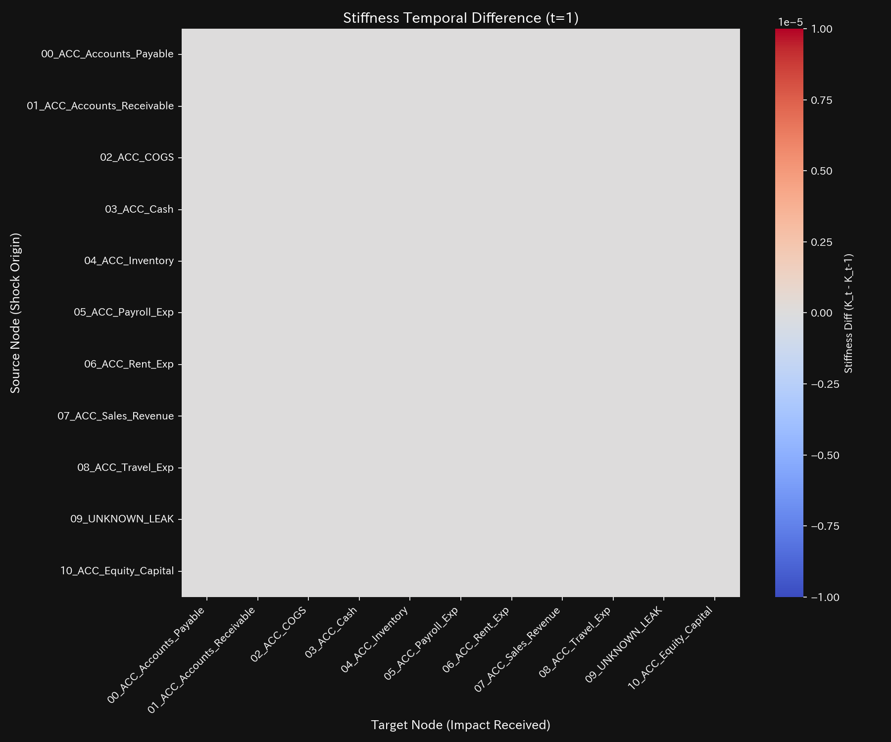

# 入力ミス 臨床要約書（ケース3）

> [!NOTE]
> より詳細な技術的データを含む臨床診断書は [clinical_report.md](clinical_report.md) にあります。

---

## 0. エグゼクティヴ・サマリー (Executive Summary)

* **総合判定:** 【軽微な異常・自己修復済（局所気血失調・経絡捻挫）】 2月（t=1）に入力エラーによる一時的な貸借不一致が発生しましたが、翌月には完全に修復され、健康な循環に戻っています。
* **総合体質評価（健康状態）:**
  組織の総資産（**「体格」**）は `$1,000,000.00` で安定しています。2月に一過性の不整合（**「質量不整合」**）が検出されましたが、翌月には完全に自己治癒しました。一時的に決済の衝撃（**「脈の乱れ」**）と初期波（**「初期のゆらぎ」**）が発生しましたが、即座にフラットな正常値へと沈静化しています。
* **要改善点と共生治療:**
  - **肩こり（回収サイトの遅延）:** **`02_ACC_COGS`**（売上原価）に一時的な決済遅延（肩こり）が発生しましたが、翌月には解消しています。
  - **ツボ（改善ポイント）:** **`02_ACC_COGS`**（売上原価）が、入力ミスを防ぐための最適なツボです。
  - **禁忌（避けるべき介入）:** 強い反発を招く **`09_ACC_Equity_Capital`**（自己資本）への直接調整は避けてください。

---

## 1. 総合病態診断（入力ミス）

### 一過性アノマリー（自己減衰）

* **数理ブリッジ説明:**
  システムの還流の暴走度を示す指標（スペクトル半径）です。全期間を通じて `0.0000` であり、内部に循環取引などの病的ループが一切形成されていないことを示しています。

---

## 2. 総合体質評価

組織の資金循環能力を、東洋医学的メタファーに基づく体質パラメータとして評価します。

### ① 体格 (総資産の規模)

* **数理ブリッジ説明:**
  総資産の合計トレンドです。2月（t=1）に `$22,000.00` の一時的な貸借のズレ（筋肉の捻挫）が発生しましたが、3月（t=2）に自動補正されて正常に戻っていることを示します。

### ② 免疫力 (ショック吸収バッファー)

* **数理ブリッジ説明:**
  利益の蓄積トレンドです。一時的な不整合により利益の認識が動揺しましたが、翌月には防衛力（自由エネルギー）が元の健康な成長軌道へ復帰しています。

### ③ 自律神経 (資金の分散多様性)

* **数理ブリッジ説明:**
  資金の多様性とボラティリティの関係図です。2月に軌道が一瞬動揺しましたが、すぐに正常な定常軌道（アトラクター）へ引き戻される、高い自己復元力を証明しています。

### ④ 動脈硬化 (取引の固定ロック評価)

* **数理ブリッジ説明:**
  特定の取引の支配率（PCA比率）です。支配率は低水準で安定しており、特定の部門間に取引がフリーズする硬化（動脈硬化）がないことを表しています。

### ⑤ 脈の乱れと波及（高次決済ショック）

* **数理ブリッジ説明:**
  決済流量の加速度の急変（Jerk/脈の乱れ）と初期波（Snap）です。不整合が発生した2月（t=1）と、修復された3月（t=2）のタイミングにのみ鋭い不連続スパイクが走り、以降は完全に沈静化しています。

---

## 3. 主要な滞留と共生介入

### ⚠️ 肩こり (慢性的な遅延)

* **数理ブリッジ説明:**
  資金状態の3次元ダイナミクスを示すリボン図です。**`02_ACC_COGS`**（売上原価）に一時的な決済遅延（肩こり）が見られましたが、3月には速やかに解消され、正常化しています。

### 🎯 治療点「ツボ」 (最適改善ポイント)

* **数理ブリッジ説明:**
  介入時の感度と反発応力をマッピングした行列です。**`02_ACC_COGS`**（売上原価）への調整が最も低負荷で効果的（ツボ）であることを示しています。

### 🚫 禁忌
* **`09_ACC_Equity_Capital`**（自己資本）への強引な調整は、構造ストレス（歪みエネルギー）を誘発しシステム全体を麻痺させるため避けてください。

### ⚡ 決済血管の時間的急変（剛性時間差分）
- **剛性時間差分ヒートマップシーケンス (縦一列表示)**:
  - **初期 (t=1)**: 
  - **中間 (t=2)**: 
  - **最終 (t=11)**: 
* **数理ブリッジ説明:**
  タイムステップ間における取引剛性の動的な変化（差分 $\Delta K_t$）を示すヒートマップです。入力ミスが発生した2月（t=1）に赤く血管の硬化が発生し、修復された3月（t=2）に青くストレスが解放され、以降は真っ白（変化なし）な健全状態へ戻っています。

---

## 4. 反証可能性 (Falsifiability)

本診断結果（一過性の入力ミス）を覆すには、以下の客観的証拠を提示する必要があります：

1. **持続的な貸借不一致の存在:**
   t=2 以降も累積して貸借のズレが拡大し、簿外への継続的な資金流出が発生していることを示す元帳監査ログ。
2. **架空売上の契約書:**
   2月に計上された取引がエラーではなく、実態のない循環取引であることを裏付ける、対向先との相殺裏合意書。

---
*発行: TLU 数理診断エンジン*
