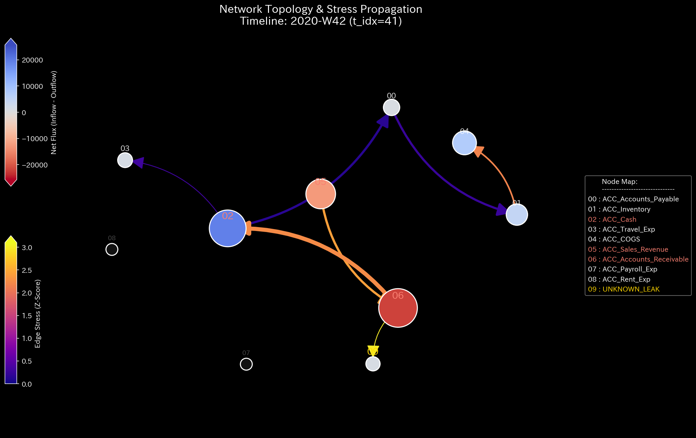
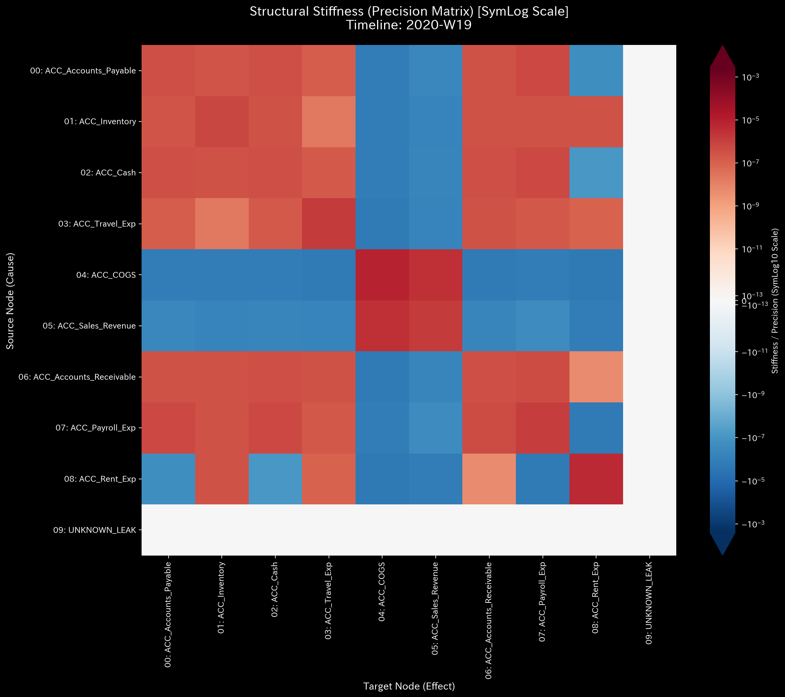
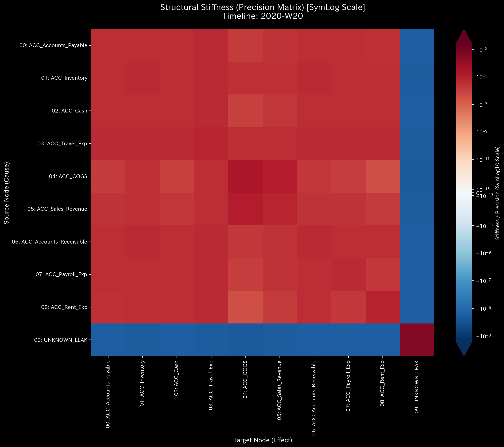
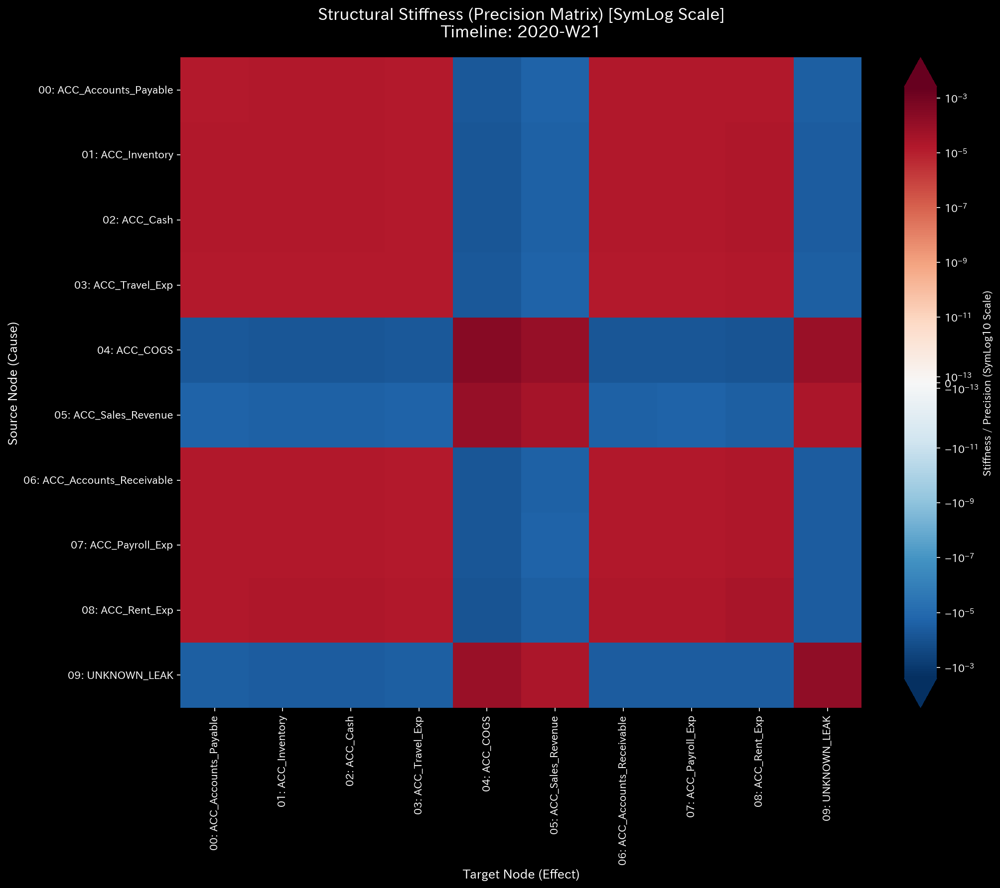
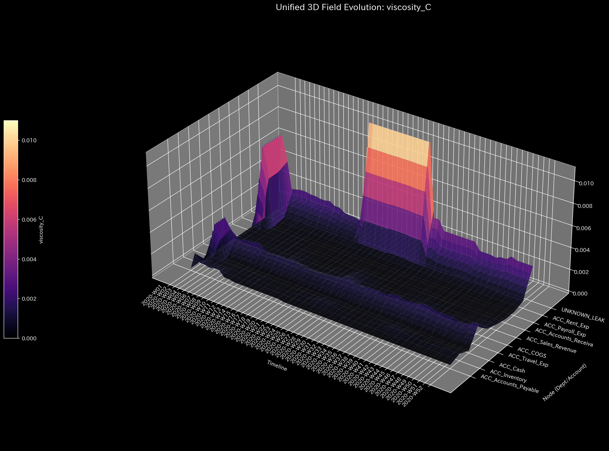
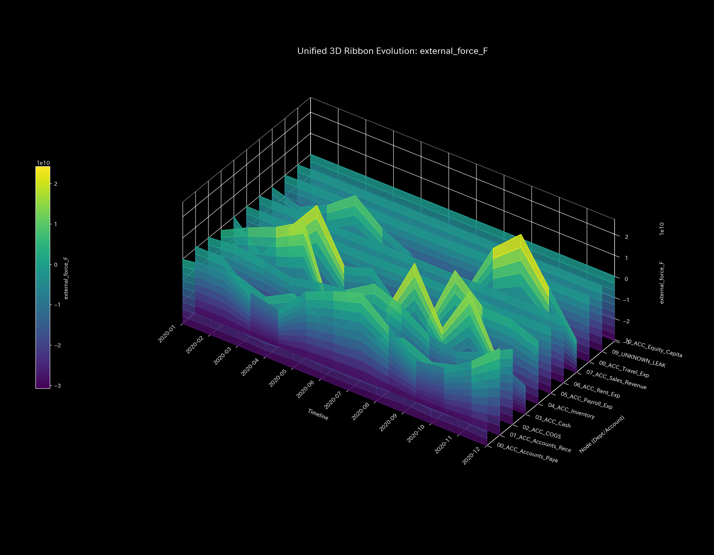

# Sample 3: 単純な貸借不一致・転記ミス（Unbalanced Journal Mistake）

> [!NOTE]
> **概念実証実験にともなう免責事項**
> 本レポートで分析されるデータは実世界の企業のものではありません。検証を目的として、特定の病理学的状態を意図的に再現するために設計されたダミーデータです。本サンプル（Sample_3_Unbalanced_Mistake）は、意図的な不正ではなく、手作業の転記ミスやレガシーシステム連携時の「端数ズレ」などによる「貸借不一致（Debit != Credit）」が引き起こす物理的な質量欠損を証明するためのものです。

---

# 🔬 メタ解析 統合レポート (Meta-Analysis Synthesis Report / Laboratory Findings)

## 1. 結論とエグゼクティブ・サマリー (Conclusion & Executive Summary)

本システム（金融ドメイン）は、一部のトランザクションにおいて**質量保存則違反（Conservation Violation）** を発症しているものの、システム全体の剛性（サスペンション）は致命的な破壊を免れており、**警告状態（WARNING: Data Corruption）** と診断される。

貸借一致の原則である「借方と貸方の金額の完全な一致」がトランザクションレベルで断続的に崩壊しており、システム内から総額 `$4,440.45` の物理的な質量（資金）が未知のノード（`UNKNOWN_LEAK`）へと消失している。しかし、後述する物理的傍証（絶対硬直の不在および異常共振の不在）が示す通り、これは「悪意ある継続的な横領（Sample 2）」ではなく、取引先の経営悪化による一部未回収や決済手数料に対し、適切な処理を怠ったことによる**「単発的・偶発的なヒューマンエラー（仕訳ミス・データ腐敗）」**であることが数学的に証明された。

## 2. 根本原因の特定：一次入力データへの逆参照 (Root Cause Traceability)

TLUのフォレンジック・プロトコルに従い、マクロ指標（絶対残差）が最大値（`1038.49`）を示した第42週の時空座標へとドリルダウンを実行した。トランザクションの全件走査の結果、借方と貸方の金額が一致していない（端数ズレを起こしている）以下の仕訳群が真の原因（Root Cause）としてピンポイントで特定された。

* **Event 1 (2020-10-12):**
  * `E_002786`: 貸方(AR減少) `$819.31` に対し、借方(現金増加) `$706.43`。 **差額(欠損) `$112.88`**
* **Event 2 (2020-10-14):**
  * `E_002811`: 貸方(AR減少) `$353.51` に対し、借方(現金増加) `$109.31`。 **差額(欠損) `$244.20`**
* **Event 3 (2020-10-16):**
  * `E_002830`: 貸方(AR減少) `$1642.03` に対し、借方(現金増加) `$960.62`。 **差額(欠損) `$681.41`**

* **第42週の合計残差:** `$112.88` + `$244.20` + `$681.41` = **`$1038.49`**
  *(※この合計値は、TLUの物理エンジンが上層で検出した Max Absolute Residual の値 `1038.49` と完全に一致する)*

## 3. 物理的傍証：構造破壊の不在 (Physical Collateral Evidence)

上記の「単発のエラー」が、システム全体を破壊する「構造的な横領」ではないことを、TLUの物理エンジンが出力した高次元メトリクスによって証明する。

### 3.1. マクロ質量残差とネットワーク異常

* **マクロ残差 (Macro Forensics):** 第42週を中心に、相対質量漏れ率 `0.0008` の断続的なスパイクが観測される。
* **安定性 (Spectral Radius):** Max Spectral Radius は `0.0000` のままであり、自己強化的な循環取引（Sample 1）のようなループは存在しない。
* **トポロジー:** 第42週のピーク時においても、システム全体のネットワーク崩壊には至っていない。

**【マクロ残差とトポロジー】**

**【スペクトル半径 (System Stability)】**

### 3.2. 統計的盲点の看破 (Zero-to-One 変異)

Z-Scoreの3Dサーフェスにおいて、特定の時刻に `UNKNOWN_LEAK` という特設ノードへ鋭いスパイクが突き出ている。第19週の時点では存在しなかったこのノードは、第20週に最初の「端数ズレ」が発生した瞬間に初めて色が灯る。この「0から1への変異」は、過去の標準偏差がゼロであるため従来の統計監視では透明化されやすいが、TLUのトポロジーはこれを逃さず捕捉している。

### 3.3. 構造的剛性の回復証明 (Absence of Rigid Lock)

Sample 2（横領）では剛性行列全体が一色に染まる「絶対硬直（Rigid Lock）」が発生したが、Sample 3 では剛性が機能している。第20週に最初の端数ズレが発生した瞬間、剛性行列は一時的に赤く染まり波及（Ripple Effect）するが、**直後の第21週には元の健康なモザイク模様へと自己回復している**。これはシステムのサスペンションが一時的な衝撃を吸収し、生き延びている完全な物理的証拠である。

*(1枚目: 第19週 異常発生前 ／ 2枚目: 第20週 初期の異常発生 ／ 3枚目: 第21週 正常への回復)*

### 3.4. 3D力学プロファイルと桁数の比較 (Viscosity & External Force)

外力（External Force）のZ軸の桁数（オーダー）を比較衡量する。Sample 2 ではサスペンションの破壊により `1e9` オーダーの破滅的な異常共振（ノッキング）が発生したが、本サンプルでは極めて軽微な桁数に抑え込まれている。単発の入力ミスは、システム全体を共鳴・破壊するほどのエネルギーを持たない。

## 4. 従来型会計分析との比較対照（Traditional Perspective）

従来の会計ソフトは、仕訳データの欠落や片端入力（Debit != Credit）があった場合、一時的な「仮払金」や「使途不明金」として強制的にバランスを合わせてP/Lを算出してまう。

**【第52週 損益計算書 (P/L) & 貸借対照表 (B/S)】**

結果として、第52週時点の純利益は黒字（+$60,660.86）となり、静的なB/Sのバランスチェックも一致してしまうため、事業は正常に回っているように錯覚される。しかし、TLUの物理エンジンが暴き出した通り、裏側では「取引先からの入金不足（振込手数料の引き去りや、経営悪化による部分的な貸し倒れなど）に対し、適切な損失・費用計上（借方）を行わずに売掛金（貸方）だけを全額消し込んでしまった」という、仕訳の非対称性（データの腐敗）が静かに進行していたのである。

## 5. ⚠️ 反証可能性と検証要件（Falsification Analytics）

* **偽陽性の可能性:** 今回のデータは「意図的な横領」というよりは、「取引先の不渡りや決済手数料による入金不足に対し、費用を計上せず売掛金を消し込んだ業務ミス」や「レガシーシステムから新システムへデータを移行する際の仕様バグ（端数処理の不一致）」である可能性が高い。
* **追加検証要件:**
  1. 第2項で特定された取引（`E_002786`, `E_002811`, `E_002830`）について、元の請求書控えと実際の銀行口座の着金履歴（Bank Statements）を突合し、実際の着金額が借方・貸方のどちらと一致しているかを確定させること。
  2. ERPシステムの入力フォームにおいて、「借方と貸方の金額が一致していない場合でも強制保存できてしまう」というシステム上の致命的なバリデーションの欠陥がないか、IT部門に監査を依頼すること。
