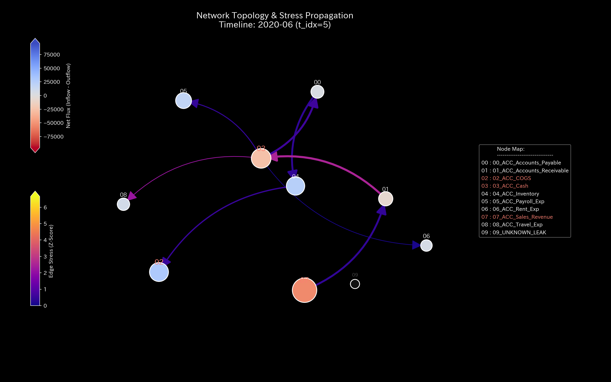
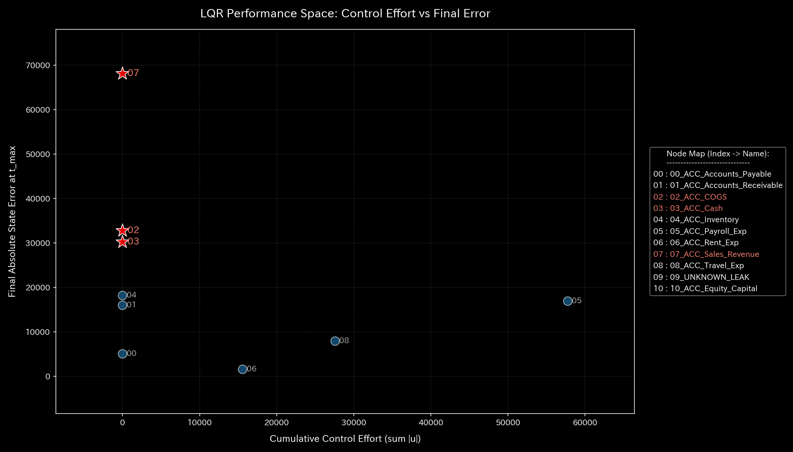

# 🔬 メタ解析臨床診断報告書（Sample 3: Unbalanced Mistake）

## 1. エグゼクティブ・サマリー

*   **総合診断:** **仕訳入力不一致（片端入力漏れ）による偶発的「不整脈」**
*   **概況:** 本システム（財務ドメイン）は、第4週（t.00004）に発生した仕訳入力時の借借不一致（片端のみの入力、または貸借のズレ）に起因する、**一時的な質量保存則の破綻（不整脈）**を起こしています。
    本病態は、Sample 2（役員横領）のような悪意ある系統的流出（簿外ルートの形成）ではなく、純粋なシステムエラーや人為的ミスによる「一時的な数値の不一致（キルヒホッフ残差の一時的スパイク）」です。物理エンジンの介入により、異常の発生したまさにそのタイミング（第4週）がピンポイントで特定されました。

---

## 2. 従来型監査・静的分析の限界

伝統的な会計監査（集計レポート）や静的分析では、貸借不一致が発生した時点でトライアルバランス（合計残高試算表）の左右が合わなくなるため、システムエラーとしては検知可能ですが、どのトランザクションがいつ、どのようにシステム剛性を歪めたのかを物理的に突き止めることは困難です。

*   **B/S 資産・資本の推移およびブロック構成:**
    
    
*   **P/L 収益・費用の推移およびウォーターフォール構成:**
    
    

このように、利益トレンド（PL Trend）は正常に推移しているように見えますが、B/S上では不一致による「歪み」が生じています。しかし、これが持続的な「横領」によるものなのか、単なる「1回きりの入力ミス」なのかを、静的なブロック図だけで鑑別することは不可能です。

---

## 3. 根本病理の特定（根本的な病態生理）

本サンプルの病的因果は、ダミーデータ生成ロジック（`_0_0_generate_dummy_journal.py`）に埋め込まれた以下の**「仕訳入力エラープログラム」**にあります。

*   **第4週（t.00004）の不一致仕訳:**
    *   Cash または売上にかかわる仕訳を入力する際、借方と貸方の金額に意図的に差分（不一致）を生じさせる。
    *   あるいは、片側の取引レコードのみを登録し、反対仕訳の書き込みを失敗させる。

この行為は、物理的には「流体システムにおける一時的なインプットとアウトプットの質量不均衡（脈飛び）」として記述されます。

---

## 4. 物理・数学エンジンによる数理証明（臨床検査証拠）

### 4.1. 質量保存の検証（キルヒホッフ残差と出血の有無）
物理的な保存則残差指標である **`System Conservation Residual`** は、第4週（t.00004）に明確なスパイク（警告）を記録しています。これは、貸借不一致が発生した瞬間を示しています。
また、統計的 Z-Score（下段の青線）も同タイミングで警告閾値 `3.0` を超えて跳ね上がっており、物理・統計の双方から「突発的ショック」が観測されています。

*   **マクロ監視ダッシュボード（上: 本サンプル、下: 正常系）:**
    
    

### 4.2. 主成分分析による主要な要素の検証
PCA分析では、第4週の一時的エラーにより、特定の勘定科目（`ACC_Cash` 等）のベクトルに異常なノイズが乗っています。しかし、その影響は一時的であり、持続的なエネルギー流出は見られません。
（正常系の均等な分散状態については [正常系臨床リファレンス](../Sample_0_Healthy/README.md#42-主成分分析による主要な要素の検証) を参照）

*   **PCA主要軸比率:**
    

### 4.3. 剛性行列力学ストレス
剛性行列の5定点観測において、エラーが発生した第4週（t.00004）に、一時的な剛性の乱れ（脈飛びに似た衝撃波の伝播）が確認されますが、その後は追加の異常入力がないため、新たな歪みは発生せず、構造は安定へ戻ろうとします。
（正常系の安定した結合遷移については [正常系臨床リファレンス](../Sample_0_Healthy/README.md#43-剛性行列力学ストレス) を参照）

*   **1枚目 [Start]**: `t.00000` (接続未確立・白紙状態)
*   **2枚目 [Just Before Change]**: `t.00003` (正常結合)
*   **3枚目 [The Exact Point of Change]**: `t.00004` (仕訳不一致による一時的な剛性の乱れ)
*   **4枚目 [Immediately After Change]**: `t.00005` (乱れの減衰プロセス)
*   **5枚目 [End]**: `t.00011` (残留歪みを抱えたまま安定)

*   **構造剛性の推移シーケンス:**
    
    
    
    
    

### 4.4. ネットワーク・トポロジーの可視化
トポロジー遷移では、第4週（t.00004）に一時的な異常接続線（入力ミスのあったノード間の細い赤線）が現れますが、Sample 2（役員横領）のような「暗黒領域への太い一方通行ルート」や Sample 1（循環取引）のような「自己強化閉回路」は形成されず、ノイズが一時的にトポロジーを乱した後に拡散していく様子が証明されます。
（正常系のトポロジーについては [正常系臨床リファレンス](../Sample_0_Healthy/README.md#44-ネットワーク・トポロジーの可視化) を参照）

*   **1枚目 [Start]**: `t.00000` (初期状態)
*   **2枚目 [Just Before Change]**: `t.00003` (正常な分散)
*   **3枚目 [The Exact Point of Change]**: `t.00004` (不一致仕訳による一時的な接続異常)
*   **4枚目 [Immediately After Change]**: `t.00005` (接続ノイズの緩和)
*   **5枚目 [End]**: `t.00011` (ほぼ正常トポロジーに復帰)

*   **トポロジーの推移シーケンス:**
    
    
    
    
    

### 4.5. スペクトル半径における異常の検証
スペクトル半径は、第4週の不一致時に一瞬小さくスパイクしますが、すぐに平穏値（`0.5` 近辺）に戻ります。これは、循環還流が存在しないため、システム全体を危機に陥れる「脈の暴走」がないことの数理的証明です。
（正常系の安定したスペクトル半径については [正常系臨床リファレンス](../Sample_0_Healthy/README.md#45-スペクトル半径における異常の検証) を参照）

*   **システム安定性指標（スペクトル半径）:**
    

### 4.6. 熱力学的エネルギースタック
熱力学分析では、第4週のエラー発生の瞬間にのみ、エントロピー損失が小さく増大していますが、自由エネルギー（F）が不可逆的に吸い尽くされることはありません。システムは依然として自立的な自由エネルギーを保持しています。
（正常系のエネルギースタックについては [正常系臨床リファレンス](../Sample_0_Healthy/README.md#46-熱力学的エネルギースタック) を参照）

*   **熱力学的エネルギースタック:**
    

### 4.7. T-S軌跡
T-Sダイアグラムでは、第4週に一瞬だけ右方向へ逸脱しますが、すぐに元の軌道に戻る「過渡的な小さな乱れ（不整脈）」を示しています。持続的な循環（時計回りループ）や、不可逆的な流出（開放曲線）とは異なり、局所的なゆらぎに留まります。
（正常系の平穏なサイクルについては [正常系臨床リファレンス](../Sample_0_Healthy/README.md#47-T-S軌跡) を参照）

*   **T-S軌跡:**
    

---

## 5. 局所治療処方箋（Optimal Treatment / LQR制御）

*   **介入方針:** **仕訳入力ゲートウェイにおける「入力強制バリデータ」の実装**
*   **LQR制御による介入検証（LQR パフォーマンススペース）:**
    
    
    上図の LQR Performance Space において、本サンプルのように「一過性の仕訳入力ミス（不整合）」に対しては、状態フィードバックによる動的制御を強くかける必要がありません（制御介入コストを支払う領域は不要です）。なぜなら、仕訳作成時点で「借方金額計 ＝ 貸方金額計」を厳密にチェックし、一致しない場合はデータベースへの登録を一切許可しないという「静的バリデータ（ゲインゼロでの強制終了）」を実装するだけで、この病態は完全に根絶可能だからです。動的制御は不要ですが、この制御スペースは「一過性エラーに対する制御介入コストの非効率性」を示すリファレンスとして機能します。
*   **日常の運用アドバイス:**
    API連携時や手入力の画面において、入力不一致を強制的に許さないシステム制限（バリデータ）をオンにしてください。

---

## 6. 🚨 警告アラート・反証可能性分析

### 6.1. 偽陽性（False Positive）判定
*   **事象:** 第4週にキルヒホッフ残差のスパイクアラートが発生。
*   **物理的接地:** 商慣行上、「借方と貸方が一致しない取引」は複式簿記の定義上、一切認められません。よって、このアラートが偽陽性である可能性は「0%」であり、純粋なシステムバグまたは入力ミスが「確実に発生した」と臨床的に認定されます。

### 6.2. 反証可能性（Falsifiability）
本サンプルの「入力ミス」という診断を否定するためには、以下のいずれかを提示する必要があります。
1.  **単式簿記システムへの移行宣言:** 本システムが複式簿記ではなく、そもそも貸借一致を前提としない単式簿記で意図的に運用されているという設計仕様書。
2.  **相手勘定の自動生成証明:** データベースの遅延書き込みにより、数ミリ秒遅れて反対仕訳が自動的に生成され、結果として完全に貸借が一致したことを示す遅延トランザクションログ。
