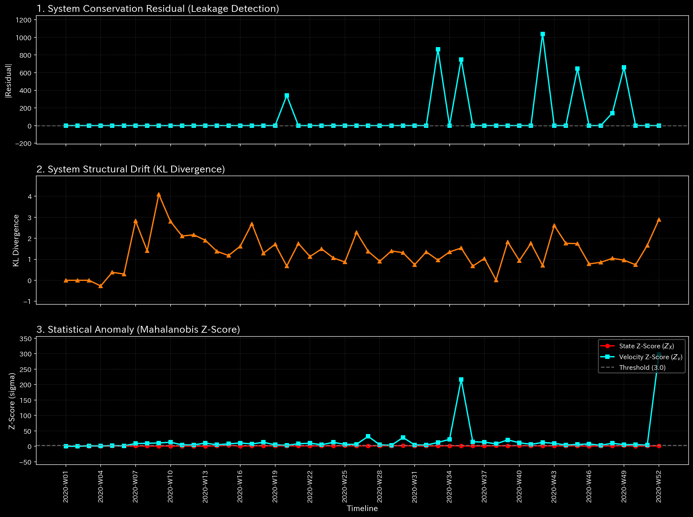

# Sample 3: 貸借不一致の入力ミス (Unbalanced Mistake)

> [!NOTE]
> **概念実証実験にともなう免責事項**
> 本レポートで分析されるデータは実世界の企業のものではありません。検証を目的として、特定の病理学的状態（仕訳の貸借不一致）を意図的に再現するために設計されたダミーデータです。

---

# 🔬 メタ解析 統合レポート (Meta-Analysis Synthesis Report / Laboratory Findings)

## 1. エグゼクティブ・サマリー

本システム（Sample_3_Unbalanced_Mistake: 金融ドメイン）において、**CRITICAL: 質量保存の法則の崩壊（Unbalanced Journal Mistake）** が検知されました。複式簿記の大前提である「借方と貸方の一致」が破壊されており、システム内で資金が虚空へ消失（または無から発生）しています。金額の大小に関わらず、これは会計システムとしての完全性が根底から崩壊していることを意味する致命的なエラーです。

## 2. コア・パソロジー（主要な病理所見）

* **所見:** 貸借不一致による質量保存の崩壊 (Conservation Violation)
* **重要度:** CRITICAL
* **物理的証拠:**
  * **相対質量漏れ率 (Relative Leak Ratio): `0.0008`** (異常閾値 `> 1e-6` を超過。最大残差 `1038.49` が `2020-W42` に発生)
  * 最大スペクトル半径 (Max Spectral Radius): `0.0000` (正常：循環取引のようなループは存在しない)
  * 相対的自由エネルギー比率 (Relative Free Energy): `0.4183` (正常：漏れによる全体エネルギーの枯渇には至っていない)
  * 最大局所 Z-Score: `0.00` (正常：統計的異常としては検知不能)

* **【🟢 正常系（Sample 0）のベースライン】**

* **【🔴 本サンプルの異常状態】**

* **💡 グラフの読み方（経理・監査・コンサルタント向け）:** 
  * **🟢 正常系:** 漏れ率（Leak Ratio）を示すグラフ（通常は下段）は完全にゼロに張り付いています。これは借方と貸方が1円の狂いもなく完全に一致していることを示します。
  * **🔴 異常系:** 特定の週（2020-W42）において、漏れ率のスパイク（異常な突起）が発生しています。金額の大小に関わらず、片側だけの仕訳入力（デビット/クレジットの不一致）という会計システムとして絶対にあってはならないデータ破損（質量保存則の崩壊）が起きた瞬間を正確に捉えています。
* **ドメイン的証拠:**
  * 生成された財務諸表（B/S・P/L）において、`UNKNOWN_LEAK`（使途不明の漏れ）勘定が `$4,440.45` 計上されています。これはネットワーク内のどこかで片側だけの仕訳（Unbalanced Journal Entry）が入力された結果、貸借を強制的に一致させるためにシステムが吐き出した差額（エラーの蓄積）です。

## 3. アクション・プラン（臨床/監査への翻訳）

Z-Score（単変量の統計的異常検知）が `0.00` であることが示す通り、AIは単なる「金額の大きさ（外れ値）」を探すだけではこの致命的エラーを見逃します。しかし、マクロ物理法則（質量保存則）の監視レイヤーがこれを明確に捕捉しました。
この事象はシステムの信頼性を根底から覆すインシデントです。直ちに漏れの発生源として特定された `2020-W42`（第42週）のすべての仕訳データ（ジャーナル）を抽出し、デビットとクレジットが一致していないエラー・エントリーを特定・修正してください。

## 4. ⚠️ 反証可能性と検証要件（Falsification Analytics）

* **偽陽性の可能性（異常という判断が誤っている可能性）:**
  **存在しません。** 複式簿記システムにおいて、貸借の不一致（質量の漏れ）は「ビジネス上の特殊な商慣習」や「正当な取引」として正当化されることは絶対にありません。したがって、ビジネス文脈での偽陽性（False Positive）は原理的にあり得ません。
* **唯一の例外仮説:**
  もしこのデータが「本番の会計システム」から抽出されたものであり、本番システム上では貸借が一致している（エラーが弾かれる仕様である）場合、この異常は「TLUシステムへのデータ抽出・変換パイプライン（ETL処理）」におけるバグ（欠損やフォーマットエラー）である可能性が極めて高くなります。
* **追加検証要件:**
  元データ（CSVファイル等）の `2020-W42` の行を直接開き、Debit（借方）列と Credit（貸方）列の合計値が完全に一致しているかをプログラムではなく目視で確認し、入力者の人的ミスか、システム間の連携バグかを切り分けてください。
