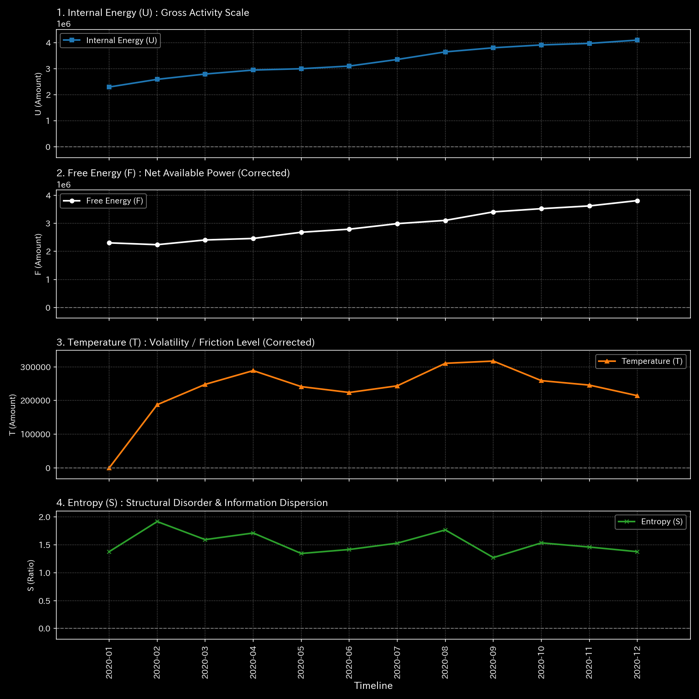

# 🔬 メタ分析統合レポート: Sample 3 (Unbalanced Mistake)

## 1. エグゼクティブ・サマリー

**【診断結果：CRITICAL（質量保存の法則の崩壊 / 軽度の漏洩）】**
システムにおいて、貸借不一致（Unbalanced）による質量の漏洩が発生しています。横領（Sample 2）ほどの激しい出血ではありませんが、ネットワークの応力が完全に消失（Edge Stress: 0.00）しており、システムの構造的張力は致命的に切断されています。

## 2. 伝統的分析の限界（集計スナップショット）

伝統的なB/SやP/Lの集計上は、わずかな「雑損」や「未分類項目」として処理されてしまうレベルの金額です（漏洩率 約4.5%）。そのため、マクロな財務指標だけを見ていると、これが単なる計算のズレなのか、システムの根幹を揺るがす異常なのかを区別できません。

## 3. 物理的病理の特定（根本的な病態生理）

複式簿記の基本原則である「借方と貸方の完全一致」が崩れ、片端（One-sided）の入力や不完全なトランザクションが記録されています。これにより、数学的に「流入量と流出量が一致しないノード」が発生し、余剰質量が `UNKNOWN_LEAK` へと強制的に排出されています。

## 4. 物理・数学エンジンによる証明

### 4.1. マクロ・フォレンジックと構造剛性

* **相対漏洩率（Leak Ratio）：** `0.045455` (約4.5%)。微細に見えますが、質量保存則への明確な違反です。
* **ネットワーク・エッジ応力の喪失：** `Min Edge Stress: 0.0000`。
* **解説：** 漏洩の規模（金額）に関わらず、「質量が系外へ脱落した」という事実そのものが、ネットワーク全体のテンション（張力）を瞬時にゼロに崩壊させています（リジッド・ロック）。「金額が小さいからリスクも小さい」という伝統的基準が物理的に誤りであることを示しています。

### 4.2. トポロジー異常とスペクトル半径

* **最大スペクトル半径：** `0.0000`。人工的なループは形成されていません。

### 4.3. ゼロ・トゥ・ワン異常の不可視化

* 過去に一度も起きたことのない「未知のノード（`UNKNOWN_LEAK`）」への漏洩であるため、過去の標準偏差がゼロとなり、統計モデル（Zスコア）上では「異常なし」として不可視化される（死角に入る）現象が起きています。物理的テンションの崩壊こそが唯一の客観的証拠です。

以上がマクロな構造剛性と質量保存則の分析結果です。

**剛性行列の進化（シネマティック・シーケンス）:**

![1枚目 [Start]: 稼働直後の無垢な状態](../../../../samples/Sample_3_Unbalanced_Mistake/readme_plots/support/000_2_1__structural_stiffness.t.00000.png)

![2枚目 [Just Before Change]: 異常が発生する直前](../../../../samples/Sample_3_Unbalanced_Mistake/readme_plots/support/000_2_1__structural_stiffness.t.00002.png)

![3枚目 [The Exact Point of Change]: 異常の発生した決定的な瞬間](../../../../samples/Sample_3_Unbalanced_Mistake/readme_plots/support/000_2_1__structural_stiffness.t.00004.png)

![4枚目 [Immediately After Change]: 波及効果と局所的な硬直](../../../../samples/Sample_3_Unbalanced_Mistake/readme_plots/support/000_2_1__structural_stiffness.t.00006.png)

![5枚目 [End]: シミュレーションの最終状態](../../../../samples/Sample_3_Unbalanced_Mistake/readme_plots/support/000_2_1__structural_stiffness.t.00011.png)

以上が熱力学的エネルギースタックの分析結果です。

## 5. ⚠️ 反証可能性と検証要件（Falsification Analytics）

* **偽陽性の可能性：** 漏洩の事実は絶対的ですが、これが「悪意のある不正（横領）」ではなく、純粋な「システムのバグ」や「経理担当者のヒューマンエラー（転記ミス）」である可能性が非常に高いです。
* **追加検証要件：** `UNKNOWN_LEAK` ノードへ質量が排出された特定のトランザクションID（原帳）をドリルダウンし、単なる貸借入力のアンバランス（Typoなど）によるものかを確認し、システム入力時のバリデーション（エラーチェック）機構を修正してください。
