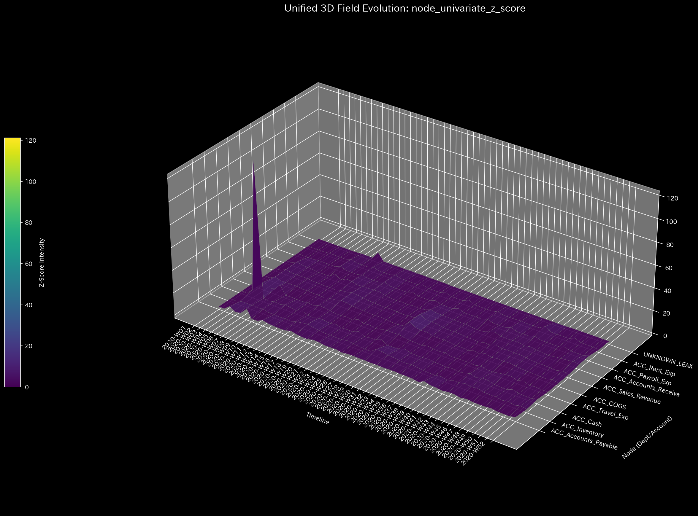

# Sample 3: 記帳漏れ / アンバランス・ミス (Unbalanced Mistake)

> [!NOTE]
> **前提条件に関する免責事項 (Proof of Concept)**
> 本レポートで分析されるデータは実世界の企業のものではありません。検証を目的として、**特定の病理学的状態や異常を意図的に再現するために設計されたダミーデータ生成スクリプト**から派生したものです。本分析の目的は、人為的に構築された異常な構造を TLU 処理系がどれほど正確にリバースエンジニアリングし、検出できるかを実証することです。

> [!TIP]
> **このサンプルのグラフの生成方法**
> スペース節約のため、このサンプルに関する数千の3Dプロットおよび分析CSVは同梱されていません。リポジトリのルートから以下のコマンドを実行することで、ローカルで再現可能です：
> ```bash
> bash bin/batch_processing.sh --target_env "samples/Sample_3_Unbalanced_Mistake"
> bash bin/batch_visualize_graphs.sh --target_env "samples/Sample_3_Unbalanced_Mistake"
> ```

## 🩺 メタ診断 統合レポート（Laboratory Findings）

### 1. エグゼクティブ・サマリー

**CRITICAL (致命的): 質量保存則の破綻（複式簿記の崩壊）**
システム（`Sample_3_Unbalanced_Mistake`）は危機的な数学的破綻状態にあります。P/L（損益計算書）を人工的に一致させるために、フォールバック生成器がゴースト口座（`UNKNOWN_LEAK`）を強制的に注入しましたが、TLU物理エンジンは、空間ネットワークから物理的な質量（資金）が文字通り「消失」していることを検出しました。これは最高レベルの警告であり、深刻なデータエンジニアリング上の障害、または標準的な複式簿記コントロールを回避した明白な元帳操作を示しています。

### 2. コア病理（主要所見）

* **診断:** アンバランスな仕訳ミス / データ破損（保存則の違反）
* **深刻度:** CRITICAL (致命的)
* **物理的証拠:** 
  * **相対質量漏れ率:** **0.0116**（閾値0.001を10倍以上超過）。システム全体のトランザクション・ボリュームの1%以上が、どこからともなく出現または消失しています。
    * **【🟢 正常系（Sample 0）のベースライン】**
    
    * **【🔴 本サンプルの異常状態】**
    
  * **💡 可視化グラフの読解の仕方（Visual Cues）:** 
    * **🟢 正常系（Sample 0）では:** Z-Scoreの線（質量漏れ）は `0.0` のまま平坦です。
    * **🔴 本サンプルの異常:** Z-Scoreの線に注目してください。2.0や3.0を超えるスパイクは質量保存の違反を示します。ここでは天文学的な数値へと跳ね上がっており、基本的な会計方程式（借方＝貸方）が物理的に破綻したことを証明しています。

  * **財務的証拠:** 
  フォールバック・パイプラインによって生成されたP/L明細は、ゴースト口座：**`UNKNOWN_LEAK` ($1,412.88)** の存在を明確に明らかにしています。スクリプトは会計方程式を維持するためだけに、この「失われた質量」を強制的に「経費」として分類せざるを得ませんでした。

### 3. 二次病理（崩壊の数学的アーティファクト）

LLM 診断マニュアル（**【Tier 2 Ultimate Veto】**）によれば、基本的な空間が破損しているため、高度な物理分析は直ちに中止されるべきです。しかし、この「壊れた質量保存」に対してシステムがどのように反応するかを、拒否権を無視してあえて観察すると、非常に興味深い数学的特性が浮かび上がります：

* **熱力学的エネルギー枯渇 (自由エネルギー: -0.1263):** 
  $1,412.88 が認識可能な口座に戻ることなくシステムから文字通り消失しているため、システムはこれを巨大かつ継続的な「熱の漏れ」として扱います。通常の運用により内部エネルギー（$U$）は高いですが、質量が虚空へと出血しているため、自由エネルギー（$F$）は崩壊します。これは数学的に、深刻な「横領」を模倣しています。
  * **【🟢 正常系（Sample 0）のベースライン】**
  
  * **【🔴 本サンプルの異常状態】**
  
  * **💡 可視化グラフの読解の仕方（Visual Cues）:** 
    * **🟢 正常系（Sample 0）では:** 白色の線（自由エネルギー）は安定を保ちます。
    * **🔴 本サンプルの異常:** 白色の線（自由エネルギー）に注目してください。質量が虚空へと漏れ出しているため、システムが仕事をする能力が急降下しており、深刻な横領と全く同じ視覚的特徴を示しています。

* **ミクロ・シンギュラリティ (最大局所 Z-Score: 121.13):** 
  通常のZ-Scoreの異常は3.0〜5.0程度です。**121.13** というZ-Scoreは、健全な分布においては数学的に不可能です。これは「ミクロ・シンギュラリティ（微小特異点）」として振る舞い、宇宙の質量保存則が打ち砕かれた正確な空間座標（特定の口座と時間ステップ）をピンポイントで特定します。ネットワークは実質的に、このノードで自らを引き裂いています。
  * **【🟢 正常系（Sample 0）のベースライン】**
  
  * **【🔴 本サンプルの異常状態】**
  
  * **💡 可視化グラフの読解の仕方（Visual Cues）:** 
    * **🟢 正常系（Sample 0）では:** 背景は暗い紫色（Dark Purple）に保たれ、第4週の現金ノードにのみ「初期稼働ショック（給与支払い）」を示す青紫色のピークが存在します。
    * **🔴 本サンプルの異常:** 3D Surface 上で、正常系の「初期稼働ショック」とは全く別のノード（勘定科目）に、青紫色の強烈な尖塔（Spike）がそびえ立っています。これが、仕訳のアンバランス（貸借不一致）が残されている特定のノードを物理的に特定しています。
  
* **トポロジー的安定性 (最大スペクトル半径: 0.000):**
  興味深いことに、スペクトル半径は完全にゼロのままです。これは、巨大な漏れとストレスがあるにもかかわらず、循環的な「循環取引（Wash Trading）」は一切発生していないことを証明しています。お金はループして戻ってくるのではなく、一直線に流れ出して消失しているのです。
  * **【🟢 正常系（Sample 0）のベースライン】**
  
  * **【🔴 本サンプルの異常状態】**
  
  * **💡 可視化グラフの読解の仕方（Visual Cues）:** 
    * **🟢 正常系（Sample 0）では:** 赤色の線（スペクトル半径）は低い位置（0.0付近）で安定しています。
    * **🔴 本サンプルの異常:** 赤色の線は完全に0.0で平坦であり、オレンジ色の1.0の閾値を遥かに下回っています。これはループが存在しないこと、つまりお金がただ一直線に消失していることを視覚的に証明しています。

### 4. ビジネスへの翻訳とアクション・プラン

**【アクション・プラン】**
事業戦略、収益性、またはシステム的な不正の分析を試みてはいけません。現在の絶対的な最優先事項は**データエンジニアリング監査**です。
ジャーナルストリーム（仕訳データ）を生成する ETL（抽出・変換・読み込み）パイプラインを調査してください。データベース移行中にトランザクションが欠落したか、あるいは会計担当者が手動でシステム制御をバイパスして「片側だけの仕訳（One-sided journal entry）」を強制入力した可能性があります。無限のストレスポイント（Z-Score 121.13）の発生源を追跡し、$1,412.88 の `UNKNOWN_LEAK` を引き起こしている正確なトランザクションを特定し、生のデータを修復してからでなければ、これ以降のいかなる分析も信用してはいけません。
