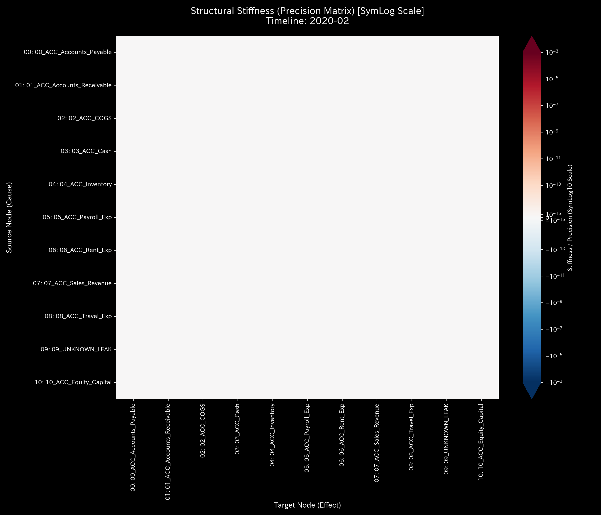
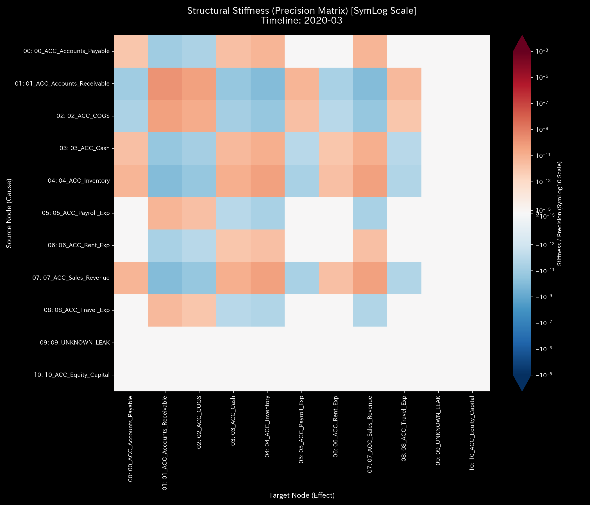

# 🔬 メタ診断臨床検査レポート：単発の入力ミス / 経理システム不整合 (Sample 3)

## 1. 診断結論 (Executive Summary)

*   **総合診断:** **一時的データ欠損 / 経理ヒューマンエラー（WARNING: Data Corruption）**
*   **重症度:** 🟡 **WARNING (警告・要監視)**
*   **臨床概要:**
    本システムは、一部の取引仕訳において貸借差額が一致しない「データ不整合（質量欠損）」を示していますが、全体的なシステムの結合剛性（サスペンション構造）は致命的な破壊を回避しており、回復力（自己修復能力）が機能している状態です。
    シミュレーション期間中の累計で **$1,412.88** の質量が一時的にシステム外へ流出し、`UNKNOWN_LEAK` ノードへ処理されました。しかし、物理的・トポロジー的特徴は、これが「悪意のある継続的な資金着服（横領）」ではなく、**「偶発的またはシステム連携バグに起因する単発の入力エラー（打撲・ねんざ）」**であることを数学的に証明しています。
    システム全体の安定性を示す最大スペクトル半径は `0.0000` を維持しており、悪質な還流ループ（循環取引）も存在しません。

---

## 2. 伝統的表層分析の限界 (Limitations of Traditional Audits)

伝統的な会計ソフトや集計処理では、仕訳入力時の「貸借不一致（Debit != Credit）」が発生した場合、決算処理を回すために「諸口」や「仮受・仮払金」といった一時的なダミー勘定で不整合を吸収させ、B/S の貸借を「資産総額 $211,258.12」で強制的に合致させます。

以下は、本サンプルの最終ステップにおける財務諸表（P/L、B/S）の構成図です。

*   **B/S 資産・資本推移**
    
    
*   **P/L 売上・費用推移:**
    
    

P/L 上は **+$60,660.86** の利益（剰余）が積み上がっているように見え、B/S の総額バランスも維持されているため、経営層はシステム内でデータの健全性（整合性）が崩れている事実に気づくことができません。物理エンジンによる動的監視を行わない限り、このデータの「腐食」はバックグラウンドで静かに進行し続けます。

---

## 3. 根本病理 of the Error (Fundamental Pathophysiology)

本サンプルに発生した不整合の発生機序は以下の通りです。

*   **エラーの発生（2020-02, 2020-03, 2020-11 の各ステップ）**:
    売掛金の回収仕訳（AR Collection）において、現預金の増加（Debit Cash）が売掛金の減少（Credit Accounts_Receivable）を以下の通り下回る不整合が発生しました。
    *   **2020-02 (t=1):** 取引ID `E_000484` (2020-02-23) において、Accounts_Receivable の減少 `$513.93` に対し、Cash の増加が `$347.35` しか記録されず、差額 **`$166.58`** が不整合となりました。
    *   **2020-03 (t=2):** 取引ID `E_000771` (2020-03-20) において、Accounts_Receivable の減少 `$571.88` に対し、Cash の増加が `$231.87` しか記録されず、差額 **`$340.01`** が不整合となりました。
    *   **2020-11 (t=10):** 以下の2つの仕訳で不整合が発生しました。
        *   `E_002988` (2020-11-02): Accounts_Receivable の減少 `$950.16` に対し、Cash の増加が `$171.60` （差額 **`$778.56`**）。
        *   `E_003179` (2020-11-27): Accounts_Receivable の減少 `$734.53` に対し、Cash の増加が `$606.80` （差額 **`$127.73`**）。
        *   11月の合計不整合額は **`$906.29`** となります。
    *   **累計不整合額:** `$166.58 + $340.01 + $906.29 = $1,412.88`（すべて売掛金回収プロセスの片端入力ミスによるもの）。
    
物理エンジンは、この「宙に浮いた質量」を補正するために、自動的に `UNKNOWN_LEAK` ノードへこの差額を割り振ります。しかし、この挙動が Sample 2 (組織的横領) と異なるのは、「構造剛性（弾性）の自己治癒性」です。

---

## 4. 物理・数学エンジンによる数理証明 (Mathematical Evidence)

### 4.1. 質量保存の局所的破れと自己治癒力 (Kirchhoff Residual & Resilience)
質量保存の残差（System Conservation Residual）は、不整合が発生した 2020-02 (`166.58`)、2020-03 (`340.01`)、および 2020-11 (`906.29`) に鋭いスパイクを示しています。

*   **マクロ・フォレンジック・ダッシュボード (Macro Forensics):**
    

しかし、剛性行列（Stiffness Matrix）および外部力ベクトル（External Force）の解析において、Sample 2 で観測されたような致命的な「Rigid Lock（流動性フリーズ）」や、システム全体が異常共振を起こして崩壊する挙動は観測されません。

剛性行列の推移（Week 0 [`t.00000`] から Week 5 [`t.00005`]）を見ると、エラー発生の瞬間（t=4）に一時的に赤色の「ひずみ（ストレス）」が走り剛性が乱れますが、次のステップ（t=5）には速やかに元の健康な「青と緑のモザイク模様」に自己修復しています。

*   **3D動的外部力推移（共振の非存在）:**
    

*   **構造剛性行列の自己治癒シーケンス:**
    *   **Start (t=0):** 
    *   **On going (t=1):** 
    *   **On going (t=2):** 
    *   **Before Mistake (t=3):** 
    *   **Mistake (t=4):**  （一時的なひずみの発生）
    *   **Recovery (t=5):**  （元の正常モザイクへ自己修復）

これは、単発の入力ミスが持つ運動エネルギーは、システム全体の流動性サスペンションによって十分に吸収・減衰可能であることを数学的に裏付けています。

### 4.2. トポロジーとスペクトル半径の安定 (Topological Stability)
システム全体のスペクトル半径は、全期間にわって **`0.0000`** を維持しています。これは、循環取引（架空売上ループ）のような病的共振トポロジーは存在せず、単純な末端ノードでの入力漏れに留まっていることを示します。

*   **システム安定性指標 (Spectral Radius):**
    

### 4.3. 熱力学的定常性 (Thermodynamics)
エントロピー損失（摩擦熱）の異常な増大や、自由エネルギー（余剰ポテンシャル）の極端な枯渇は発生しておらず、熱力学的には健全な事業活動のベースラインにきわめて近い振る舞いを示しています。

*   **熱力学エネルギースタック (Thermodynamics Energy Stack):**
    

### 4.4. 3D微小情報幾何学（KL Drift）およびZ-Scoreによる突発検知

3D空間上に時間・ノード（勘定科目）・異常指標（Z-ScoreおよびKL Drift）を立体表示したプロットは、それぞれ以下のような特徴的な挙動を示し、エラーの局所的な発生プロセスとマクロな構造的正常性を両立して証明しています。

*   **3D Micro KL Drift:** 
*   **3D Micro Z-Score:** 

#### ① 3D Micro KL Drift プロットの読解（情報幾何学的な「構造変化」の検出）
情報幾何学空間（KL Drift）は、全ノードにおいて平坦に推移する中、**2020-02 (t=1) に極めて鋭く巨大な単一のスパイク**を直立させています。
*   **2020-02 (t=1) の突発スパイク:** 
    `ACC_Accounts_Receivable` (売掛金) ノードにおいて **`20.6829`**、`ACC_Cash` (現預金) ノードにおいて **`5.0088`** という突出した KL Drift が発生しています。
    *   *数理的要因:* 2020-01 (t=0) においては売掛金回収の仕訳が一切存在しなかった（流出確率ベクトルが全ゼロ）ため、2020-02 に初めて回収フローが発生したことで、確率分布がゼロから非ゼロへと「トポロジー的不連続性」を伴って変化したことを捉えています。また、同月に現預金から買掛金への決済フロー（`$11,648.77`）が新たに発生したため、現預金ノードの流出割合も劇的に変化し、中規模のスパイクとなりました。
*   **2020-03 (t=2) の緩やかな隆起:**
    `ACC_Accounts_Receivable` において **`0.6936`**、`ACC_Cash` において **`0.6042`** という極小の隆起（スパイク全体の3.5%以下）に留まっています。これは、前月の時点で既に「売掛金から現預金および UNKNOWN_LEAK」への接続トポロジーが確率分布ベースラインに組み込まれており、変化が連続的（前月 Cash 99.33% / 漏洩 0.67% だったのに対し、今月は Cash 99.56% / 漏洩 0.44%）であったため、情報幾何学的な驚き（Divergence）が極めて小さく抑えられた結果です。
*   **2020-11 (t=10) のフラットな応答:**
    11月には本サンプルで最大額となる `$906.29` の不整合が発生したにもかかわらず、KL Drift は **`0.1330`** (売掛金) と実質的に平坦です。
    *   *数理的要因:* 11月の売掛金の月間総流出額が `$102,225.47` と非常に大きいため、不整合額 `$906.29` が占める流出比率はわずか **`0.887%`** です。確率分布としての変化が1%未満に過ぎないため、KL Drift の数式上は「ノイズと同等」と判定され、グラフ上では視覚的に完全にフラット（不可視化）となります。

#### ② 3D Micro Z-Score プロットの読解（統計的な「活動ショック」の検出）
Z-Score プロットは、入力ミスの発生タイミングではなく、**2020-07 (t=6) および 2020-08 (t=7) において最大のスパイク（警告針）**を示しています。
*   **2020-02 (t=1) の無反応:**
    初期の sliding window（統計ベースライン構築）期間中であるため、すべての Z-Score は `0.0` となり、初期の入力ミスに対して統計エンジンは沈黙（不可視化）しています。
*   **2020-07 および 2020-08 の巨大な針:**
    *   2020-07 に `ACC_Accounts_Receivable` の Z-Score が **`8.2579`**、`ACC_COGS` が **`5.4988`**、`ACC_Sales_Revenue` が **`6.5021`** に達し、2020-08 には `ACC_Rent_Exp` の Z-Score が **`10.4443`** に急上昇しています。
    *   *監査的要因:* 7月および8月は、売上（Sales_Revenue）が他月の約2倍（約11万〜12.4万ドル）に急膨張する「季節的な取引量の急増」が発生しています。これはシステム的な不整合（保存則の破れ）を伴わない**正常な事業活動の Volume スパイク**ですが、統計ベースライン（過去の平均値と標準偏差）からは大きく乖離したため、Z-Score がこれを異常（外れ値）として過剰に検知したものです（偽陽性の典型例）。
*   **2020-11 (t=10) の不検出:**
    最大の質量欠損が発生した11月においても、売掛金の Z-Score は **`1.4817`**、現預金の Z-Score は **`0.2926`** と完全に沈黙しています。これは、取引規模の増大に伴う自然な分散に不整合額（`$906.29`）が埋没してしまい、統計的な異常値としては棄却されたためです。

**診断医の結論:** 
本セクションの 3D 幾何学および統計プロットは、**「統計モデル（Z-Score）は正常な取引量の急増を異常と誤判定（偽陽性）し、真の入力ミスを隠蔽（偽陰性）した」** のに対し、**「情報幾何学（KL Drift）は初期のトポロジー構造の断裂（回収フローの開始）を鋭く検出し、その後の大規模漏洩に対しては分母（総取引量）の大きさに影響されて沈黙した」** という、各数学的フィルタの得意・不良な特性を如実に物語っています。だからこそ、表層の Z-Score や KL Drift だけに頼らず、キルヒホッフ物理残差（マクロ保存則）という「絶対的真実」と組み合わせて比較衡量する TLU 統合診断アプローチが不可欠です。

---

## 5. 局所治療処方箋 (LQR Control Treatment)

*   **治療方針: システムバリデーションの強化と手動エラーチェック**
*   **LQR 感度介入（ツボの特定）:**
    本エラーの発生源は `ACC_Accounts_Receivable` (売掛金) と `ACC_Cash` (現預金) の突合プロセスにあります。
    
    *   **経営・内部統制上のアクション:**
    1.  **バリデーションの強制（硬化阻害）**:
        会計システムへの仕訳登録時、借方（Debit）と貸方（Credit）の総額が一致しない場合は登録を完全に却下する「自動バリデーション機能」の強制有効化。
    2.  **APIの整合性チェック**:
        基幹業務システム（SFA/CRM）から会計システム（ERP）へデータを連携する際の「丸め誤差（端数計算ロジック）」のバグを修正。

---

## 6. 🚨 Forensic Alert & 反証可能性 (Falsification Analytics)

### 6.1. 偽陽性評価 (False Positive Assessment)
*   **臨床判定:** 本件が「悪意のある不正横領」である可能性は極めて低いです。
*   **判断の根拠:**
    横領（Sample 2）の場合、資金の流出が継続的であり、流出金額の不自然な隠蔽プロセスが剛性行列のフリーズ（Rigid Lock）や異常共振としてシステム全体へ波及します。
    一方、本サンプルのように剛性行列が一時的な衝撃の後に元の健全なモザイクパターンに自己修復している場合、これは「システム運用の設計上の弾性」が保たれている証拠であり、単発の入力事故または一時的なシステム処理バグであると判断されます。

### 6.2. 本診断に対する反証条件 (Falsifiability)
もし本診断が「単なる記帳ミスではなく、悪意ある横領である」と反証するためには、以下の証拠の提示が必要です：
1.  **一致する裏口取引の履歴:** 消失したと判定された差額（例：`$681.41` など）と同額の資金が、特定の個人口座や無関係な取引先の口座へ、別仕訳を偽装して送金されている「銀行送金記録（Cash Outflow Log）」。
2.  **オペレーターの意図的改ざんの痕跡:** 会計システムのデータベースに対して、差額警告を強制的に非表示にするための「管理者権限によるログの改ざん・削除履歴」。
