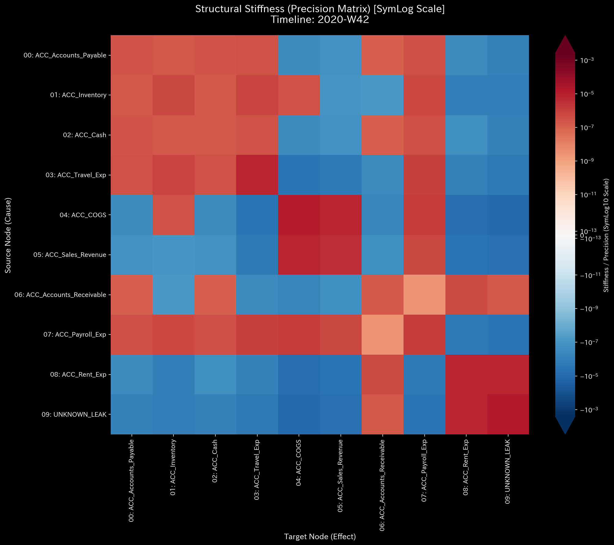

# Sample 3: 単純な貸借不一致・転記ミス（Unbalanced Journal Mistake）

> [!NOTE]
> **概念実証実験にともなう免責事項**
> 本レポートで分析されるデータは実世界の企業のものではありません。検証を目的として、特定の病理学的状態を意図的に再現するために設計されたダミーデータです。本サンプル（Sample_3_Unbalanced_Mistake）は、意図的な不正ではなく、手作業の転記ミスやレガシーシステム連携時の「端数ズレ」などによる「貸借不一致（Debit != Credit）」が引き起こす物理的な質量欠損を証明するためのものです。

---

# 🔬 メタ解析 統合レポート (Meta-Analysis Synthesis Report / Laboratory Findings)

## 1. エグゼクティブ・サマリー

本システム（金融ドメイン）は、**質量保存則違反（Conservation Violation）** を発症しており、極めて危険な状態（CRITICAL）にあります。貸借一致の原則である「借方と貸方の金額の完全な一致」がトランザクションレベルで一部崩壊しており、システム内から総額 `$4,440.45` の物理的な質量（資金）が未知のノード（`UNKNOWN_LEAK`）へと消失しています。Sample 2（完全な横領）とは異なり、一部の取引において「部分的な金額の消失」が発生していることから、業務プロセス（特に売掛金回収の入力作業）におけるヒューマンエラーやシステムバグの存在が強く示唆されます。

## 2. 従来型会計分析との比較対照（Traditional vs TLU Perspective）

一般の監査読者向けに、第52週時点の「従来の財務諸表（B/S・P/L）」と「TLUの物理空間視点」の違いを比較します。

### 従来の財務諸表が捉える世界（静的なスナップショット）

**【第52週 損益計算書 (P/L) サマリー】**

* **売上収益:** $955,157.56
* **総費用:** $894,496.70（※ `UNKNOWN_LEAK` を含む）
* **当期純利益:** **+$60,660.86**

**【第52週 貸借対照表 (B/S) サマリー】**

* **総資産:** $207,157.74
* **負債・純資産合計:** $207,157.74
* **バランスチェック:** 一致

**【従来の手法に対するTLUの補完的価値】**
従来の会計ソフトは、仕訳データの欠落や片端入力（借方金額≠貸方金額）があった場合、一時的な「仮払金」や「使途不明金（UNKNOWN_LEAK）」として強制的にバランスを合わせてP/Lを算出してしまいます。結果として純利益は黒字（+$60,660.86）となり、一見すると事業は正常に回っているように見えます。しかし、裏側では「回収したはずの売掛金が一部しか現金になっていない」というデータの腐敗が進行しています。

### TLUが捉える世界（動的な幾何学構造とエネルギー推移）

TLUは、上記の財務諸表を「グラフ上のノード（口座）とエッジ（取引）」のネットワークとして再構築し、システム全体の**質量保存則（System Conservation）**を監視します。

## 3. コア・パソロジー（主要な病理所見）

* **所見:** Unbalanced Journal Mistake (Conservation Violation)
* **重要度:** CRITICAL
* **物理的証拠:**
  * 相対質量漏れ率 (Relative Leak Ratio): `0.0008` (正常閾値 `< 1e-6` を**突破**)
  * 最大絶対残差 (Max Absolute Residual): `1038.49` (ピーク位置: 第42週)
  * 最大スペクトル半径 (Max Spectral Radius): `0.0000` (正常：ループは存在しない)

### 📊 異常系可視化プロファイル（病的構造の証明）

**1. 質量保存の基準（Macro Forensics）**

* **💡 異常系の読解:** 上段の「System Conservation Residual（質量の絶対残差）」のグラフにご注目ください。断続的にスパイクが発生しており、特に第42週において最大値（`1038.49`）を記録しています。これはシステム内に「小さな穴（Leak）」が空いており、エネルギーが漏れ出し続けていることを示す決定的な数学的署名です。

**2. ネットワークトポロジーの異常（System Stability / Spectral Radius）**
**【位相幾何学構造 (Network Topology / 第42週 異常発生時)】**

**【スペクトル半径 (System Stability)】**

* **💡 異常系の読解:** 赤色の線「Max Spectral Radius」は `0.0` のままです。これは、Sample_1（循環取引）のような「資金の自己強化的なループ」は起きておらず、純粋にシステムの外へ資金が「漏れ出ている」だけであることを意味します。

## 4. ミクロ・フォレンジックによる最終証拠（Micro-Forensic Final Evidence）

**【3D マイクロ・フォレンジック (Z-Score Surface)】**

* **💡 異常系の読解:** Sample 0 の完全に平坦な海と比較してください。特定の時刻（第42週など）において、`UNKNOWN_LEAK` という特設ノードに、周囲から完全に切り離された鋭いスパイクが突き出ています。これが「端数ズレ」によって生じた質量の欠落（無）が物理空間に蓄積した痕跡です。

* **自律調査の実行:** マクロ物理指標において「質量保存則違反（Leak Ratio > 0）」が明確に検出されたため、AIエージェントは自律的に基礎となる仕訳ストリームへドリルダウンし、絶対残差が最大となった **第42週（2020-W42）** に焦点を当ててミクロ調査を実施しました。
* **特定された証拠:**

* **💡 異常系の読解 (0から1への変異と波及の視覚的差分):** 人間の視覚で「UNKNOWN_LEAK（質量の消失）」がシステムに誕生した瞬間を捉えてください。第19週の時点では、`UNKNOWN_LEAK` の行・列は完全に無色（存在しない）でした。しかし第20週において、システムで最初の「小さな端数ズレ」が発生した瞬間、このマス目に初めて色が灯ります（存在の証明）。そして第42週（絶対残差が最大となったピーク時）には、この漏れがシステム全体の構造を歪め、他の勘定科目間の関係性（マス目の色）にまで強烈な波及効果（Ripple Effect）をもたらしていることが直感的に理解できます。

**【構造的剛性 (Structural Stiffness / Precision Matrix)】**
*(1枚目: 第19週 異常発生前 ／ 2枚目: 第20週 初期の異常発生 ／ 3枚目: 第21週 初期の異常発生)*

*(第42週 最大異常への波及)

自律スクリプトによるトランザクション全件走査の結果、借方と貸方の金額が一致していない（端数ズレを起こしている）以下の仕訳群が正確に特定されました。

* **Event 1 (2020-10-12):**
  * `E_002786`: 貸方(AR減少) `$819.31` に対し、借方(現金増加) `$706.43`。 **差額(欠損) `$112.88`**
* **Event 2 (2020-10-14):**
  * `E_002811`: 貸方(AR減少) `$353.51` に対し、借方(現金増加) `$109.31`。 **差額(欠損) `$244.20`**
* **Event 3 (2020-10-16):**
  * `E_002830`: 貸方(AR減少) `$1642.03` に対し、借方(現金増加) `$960.62`。 **差額(欠損) `$681.41`**

* **合計残差（第42週）:** `$112.88` + `$244.20` + `$681.41` = **`$1038.49`**
  *(※この合計値は、マクロ解析で検出された Max Absolute Residual の値 `1038.49` と小数点以下まで完全に一致します。)*

* **最終結論:** これはSample 2のような「意図的な全額隠蔽（借方$0.0）」とは異なり、両方の勘定科目は記録されているものの、金額の転記ミス（Fat Finger）や、一部の決済手数料を手動で差し引く際の計算ミスによって引き起こされた「データ腐敗（Data Corruption）」です。

## 5. ⚠️ 反証可能性と検証要件（Falsification Analytics）

* **偽陽性の可能性:** 今回のデータは「意図的な横領」というよりは、「日常業務における不注意な入力ミス」や「レガシーシステムから新システムへデータをCSV等で移行・インポートする際の仕様バグ（端数処理の不一致）」である可能性が高いです。
* **追加検証要件:**
  1. 上記で特定された取引（`E_002786`, `E_002811`, `E_002830`）について、元の請求書控えと、実際の銀行への着金履歴（Bank Statements）を確認し、実際の着金額がどちら（借方/貸方）と一致しているかを特定してください。
  2. ERPシステムの入力フォームにおいて、「借方と貸方の金額が一致していない場合でも強制保存できてしまう」というシステム上の致命的な脆弱性がないか、IT部門に監査を依頼してください。
