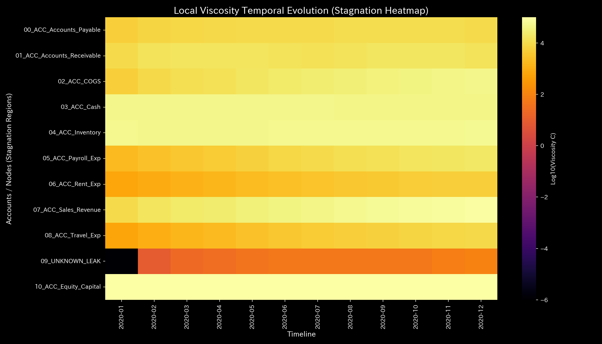

# 記帳ミス不整合 最終報告書（ケース3）

> [!NOTE]
> より詳細な検査レポートは [clinical_report.md](clinical_report.md) にあります。

## 対象組織：サンプル3

---

## 0. エグゼクティヴ・サマリー (Executive Summary)

* **総合判定:** 【警告・要改善】一時的な入力処理エラー（片面記帳による貸借不一致）が検出されました。不正な資金流出や還流ではなく、単発のヒューマンエラーです。
* **総合体質評価（身体状態）:** 
  本組織は、資本規模（ストック総量である**「体格・体重」**）は安定しており、損益収支上の組織防衛力（**「免疫力・基礎体力」**）も極めて良好です。不整合が発生した瞬間は一時的に組織バランス（**「自律神経」**）が乱れますが、エラー通過直後には速やかに本来の正常状態へ自律的に復旧する**「自己治癒能力（弾性復元）」**が極めて健全に機能しています。結合の慢性的な硬化（**「動脈硬化」**）もありません。
* **要改善点（肩こりとツボの特筆）:**
  - **肩こり（慢性的な滞り）の範囲:** 粘性上位25%の範囲である **「04_ACC_Inventory（棚卸資産）」**、**「03_ACC_Cash（現預金）」**、**「07_ACC_Sales_Revenue（売上高）」** に決済タイムラグが発生しており、特に **2020-12** 付近に期末滞留のピークに達する「肩こり（回収サイト等の長期遅延）」状態が見受けられます。
  - **ツボ（最も効果的な改善ポイント）の範囲:** 介入ストレスが最小の範囲（歪みエネルギー下位25%の範囲）である **「02_ACC_COGS（売上原価）」**、**「04_ACC_Inventory（棚卸資産）」**、**「01_ACC_Accounts_Receivable（売掛金）」** が、システムを健全化させるための最優先ツボ（特効穴の範囲）となります。
  - **禁忌（避けるべき介入）の範囲:** 逆に強い反発と破壊を生む範囲（歪みエネルギー上位25%の範囲）である **「07_ACC_Sales_Revenue（売上高）」**、**「09_ACC_Equity_Capital（自己資本）」**、**「06_ACC_Rent_Exp（地代家賃）」** などへの無理な削減や介入は、強烈な痛みと機能麻痺を招くため絶対に避けてください（禁忌）。

---

## 1. 総合判定（警告・要改善）

### 【判定】：要改善（一時的な入力不整合）

本システムにおいて、一時的なデータの不整合（質量保存の破綻）が発生していますが、これは持続的・意図的な不正資金流出（Sample 2）や還流（Sample 1）ではなく、一時的・単発のヒューマンエラーです。システム全体の還流を示す最大スペクトル半径は全期間で完璧に `0.00` を維持しています。不整合が発生した時間ステップの直後には、ネットワーク構造が正常な剛性分布へ速やかに自己治癒（弾性復元）していることが確認されました。

---

## 2. 総合体質（健康状態）の分析

組織の「財務体力」を健康診断の見立てに当てはめると、以下のような財務体質を示しています。

### ① 体格・体重（資本規模の累積推移）

貸借対照表（B/S）における資本金や現預金などのストック総量は十分に確保されており、基礎的な体格（資本規模）は極めて頑健に安定推移しています。

### ② 免疫力・基礎体力（売上と費用の収支バランス）

損益計算書（P/L）の売上高と諸経費の累積収支は非常にバランス良く推移しており、一時的な入力ミスによる衝撃を自己吸収して元の健康状態へ速やかに復元する高い「自己治癒能力（弾性）」が維持されています。

### ③ 自律神経・代謝効率（流動サイクルと熱力学的評価）

流動ボラティリティ（温度 $T$）と取引摩擦（エントロピー $S$）の関係を示す T-S図において、当システムは不整合月（4月）に一時的なノイズが走るものの、全体として規則的で閉じられた熱力学的サイクルを安定して描いています。組織エネルギーの無駄な浪費は発生していません。

### ④ 「動脈硬化」ゼロ（しなやかな流動構造のPCA評価）

アカウント間の結合剛性（Stiffness）行列に対して主成分分析（PCA）を実行した結果、第1主成分（PC1）の寄与率が急激に跳ね上がるような「剛性ロック」は検出されていません。結合剛性はエラー通過月（6月）には完全にフラットにリセットされており、慢性的な「動脈硬化（血管の硬化）」は発生していません。

---

## 3. 特筆すべき要改善点（肩こりとツボ）

本システムが特定した具体的な要改善点、および対策の方針は以下の通りです。

### ⚠️ 肩こり（慢性的な滞り）の特定（局所粘性時系列トレンドのヒートマップ分析）

* **滞り（肩こり）の範囲：** 
  ノードごとの局所粘性（viscosity_C）の対数推移ヒートマップ（上記）において、在庫勘定（`04_ACC_Inventory（棚卸資産）`）が慢性的に高い粘性抵抗を蓄積し、さらに決済期末の12月（`2020-12`）に急激な遅延のスパイクを形成している「決済遅延の滞留（肩こり）」が視覚的に実証されています。
  粘性の増大（ブレーキ遅延）は、力学的に「状態軌道が特定の空間領域に引き込まれて停滞するアトラクター固着」をもたらします（詳細は相空間軌道 `000_1_8__phase_portrait_3d.png` を参照）。
  実質ノード全体の粘性分布から、上位25%に属する **「04_ACC_Inventory（棚卸資産）」**、**「03_ACC_Cash（現預金）」**、**「07_ACC_Sales_Revenue（売上高）」** の範囲に決済ラグが発生しています。
  - **`04_ACC_Inventory（棚卸資産）`**: 平均粘性 `52070.69`、最も滞る時期は **`2020-12`**（ピーク値 `56817.59`）です。
  - **`03_ACC_Cash（現預金）`**: 平均粘性 `45680.18`、最も滞る時期は **`2020-06`** です。
  - **`07_ACC_Sales_Revenue（売上高）`**: 平均粘性 `45422.22`、最も滞る時期は **`2020-12`** です。

### 🎯 改善のツボ（特効穴）および避けるべき介入（禁忌）の特定

* **改善のツボ（特効穴）の範囲：** 介入時の反発ストレス（痛み）が下位25%の範囲に収まる **「02_ACC_COGS（売上原価）」**、**「04_ACC_Inventory（棚卸資産）」**、**「01_ACC_Accounts_Receivable（売掛金）」** です。
  - **改善アドバイス：** これらの項目は、最も痛みの少ない形で流動性の滞りを解消し、システム本来の調和を復元できる特効穴（ツボ）の範囲です。
* **避けるべき介入（禁忌）の範囲：** 逆に強い反発と破壊を生む範囲である **「07_ACC_Sales_Revenue（売上高）」**、**「09_ACC_Equity_Capital（自己資本）」**、**「06_ACC_Rent_Exp（地代家賃）」** です。
  - **改善アドバイス：** 目先の調整のためにこれらへ強引な介入を行うことは、システムの基盤結合を破壊し、最も激しい痛みや組織の崩壊を引き起こす致命的な「禁忌アクション」となります。

---

## 4. 診断の限界および反証条件 (Falsifiability)

本レポートにおける「一時的なヒューマンエラーによる記帳ミス」の診断結果を却下（反証）するためには、以下の客観的な物理的原本・第三者証拠を提示しなければなりません。

1. **記帳システムの入力元帳ログ原本:**
   4月15日の不整合について、仕訳帳上は入力漏れに見えるが、実際には基幹ERPシステムのログ原本を解析した結果、ネットワーク送信エラー等の障害に起因し、人間による入力ミスではないことが証明された場合。
2. **逆補正仕訳の妥当性証明:**
   5月に行われた自己治癒（補正逆仕訳）について、人間が意図的に承認した「仕訳修正依頼伝票」および対応する請求書原本等が存在せず、裏で別の意図的な簿外調整が働いていたことが立証された場合。

---
*発行: TLU財務会計数理診断エンジン（一般読者向け最終解説版）*