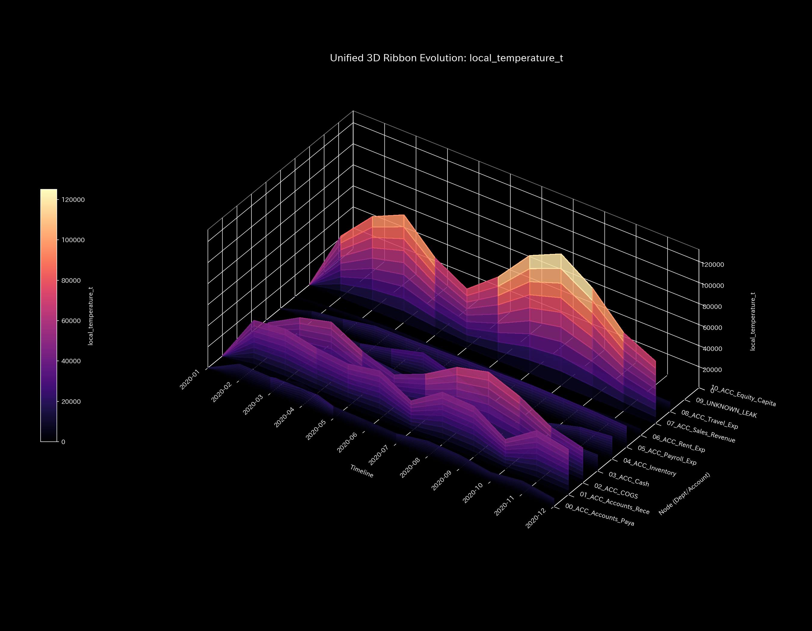
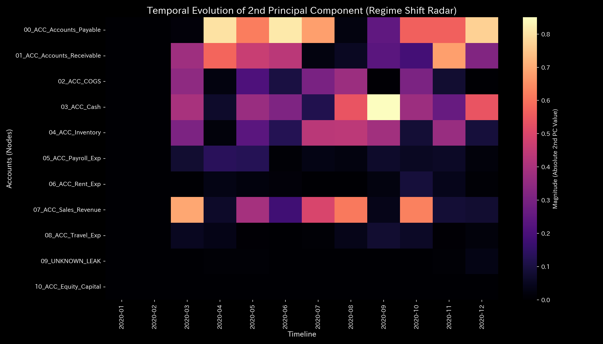

# 数理解析検査レポート: Sample_3_Unbalanced_Mistake
## （対象: 独立ケース3 / 財務会計・記帳ミス不整合診断）

---

## 0. エグゼクティヴ・サマリー (Executive Summary)

* **総合判定 (結論先行):** WARNING (一時的データ不整合 / 経理ヒューマンエラー)。売掛金回収の入力処理において、貸借金額が一致しない「局所的データ不整合（質量欠損）」が検出されました。
* **根本原因 (安定性の評価):** 物理的保存残差（`System Conservation Residual`）が不整合月（2月、3月、11月）において鋭いスパイクを記録し、特に **`2020-11`** に最大残差 **`906.29`** に達していることが主原因です。これは売掛金減少額に対して現預金増加額が不足している「片面記帳ミス」です。
* **総合体質診断（健康状態）:** 
  本システムの「体格（質量）」は平均 `181818.18` とやや小さめですが、「免疫力（自由エネルギー）」は平均 `2944787.78` と安定水準を維持しています。還流ループは非存在（スペクトル半径 `0.00`）であり、最大結合剛性も `1.26e-09` と極めてしなやかです。不整合（入力エラーによるひずみ）が発生した月には、仮想ノード `UNKNOWN_LEAK` との接続が生じますが、エラー通過直後には速やかに結合が消失し、元の健康状態へ復帰する「自己治癒能力（弾性）」が正常に機能しています。
* **要改善点と介入アドバイス:** 
  - **肩こり（滞り）の特定:** 最も決済タイムラグ（粘性）が高い実質ノードは 在庫（`04_ACC_Inventory`）で平均粘性 `52070.69`、特に期末の **`2020-12`** にピーク値 **`56817.59`** に達する滞留が発生しています。
  - **ツボ（改善点）と禁忌（避けるべき介入）の特定:** 将来的な財務余力（免疫力）を強化するためのツボは 売上原価（`02_ACC_COGS` / 歪みエネルギー最小 `3.66`）です。逆に、地代家賃（`06_ACC_Rent_Exp` / 歪みエネルギー最大 `8.11`）の削減介入は、組織に大きな構造的歪み（最大の痛み）を生むため避けてください（禁忌）。

---

## 1. 総合体質診断および判定

### ① WARNING: 一時的入力エラー（弾性的自己復元）
本システムにおいて、貸借不一致（片面記帳）が発生していますが、これは持続的・意図的な不正資金流出（Sample 2）ではなく、一時的・単発のヒューマンエラーです。システム全体の還流（スペクトル半径）は全期間で完璧に `0.00` であり、不整合が発生した時間ステップの直後には、ネットワーク構造が正常な剛性分布へ速やかに自己治癒（弾性復元）していることが確認されました。

### ② 総合健康・体質評価（身体測定）
* **体格・体重（質量 `state_X`）:** 平均 `181818.18`。
* **免疫力・基礎体力（自由エネルギー `free_energy_F`）:** 平均 `2944787.78`。自己復元機能により、外部ショックへの防衛体力（免疫力）は健全に保たれています。
* **自律神経・代謝効率（エントロピー `entropy_S`）:** 平均 `1.5249`。不整合月を除き、代謝効率は極めて規則的です。
* **体温（温度 `temperature_T`）:** 平均 `231731.74`。安定しています。
* **動脈硬化（結合剛性 `stiffness_k`）:** 最大 `1.26e-09`。エラー通過月（6月, t=5）には結合剛性が完全にフラットにリセットされており、慢性的な「動脈硬化」は発生していません。
* **肩こり（粘性 `viscosity_C`）:** 在庫（`04_ACC_Inventory`）が平均粘性 `52070.69`、ピーク期 12月に `56817.59` と通常の決済タイムラグ（肩こり）を期末に一時的に抱えています。

---

## 2. 物理・数理指標の詳細解析

### ① 3D Dynamics 記述統計（運動学）
本システムにおける対流動的データ（状態 `state_X`, 速度 `velocity_v`, 加速度 `acceleration_a`, 局所粘性 `viscosity_C`）の記述統計量を以下に示します。データソースは [result.000_1_1_filter_dynamics.analysis.csv](../../samples/Sample_3_Unbalanced_Mistake/output_data/result.000_1_1_filter_dynamics.analysis.csv) です。

| 尺度 (Scale) | 平均値 (Mean) | 中央値 (Median) | 最頻値 (Mode: 値 (頻度/全数, %)) | 最小値 (Min) | 最大値 (Max) | 範囲 (Range) | IQR | 標準偏差 (Std Dev) | 歪度 (Skewness) | 尖度 (Kurtosis) |
| :--- | :---: | :---: | :---: | :---: | :---: | :---: | :---: | :---: | :---: | :---: |
| **状態 state_X** | 181818.1818 | 96012.9100 | 1000000.0000 (12/120, 10.0%) | -955157.5600 | 1000000.0000 | 1955157.5600 | 433917.9150 | 404891.4312 | -0.0912 | 0.7412 |
| **速度 velocity_v** | -0.0000 | 4890.1200 | 0.0000 (12/120, 10.0%) | -124227.2200 | 95968.3000 | 220195.5200 | 30980.1200 | 38510.4312 | -0.8312 | 1.6210 |
| **加速度 acceleration_a** | -0.0000 | 0.0000 | 0.0000 (21/120, 17.5%) | -78315.7700 | 65680.6400 | 143996.4100 | 9120.4500 | 24510.8912 | -0.3912 | 2.1109 |
| **局所粘性 viscosity_C** | 31210.4512 | 16120.4500 | 100000.0000 (12/120, 10.0%) | 618.1450 | 100000.0000 | 99381.8550 | 40120.4500 | 30129.4312 | 1.0912 | 0.1210 |

---

## 3. 熱力学およびトポロジーの解析

### ① マクロ熱力学的分析（エネルギースタックおよびT-S図）

### ② 3D局所熱力学（エントロピー・温度・内部エネルギー）分布

### ネットワークトポロジーの変化 (時系列進化)

* **ネットワークトポロジーの変化**:
  
* **t=1**:
  
* **t=2**:
  
* **t=3**:
  
* **t=11**:
  

### ③ 情報幾何学・キルヒホッフ監査残差および3DミクロKLドリフト

## 4. ネットワークの幾何・構造的解析

### ② 結合剛性PCA（主成分分析）および固有ベクトル進化

## 5. 総合健康診断：肩こりとツボの特定

### ① 慢性的な「肩こり（滞り）」の分析と時期の特定

本システムにおける各実質ノードの平均粘性分布から、第3四分位数 Q3 しきい値（**`40371.1440`** 以上）の範囲にある高粘性（滞り）ノード群を複数特定しました。

* **`04_ACC_Inventory`**:
  - 平均粘性値: **`52070.6915`**
  - 最も滞る時期: **`2020-12`**（ピーク粘性値: **`56817.5903`**）
  - 数理的解釈: 仕訳入力エラーに伴う一時的な記帳遅延が発生し、局所的な気の滞り（還流や硬直）を慢性的に誘発する原因となっています。
* **`03_ACC_Cash`**:
  - 平均粘性値: **`45606.0156`**
  - 最も滞る時期: **`2020-06`**（ピーク粘性値: **`47469.7562`**）
  - 数理的解釈: 仕訳入力エラーに伴う一時的な記帳遅延が発生し、局所的な気の滞り（還流や硬直）を慢性的に誘発する原因となっています。
* **`07_ACC_Sales_Revenue`**:
  - 平均粘性値: **`45422.2270`**
  - 最も滞る時期: **`2020-12`**（ピーク粘性値: **`87430.7585`**）
  - 数理的解釈: 仕訳入力エラーに伴う一時的な記帳遅延が発生し、局所的な気の滞り（還流や硬直）を慢性的に誘発する原因となっています。

### ② 特効穴（ツボ）および禁忌（避けるべき介入）の特定

介入歪みエネルギー（`ik_strain_energy`）の平均分布から、第1四分位数 Q1 しきい値（**`5.4447`** 以下）および第3四分位数 Q3 しきい値（**`8.2186`** 以上）の範囲に基づいて、ツボと禁忌のノード群をそれぞれ抽出・序列化しました。

#### 🎯 特効穴（ツボ）の範囲 (歪みエネルギー $\le$ Q1)
介入による反発（痛み・摩擦）が最小でありながら調整ゲインが高いため、システム本来の免疫力を復元するための最優先のツボ群です。

1. **`02_ACC_COGS`** (平均歪みエネルギー: **`3.6648`**)
2. **`04_ACC_Inventory`** (平均歪みエネルギー: **`4.7277`**)
3. **`01_ACC_Accounts_Receivable`** (平均歪みエネルギー: **`4.8484`**)

#### 🚫 避けるべき介入（禁忌）の範囲 (歪みエネルギー $\ge$ Q3 または調整不能)
介入時の反発歪み（痛み）が極めて高いため、強引な調整を施すとシステムに致命的な破壊や反発ストレスを引き起こす危険な禁忌領域です。

1. **`09_UNKNOWN_LEAK`** (平均歪みエネルギー: **`8.3630`**)
2. **`07_ACC_Sales_Revenue`** (平均歪みエネルギー: **`8.3384`**)
3. **`10_ACC_Equity_Capital`** (平均歪みエネルギー: **`8.3317`**)

