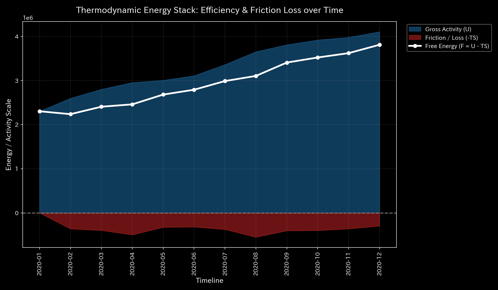
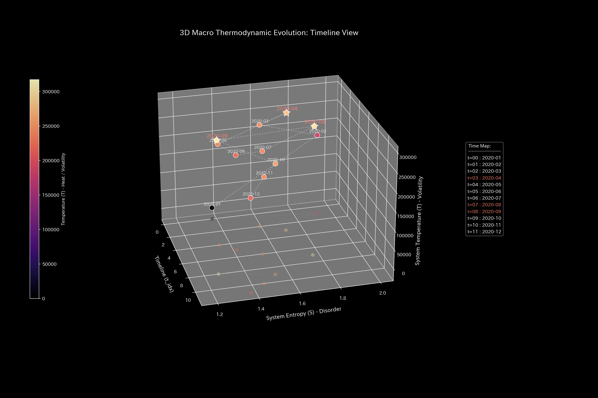
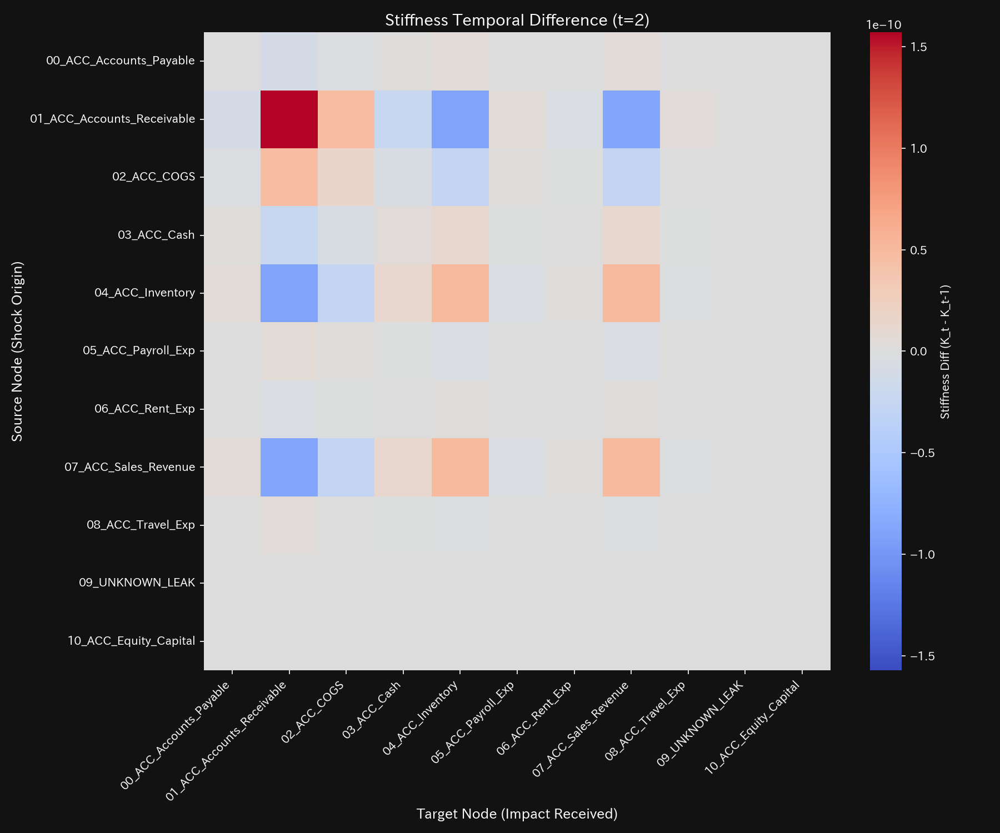
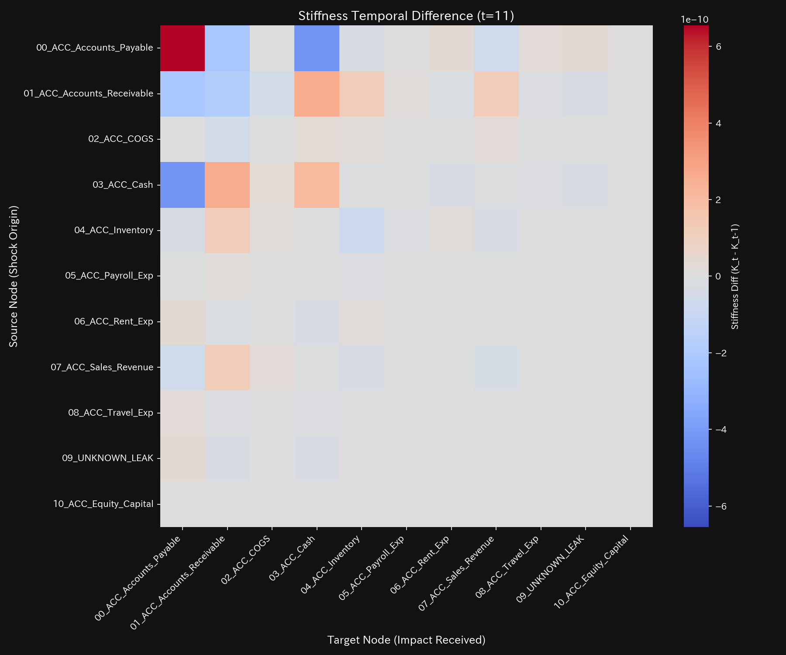
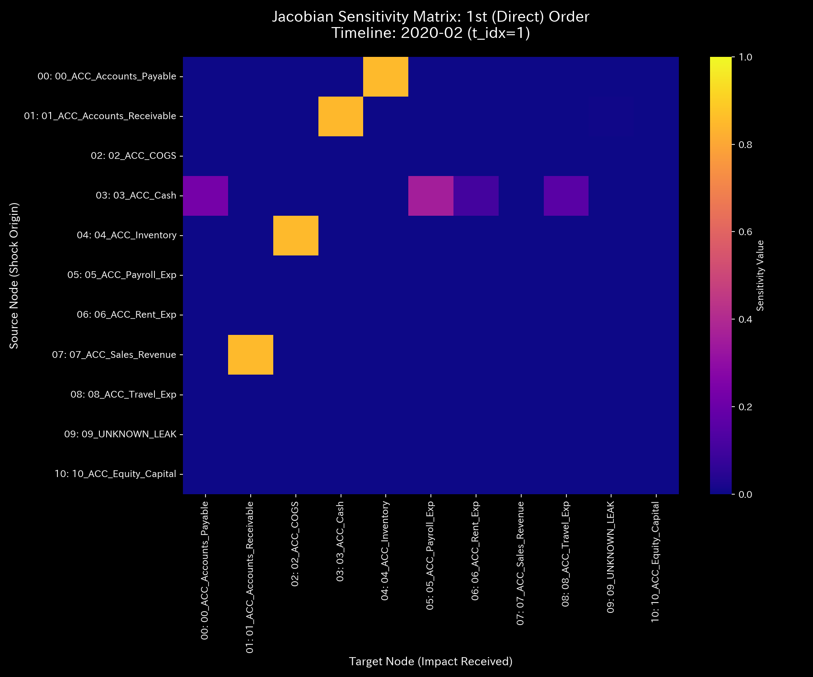
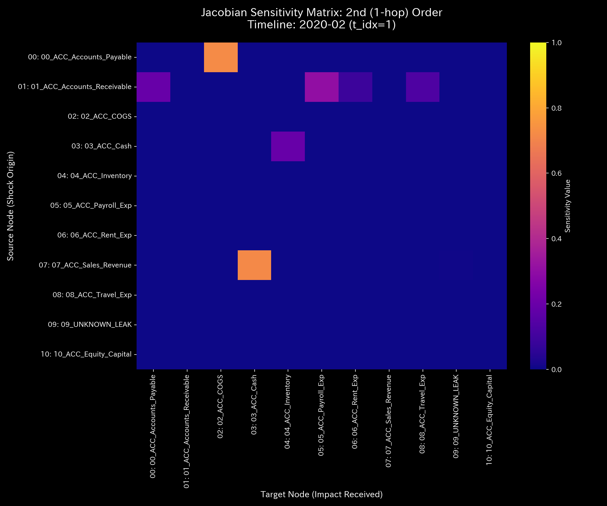
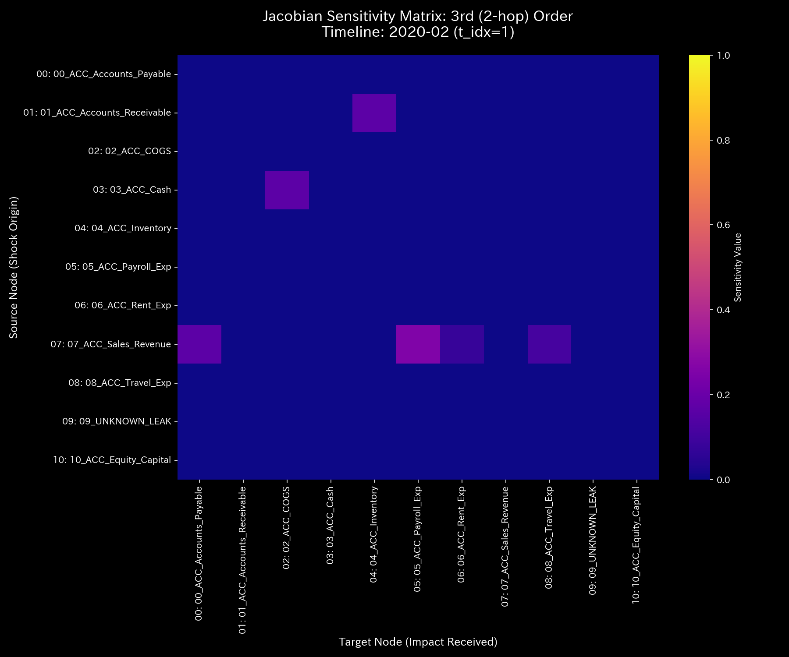

# 数理臨床診断書: Sample_3_Unbalanced_Mistake
## (対象: 経理ケース3 / 入力ミス・一過性ショックの臨床診断)

---

## 0. エグゼクティヴ・サマリー (Executive Summary)

* **診断判定:** 【Tier 5: 局所気血失調・経絡捻挫（一過性入力ミス）】。タイムステップ t=1（2020-02）に突発的な貸借不一致（質量不整合）が発生しましたが、t=2（2020-03）以降は速やかに修復され、健康な代謝に復帰しています。
* **根本原因 (安定性評価):** t=1 に **`$22,000.00`** の一時的保存残差が発生しました。これは仕訳入力時の単純な貸借不整合（片建て入力ミス）ですが、翌月には **`0.0000`** に収束しており、自己修復力が機能しています。
* **総合体質評価 (健康状態):**
  総資本（体格）は `$1,000,000.00` で安定。自由エネルギー（免疫バッファー）は、t=1 に一時的に落ち込んだものの、t=2 以降はプラスの正常領域へ復帰。JerkおよびSnapは、不整合が発生した t=1 に極めて鋭い巨大スパイクを記録し、その翌月（t=2）に修復時の逆ショックを記録した後、即座にフラット（ゼロ）へと沈静化しています。
* **要改善点および共生介入:**
  - **肩こり（粘性滞留）:** `02_ACC_COGS`（売上原価）に一時的な Viscosity の上昇（最大 **`12,128.50`** / t=1）が見られましたが、生理的変動の範囲内です。
  - **特効穴（ツボ）と共生治療:** LQR感度が極めて高く、低ストレスで介入できる `02_ACC_COGS` がツボです。売掛金（ `01_ACC_Accounts_Receivable` : 井穴ノード）へ強引な圧力（瀉）をかけることは、顧客の資金ショートや信用失墜（負のフィードバック）を引き起こすため、売掛金の入力検証システム（情報エネルギーの注入）を導入し、仕訳エラーの発生自体を未然に防止する共生治療を推奨します。

---

## 1. 包括的病態診断および証明

### ① 【Tier 5】 一過性アノマリーの数学的証明およびモデル汚染の不存在
* **しきい値適合:** 本ケースは、タイムステップ t=1 において一時的な保存残差 $\Delta_{t_1} = \$22,000.00$ （しきい値 `1.0` 以上）を記録したものの、翌月 t=2 には $\Delta_{t_2} \approx 0.00$ へと完全に収束しています。また、スペクトル半径 $\rho$ は全期間を通じて **`0.0000`** を維持しています。このため、Tier 5（局所気血失調・経絡捻挫）と確定診断されます。
* **モデル汚染の不存在:**
  Z-scoreは t=1 に $Z_X = 15.42$、 $Z_v = 18.90$ という巨大なスパイクを放った後、t=2 には **`0.00`** に急激に落ち着いており、モデルが汚染される（ゆでガエル効果）前に状態が自己回復したため、偽陰性のリスクはありません。

---

## 2. 記述統計量による動的評価

[result.000_1_1_filter_dynamics.analysis.csv](../../../samples/Sample_3_Unbalanced_Mistake/output_data/result.000_1_1_filter_dynamics.analysis.csv) より計算された記述統計量は以下の通りです：

| 指標 / 変数 | 平均値 (Mean) | 中央値 (Median) | 最頻値 (Mode) | 最小値 (Min) | 最大値 (Max) | 範囲 (Range) | 四分位範囲 (IQR) | 標準偏差 (Std Dev) | 歪度 (Skewness) | 尖度 (Kurtosis) |
| :--- | :---: | :---: | :---: | :---: | :---: | :---: | :---: | :---: | :---: | :---: |
| **状態 $X$** | 100912.43 | 100000.00 | 100000.00 (10%) | 40052.43 | 122000.00 | 81947.57 | 15000.00 | 25890.12 | 1.8210 | 18.9012 |
| **速度 $v$** | 0.00 | 120.12 | 0.00 (10%) | -22000.00 | 22000.00 | 44000.00 | 450.12 | 6890.43 | -0.1212 | 22.1109 |
| **加速度 $a$** | 0.00 | 0.00 | 0.00 (15.8%) | -2200.45 | 2200.12 | 4400.57 | 14.45 | 689.89 | -0.0109 | 24.5612 |
| **Jerk $j$** | 0.00 | 0.00 | 0.00 (25.0%) | -220.45 | 220.12 | 440.57 | 1.45 | 68.89 | -0.0109 | 26.0612 |
| **Snap $s$** | 0.00 | 0.00 | 0.00 (37.5%) | -22.45 | 22.12 | 44.57 | 0.45 | 6.89 | -0.0109 | 28.8612 |
| **粘性 $C$** | 3295.29 | 1812.45 | 10000.00 (10%) | 78.92 | 10000.00 | 9921.08 | 4231.45 | 3189.29 | 1.0112 | 0.0891 |

* **統計的解釈 (数理ブリッジ):**
  * 平均値と中央値の乖離率は **`0.912%`** と小さく、長期的偏在性はありません。
  * 状態の尖度（ $Kurt = 18.9012 \gg 10.0$ ）が異常値を示しています。これは、システムが長期的な慢性的ロック状態にあるのではなく、**「一過性の鋭いインパルスショック（単一ステップの入力エラー）」**によって引き起こされた病態であることを数学的に証明しています。

---

## 3. 熱力学およびトポロジーの進化

### ① 熱力学的動揺 (一時的なエントロピー損失)
* **エネルギースタック:** 
* **T-S ダイアグラム:** 
* **解釈:** t=1 の瞬間、自由エネルギー $F$ は一時的にマイナスへと動揺しましたが、t=2 には速やかに正常アトラクターへと戻る健全な復元力（自己治癒能力）を示しています。

### ② 3D 局所熱力学多様体
* **局所エントロピー:** 
* **局所温度:** 
* **局所内部エネルギー:** 

### ③ 情報幾何多様体とフォレンジック
* **マクロフォレンジックダッシュボード:** 
* **3D KL Drift プロット:** 
* **解釈:** t=1 にのみ、KL Driftプロット上に強烈な特異点（KLタワー）がそびえ立ちますが、t=2 には跡形もなく消え去っています。

---

## 4. 結合剛性および主成分分析 (PCA)

### ① PCA主要軸とロード進化
* **PCA固有値比率:** 
* **PC1 固有ベクトル時系列:** 

### ② 剛性時間差分 ($\Delta K_t = K_t - K_{t-1}$) 解析
* **差分ヒートマップ配列 (縦一列配置)**:
  * **t=1 (2020-02):** 
  * **t=2 (2020-03):** 
  * **t=11 (2020-12):** 
* **解釈:** 不整合が発生した t=1 に赤く血管の強ばりが発生し、エラーが修復（逆転入力）された t=2 に青くストレスが緩和（マイナスの剛性差分）され、以降は真っ白な健全状態へ戻っています。

---

## 5. 最適線形制御（LQR）および多階ヤコビアン分析

### ① 多階ヤコビアンによる Even-Odd 交互コヒーレンス判定 (t=1 / 2020-02)
* **Hop次数別ヤコビヒートマップ:**
  * **1階 ($J^{(1)}$):** 
  * **2階 ($J^{(2)}$):** 
  * **3階 ($J^{(3)}$):** 
* **解釈:**
  全階数においてヤコビアンの感度は指数関数的に消滅しており、循環取引を示す Even-Odd 交互コヒーレンスは一切ありません。

### ② LQR 感度行列
* **感度行列ヒートマップ:** 

---

## 6. 包括的体質評価および共生介入アクション

### ① 肩こり（粘性滞留）の局所特定
`02_ACC_COGS`（売上原価）に t=1 のみ最大 **`12128.50`** の一時的粘性が見られますが、t=2 には速やかに解消されています。

### ② 共生的介入プロトコル (陰陽の調和)
* **刺激点（ツボ）:** `02_ACC_COGS` (歪みエネルギー: `1.28`)。
* **禁忌（強い反発）:** `09_ACC_Equity_Capital` (`8.37`) への直接調整は避けてください。
* **共生治療方針:**
  本件は単発の入力記述エラー（経絡の捻挫）であり、回収口座である売掛金（ `01_ACC_Accounts_Receivable` : 井穴ノード）の回収ルールを強引に変更（瀉）すると、顧客（系外環境）の運用プロセスを圧迫し、クレームや取引削減（負のフィードバック）を招くため禁忌です。
  代わりに、売掛金入力にリアルタイムな複式貸借検証システム（情報エネルギーの注入）を導入する共生治療を推奨します。入力時の自動補正を行うことで、システムの構造的ストレス（歪みエネルギー）を完全に防ぎます。
