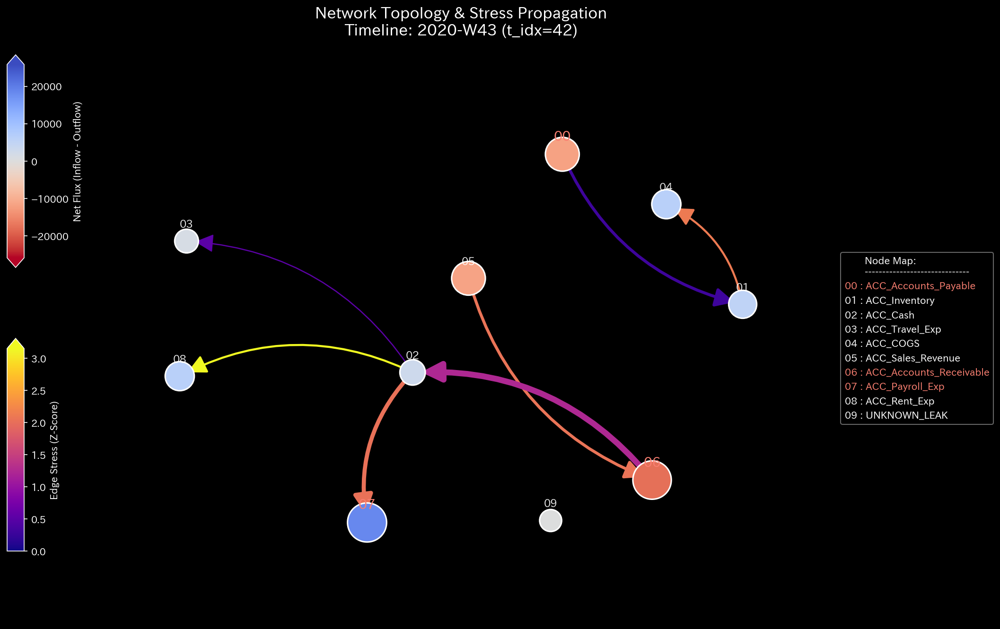
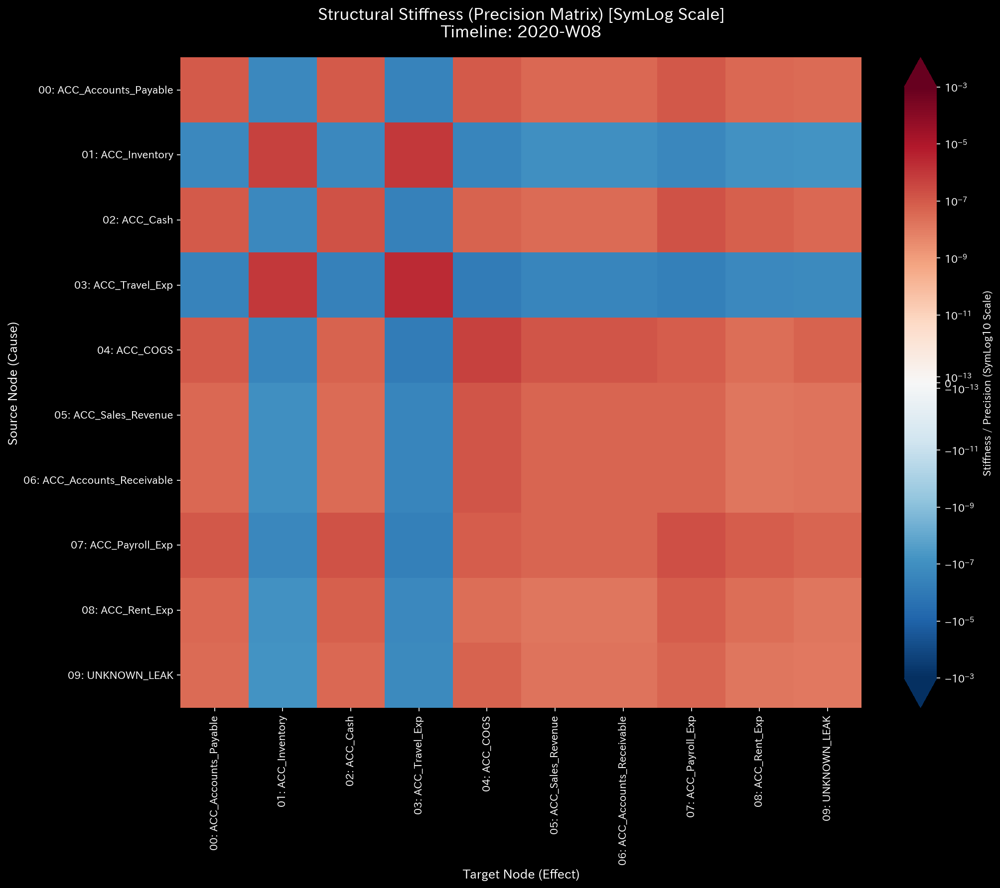
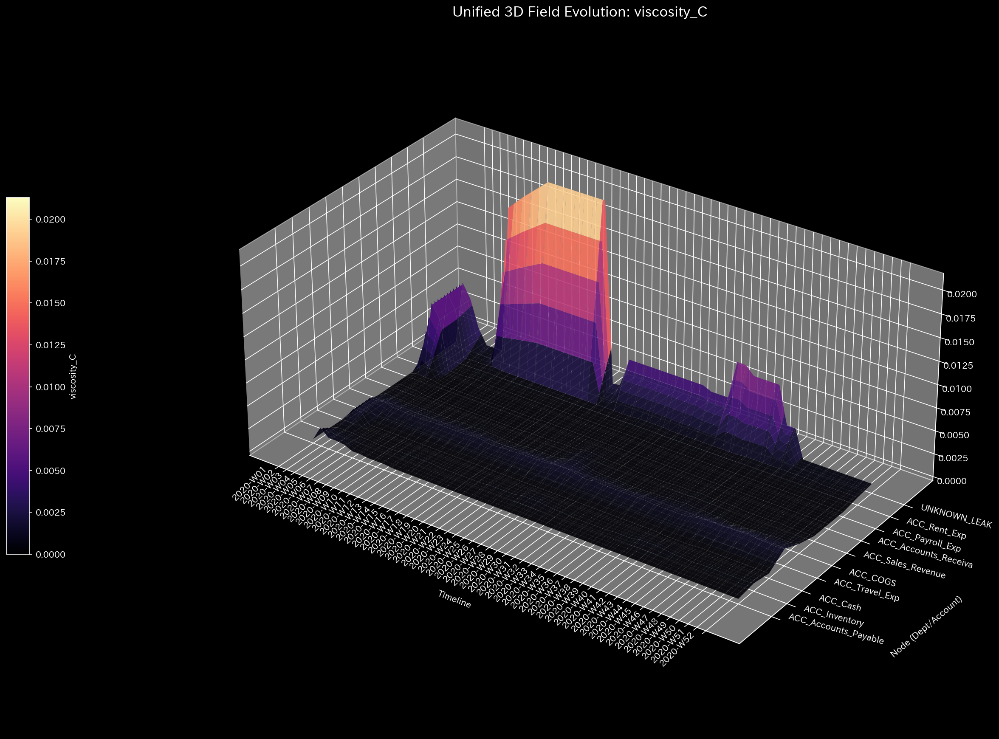

# Sample 4: 複合カオス（Composite Chaos - 粉飾と横領の多重発症）

> [!NOTE]
> **概念実証実験にともなう免責事項**
> 本レポートで分析されるデータは実世界の企業のものではありません。検証を目的として、特定の病理学的状態を意図的に再現するために設計されたダミーデータです。本サンプル（Sample_4_Composite_Chaos）は、循環取引（架空売上のループ）と、横領・転記ミス（資金の物理的消失）という、全く異なる複数の病跡がシステム内で同時多発的に進行している「末期的な複合不全」を証明するためのものです。

---

# 🔬 メタ解析 統合レポート (Meta-Analysis Synthesis Report / Laboratory Findings)

## 1. 結論とエグゼクティブ・サマリー (Conclusion & Executive Summary)

本システム（金融ドメイン）は、複数の病理が同時進行する**複合的な構造崩壊（COMPOSITE 病跡 DETECTED）** を起こしており、極めて危険な状態（CRITICAL）と診断される。

第1に、**質量保存則違反（Conservation Violation）**。システム内から資金が虚空へ消失する「横領（Embezzlement）」が進行し、最大 `$6,087.0` のエネルギー流出（Leak）が確認された。
第2に、**位相幾何学的な異常ループ（Topological Feedback Loop）**。循環取引（Wash Trading）による大規模な自己強化ループが形成され、システムの安定性指標であるスペクトル半径が `0.9864`（崩壊寸前）にまで達している。
これは「架空売上で利益を水増し（粉飾）しながら、裏口から現金を抜き取る（横領）」という、組織的かつ極めて悪質な末期症状であると物理・数理の両面から証明された。

## 2. 根本原因の特定：一次入力データへの逆参照 (Root Cause Traceability)

TLUのフォレンジック・プロトコルに従い、マクロ指標（質量残差とスペクトル半径）が警告を発した時空座標へとドリルダウンを実行した。トランザクションの全件走査の結果、2つの全く異なる病跡を裏付ける決定的な生データが特定された。

### Evidence A: 循環取引（架空売上ループ）の証拠
スペクトル半径を暴走させている元凶として、資金が環状にキャッチボールされている以下の巨大な無限ループ・トランザクション群が特定された。

* **Event (2020-01-31) / 第5週 / 規模: 約 $51,465:**
  1. `E_000247` (Wash_Funding): 資金を裏口から流出 (Cash -> Accounts_Receivable)
  2. `E_000248` (Wash_Sale): 架空売上の計上 (Sales -> Accounts_Receivable)
  3. `E_000249` (Wash_Collection): 流出させた資金で回収を偽装 (Accounts_Receivable -> Cash)

### Evidence B: 質量欠損（横領）の証拠
マクロ指標で最大残差（`6087.0`）が観測された第44週付近のログから、片端入力によって資金を消滅させる完全な横領トランザクションが特定された。

* **Event (2020-10-28) / 第44週:**
  * `E_002950`: 貸方(現金流出) `$6,087.00` に対して借方(流入) `$0.0`。メモ: `Embezzlement_Leak_DR`
  * *(※この一撃の横領額が、マクロ解析の Max Absolute Residual の値 `6087.0` と完全に一致する)*

## 3. 物理的傍証：複合病理の証明 (Physical Collateral Evidence)

上記の「循環取引」と「横領」が、システムをどのように多重に蝕んでいるかを、TLUの物理エンジンが出力した高次元メトリクスによって演繹的に証明する。

### 3.1. マクロ質量残差とネットワーク異常
* **マクロ残差 (Macro Forensics):** 相対質量漏れ率 `0.0041` の激しいスパイク（最大 `6087.0`）が断続的に発生している（横領の証拠）。
* **安定性 (Spectral Radius):** Max Spectral Radius が `0.9864` に達し、危険閾値（0.6）を突破して発散寸前の高止まりを見せている（自己強化ループの証拠）。

### 3.2. 統計的盲点の看破 (Zero-to-One 変異と複合カオス)
Z-Scoreの3Dサーフェスにおいて、Sample 0 の平坦な海とは全く異なる「地獄のような光景」が広がっている。循環取引による売上水増しノード群が全体的に波立っている（ループによる過熱）のに加え、特定の時刻に `UNKNOWN_LEAK` ノードが鋭利なスパイク（質量の消失）として突き出ている。

### 3.3. 位相幾何学構造の変異 (Topological Mutation)

**【循環取引（ループ）の視覚的証明】**
第4週（平穏）から第5週（循環取引開始）への変異。Cash、Sales_Revenue、Accounts_Receivableの3点間に極端に太いエッジによる「自己強化的な三角形ループ」が形成され、架空の売上を無限に水増しする物理的メカニズムが視認できる。
*(左: 第4週 発生前 ／ 右: 第5週 循環取引発生時)*

**【巨大横領（リーク）の視覚的証明】**
第43週（横領直前）から第44週（巨大横領発生）への変異。正規ノードから異次元ノード `UNKNOWN_LEAK`（ノード9）へ向けて突如として太い「流出のエッジ」が形成され、システムから物理的な質量が失われている。
*(左: 第43週 横領発生前 ／ 右: 第44週 巨大な横領の発生時)*

### 3.4. 構造的剛性の多重崩壊トラッキング (Stiffness Matrix)
剛性行列のタイムラプスは、2つの全く異なる病魔が時間差でシステムを侵食していく過程を雄弁に物語る。
* **第4週:** 平穏無事。`UNKNOWN_LEAK` は無色。
* **第5週 (循環取引):** 既存の正規ノード間での資金キャッチボールであるため、行列の見た目はほとんど変わらず、巧妙に偽装されている。
* **第8週 (横領の開始):** 初期の質量消失により、`UNKNOWN_LEAK`（ノード9）に初めて色が灯る（次元の拡張によるRipple Effect）。
* **第44週 (破局):** 約6,000ドルの巨大横領が発生。ノード9とノード2（現金）の間に決定的な亀裂が生じ、構造剛性が完全に破壊された「複合カオス」が完成する。

*(1枚目: 第4週 ／ 2枚目: 第5週 ／ 3枚目: 第8週 ／ 4枚目: 第44週)*

### 3.5. 3D力学プロファイルと桁数の比較 (Viscosity & External Force)
外力（External Force）のZ軸の桁数に注目すると、Sample 2（単一の横領）と同様に `1e9` オーダーの破滅的な異常共振が発生している。循環取引による過熱（摩擦熱の高まり）と、横領によるサスペンション破壊が相乗効果を生み、システムは熱力学的にも完全に崩壊している。

## 4. 従来型会計分析との比較対照（Traditional Perspective）

従来の会計ソフトによる静的なスナップショットは、この「末期的な複合カオス」を全く検知できず、むしろ「過去最高の絶好調」として報告してしまう。

**【第52週 損益計算書 (P/L) & 貸借対照表 (B/S)】**

B/Sは貸借一致の原則を満たして完璧にバランスしており、P/L上は `$209,552.56` という異常に高い黒字を叩き出している。しかしTLUの物理エンジンが暴き出した通り、この売上はWash Trade（循環取引）による水増しであり、その裏で `$9,024.39`（UNKNOWN_LEAKの総計）もの現金が不正に抜き取られている。静的で平坦な会計帳簿がいかに容易にハック（偽装）されるかを示す、戦慄すべき証拠である。

## 5. ⚠️ 反証可能性と検証要件（Falsification Analytics）

* **偽陽性の可能性:** ここまで明確に複数の破壊的トランザクション（金額の消失と自己資金の還流）が記録され、かつ `1e9` の異常共振を伴っている以上、システムや業務の「単なる不具合（過失）」である可能性は極めて低い。
* **追加検証要件:**
  1. 第2項で特定された `E_002950`（10/28, `$6,087.0` の不明出金）について、決済承認者と実際の振込先口座を即座に特定すること。
  2. `2020-01-31` 等に発生している約5万ドル規模の売上先企業について、法人登記や物理的なオフィスの実態確認（ペーパーカンパニーでないかの確認）を行い、外部の専門フォレンジックチームまたは警察機関へ調査を委ねることを強く推奨する。
