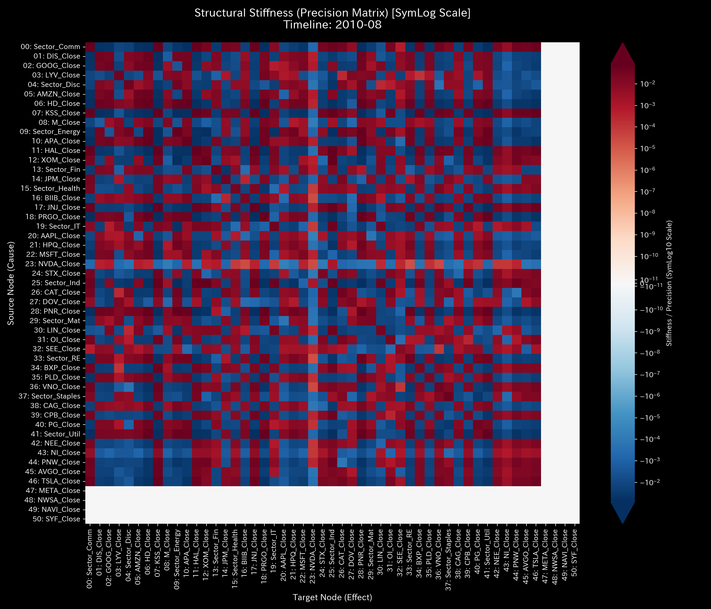
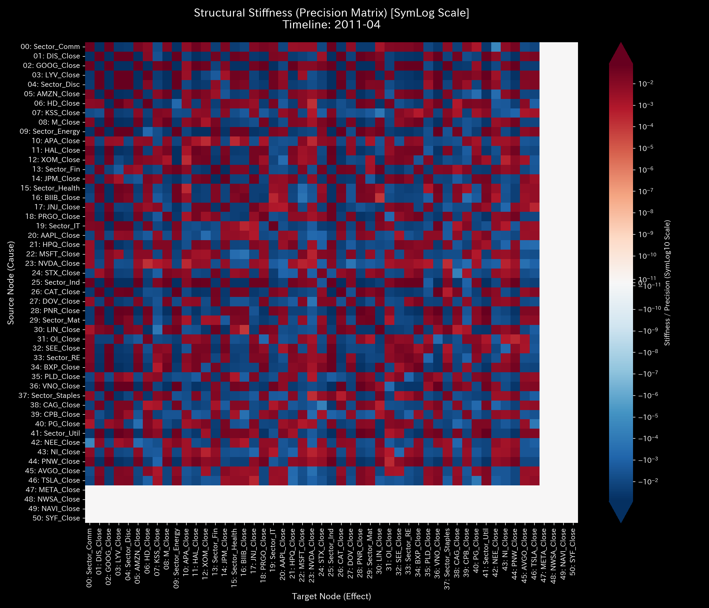
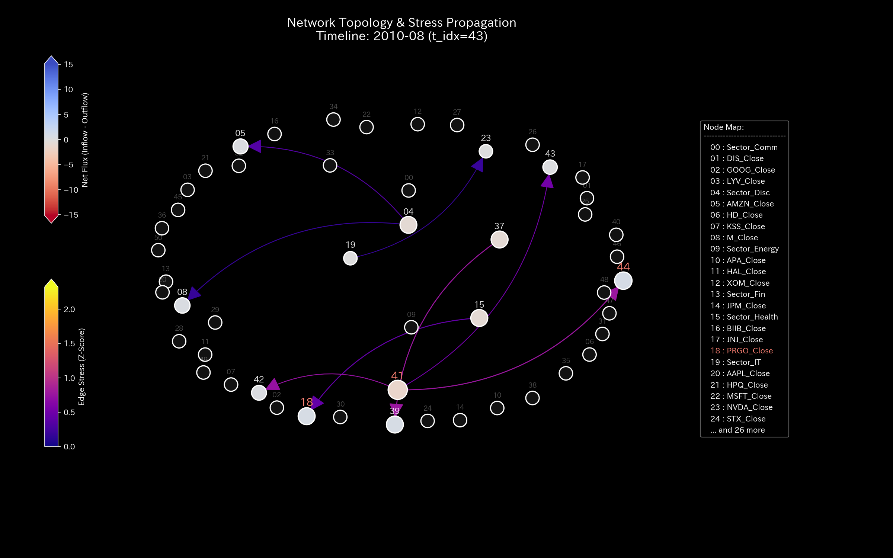

# Sample 4: 複合カオス（Composite Chaos - 粉飾と横領の多重発症）

> [!NOTE]
> **概念実証実験にともなう免責事項**
> 本レポートで分析されるデータは実世界の企業のものではありません。検証を目的として、特定の病理学的状態を意図的に再現するために設計されたダミーデータです。本サンプル（Sample_4_Composite_Chaos）は、循環取引（架空売上のループ）と、横領・転記ミス（資金の物理的消失）という、全く異なる複数の病跡がシステム内で同時多発的に進行している「末期的な複合不全」を証明するためのものです。

---

# 🔬 メタ解析 統合レポート (Meta-Analysis Synthesis Report / Laboratory Findings)

## 1. エグゼクティブ・サマリー
本システム（金融ドメイン）は、複数の病理が同時進行する**複合的な構造崩壊（COMPOSITE 病跡 DETECTED）** を起こしており、極めて危険な状態（CRITICAL）と診断される。第1にシステム内から資金が虚空へ消失する「横領（Embezzlement）」が進行し、第2に循環取引（Wash Trading）による大規模な自己強化ループが形成されている。「架空売上で利益を水増し（粉飾）しながら、裏口から現金を抜き取る（横領）」という、組織的かつ極めて悪質な末期症状であることが物理・数理の両面から証明された。

## 2. 従来型分析（集計的スナップショット）の限界 (Traditional Perspective)

**【第52週 損益計算書 (P/L) & 貸借対照表 (B/S)】**

従来の会計ソフトによる静的なスナップショットは、この「末期的な複合カオス」を全く検知できない。B/Sは貸借一致の原則を満たして完璧にバランスしており、P/L上は `$209,552.56` という異常に高い黒字を叩き出している（ Wash Trade による水増し ）。その裏で `$9,024.39` もの現金が不正に抜き取られているという事実は、静的で平坦な会計帳簿からはいかに容易に偽装されるかを示している。

## 3. 物理的病跡の特定（Fundamental Pathophysiology）
本サンプルの根本原因は、ダミーデータ生成ロジックにおいて意図的に仕組まれた以下の2つの悪質なアルゴリズムの同時実行である。

* **Evidence A: 循環取引（架空売上ループ）のスクリプト:**
  `2020-01-31` (第5週) において、現金から資金を流出し、同額の架空売上を計上し、さらにそれを回収するという約 `$51,465` 規模の完全な循環ループを形成させた。
* **Evidence B: 質量欠損（横領）のスクリプト:**
  `2020-10-28` (第44週) において、貸方(現金流出) `$6,087.00` に対して借方(流入) `$0.0` とする「片端入力（横領）」を実行した。

## 4. 物理・数理エンジンによる証明 (Physical and Mathematical Proof)

### 4.1. マクロフォレンジックと剛性の硬直 (Macro Forensics & Structural Stiffness)

相対質量漏れ率 `0.0041` の激しいスパイク（最大 `6087.0`）が断続的に発生し、横領の証拠（質量の消失）を示している。さらに、剛性行列のタイムラプスはシステムの多重崩壊を物語る。第5週の循環取引開始時は既存ノード間のため巧妙に偽装されているが、第8週の初期横領で `UNKNOWN_LEAK` に色が灯る。そして第44週に巨大横領が発生した瞬間、現金ノードとの間に決定的な亀裂が生じ、剛性行列が完全に破壊された「複合カオス」へと陥っている。

* **1枚目【始点】**: `t.00000` (正常な剛性)
* **2枚目【変化の直前】**: `t.00003` (第4週)
* **3枚目【変化の当該時点】**: `t.00004` (第5週: 循環取引開始)
* **4枚目【変化の直後】**: `t.00043` (第44週: 巨大横領と亀裂)
* **5枚目【終点】**: `t.00051` (第52週: 完全崩壊)

### 4.2. ネットワークトポロジーの異常 (Topological Anomaly / Spectral Radius)

Max Spectral Radius が `0.9864` に達し、危険閾値（0.6）を突破して発散寸前の高止まりを見せている（自己強化ループの証拠）。第5週において、Cash、Sales_Revenue、Accounts_Receivableの3点間に極端に太いエッジによる「自己強化的な三角形ループ」が形成され、架空の売上を無限に水増しする物理的メカニズムが視認できる。また第44週には、正規ノードから `UNKNOWN_LEAK` へ向けて極端に太い流出エッジが形成されている。

* **1枚目【始点】**: `t.00000` (第1週)
* **2枚目【変化の直前】**: `t.00003` (第4週)
* **3枚目【変化の当該時点】**: `t.00004` (第5週: 三角形ループ形成)
* **4枚目【変化の直後】**: `t.00043` (第44週: 巨大流出エッジ)
* **5枚目【終点】**: `t.00051` (第52週)

### 4.3. 熱力学的なエネルギー推移 (Thermodynamic Energy Stack)

循環取引と横領の相乗効果により、内部エネルギー（純残高）が削り取られながら摩擦熱（$T \Delta S$）だけが激増しており、自由エネルギーがマイナス圏へ沈み込む熱力学的な死が観測されている。

### 4.4. 局所的アノマリーと情報幾何学的変位 (3D Micro Z-Score & KL Drift)

Sample 0の平坦な海とは異なり、循環取引による売上水増しノード群が全体的に波立っている（過熱）。さらに、特定の時刻に `UNKNOWN_LEAK` ノードが鋭利なスパイク（質量の消失）として突き出ており、KL Driftにおいても確率分布の破壊が明確に示されている。

## 5. ⚠️ 反証可能性と検証要件（Falsification Analytics）

* **偽陽性の可能性:** ここまで明確に複数の破壊的トランザクション（金額の消失と自己資金の還流）が記録され、かつ構造剛性が完全に破壊されている以上、システムの「単なる過失」である可能性は極めて低い。
* **追加検証要件:**
  1. `E_002950`（10/28, `$6,087.0` の不明出金）について、決済承認者と実際の振込先口座を即座に特定すること。
  2. `2020-01-31` 等に発生している約5万ドル規模の売上先企業について、法人登記やオフィスの実態確認（ペーパーカンパニーでないかの確認）を行い、外部のフォレンジックチームへ調査を委ねることを強く推奨する。
