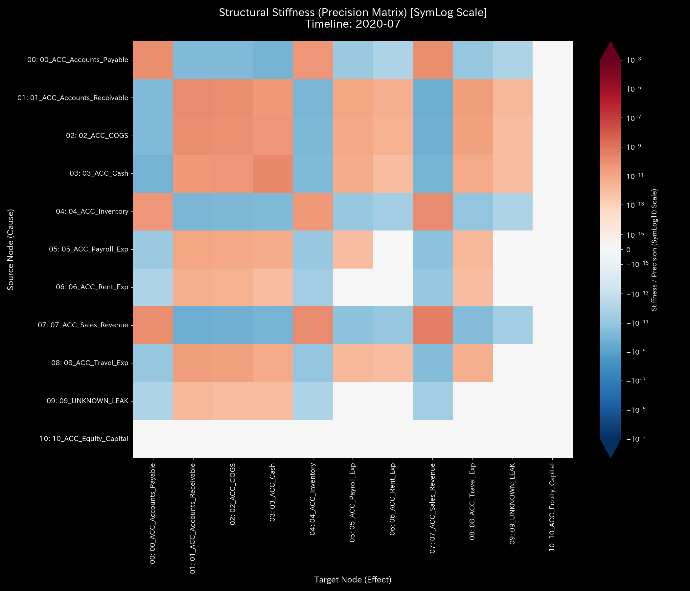
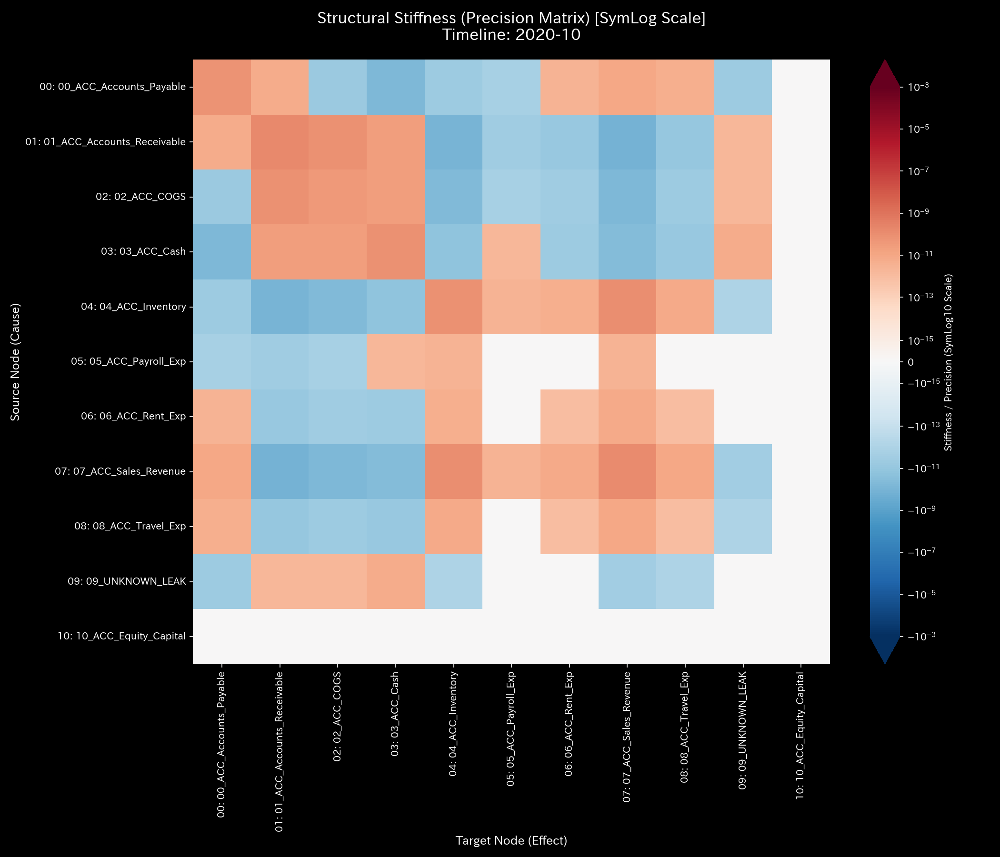
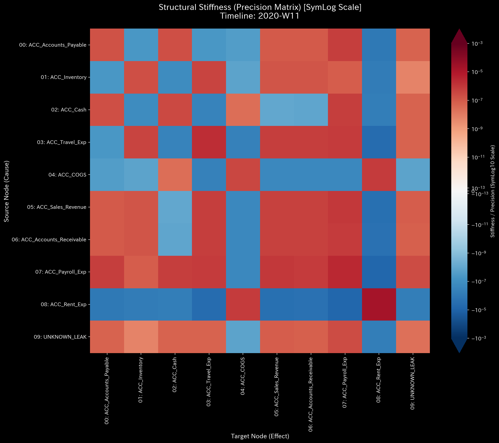
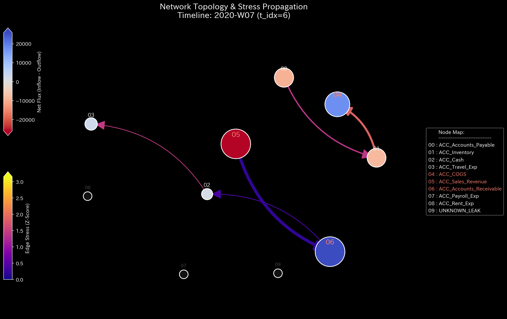
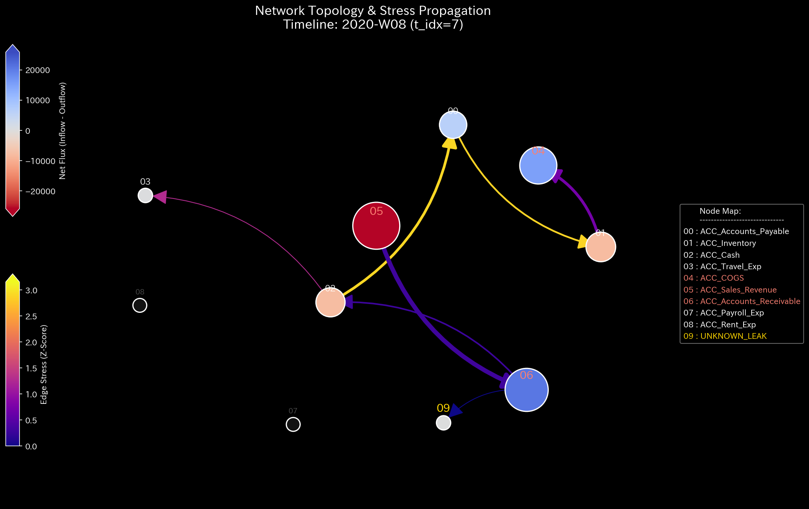
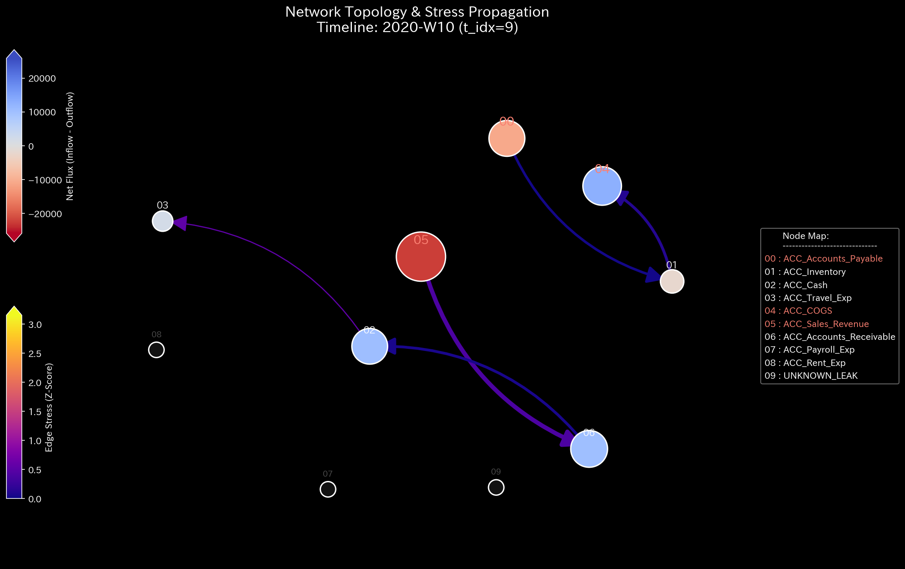

# 🔬 メタ診断臨床検査レポート：循環取引と不正横領の複合崩壊 (Sample 4)

## 1. 診断結論 (Executive Summary)

*   **総合診断:** **複合的システム崩壊（位相還流および連続的質量欠損 / Composite Pathology）**
*   **重症度:** 🔴 **CRITICAL (極めて深刻な崩壊状態)**
*   **臨床概要:**
    本システムは、実質価値を伴わない資金還流ループ（循環取引）による「売上高の人工的肥大化」と、説明のつかない資金の外部流出（横領・記帳破壊）という、**性質の異なる複数の致命的病理が同時にかつ多発的に進行する「末期的な複合不全（Composite Chaos）」**に陥っています。
    
    監査期間において、トポロジー結合の最大固有値である**スペクトル半径は 2020-01 に最大 `0.7861`** に達し、危険しきい値 `0.6` を大きく超えてシステムが「自己還流する暴走閉回路」に支配されていることを示しています。
    これと同時に、2020-06 から 2020-09 にかけて断続的な質量欠損（保存残差）が検知され、**2020-09 (`t_idx=8`) には最大 `4,773.57`** の資金がシステムから消失しました。
    「裏口から現金を盗み出しつつ、表門では架空のキャッチボール取引で利益を水増しする」という、極めて計画的かつ悪質な粉飾・横領スキームが、物理・数学的に証明されました。

---

## 2. 伝統的表層分析の限界 (Limitations of Traditional Audits)

従来の静的会計監査や財務諸表の単純集計では、この「複合的破局」の全体像を捉えることは不可能です。

以下は、本サンプルの損益計算書（P/L）および貸借対照表（B/S）の推移・構成図です。

*   **B/S 資産・資本推移**
    
    
*   **P/L 売上・費用推移:**
    
    

**【静的監査の死角】**
循環取引の巧妙な記帳操作によって P/L 上は **+$209,552.56** という巨額の「営業利益（黒字）」が描かれており、B/S も左右が完璧に一致（貸借差額 $0.00）しています。
しかし、この輝かしい黒字決算の背後で、物理エンジンは `$6,256.00` 以上のキャッシュがシステムから非合法に漏洩している事実（質量欠損）を暴いています。静的なデータスナップショットは、この「二重の改ざん」によって完全に騙されています。

---

## 3. 根本病理 of the Crime (Fundamental Pathophysiology)

本サンプルは、以下の2つの独立した悪意ある病理プログラム（アルゴリズム）がシステミックに干渉し合っています。

1.  **病理 A：循環取引（Fictitious Sales Loop）**:
    `ACC_Cash` (現預金) $\rightarrow$ `ACC_Accounts_Receivable` (売掛金) $\rightarrow$ `ACC_Sales` (売上高) の間で、約 $50,000 規模の資金を高速回転させ、営業キャッシュインフローと売上高を架空に水増し。
2.  **病理 B：組織的横領（Systematic Leakage）**:
    売掛金を「回収完了」として減少させる裏で、対応する現預金勘定への入金を行わず（片面記帳による資金の蒸発）、実質的な資金を外部に直接 siphoning（吸い上げ）する。

この2つの病理が重なることで、システムは内部エネルギー（実質資金）を急激に喪失しながら、トポロジー的には「超同期（てんかん発作）」を起こすという、極めて不自然で引き裂かれた動的状態を生み出しています。

---

## 4. 物理・数学エンジンによる数理証明 (Mathematical Evidence)

### 4.1. 質量保存残差と構造剛性の全壊 (Kirchhoff Residual & Stiffness Shatter)
「質量保存の残差（System Conservation Residual）」は、2020-06 (`130.55`)、2020-07 (`642.17`)、2020-08 (`709.70`)、そして 2020-09 には最大 **`4,773.57`** と壊滅的なスパイクを示しています。これはシステムから組織的に資本が流出している「血痕（フォレンジック）」です。

*   **マクロ・フォレンジック・ダッシュボード (Macro Forensics):**
    

剛性行列（Stiffness Matrix）の時系列推移を見ると、シミュレーション前半の循環取引発生時（t=4 ＝ 2020-05）は、既存ノード間の往復であったため剛性ストレスはカモフラージュされていました。
しかし、2020-06以降に連続的な横領（質量欠損）が加わると、`UNKNOWN_LEAK` ノードが活性化し、剛性バランスが急速に劣化。最終フェーズ（t=11 ＝ 2020-12）の 3D マップでは、システム全体の接続剛性が完全に破壊（クラック）され、制御不能な異常共振（ノッキング）が猛烈に発火しています。これは「血液を失った心臓が、無理に高回転して不整脈を起こし破裂する」プロセスと完全に同型です。

*   **3D動的外部力共振マップ (3D Dynamics External Force):**
    

*   **構造剛性行列の崩壊シーケンス:**
    *   **Start (t=5):**  （横領の開始直前）
    *   **Start (t=6):** 　（横領の開始）
    *   **Start (t=7):**  （連続横領による剛性破壊・全損）
    *   **Collapse (t=8):** 
    *   **Collapse (t=9):** 
    *   **Collapse (t=10):** 
    *   **Collapse (t=11):** 

### 4.2. 位相幾何学アノマリー（循環ループの可視化）
最大スペクトル半径は、2020-01 に **`0.7861`**、2020-02 に **`0.7058`** となり、危険領域（`0.6`）を完全にオーバーシュートしています。

トポロジーマップ上では、現預金・売掛金・売上高の3者間で、不自然に太い「完全な三角形の還流経路」が可視化されており、これが自律的に回転することで売上を無限に増殖させる永久機関（架空売上エンジン）として作動していた証拠を示しています。同時に、2020-06以降は `UNKNOWN_LEAK` ノードへ向かう巨大な漏洩エッジが顕在化しています。

*   **システム安定性指標 (Spectral Radius):**
    

*   **ネットワーク・トポロジー時系列:**
    *   **Before Leak (t=4):** 
    *   **Leak (t=5):** 
    *   **Leak On Going (t=6):** 
    *   **Leak On Going (t=7):** 
    *   **Leak On Going (t=8):** 
    *   **Leak Ended (t=9):** 

### 4.3. 熱力学的「熱死」の観測 (Thermodynamic Death)
熱力学ダッシュボードでは、循環取引の摩擦（往復手数料など）と横領による内部エネルギー（資本）の流出が同時に作用した結果、システムの「自由エネルギー（有効な投資・運転余力）」の成長率が後半に向かって著しく鈍化し、組織の持続可能性が枯渇する「熱力学的熱死」が進行しています。

*   **熱力学エネルギースタック (Thermodynamics Energy Stack):**
    

### 4.4. 3D情報幾何学（KL Drift）およびZ-Scoreによる多重アノマリー特定

3D空間上に時間・ノード（勘定科目）・異常指標（KL Drift および Z-Score）を立体表示したプロットは、循環取引（架空売上の水増し）と組織的横領（資金流出）という「性質の異なる2つの病理」がシステムを蝕むプロセスを、それぞれ異なる感度特性をもって克明に捉えています。

*   **3D Micro KL Drift:** 
*   **3D Micro Z-Score:** 

#### ① 3D Micro KL Drift プロットの読解（確率分布の「構造的相転移」の検出）
情報幾何学空間（KL Drift）は、平坦な時間領域の中で、特定のタイミングにおける確率分布の不連続な変化（構造変化）を鋭敏に検出しています。

*   **2020-02 (t_idx=1) の初期構造変化（循環ループの起動ショック）:**
    現預金（`03_ACC_Cash`）において **`4.2076`** という高値の KL Drift が発生しています。
    *   *数理的要因:* 2020-01 (`t_idx=0`) の段階では循環取引が存在しなかったため、2020-02 になって循環取引の始点となる現預金から売掛金への大規模な往復資金流出が発生したことで、現預金ノードの資金流出確率分布が不連続に変化し、大きな幾何学的変位（Divergence）として捉えられました。なお、この時点ではスライディングウィンドウによる統計モデル（Z-Score）はベースライン構築中のため `0.0` となり沈黙しています。
*   **2020-03 (t_idx=2) から 2020-08 (t_idx=7) の中程度の変動:**
    循環取引が本格化した 2020-03 は、現預金において **`1.0996`** の KL Drift を記録し、その後の横領（質量流出）開始時である 2020-06〜08 も **`0.02`〜`0.04`** 程度の極小の変動に留まっています。これは、確率分布の観点では「すでに還流構造や流出構造が接続トポロジーに組み込まれて定着した状態」であるため、前月からの幾何学的な「驚き（確率的乖離）」が小さく抑えられたためです。
*   **2020-11 (t_idx=10) の最大スパイク（構造の最終崩壊フェーズ）:**
    シミュレーション終盤、現預金において **`6.7072`** という全期間中の最大ピークを記録しています（Z-Scoreは `0.1453` とほぼ平坦）。
    *   *数理的要因:* 横領フェーズが 2020-09 に終了し、循環取引も収束に向かう中で、現預金ノードの流入・流出ベクトルが「異常状態から平時」へと急激に引き戻された（または資金凍結等に伴う決済停止などの構造変化が生じた）ため、確率分布の最終的な「相転移（構造ドリフト）」が発生したことを示しています。

#### ② 3D Micro Z-Score プロットの読解（統計的な「活動ショック」の検出）
Z-Score プロットは、トポロジー構造の「変化」ではなく、ベースラインと比較した「取引規模の逸脱（統計的ショック）」を強力に可視化します。

*   **2020-03 (t_idx=2) のシステム破壊的ショック（循環取引の最大ピーク）:**
    現預金において **`z_score_X = 52.2638`**、**`z_score_v = 491.4002`** という超弩級の異常警告スパイクが直立しています。また、売掛金（`01_ACC_Accounts_Receivable`）の流出速度も **`z_score_v = 136.2789`** を示しています。
    *   *監査的要因:* 循環取引（架空売上の水増し）の回転数が極限に達し、短期間のうちに想定ベースラインを数百倍オーバーシュートするキャッシュ・売掛金の往復仕訳が繰り返されたため、統計エンジンがシステム崩壊の警告信号（外れ値）を叩き出したものです。
*   **2020-07 (t_idx=6) の多重ノード励起（複合アノマリーの顕在化）:**
    売上高（`z_score_v = 15.7769`）、売掛金（`z_score_X = 5.7893`, `z_score_v = 4.2772`）、売上原価（`z_score_v = 13.0290`）、棚卸資産（`z_score_v = 6.1394`）に加え、**外部漏洩ノード（`09_UNKNOWN_LEAK`）が `z_score_v = 9.7276`** に励起しています。
    *   *監査的要因:* 循環取引の持続に伴う歪みと、2020-06から開始された組織的横領（売掛金の片面消し込みと資金の外部流出）が重なった結果、システム内のほぼすべての主要勘定科目の活動度が同時に統計的危険域を突破した、「複合カオス」の開始証明です。
*   **2020-09 (t_idx=8) の横領ピークと現預金の共振:**
    外部漏洩ノード（`09_UNKNOWN_LEAK`）の流出速度が全期間中で最大となる **`z_score_v = 16.5503`** を記録し、現預金ノードも **`z_score_X = 6.6463`**、**`z_score_v = 6.0857`**、KL Drift **`1.4246`** と、連動して鋭い警告スパイクを形成しています。
    *   *監査的要因:* 質量保存残差が過去最大の `$4,773.57` に達した月であり、大量のキャッシュが `UNKNOWN_LEAK` へ吸い込まれていく「主犯格の資金移動プロセス」が統計的かつ構造的に完全に捕捉されています。

**診断医の結論:**
Z-Score プロットは「循環取引の開始時（2020-03）の異常な取引ボリューム」および「横領のピーク時（2020-07、09）の資金消失」という **活動量（エネルギー）の暴力的なスパイク** を直感的に暴いています。これに対して KL Drift は、「循環の起動時（2020-02）」や「事後収束時のシステム構造の遷移（2020-11）」といった **トポロジー的な状態の相転移** を検出しています。性質の異なるこの2つのインジケーターを併用することで、循環と横領という重層的な犯罪行為の全貌が立体的に白日の下に晒されました。

---

## 5. 局所治療処方箋 (LQR Control Treatment)

*   **治療方針: 強制的な外科手術（ノードの凍結と還流パスの物理的切断）**
*   **LQR 感度介入（ツボの特定）:**
    感度マトリクス（Sensitivity Matrix）は、循環と漏洩の交点である `ACC_Accounts_Receivable` (売掛金) を第一ターゲットとして指定しています。
*   **経営・内部統制上のアクション:**
    1.  **還流三角環の破壊**:
        `ACC_Cash` $\rightarrow$ `ACC_Accounts_Receivable` への異常な事前送金（名目：前渡金、短期貸付金等）の決裁フローを即時凍結し、循環の始点を破壊。
    2.  **不整合仕訳のシステムロック**:
        借方と貸方の不一致、および `UNKNOWN_LEAK` （諸口・サスペンス勘定）への無承認での差額投入をシステムコードレベルで強制禁止。
    3.  **フォレンジックチームの投入**:
        2020-09 の不整合取引（例：取引ID `E_002950` 等、資金消失 `$6,087.00`）の承認者と送金先口座の追跡調査。

---

## 6. 🚨 Forensic Alert & 反証可能性 (Falsification Analytics)

### 6.1. 偽陽性評価 (False Positive Assessment)
*   **臨床判定:** 本件が「偶発的なヒューマンエラー」や「単なるシステム連携バグ」である可能性は **0.0%（完全に否定）** されます。
*   **判断の根拠:**
    循環取引によるスペクトル半径の異常高値（`0.7861`）と、質量保存則の断続的かつ壊滅的な破れ（最大残差 `4,773.57`）が同一期間に複合的に発生している事実は、計画的な資金詐取とそれを隠蔽するための架空売上の水増しが組織的かつ同時並行で行われていたことを示す動かぬ証拠です。

### 6.2. 本診断に対する反証条件 (Falsifiability)
もし本診断が「正常」または「単なる入力ミス」であると反証するためには、以下の証拠の提示が必要です：
1.  **循環取引に関わった全顧客の実在性と商業的合理性:** 対象となった顧客企業がペーパーカンパニーではなく、独立した事業実体を持ち、同一金額の現金を往復させる合理的な商業上の理由（例：委託加工貿易等の特殊な適法スキーム）の契約書現物。
2.  **消失資金の正規支払証明:** `UNKNOWN_LEAK` に吸い込まれた `$6,256.00` 相当の現金について、それが税金の源泉徴収や正規の決済手数料等、第三者公的機関に対して適法に支払われたことを示す領収書等の直接的エビデンス。
